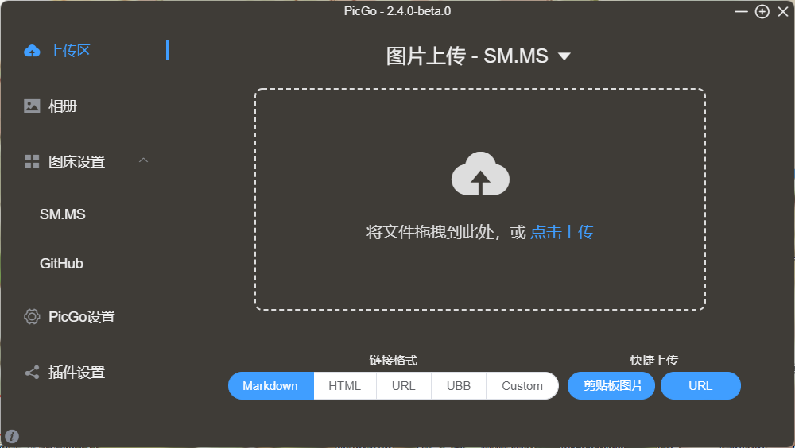

## HIT软件构造2023年春Lab1 Turtle Graphics (MIT)

理解：题目提供了绘制图形轨迹的代码集，我们需要按要求对其中`TurtleSoup.java`的几个方法进行方法体的编写

#### 在项目中导入junit

打开就看到junit包没正确导入

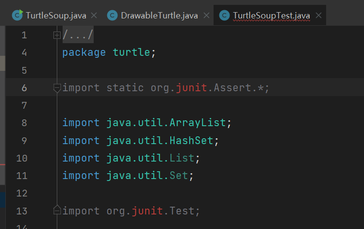

打开文件--项目结构--模块--添加JAR或目录

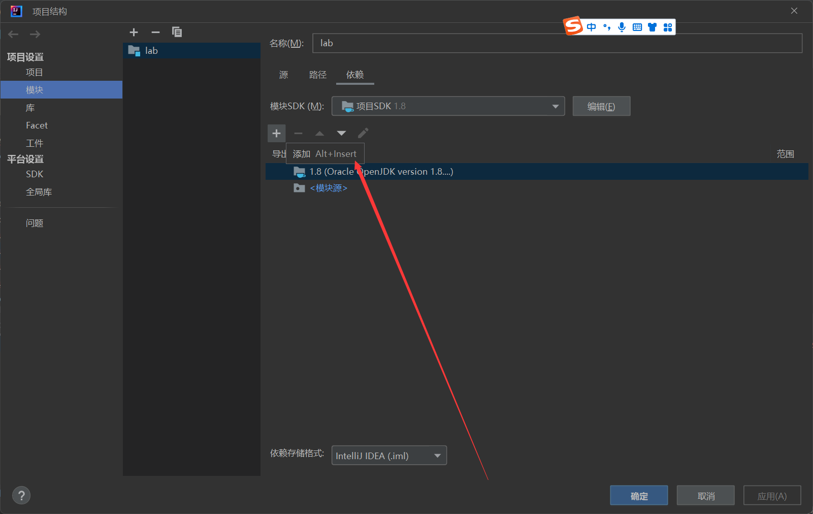

在`安装目录\lab\`下找到junit4.jar，导入即可

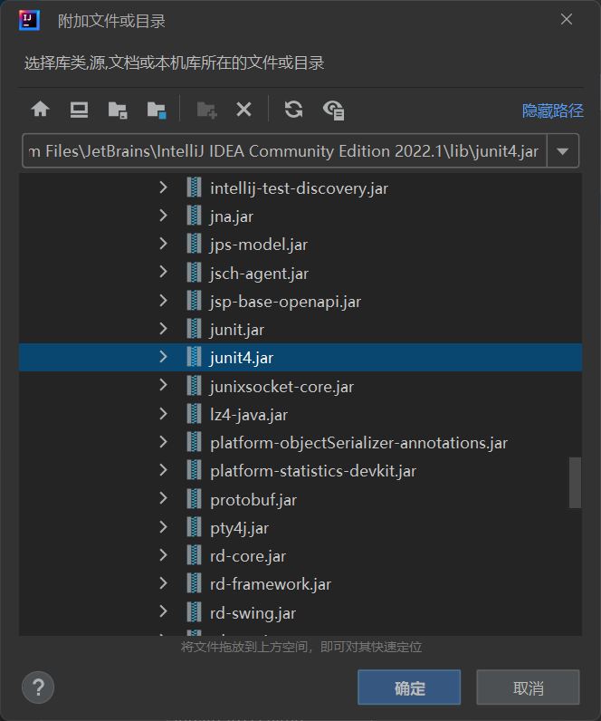

现在再看就不是暗红的了

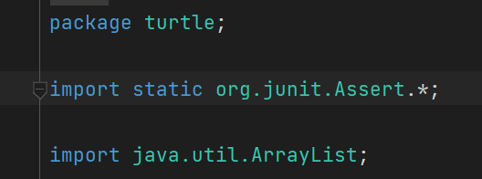


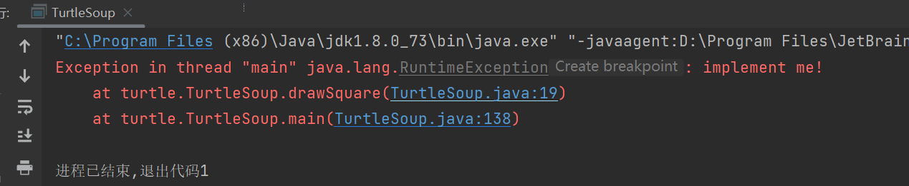

#### 问题3

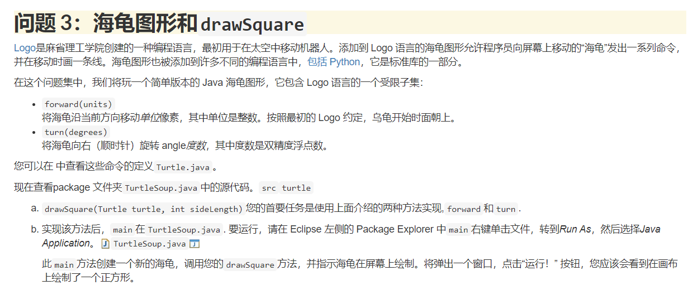

为`public static void drawSquare(Turtle turtle, int sideLength)`编写绘制正方形的代码

```java
for(int i=0;i<4;i++){
    turtle.forward(sideLength);
    turtle.turn(90);
}
```

运行`TurtleSoup.java.main`

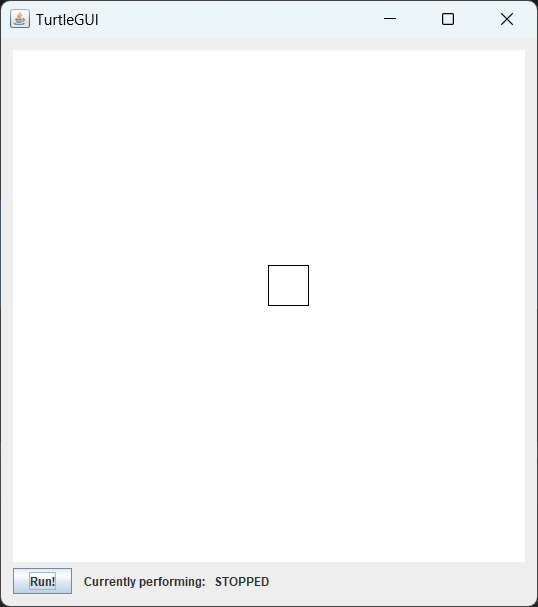

#### 问题5

为`public static double calculateRegularPolygonAngle(int sides)`编写方法体

```java
return ((double)sides-2)*180.0/(double)sides;
```

调试运行`TurtleSoupTest`，看到`calculateRegularPolygonAngleTest`通过了

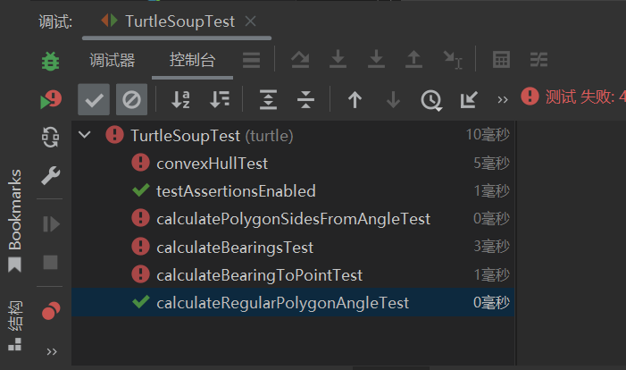

为`public static void drawRegularPolygon(Turtle turtle, int sides, int sideLength)`编写方法体

```java
double degree=180-calculateRegularPolygonAngle(sides);
for(int i=0;i<sides;i++){
    turtle.forward(sideLength);
    turtle.turn(degree);
}
```

修改`main`中调用的方法

```java
DrawableTurtle turtle = new DrawableTurtle();
//drawSquare(turtle, 40);
drawRegularPolygon(turtle,6,50);
// draw the window
turtle.draw();
```

运行`main`

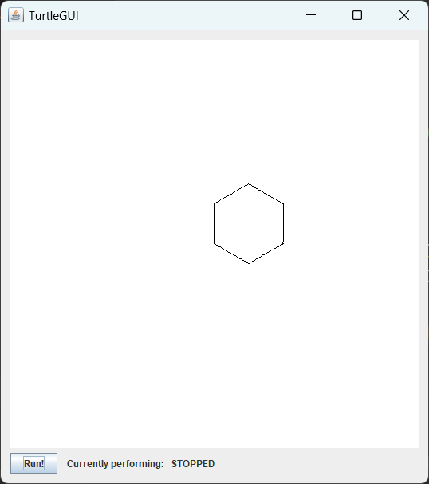

#### 问题6

为`public static double calculateBearingToPoint(double currentBearing, int currentX, int currentY, int targetX, int targetY)`编写方法体

```java
double degree = 90-Math.toDegrees(Math.atan((double) (targetY-currentY)/(double)(targetX-currentX)))-currentBearing;
if(degree<0)degree+=360;
return degree;
```

调试运行`TurtleSoupTest`

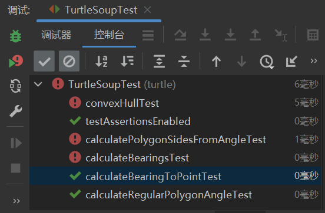

为`public static List<Double> calculateBearings(List<Integer> xCoords, List<Integer> yCoords)`编写方法体

```java
List<Double> list=new ArrayList<>();
double currentBearing=0;
int i=0;
int listLength=xCoords.size();
while (i+1<listLength){
    double degreeChange=calculateBearingToPoint(currentBearing, xCoords.get(i),yCoords.get(i), xCoords.get(i+1),yCoords.get(i+1) );
    list.add(degreeChange);
    currentBearing=(currentBearing+degreeChange)%360;
    i++;
}
return list;
```

调试运行`TurtleSoupTest`

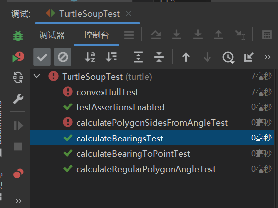


#### 问题8

为`public static void drawPersonalArt(Turtle turtle)`编写方法体

```java
turtle.color(PenColor.YELLOW);
//turtle.forward(100);
turtle.turn(270);
turtle.turn(180-(double)6*180/16);
for(int i=1;i<200;i++){
    turtle.forward(i);
    turtle.turn(180-(double)6*180/8);
    turtle.color(i%2==0?PenColor.BLUE:PenColor.YELLOW);
}
turtle.turn(180+(double)6*180/8);
turtle.turn(90);
turtle.forward(5);
turtle.turn(90);
for(int i=1;i<200;i++){
    turtle.forward(200-i-1);
    turtle.turn(180+(double)6*180/8);
    turtle.color(i%2==0?PenColor.BLUE:PenColor.YELLOW);
}
```

