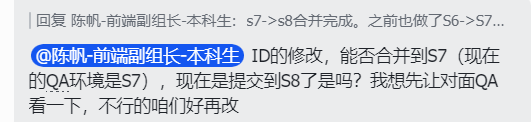
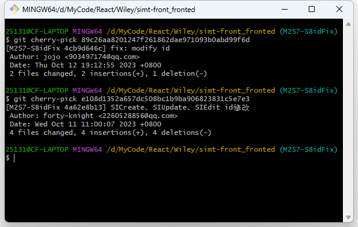
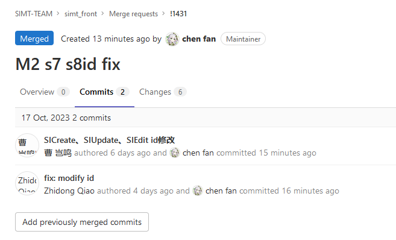

问题：有个bug的修复提交到S8的分支了，但是需要先单独合并到S7分支。



思路：在S8里找到commit的hash值。从S7签出分支，然后将commit合并到该分支。该分支pr到上游仓库的S7分支即可。



```bash
#合并单独的commit到当前分支
git cherry-pick commit的hash值
```

结果：pr里只有指定的两个commit，不会夹带分支的其他commit

