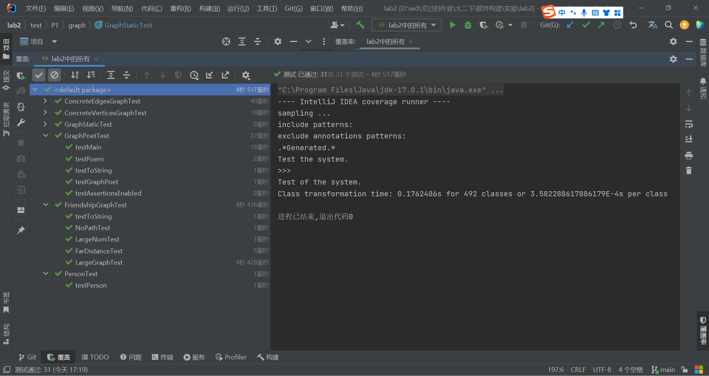
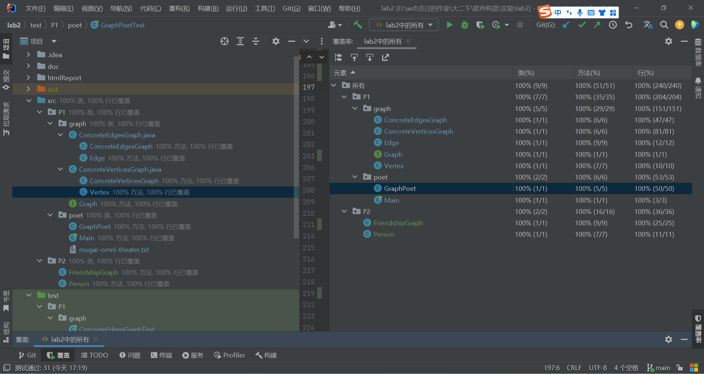

# HIT-软件构造实验2-2023春

# 1 实验目标概述

本次实验训练抽象数据类型（ADT）的设计、规约、测试，并使用面向对象编程（OOP）技术实现ADT。具体来说：

l 针对给定的应用问题，从问题描述中识别所需的ADT；

l 设计ADT规约（pre-condition、post-condition）并评估规约的质量；

l 根据ADT的规约设计测试用例；

l ADT的泛型化；

l 根据规约设计ADT的多种不同的实现；针对每种实现，设计其表示（representation）、表示不变性（rep invariant）、抽象过程（abstraction function）

l 使用OOP实现ADT，并判定表示不变性是否违反、各实现是否存在表示泄露（rep exposure）；

l 测试ADT的实现并评估测试的覆盖度；

l 使用ADT及其实现，为应用问题开发程序；

l 在测试代码中，能够写出testing strategy并据此设计测试用例。

# 2 实验环境配置

配置实验环境：和实验1基本一致，使用IDEA开发环境。代码覆盖率工具使用IDEA自带的覆盖率测试，无需额外安装。

实验代码仓库地址：https://github.com/ComputerScienceHIT/HIT-Lab2-2021112946

# 3 实验过程

## 3.1 Poetic Walks

使用下载的代码框架。对接口Graph进行分别两种实现（ConcreteEdgesGraph和ConcreteVerticesGraph）并进行测试，并编写一个指定应用（GraphPoet）

### 3.1.1 Get the code and prepare Git repository

如何从GitHub获取该任务的代码、在本地创建git仓库、使用git管理本地开发：

在任意文件夹cmd，使用git从github仓库的ssh链接克隆代码框架

`git clone git@github.com:rainywang/Spring2022_HITCS_SC_Lab2.git`         

在项目文件夹cmd，创建代码仓库

`git init`

### 3.1.2 Problem 1: Test `Graph <String>`

编写`Graph<String>`的测试类。编写提供空图的方法empty()；在GraphStaticTest中编写测试静态方法的内容，在抽象类GraphInstanceTset中编写其他测试内容，并对应两种图的实现做抽象测试类的两种实现。

### 3.1.3 Problem 2: Implement `Graph <String>`

两种方式实现`Graph<String>`。分别是ConcreteEdgesPragh和ConcreteVerticesGpaph。

#### 3.1.3.1 Implement ConcreteEdgesGraph

先实现JavaBean类：Edge

```
private L sourceVertex;
private L targetVertex;
private int weight;
```

然后编写ConcreteEdgesgraph实现graph

```
private final Set<L> vertices = new HashSet<>();//顶点集
private final List<Edge<L>> edges = new ArrayList<>();//边集
```

编写graph中的所有方法的方法体

#### 3.1.3.2 Implement ConcreteVerticesGraph

先实现JavaBean类：Vertex

```
private L data;
private Map<Vertex<L>, Integer> targetVertexes;
```

然后编写ConcreteVerteicesgraph实现graph

```
private final List<Vertex<L>> vertices = new ArrayList<>();
```

 

 

### 3.1.4 Problem 3: Implement generic Graph<L>

实现泛型`Graph<L>`

#### 3.1.4.1 Make the implementations generic

在各个相关源文件中，使用IDEA的搜索功能，搜索所有的String并选中，一次性替换成L。这里发现toString及其注释也被替换了，手动改回来。修改后即可完成泛型实现。

#### 3.1.4.2 Implement Graph.empty()

在Graph的两个实现类中重写Graph.empty()。

### 3.1.5 Problem 4: Poetic walks

读入语料库并生成词的亲和图，据此对输入的英文文本进行解析并输出“诗意”的语句。

#### 3.1.5.1 Test GraphPoet

编写对GraphPoet的测试类

#### 3.1.5.2 Implement GraphPoet

实现GraphPoet

1. 读取语料库，构建有向图 
2. 根据输入的语句，从语料库中匹配出合适的桥接词并插入语句，输出

#### 3.1.5.3 Graph poetry slam

编写可运行内容：给定语料库，输入一段语句，输出处理后的语句

### 3.1.6 使用Eclemma检查测试的代码覆盖度

由于笔者使用的是IDEA作为开发环境，检查代码的覆盖度使用的是IDEA自带的代码覆盖率工具。测试结果均为100%覆盖、全部通过测试。




### 3.1.7 Before you’re done

按照http://web.mit.edu/6.031/www/sp17/psets/ps2/#before_youre_done的说明，检查程序。

通过Git提交当前版本到GitHub上的Lab2仓库

**项目的目录结构：**

项目名称： HIT-Lab2-学号

​       src

​          P1

​           graph

​             Graph.java

​             ConcreteEdgesGraph.java

​             ConcreteVerticesGraph.java

​           poet

​             GraphPoet.java

​             Main.java

​             Mugar-omni-theater.txt

​        test

​          P1

​           graph

​             ConcreteEdgesGraphTest.java

​             ConcreteVertucesGraph.java

​             GraphInstance.java

​             GraphStaticTest.java

​           poet

​             GraphPoet.java

 

## 3.2 Re-implement the Social Network in Lab1

使用实验2中的Graph及其实现类，对实验1的FriendshipGraph进行高效地复现，并对其进行测试。

### 3.2.1 FriendshipGraph类

成员方法根据要求提供了addVertex、addEdge、getDistence，根据需要提供getter和setter；

成员变量有一个int类型的变量，用于在递归调用深度优先搜索时共享数据；graph类型的成员变量，用于构建和存储关系图。

### 3.2.2 Person类

延续了实验1的设计，提供成员变量String类型的name存放姓名、boolean类型的isSearch用于搜索时存放是否遍历过，去除了在graph中实现的内容：与该节点链接的节点集合。

### 3.2.3 客户端main()

读取语料库文件，实例化一个GraphPoet；接着给定输入语句，使用GraphPoet进行处理并输出

### 3.2.4 测试用例

对每个成员方法设计测试，考虑较大图时的遍历、无关系节点的情况。

测试结果：覆盖率100%，测试全部通过

 

 

### 3.2.5 提交至Git仓库

通过Git提交当前版本到GitHub上的Lab3仓库。

在这里给出项目的目录结构树状示意图。

项目名称： HIT-Lab2-2021112946

​       src

​          P2

​           FriendshipGraph.java

​           Person.java

​        test

​          P2

​           FriendshipGraphTest.java

​           PerosnTest.java

 

# 4 实验进度记录

请使用表格方式记录你的进度情况，以超过半小时的连续编程时间为一行。

 

| 日期     | 时间段      | 计划任务                                   | 实际完成情况       |
| -------- | ----------- | ------------------------------------------ | ------------------ |
| 已轶     | 已轶        | 编写了图泛型的测试和实现                   | 全部完成           |
| 2023/4/1 | 已轶        | 完成图测试中的缺少部分                     | 全部完成           |
| 2023/4/2 | 已轶        | 编写了诗意漫步的内容                       | 完成了实现，未测试 |
| 2023/4/4 | 15:00-18:30 | 代码覆盖率提高到100%，完成实验报告剩余内容 | 全部完成           |

# 5 实验过程中遇到的困难与解决途径

| 遇到的难点               | 解决途径                                                     |
| ------------------------ | ------------------------------------------------------------ |
| 对P1的题目具体内容不理解 | 看MIT的网页无果后，在代码框架源码中发现详细的说明。借助IDEA翻译插件阅读后理解。 |
| 代码覆盖率不足100%       | 使用代码覆盖率工具测试后，阅读对未测试行的标记，并添加新的测试内容 |

# 6 实验过程中收获的经验、教训、感想

## 6.1 实验过程中收获的经验和教训（必答）

先编写测试再编写实现，便于在实现代码时考虑到更多的处理可能情况。

## 6.2 针对以下方面的感受（必答）

(1)  面向ADT的编程和直接面向应用场景编程，你体会到二者有何差异？

面向ADT复用性较高

(2)  使用泛型和不使用泛型的编程，对你来说有何差异？

使用泛型可以使ADT复用性提高

(3)  在给出ADT的规约后就开始编写测试用例，优势是什么？你是否能够适应这种测试方式？

考虑了可能出现问题的情况，考虑更加全面。减少了先实现再测试可能导致的惯性思维。逐步适应中，实现后发现有些内容没测试到，仍需进行补充

(4)  P1设计的ADT在多个应用场景下使用，这种复用带来什么好处？

提高可维护性，提高编码效率。

(5)  为ADT撰写specification, invariants, RI, AF，时刻注意ADT是否有rep exposure，这些工作的意义是什么？你是否愿意在以后编程中坚持这么做？

使团队的同事能明白代码内容，使维护者（包括未来的自己）能容易地重新理解结构。

(6)  关于本实验的工作量、难度、deadline。

内容有点多，要写的东西挺多，说合适都是假的。难度和deadline我觉得可以接受。

(7)  《软件构造》课程进展到目前，你对该课程有何收获和建议？

收获：一定程度上掌握了软件开发的设计思想、开发的方法。
