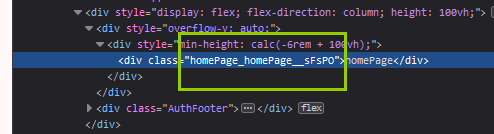

# CSS模块化

## css模块化

### 样式文件

正常写就行

```scss
.homePage{
    background-color: aquamarine;
}
```

### 导入样式

类名当做成员属性引用即可

```js
import styles from './homePage.module.scss';
export default function HomePage(props) {
  return (
    <div className={styles.homePage}>
      homePage
    </div>);
}

```

在调试工具中可以看到类名加上了哈希值



### 配置Webpack（可选）

https://www.webpackjs.com/loaders/css-loader/#modules

React项目暴露Webpack配置文件：`yarn eject`

为loader新增modules的选项。类型：`Boolean|String|Object` 默认值：`undefined`

嘛，react的框架里，被似乎被**getLocalIdent**覆盖了，设置没生效

```js
// webpack.config.js
module.exports = {
  module: {
    rules: [
      {
        test: /\.css$/i,
        loader: "css-loader",
        options: {
          modules: {
            mode: "local",
            auto: true,//当 modules 配置项为对象时允许基于文件名自动启用 CSS 模块或者 ICSS。
            exportGlobals: true,
            localIdentName: "[path][name]__[local]--[hash:base64:5]",//自定义类名
            localIdentContext: path.resolve(__dirname, "src"),//允许为本地标识符名称重新定义基本的 loader 上下文。
            localIdentHashSalt: "my-custom-hash",
            namedExport: true,
            exportLocalsConvention: "camelCase",
            exportOnlyLocals: false,
          },
        },
      },
    ],
  },
};
```

##### `localIdentName`

（摘自官网https://www.webpackjs.com/loaders/css-loader/#modules）

类型：`String` 默认：`'[hash:base64]'`

允许配置生成的本地标识符(ident)。

支持的模板字符串：

- `[name]` 源文件名称
- `[folder]` 文件夹相对于 `compiler.context` 或者 `modules.localIdentContext` 配置项的相对路径。
- `[path]` 源文件相对于 `compiler.context` 或者 `modules.localIdentContext` 配置项的相对路径。
- `[file]` - 文件名和路径。
- `[ext]` - 文件拓展名。
- `[hash]` - 字符串的哈希值。基于 `localIdentHashSalt`、`localIdentHashFunction`、`localIdentHashDigest`、`localIdentHashDigestLength`、`localIdentContext`、`resourcePath` 和 `exportName` 生成。
- `[<hashFunction>:hash:<hashDigest>:<hashDigestLength>]` - 带有哈希设置的哈希。
- `[local]` - 原始类名。

建议：

- 开发环境使用 `'[path][name]__[local]'`
- 生产环境使用 `'[hash:base64]'`

`[local]` 占位符包含原始的类。

**注意：**所有保留 (`<>:"/\|?*`) 和控制文件系统字符 (不包括 `[local]` 占位符) 都将转换为 `-`。

## CSS in JS

（摘自https://zhuanlan.zhihu.com/p/100133524）

CSS in JS，意思就是使用 js 语言写 css，完全不需要些单独的 css 文件，所有的 css 代码全部放在组件内部，以实现 css 的模块化。

CSS in JS 其实是一种编写思想，目前已经有超过 40 多种方案的实现，最出名的是 styled-components。

使用方式如下：

```js
import React from "react";
import styled from "styled-components";

// 创建一个带样式的 h1 标签
const Title = styled.h1`
  font-size: 1.5em;
  text-align: center;
  color: palevioletred;
`;

// 创建一个带样式的 section 标签
const Wrapper = styled.section`
  padding: 4em;
  background: papayawhip;
`;

// 通过属性动态定义样式
const Button = styled.button`
  background: ${props => (props.primary ? "palevioletred" : "white")};
  color: ${props => (props.primary ? "white" : "palevioletred")};

  font-size: 1em;
  margin: 1em;
  padding: 0.25em 1em;
  border: 2px solid palevioletred;
  border-radius: 3px;
`;

// 样式复用
const TomatoButton = styled(Button)`
  color: tomato;
  border-color: tomato;
`;

<Wrapper>
  <Title>Hello World, this is my first styled component!</Title>
  <Button primary>Primary</Button>
</Wrapper>;
```

可以看到，我们直接在 js 中编写 css，案例中在定义源生 html 时就创建好了样式，在使用的时候就可以渲染出带样式的组件了。

除此之外，还有其他比较出名的库：

- emotion
- radium
- glamorous