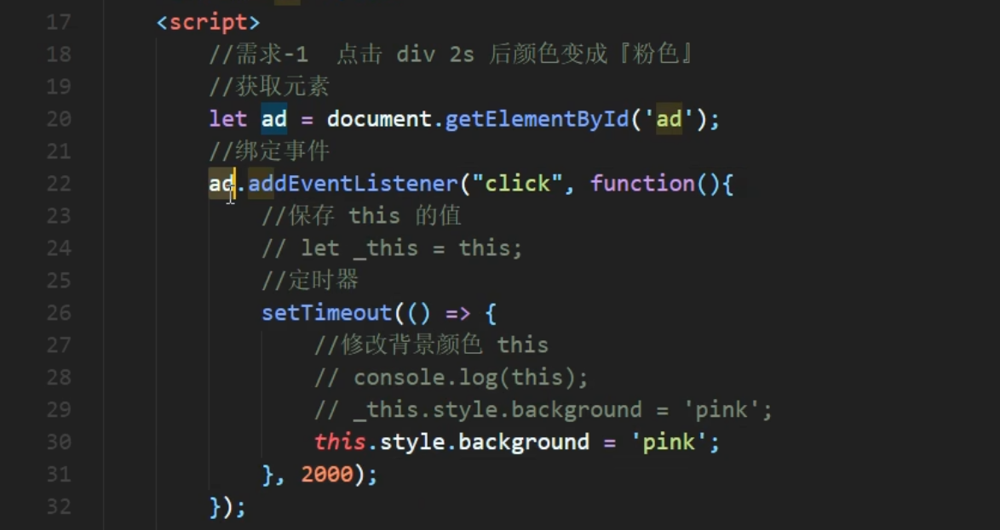
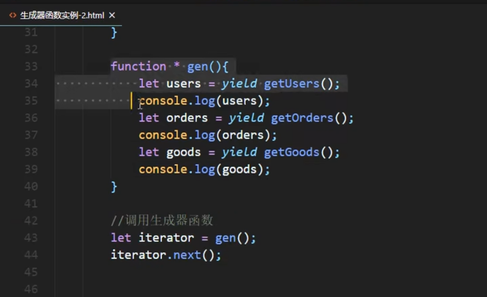
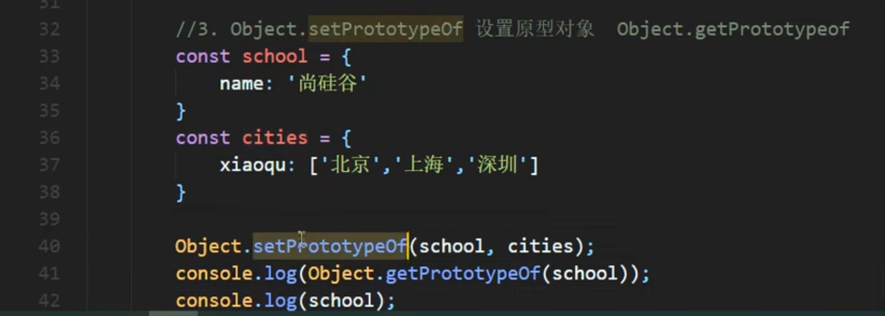
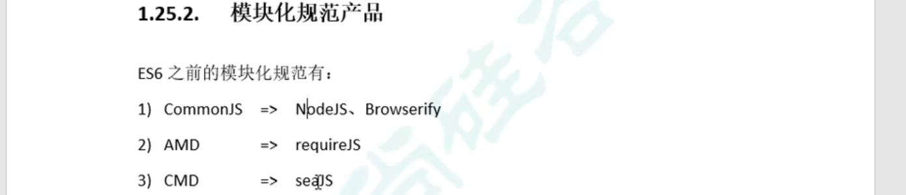
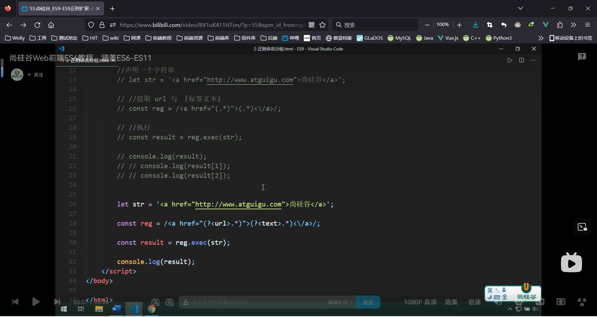
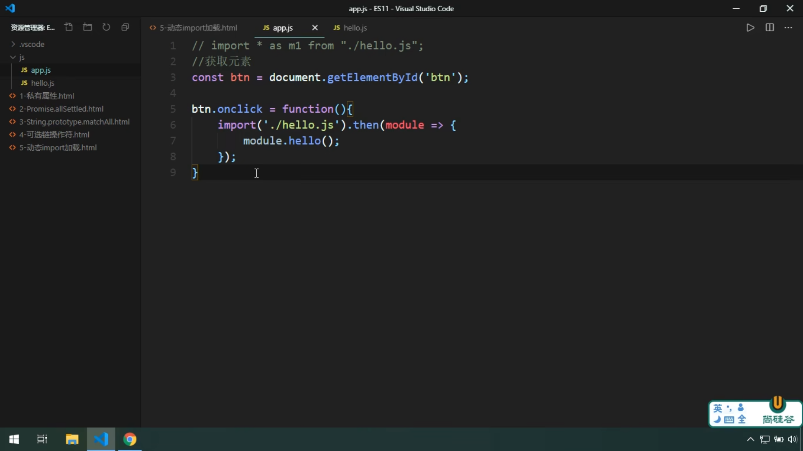

# ES6-ES11笔记

概念

ECMAScript是ECMA国际 标准化的脚本语言设计标准

## ES6

#### let变量

```js
let a;
let a,b,c;
let a=1,b=2,h=[];
```

- let变量不能重复声明，var可以
- 块级作用域（其他还有 全局、函数、eval）
- 不存在变量提升（var 可以在声明前使用，内容是undefined）
- 不影响作用域链

```js
{
    let s='xxx';
    function fn(){
        console.log(s);//函数里找不到，会往上一级找
    }
    fn();//可以输出xxx
}
```

eg、点击元素变色

```js
let items = document.getElementsByClassname('item');
for(let i=0;i<items.length;i++){
    item[i].onclick=function(){
        //this.style.background='pick';
        item[i].style.background='pick';
        //let可以，var不行
    }
}
```

#### const常量

值不能修改

```js
const SCHOOL = 'xxx'
```

- 一定要赋初始值
- 一般常量名使用大写（不是语法规则）
- 常量的值不能修改
- 对于数组和对象的元素进行修改是允许的

#### 变量的解构赋值

按照一定的模式从数组和对象中提取值，对变量进行赋值

```js
//数组
const F =['1','2','3','4'];
let [a,b,c,d]=F;
//对象
const zhao={
    name:'赵本山',
    age:66,
    f: function(){
        ...;
    }
}
let {x,y,z}=zhao;
```

#### 模板字符串

```js
let str=`我是字符串`;
console.log(str,typrof str);
```

- 内容中可以直接出现换行符
- 变量拼接${变量}

#### 对象的简化写法

ES6允许在大括号内直接写入变量和函数，作为对象的属性和方法

```js
let name='xxx';
let fun=function(){xxx;};
let school1={
    name:name,
    fun:fun;
    fun2:function(){
        xxx;
    }
}
let school ={
    name,
    fun,
    fun2(){
        xxx;
    }
}
```

#### 箭头函数

ES6允许使用=>定义函数，省略了function

```js
let fn= (a,b)=>{
    xxx;
}
let fn2= a=>{
    xxx;
}
let fn3= ()=>{
    xxx;
}
```

- this是静态的，this始终指向函数声明时所在作用域下的this值（原来指向调用的实例对象）
- `function xxx(){}`
- 不能作为构造实例化对象
- 有且仅有一个形参可以省略()
- 唯一语句省略return

this栗子



适合与this无关的回调、定时器/数组方法的回调，

不适合this有关的回调、事件回调、对象的方法

#### 函数参数默认值

```js
function aaa(a,b,c=0){
    
}
```

- 一般有默认值的参数放后
- 可以与解构赋值结合

```js
function fun({a=1,b,c}){
    a==1;
};
fun(object);
```


#### rest参数

ES6引入rest参数用于获取实际参数

ES5获取实参的方法：函数中直接使用arguments

```js
function date(){
    console.log(arguments)
}
data("1","2");//输出对象
```

ES6rest

```js
function date(...args){
    console.log(args);
}
data("1","2");//输出数组
```

rest必须放最后

#### 扩展运算符

...将数组转化为逗号分隔的参数序列

数组合并

```js
let arr1=[1,2]
let arr2=[3,4]
let arr=[...arr1,...arr2]
```

数组克隆

```js
/
```

伪数组转化为数组

```js
const div=document.querySelectorAll("div");
arguments
```

#### Symbol

创建唯一的对象

```js
let s1=Symbol('abc')
let s2=Symbol('abc')
console.log(a1==s2)//false
```


```js
Symbol();
Symbol("xxx");
Symbol.for("xxx");
```


##### Symbol的内置属性【】

#### 迭代器Interator

接口，为不同数据结构提供统一的访问机制


##### 自定义【】


#### 生成器函数

异步编程解决方案

##### 语法

声明

```js
function * xxxfun(){
    console.log('xxx')
}
```

执行

```js
let i=xxxfun();
i.next();
```

返回一个迭代器对象，需要调用next方法才能执行代码

##### yield分隔符

函数代码的分隔符

```js
function * xxxfun(){
    console.log('xxx');
    yield '1';
    console.log('xxx');
    yield '2';
    console.log('xxx');
    yield '3';
}
let i=xxxfun();
i.next();//next返回的是yeild的内容
i.next();
i.next();
```

##### 用迭代器遍历调用


##### 参数传递

1、获取迭代器对象时传递

2、调用next方法时传递

```js
function * xxxfun(arg){
    
    console.log(arg);
    //第一次调用next执行到这里
    let one = yield 'y1';
    console.log(one);
    //--
    let two = yield 'y2';
    console.log(two);
    //--
    let three = yield 'y3';
    console.log(three);
    //--
}
let i=xxxfun();
i.next();
i.next(2);//第二次调用时传入的参数，将作为第一个yield的返回结果
i.next(3);
i.next(4);
```


回调实现的异步

```js
setTimeout(()=>{
    console.log(1);
    setTimeout(()=>{
        sonsole.log(2);
        setTimeout(()=>{
            sonsole.log(3);
        },3000)
    },2000)
},1000)
```


```js
//声明异步函数
function first(){
    setTimeout(()=>{},1000);
}
function second(){
    setTimeout(()=>{},2000);
}
function third(){
    setTimeout(()=>{},3000);
}
//声明生成器函数
function * gen(){
    yield first();
    yidld second();
    yidld three();
}
//获取迭代器
var iterator=gen();
iterator.next();//执行异步函数
iterator.next();
iterator.next();
```


连续调用

```js
function getUser(){
    setTimeout(()=>{
        let data='user';
        interator.next(data);
    },1000)
}
function getOrder(){
    setTimeout(()=>{
        let data='order';
        interator.next(data);
    },1000)
}
function getGoods(){
    setTimeout(()=>{
        let data='good';
        interator.next(data);
    },1000)
}
function * gen(){
    let users= yi
}
```

 


#### Promise

异步编程的新解决方案，用来封装异步操作的 构造函数


```js
//实例化Promise对象
const p=new Promise((resolve,reject)=>{
    //进行异步操作
    //setTimeout
    
    //成功
    resolve('返回数据')
    //失败
    reject('失败原因')
})
p.then((value)=>{},(reason)=>{}).catch((err)=>{})
```


##### promise.prototype.then()方法

```js
//实例化Promise对象
const p=new Promise((resolve,reject)=>{
    //进行异步操作
    //setTimeout
    
    //成功
    resolve('返回数据')
    //失败
    reject('失败原因')
})
p.then((value)=>{
    return 123;//返回非Promise对象，则promise.prototype的返回为值为123的Promise成功对象
    return new Promise((resolve,reject)=>{
        resolve()//返回Promise对象，则promise.prototype的返回为该值、成败状态的Promise对象
        //reject()
    })
},(reason)=>{})

```

##### 链式调用

```js
p.then((value)=>{
    return new Promise((resolve,reject)=>{...})
}).then((value)=>{
    return new Promise((resolve,reject)=>{...})
}).then((value)=>{
    return new Promise((resolve,reject)=>{...})
})
```

##### catch方法

略


#### 集合【】

#### class【】

#### 数值扩展

##### 0、Number.EPSILON

表示JavaScript表示的最小精度，用来浮点数的比较

```js
```


##### 1、二进制和八进制

```js
let b =0b10101;//0b开头
let o =0o777;//0o开头
let d =100;//直接写
let x=0xff;//十六进制
```


##### 2、检测是否为有限数


##### 3、检测是否为数值


##### 4、字符串转数字

会截断非数字


##### 5、是否为整数


##### 6、抹去小数位


##### 7、判断正负和0

返回1、-1、0


#### 对象方法拓展

##### 1、判断两个值是否相等


##### 2、合并对象

如果有相同的属性，后面会覆盖前面


##### 3、设置/获取原型对象




#### 模块化


优点：防止命名冲突、代码复用性、高可维护性

以前的模块化规范：CommonJS、AMD、CMD（JS自己没有，靠社区推出）



##### 导出模块语法

分别暴露

```js
export let a=xxx;
export function b(){}
```

统一暴露

```js
let a=xxx;
function b(){};
export {a,b};
```

默认暴露

```js
export default {}//对象居多
```

##### 导入模块语法

通用方式

```js
import * as m1 from "./xxx.js"
//m1.default
//m1.a
```

解构赋值

```js
import {a,b} from './xxx.js'
import {a as c,d} from './yyy.js';//使用别名解决同名冲突
import {default m3} from './xxx.js'
```

简便形式

只能用于默认暴露

```js
import 要保存的变量名 from './xxx.js'
```

##### 浏览器使用模块化

缺点：浏览器兼容性、不一定能导入npm安装的包

```html
<script type="module">
	import * as m1 from "./xxx.js"
    console.log(m1)
</script>
```

```html
<script type="module" src="../main.js"></script>
```


##### Babel

处理模块，转化为浏览器能识别的js

1、安装工具：命令行工具，预设包，打包工具（browserify、webpack）

```bash
npm i babel-cli babel-preset-env browserify -D
```

`-D `表示开发依赖

2、运行

```bash
npx babel src/js dist/js --preset=babel-preset-env
#源目录 输出目录 预设
```

3、打包

```bash
npx browserify dist/js/app.js -o dist/bundle.js
```

## ES7

##### 数组include方法

##### 指数操作符

```js
//检查数组中是否包含元素，返回布尔类型
arr.includes()
//指数操作符**
//2**3==Math.pow(2,3)==8
```


## ES8

#### 异步

##### async函数

```js
synv function xxx(){}
```

- 返回非promise对象
- 抛出错误
- 返回promise对象

##### await表达式

只能放在async函数内

- await 操作符用于等待一个 Promise 兑现并获取它兑现之后的值。
- promise成功，返回值
- promise拒绝，抛出异常

##### async+await封装AJAX

用promise发请求，用await接结果，很方便

```js
function sendAJAX(url){
    return new Promise((resolve,reject)=>{
        const x=new XMLHttpRequest();
    	x.open('get',url)
        x.send();
        x.onreadystatechange=function(){
            if(x.readyState===4){
                if(x.status >=200 && x.status < 300){
                    resolve(x.response);
                }else{
                    reject(x.status);
                }
            }
        }
    })
}
async function aFun(){
    let result=await sendAJAX("https://api.apiopen.top/getJoke");
    let result2=await sendAJAX('url');
}
```

#### 对象方法扩展

```js
//获取对象所有键，返回数组
let arr = Object.keys(obj);
//获取对象所有值，返回数组
let arr = Object.value(obj);
//获取对象所有键值对，返回键值对对象的数组
let arr = Object.entries(obj);
//创建Map 
let map = new Map(Object.entries(obj));
//创建对象属性的描述对象
//键不变，值变{writable,configurable,enumerable,vaule:{值}}
let obj = Object.getOwnPropertyDescriptors(obj);
```

## ES9

##### 拓展运算符

```js
obj={...obj1,...obj2}
```

##### rest参数

```js
function fun({a,b,...c}){}
```

#### 正则表达式拓展

##### 分组捕获和命名



##### 反向断言


##### dotAll模式

```js
//  .  元字符，除换行符以外的任意单个字符
let str=`
	<ul>
		<li>...</li>
	</ul>
`
const reg = /<li>\s+<a>(.*?)<\/a><p>(.*?)<\/p>/;
const reg = /<li>\s+<a>(.*?)<\/a><p>(.*?)<\/p>/gs;
```

## ES10

#### 对象拓展方法

##### fromEntries

```js
Object.fromEntries([['key','value'],])
//将二维数组转化为对象，和Object.entries(obj)互逆
```

##### trim

```js
//trim，原来就有，清除字符串中的空白
//新增方法，清除字符串前/后中的空白
str1=str.trimStart();
str2=str.trimEnd();
```

##### flat

```js
//将高维数组转化为低维数组
let arr=[1,[2,[3]]]
arr.flat()//3维度转2维
arr.flat(2)//深度为2，3维转1维数组
```

##### symbol

```js
let s = Symbol('abc')
s.description
```

## ES11

##### 对象私有属性

```js
class Person{
    name;
    #age;
    #weight;
    constructor(name,age,weight){
        this.name=name;
        this.#age=age
    }
    say(){
        console.log(this.#age)
        //只能在对象中调用
    }
}
```

#### 批量Promise

##### allSettled

```js
Promise.allSettled([promise1,promise2])
```

始终返回成功，用于获取每个值

##### all

```js
Promise.all([promise1,promise2])
```

都成功时才成功

#### 批量正则

##### matchAll

```js
resultArr=str.matchAll(reg);//
```

##### 可选链操作符

```js
a.b;//如果a==undefined，会报错
a?.b;//使用可选链操作符?.时，a==undefined则返回undefined
```

##### 动态导入

提高模块加载效率



##### 大整数


##### globalThis

指向全局变量，浏览器是window、NodeJS是gobal
