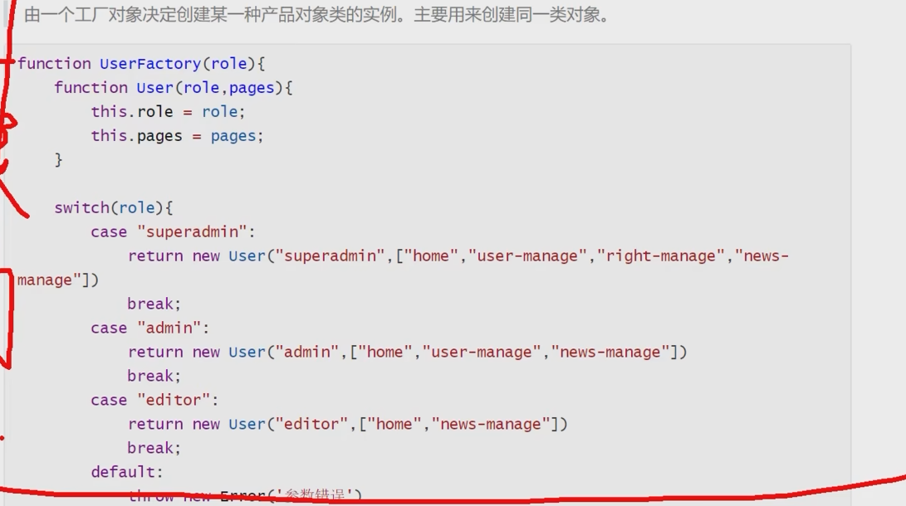
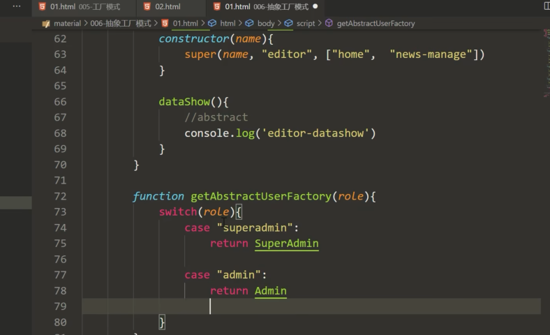
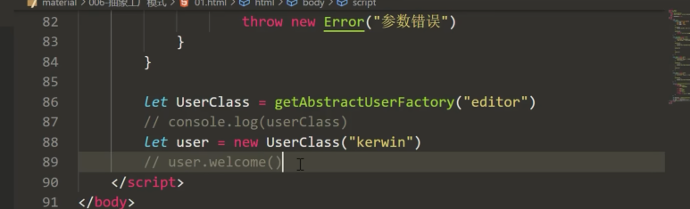
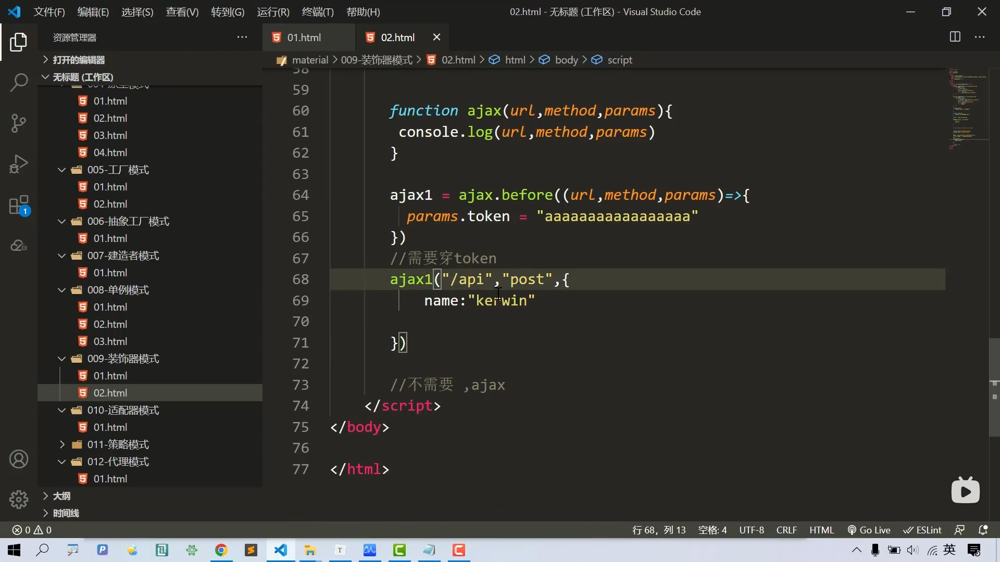
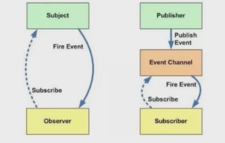
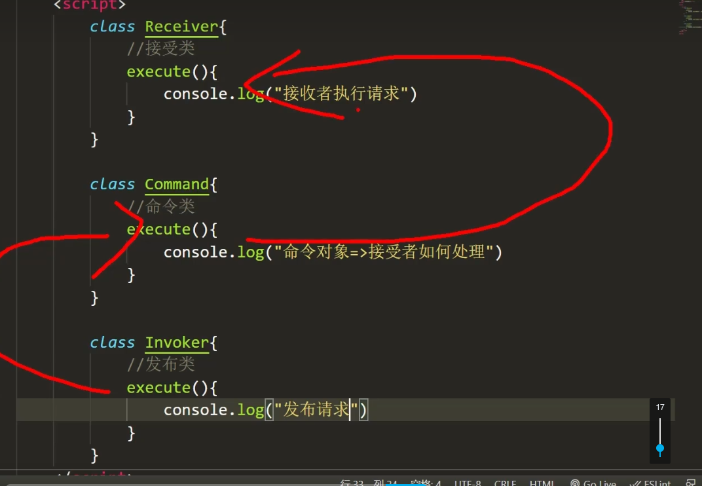
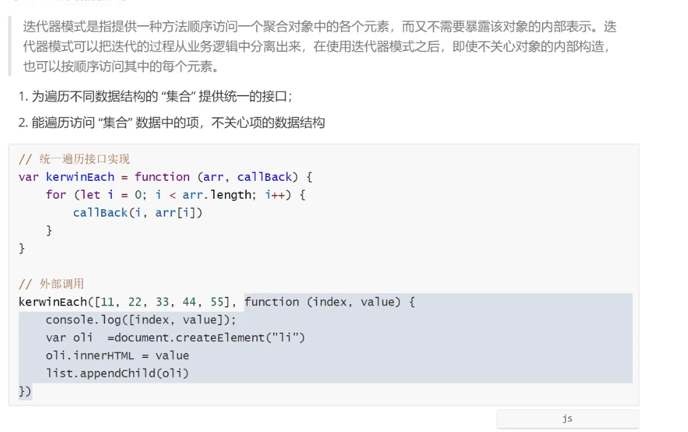
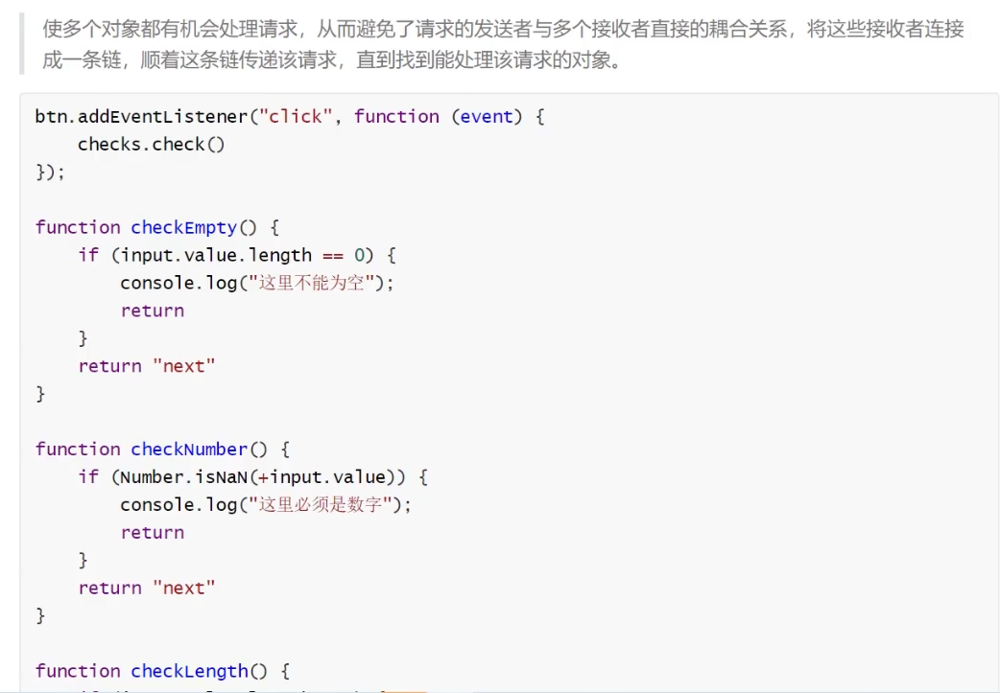

# JS设计模式

学自b站视频：https://www.bilibili.com/video/BV1MP4y127kd

部分笔记内容摘自掘金：https://juejin.cn/post/6844904032826294286

## 一 设计模式简介

- 设计模式是针对特定问题给出的简洁而优化的解决方案
- 核心思想：封装变化
- 变与不变分离，确保变化的部分灵活、不变的部分稳定

设计模式是一套被反复使用的、多数人知晓的、经过分类编目的、代码设计经验的总结。使用设计模式是为了重用代码、让代码更容易被他人理解、保证代码可靠性。 毫无疑问，设计模式于己于他人于系统都是多赢的，设计模式使代码编制真正工程化，设计模式是软件工程的基石，如同大厦的一块块砖石一样。

#### 设计模式原则

**S – Single Responsibility Principle 单一职责原则**

- 一个程序只做好一件事
- 如果功能过于复杂就拆分开，每个部分保持独立

**O – OpenClosed Principle 开放/封闭原则**

- 对扩展开放，对修改封闭
- 增加需求时，扩展新代码，而非修改已有代码

L – Liskov Substitution Principle 里氏替换原则

- 子类能覆盖父类
- 父类能出现的地方子类就能出现

I – Interface Segregation Principle 接口隔离原则

- 保持接口的单一独立
- 类似单一职责原则，这里更关注接口

D – Dependency Inversion Principle 依赖倒转原则

- 面向接口编程，依赖于抽象而不依赖于具体
- 使用方只关注接口而不关注具体类的实现

##### SO体现较多，举个栗子：（比如Promise）

- 单一职责原则：每个then中的逻辑只做好一件事
- 开放封闭原则（对扩展开放，对修改封闭）：如果新增需求，扩展then

#### 设计模式分类

创建型

- 单例模式
- 原型模式
- 工厂模式
- 抽象工厂模式
- 建造者模式

结构型

- 适配器模式
- 装饰器模式
- 代理模式
- 外观模式
- 桥接模式
- 组合模式
- 享元模式

行为型

- 观察者模式
- 迭代器模式
- 策略模式
- 模板方法模式
- 职责链模式
- 命令模式
- 备忘录模式
- 状态模式
- 访问者模式
- 中介者模式
- 解释器模式

## 创建型模式

　　**1. 单例（Singleton）模式**：某个类只能生成一个实例，该类提供了一个全局访问点供外部获取该实例，其拓展是有限多例模式。

　　**2. 原型（Prototype）模式**：将一个对象作为原型，通过对其进行复制而克隆出多个和原型类似的新实例。

　　**3. 工厂方法（Factory Method）模式**：定义一个用于创建产品的接口，由子类决定生产什么产品。

　　**4. 抽象工厂（AbstractFactory）模式**：提供一个创建产品族的接口，其每个子类可以生产一系列相关的产品。

　　**5. 建造者（Builder）模式**：将一个复杂对象分解成多个相对简单的部分，然后根据不同需要分别创建它们，最后构建成该复杂对象。

---


### 构造器模式

```js
const p1={
    name:'cf',
    age:20
};
const p2={
    name:'cf2',
    age:21
};
```

上述相似对象，如果数据量变多，使用构造器

```js
function Person(name,age){
    this.name=name;
    this.age=age;
}
const p1=new Person('cf',20);
const p2=new Person('cf2',21);
```

### 原型模式

```js
function Person(name){
    this.name=name;
    this.say=()=>{console.log(this.name)
}
const p1=new Person('cf');
const p2=new Person('cf2');
```

上述两个对象，成员方法是一样的，却需要分别占用内存。使用原型方法

```js
function Person(name){
    this.name=name;
}
Person.prototype.say=()=>{console.log(this.name);                       
const p1=new Person('cf');
const p2=new Person('cf2');
```

#### 类模式

ES6后有了类，构造器和原型结合，写法更加简便

```js
class Person(){
    constructor(name,age){
        this.name=name;
        this.age=age;
        //兼顾构造器模式
    }
    say(){
        console.log(this.name)
    }//兼顾原型模式
}
```

### 工厂模式

工厂模式定义一个用于创建对象的接口，这个接口由子类决定实例化哪一个类。该模式使一个类的实例化延迟到了子类。而子类可以重写接口方法以便创建的时候指定自己的对象类型。

```js

class Product {
    constructor(name) {
        this.name = name
    }
    init() {
        console.log('init')
    }
    fun() {
        console.log('fun')
    }
}

class Factory {
    create(name) {
        return new Product(name)
    }
}

// use
let factory = new Factory()
let p = factory.create('p1')
p.init()
p.fun()
```


由一个工厂对象决定创造某一种产品对象类的示例 



简单工厂的优点在于，你只需要一个正确的参数，就可以获取到你所需要的对象，而无需知道其创建的具体细节.但是在函数内包含了所有对象的创建逻辑和判断逻辑的代码，每增加新的构造函数还需要修改判断逻辑代码。当我们的对象不是上面的3个而是10个或更多时，这个函数会成为一个庞大的超级函数，便得难以维护。所以，简单工厂只能作用于创建的对象数量较少，对象的创建逻辑不复杂时使用。


### 抽象工厂模式

抽象工厂模式并不直接生成实例，而是用于对产品类簇的创建

```js
class User{
    constructor(name){this.name=name;}
    welcome(){//公共方法
        console.log('welcome');
    }
    dataShow(){//子类不一样，抽象方法
        //abstract虽然是JS保留关键字，但是没用
        throw new Error('抽象方法需要实现')
    }
}
class Editor extends User{
    constructor(name){
        super(name);
    }
     dataShow(){}
}
```





### 建造者模式

建造者模式 (builder pattern) 属于创建型模式的一种，提供一种创建复杂对象的方式。它将一个复杂的对象的构建与它的表示分离，使得同样的构建过程可以创建不同的表示。
建造者模式是一步一步的创建一个复杂的对象，它允许用户只通过指定复杂的对象的类型和内容就可以构建它们，用户不需要指定内部的具体构造细节。

```js
class List{
    init(){}
    getData(){}
    render(){}
}
class List2{
    init(){}
    getData(){
        return new Promise((resolve)=>{
            setTimeout(()=>{
                resolve('aaa')
            },100)
        })
    }
    render(){}
}
class Creator{
    //可以改写成异步的
    async startBuild(builder){
       await builder.int();
       await builder.getData();
       await builder.render();
    }
}
const op=new Creator();
op.startBuild(new list());
op.startBuild(new list2());
```

建造者模式将一个复杂对象的构建层与其表示层相互分离，同样的构建过程可采用不同的表示。工厂模式主要是为了创建对象实例或者类簇(抽象工厂)，关心的是最终产出(创建)的是什么，而不关心创建的过程。而建造者模式关心的是创建这个对象的整个过程，甚至于创建对象的每一个细节。


### 单例模式

1. 保证一个类仅有一个实例，并提供一个访问它的全局访问点
2. 主要解决一个全局使用的类频繁地创建和销毁，占用内存

方法1：ES5闭包

```js
 var Singleton = (function(){
     var instance
     function User(name,age){
         this.name=name;
         this.age=age; 
     }
     return function(name,age){
         if(!instance){
             instance=new User(name,age);
         }
         return instance;
     }
 })()
 //自执行函数。函数内部的变量无法被释放.
 
 
 var a=Singleton('aaa',10);
```


方法2：ES6类

```js
class Singleton{
    constructor(name,age){
        if(!Singleton.instance){
            this.name=name;
            this.age=age;
            Singleton.instance=this;
        }
        return Singleton.instance;
    }
}
new Singleton("aaa",18)===new Singleton("bbb",16);
```

应用：Store、对话框

## 结构型模式

**1. 代理（Proxy）模式：**为某对象提供一种代理以控制对该对象的访问。即客户端通过代理间接地访问该对象，从而限制、增强或修改该对象的一些特性。

**2. 适配器（Adapter）模式：**将一个类的接口转换成客户希望的另外一个接口，使得原本由于接口不兼容而不能一起工作的那些类能一起工作。

**3. 桥接（Bridge）模式：**将抽象与实现分离，使它们可以独立变化。它是用组合关系代替继承关系来实现，从而降低了抽象和实现这两个可变维度的耦合度。

**4. 装饰（Decorator）模式**：动态的给对象增加一些职责，即增加其额外的功能。

**5. 外观（Facade）模式：**为多个复杂的子系统提供一个一致的接口，使这些子系统更加容易被访问。

**6. 享元（Flyweight）模式：**运用共享技术来有效地支持大量细粒度对象的复用。

**7. 组合（Composite）模式：**将对象组合成树状层次结构，使用户对单个对象和组合对象具有一致的访问性。

---


### 装饰模式

装饰器模式能够很好的对已有功能进行拓展，这样不会更改原有的代码，对其他的业务产生影响，这方便我们在较少的改动下对软件功能进行拓展。

```js
//定义一个前置函数
Function.prototype.beforeExample=function(beforeFun){
    //存储原来的函数
    let _this=this;
    return function(){
        //前置函数调用（并绑定this）
        beforeFun.apply(this,arguments);
        //原来函数的调用
       	let result=  _this.apply(this,arguments);
        return result;
    }
}

//定义一个普通函数
function test(){
    console.log('aaa');
}

//注入前置函数，得到装饰后的函数：执行前置函数，再执行这个函数
let testNew=test.before(()=>{
    console.log('这是一个前置函数');
})
```

eg



用途：react高阶组件、内容较难重构时进行补充

### 适配器模式

将一个类的接口转化为客户希望的另一个接口，让接口不兼容的类可以一起工作

```js
class TencentMap{
    //腾讯地图
    show(){}
}
class BaiduMap{
    //百度地图
    display(){}
}
//适配器
class TencentAdapater extends TencentMap{
    constructor(){
        super()
    }
    display(){
        this.show;
    }
}
//可以使用一样的方式调用
function renderMap(map){
    map.display();
}
renderMap(new TencentAdapater());

```


### 代理模式(……)

代理模式(Proxy)，为其他对象提供一种代理以控制对这个对象的访问代理模式使得代理对象控制具体对象的引用。代理几乎可以是任何对象:文件，资源，内存中的对象，或者是一些难以复制的东西。

```js
```


### 桥接模式(未学)

> 桥接模式：将抽象部分和它的实现部分分离，使它们都可以独立地变化
>
> 使用场景：一个类存在两个或多个独立变化的维度，并且两个维度都需要进行扩展
>
> 优点：把抽象和实现隔离开，有助于独立地管理各组成部分
>
> 缺点：每使用一个桥接元素都要增加一次函数调用，这对应用程序的性能会有一些负面影响--提高系统的复杂度

```js
```


### 组合模式

> 组合模式在对象间形成树形结构
>
> 组合模式中基本对象和组合对象被一致对待
>
> 无需关心对象有多少层，调用时只需在根部进行调用

它在我们树型结构的问题中，模糊了简单元素和复杂元素的概念，客户程序可以向处理简单元素一样来处理复杂元素，从而使得客户程序与复杂元素的内部结构解耦。

```js
const Folder=function(folder){
    this.folder=folder;
    this.list=[];
}
Folder.prototype.add=function(res){
    this.list.push(res);
}
Folder.prototype.scan=function(res){
    //遍历文件夹
    console.log(this.folder);
    for(let i=0;i<this.list.length;i++){
        this.list[i].scan();
    }
}
```


## 行为型模式

**1. 模板方法（TemplateMethod）模式**：定义一个操作中的算法骨架，而将算法的一些步骤延迟到子类中，使得子类可以不改变该算法结构的情况下重定义该算法的某些特定步骤。

**2. 策略（Strategy）模式：**定义了一系列算法，并将每个算法封装起来，使它们可以相互替换，且算法的改变不会影响使用算法的客户。

**3. 命令（Command）模式：**将一个请求封装为一个对象，使发出请求的责任和执行请求的责任分割开。

**4. 职责链（Chain of Responsibility）模式**：把请求从链中的一个对象传到下一个对象，直到请求被响应为止。通过这种方式去除对象之间的耦合。

**5. 状态（State）模式**：允许一个对象在其内部状态发生改变时改变其行为能力。

**6. 观察者（Observer）模式**：多个对象间存在一对多关系，当一个对象发生改变时，把这种改变通知给其他多个对象，从而影响其他对象的行为。

**7. 中介者（Mediator）模式**：定义一个中介对象来简化原有对象之间的交互关系，降低系统中对象间的耦合度，使原有对象之间不必相互了解。

**8. 迭代器（Iterator）模式**：提供一种方法来顺序访问聚合对象中的一系列数据，而不暴露聚合对象的内部表示。

**9. 访问者（Visitor）模式**：在不改变集合元素的前提下，为一个集合中的每个元素提供多种访问方式，即每个元素有多个访问者对象访问。

**10. 备忘录（Memento）模式：**在不破坏封装性的前提下，获取并保存一个对象的内部状态，以便以后恢复它。

**11. 解释器（Interpreter）模式**：提供如何定义语言的文法，以及对语言句子的解释方法，即解释器。

---

### 策略模式

策略模式定义了一系列算法，并将每个算法封装起来，使它们可以相互替换，且算法的变化不会影响使用算法的客户。策略模式属于对象行为模式，它通过对算法进行封装，把使用算法的责任和算法的实现分割开来，并委派给不同的对象对这些算法进行管理。该模式主要解决在有多种算法相似的情况下，使用 if..1se 所带来的复杂和难以维护。它的优点是算法可以自由切换，同时可以避免多重 if...else判断，且具有良好的扩展性。

```js
let strategry={
    //算法的实现
    "A":(salary)=>{return salary*2},
    "B":(salary)=>{return salary*3},
    "C":(salary)=>{return salary*4},
}
function cal(level,salary){//进行算法的决策
    
    //使用成员名匹配不同算法，避免多重if...else...判断
    return strategry[level](salary);
}
```

eg、路由的匹配策略

### 观察者模式

观察者模式包含观察目标和观察者两类对象，一个目标可以有任意数目的与之相依赖的观察者。一旦观察目标的状态发生改变，所有的观察者都将得到通知。

当一个对象的状态发生改变时，所有依赖于它的对象都得到通知并被自动更新，解决了主体对象与观察者之间功能的耦合，即一个对象状态改变给其他对象通知的问题

```js
class Subject{//被观察的对象
    constructor(){
        this.observers=[]
    }
    add(observer){//添加观察者
        this.observers.push(observer)
    }
    remove(observer){//添加观察者
        this.observers=this.observers.filter(item=>item!===observer)
    }
    notify(info){//通知观察者
        this.observers.forEach((item)=>{
            item.update(info);
        })
    }
}
class Observer{//观察者
    update(info){
        console.log('收到更新',info);
    }
}

const subject = new Subject();
const observer1=new Observer();
const observer2=new Observer();
subject.add(observer1);
subject.add(observer2);
```

用于组件通信、后台系统

### 发布订阅模式

- 观察者模式需要双方互相知道
- 发布订阅模式双方不需要互相知道，消息经过第三方的中间者，实现了进一步解耦合
- 中间者根据不同的消息类型，触发不同的订阅者



```js
const PubSub={//调度中心
    list:[],
    publish(info){//发布
        this.list.forEach(item=>item(info));
    },
    subscribe(cb){//订阅
        this.list.push(cb);
    }
}
function test1(){};
function test2(){};
PubSub.subscribe(test1);
PubSub.subscribe(test2);

PubSub.publish('aaaaaaaaaaaaaaaaa');
```

对消息进行类型区分，产生多个时间频道

```js
const PubSub={//调度中心
    message:{
        //exampleList:[],
    },
    publish(type,info){//发布
        if(this.message[type]){
            this.message[type].forEach(item=>item(info))
        }
    },
    subscribe(type,cb){//订阅
        if(this.message[type]){
            this.message[type]=[cb]
        }
        else{
            this.message[type].push(cb);
        }
    },
    unSubscribe(type,cb){//q取消订阅
        if(message[type]){//使用过滤器的方法
            message[type]=message[type].filter(item=>item!==cb);
        }
    }
}
function test1(){};
function test2(){};
PubSub.subscribe('type',test1);
PubSub.subscribe('type',test2);

PubSub.publish('aaaaaaaaaaaaaaaaa');
```


### 模块模式

- 模块化模式最初被定义为在传统软件工程中为类提供私有和公共封装的一种方法、
- 能够使一个单独的对象拥有公共/私有的方法和变量，从而屏蔽来自全局左右与的特殊部分。这可以减少我们的函数名与在页面中其他函数名冲突的可能性
- ps：ES13（2022年）类支持使用私有成员（在成员前加#

1.闭包实现

```js
const obj=(function(){
    var count=0
    return {
        increase(){return count++}//count被外界引用，不会被垃圾回收机制回收
        decrease(){return count--}
    }
}
)()
```

2.模块化方法(ES6+

```html
<script>
    let count = 0;
    function increase(){
        return ++count;
    }
    function decrease(){
        return --count;
    }
    export default{
        increase,
        decrease
    }
</script>
<scrpit type='module'>
	import obj from './1.js'
    console.log(obj.increase());
</scrpit>
```


module模式使用了闭包封装“有“状态和组织。它提供了一种包装混合公有/私有方法和变量的方式，防止起泄露至全局作用域，并与别的开发人员的接口发生冲突。通过该模式，只需要返回一个公有的API，而其他的一切则都维持在私有闭包里


### 命令模式（未学

有时候需要向某些对象发送请求，但是并不知道请求的接收者是谁 ，也不知道被请求的操作是什么。需要以一种松耦合的方式来设计程序，使得发送者和接收者能消除彼此之间的耦合关系

- 发布者：发出命令，调用命令对象，不知道如何执行和谁执行
- 接收者：提供对应接口处理请求，不知道谁发起请求
- 命令对象：接收命令，调用接收者对应接口处理发布者的请求

```js
```




### 模板方法模式

模板方法模式由两部分组成，第一部分是抽象父类，第二部分是具体的实现子类。通常在抽象父类中封装了子类的算法框架，包括实现一些公共方法以及封装子类中所有方法的执行顺序。子类通过继承这个抽象类也继承了整个算结构，并且可以选择重写父类的方法。

```js
var Container = function(param){
    var render=function(list){};
    var getData=param.getData||function(){
        throw new Error('必须传递getData方法')
    }
    var F=function(){};//构造方法
    F.prototype.render=render;//公共方法
    F.prototype.getData=getData;//抽象方法
    return F;
}
```

模板方法模式时一种典型的通过封装变化提高系统扩展性的设计模式。运用了模板方法模式的程序中，子类方法种类和执行顺序都是不变的，但是子类的方法具体实现则是可变的。父类是个模板，子类可以添加，就增加了不同的功能。

### 迭代器模式



### 职责链模式




