# linux系统学习笔记

https://www.bilibili.com/video/BV1n84y1i7td

## 一、准备

#### 简介

- 组成：Linux系统内核+系统级应用程序
- 发行版：CentOS、Ubuntu等
  - 基础命令相同
  - 软件安装操作有所不同

#### 虚拟机

- 虚拟机：模拟硬件，并给虚拟硬件安装真实的操作系统
- 虚拟化软件
  - VMware Workstation 16
  - 确保虚拟网卡安装成功
- 系统安装
  - http://mirror.nsc.liu.se/centos-store/7.6.1810/isos/x86_64/CentOS-7-x86_64-DVD-1810.iso

#### 远程链接

- 图形化和命令行操作模式

  - Linux图形化不好用、不稳定。命令行高效、直观、资源占用低、程序运行稳定

- FinalShell

  

IP地址

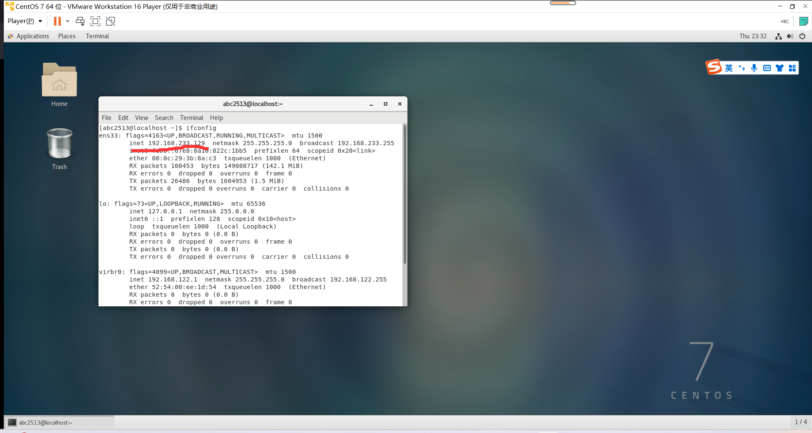

#### 虚拟机快照

- 学习过程损坏操作系统后，可以快速还原
- 虚拟机关机创建快照，速度很快
- VMware Workstation 的Player版本没有，Pro版本有该功能

## 二、开始

#### 目录结构

- 树形结构；没有盘符，只有根目录 /
- Linux分隔符是/，Windows是\

#### 命令入门

- Linux终端：Terminal
- 启动终端时，默认加载的目录是用户的HOME目录

##### 命令通用格式

命令，选项，参数（目标）

```bash
command [-options] [parameter]
```

##### 目录操作命令

ls 命令

```bash
ls [-a -l -h] [路径]
```

- 以平铺形式列出当前工作目录下的内容
- -a 全部内容，包括隐藏文件和文件夹
  - .开头的文件名自动隐藏
- -l 列表形式，展示信息
- -h -l配合，列出文件大小

混合使用选项

```bash
ls -l -a
ls -la
```

cd命令

```bash
cd [路径]
```

- 切换工作目录
- 不写路径，回到用户HOME目录
  - 相对路径：开头不写/
  - 绝对路径：/开头
- 特殊路径符
  - . 当前目录
  - .. 上级目录
  - ~ HOME目录

pwd

- 打印当前工作目录
- 无参数和选项

mkdir

```bash
mkdir [-p]  Linux路径(绝对/相对)
#eg
mkdir $/empty
mkdir $/f1/f2
```

- 创建文件夹
- -p 自动创建不存在的父目录 
- home外的目录有权限问题

##### 文件操作命令

touch 创建文件

```bash
touch Linux路径
#eg
touch test.txt
```

- 创建文件


cat 查看文件内容

```bash
cat Linux路径
```

- 查看文件内容，全部显示


more 多页查看文件

```bash
cat Linux路径
```

- 查看文件内容，支持分页
- 空格翻页，q退出查看


cp 复制文件

```bash
cp [-r] 源路径 目标路径
```

- copy 文件/文件夹
- -r 递归（复制文件夹的子项目）


mv 移动/重命名文件

```bash
mv 源路径 目标路径（可以改名）
#修改文件名
mv test1.txt test2.txt
```

- move 移动文件/文件夹


rm 删除文件

```bash
rm [-r -f] 路径1 路径2 ...
```

- remove 删除文件/文件夹
- -r 递归（删除文件夹的子项目）
- -f 强制删除（无提示）
- 支持通配符*
  - `test*`匹配test开头
  - `*test`
  - `*test*`
- 这是危险的命令，特别是管理员模式==rm -rf /*==


##### 临时进入管理员

su root

- 切换，输入密码

exit

- 退出，回到普通用户


##### 查找命令

which

```bash
which 命令
```

- 查看命令所使用的二进制文件存放位置

find

```bash
find 起始路径 -name "被查找文件名"
find 起始路径 -size +|-n [kMG]
#当前文件夹中大于100MB的文件
find ./ -size +100 M

```

- -name 按文件名查找文件
  - 文件名可以使用通配符*
- -size 按文件大小查找文件
  - +大于，-小于，n数值，k/M/G单位


##### 文本过滤/统计

grep命令查找/过滤

```bash
grep [-n] "关键字" 文件路径
```

- 作用：在文件中通过关键字过滤行
- -n 在结果中显示匹配的行的行号
- 关键字
- 文件路径：待过滤内容的文件路径；可作为管道符的输入

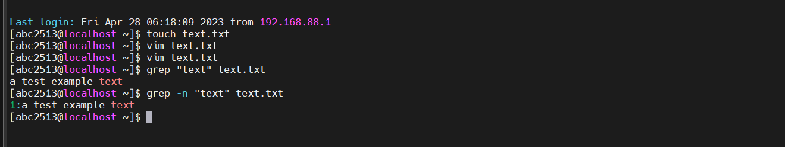


wc命令统计

```scss
wc [-c -m -l -w] 文件路径
```

- 作用：统计文件的行数、单词数量等
- -c 统计字节数（bytes
- -m 字符数
- -l 行数（line
- -w 单词数（word
- 不写选项，输出：行数、单词数、字节数、文件名
- 文件路径：待过滤内容的文件路径；可作为管道符的输入


##### echo和tail

echo 

```bash
echo 输出的内容
echo "输出的内容"
echo `命令`
```

- 输出指定内容
- 使用反引号\`，可以使内容作为命令执行


tail命令

```bash
tail [-f -num] Linux路径
#eg
tail [-f -20] text.txt
```

- 作用：查看文件尾部内容
- -f 表示持续追踪，ctrl+c 停止
- -num 表示查看尾部行数，不写默认10行


##### 管道符

将管道左侧命令的结果，作为右边的输入

```bash
#eg
cat text.txt | grep "text" 
#将左侧获取的文件内容，作为右侧过滤命令的输入

#eg2
ls -l | grep "text"
#查找单前路径下的，文件名含有"text"的文件
ls -l | wc -l
#统计单前路径下的文件/文件夹(实测发现有非文件行)

#eg3 嵌套使用
cat text.txt | grep "test" | wc -l
#获取、过滤、统计
```


##### 重定向符

- `>`将左侧命令的结果，覆盖写入符号右侧指定的文件中
- `>>`将左侧命令的结果，追加写入符号右侧指定的文件中


##### vi编辑器

vim是vi的加强版本，有不同颜色字体

###### 三种工作模式

- 命令模式
- 输入模式
- 底线命令模式


###### 打开文件

```bash
vi 文件路径
vim 文件路径
```


###### 命令模式快捷键


###### 底线命令快捷键


## 三、用户和权限

- 多用户管理模式进行管理权限
- Linux最大权限账户：root（超级管理员）
- 普通用户
  - 在其home目录不受限制
  - 在其他目录，大多数情况是只读/执行权限，无修改权限

#### 切换账户

```bash
su [-] [用户名]
```

- Switch User
- `-`表示在切换用户后加载环境变量
- 用户名，不写切换到root
- 普通用户切换到其他用户需要密码，root用户切换到其他用户无需密码

```
exit
```

- 切换到上一个用户

#### sudo

```
sudo 其他命令
```

- 为命令临时赋予root权限（需要密码）
- 该用户需要有root认证

###### 为普通用户配置sudo认证

```
su -
vim /etc/sudoers
```


#### 用户、用户组管理

- 可以配置多个用户、用户组，用户可以加入多个用户组中
- 针对用户的权限控制、针对用户组的权限控制

###### 用户组

```bash
groupadd 用户组名
#添加用户组

groupdel 用户组名
#删除用户组
```

###### 用户

```bash
useradd [-g -d] 用户名
#创建用户

userdel [-r] 用户名
#删除用户

id [用户名]
#查看用户

usermod -aG 用户组 用户名
#修改用户所属组
```


###### 查看系统中的用户

```bash
getent passwd
#查看系统中的用户信息
#用户名：密码（x隐藏）：用户ID：组ID：描述信息：HOME目录：执行终端（默认bash）

getent group
#查看系统中的用户组信息
#组名称：组认证（x）：组ID
```

#### 查看权限信息


#### 变更权限

chmod

```bash
chmod [-R] 权限 文件或文件夹
#eg
chmod u=rwx,g=rx,o=x hello.txt
#修改权限为rwxr-x--x
#所属用户有rwx权限，所属用户组有rx权限，其他用户组有x权限
#u:user, g:group, o:other
#r:read, w:write, x:执行

#使用数字序号简写权限
chmod 751 hello.txt
#三位数字分别表示：u、g、o的权限
#0:---	1:--x	2:-w-	3:-wx	4:r--	5:r-x	6:rw-	7:rwx
#r4,w2,x1相加即可得到权限
```

- 只有文件所属用户和root用户可以修改
- 作用：修改文件、文件夹的权限信息
- -R 对文件夹内的全部内容应用相同操作


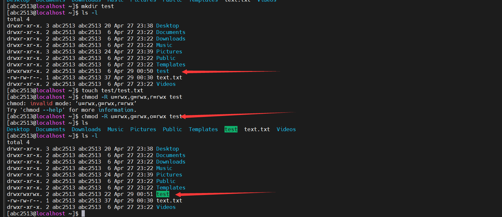

使用数字


chown

```bash
chown [-R] [用户][:用户组] 文件/文件夹
```

- 只有root可以执行
- 作用：可以修改文件/文件夹的所属用户和用户组


## 四、实用操作

#### 快捷键

| 按键   | 作用                                                         |
| ------ | ------------------------------------------------------------ |
| ctrl+c | 强制停止命令程序                                             |
| ctrl+d | 退出/登出账户，退出特定程序的特定页面（比如python，但是不能用于vi） |
| ctrl+r | 输入内容，匹配历史命令；回车执行，左右键得到                 |
| ctrl+l | 清空终端内容（clear命令）                                    |

- `history`命令：查看历史输入过的命令 ,配合grep筛选命令和管道符使用
- `!前缀`：自动执行匹配前缀的命令

光标移动

| 按键------------ | 作用---光标移动----------------------------------------------------------------------------- |
| ---------------- | ------------------------------------------------------------ |
| ctrl+a           | 跳到命令开头                                                 |
| ctrl+e           | 跳到命令结尾                                                 |
| ctrl+键盘左键    | 向左跳一个单词                                               |
| ctrl+键盘右键    | 向右跳一个单词                                               |


#### 软件和服务

##### 软件安装

- CentOS系统：.rpm,yum安装器
- Ubuntu系统：.deb,apt安装器

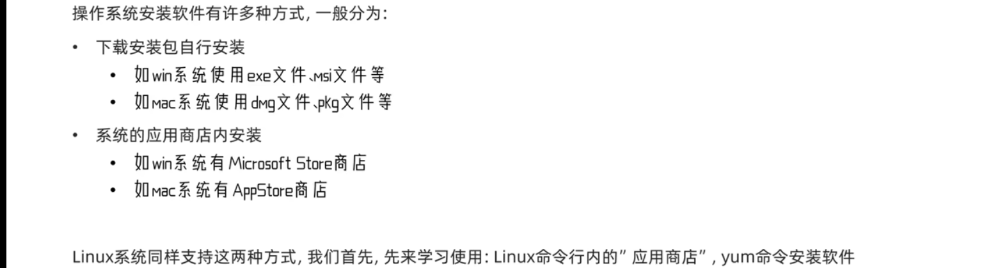

 

yum命令

```bash
yum [-y] [install | remove |search] 软件名称
#eg
su -
yum -y wget
```

- 在centOS中使用，需要root权限、需要联网
- 作用：安装|卸载|搜索安装包，安装会自动安装依赖项
- -y 选项：自动确认，无需手动确认安装/卸载过程


apt命令

- 在Ubuntu中使用，和yum一样


##### 控制服务

systemctl命令

```bash
systemctl start | stop | status | enable | disable 服务名
#启动/关闭/查看状态/开启开机自启/关闭开机自启   系统服务

#eg
yum install -y ntp
systemctl start ntpd
#该软件安装后自动注册为系统服务ntpd
```

- 控制/查看 系统服务


#### 软链接

软链接：将文件/文件夹链接到其他位置，类似windows的快捷方式

ln 命令

```bash
ln -s 被链接的文件/文件夹 目的地
```

- -s 创建软链接

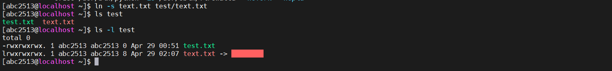


#### 日期和时区

date命令

可以+-日期


修改系统时区

```bash
su -
rm -f /etc/localtime
#ls /usr/share/zoneinfo/Asia | grep "Harbin"
ln -s /usr/share/zoneinfo/Asia/Harbin /etc/localtime
```


ntp程序

- 联网自动校准系统时间

```bash
#安装
yum -y install ntp
#开启
systemctl start ntpd
#开机自启
systemctl enable ntpd
#手动校准时间
ntpdate -u ntp.aliyun.com
```


#### 网络地址

##### IP与主机

- IP地址

  - 对外联络地址
  - 查看ip地址：`ifconfig`
  -  `127.0.0.1`本机
  -  `0.0.0.0`本机、确定绑定端口、表示任意IP

- 主机名

  ```bash
  #查看主机名
  hostname
  #修改主机名
  hostnamectl set-hostname 主机名
  ```

- 域名解析/主机名映射

  1. 检查私人地址本`/etc`
  2. 联网DNS服务器

##### 虚拟机固定IP

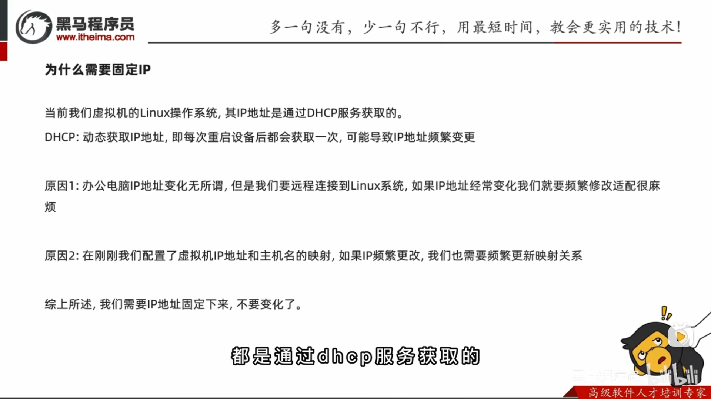

步骤：

1. 虚拟化软件配置IP地址网关和网段

   1. VM->编辑->虚拟网络编辑器->更改设置
   2. 给予管理员权限
   3. 修改网关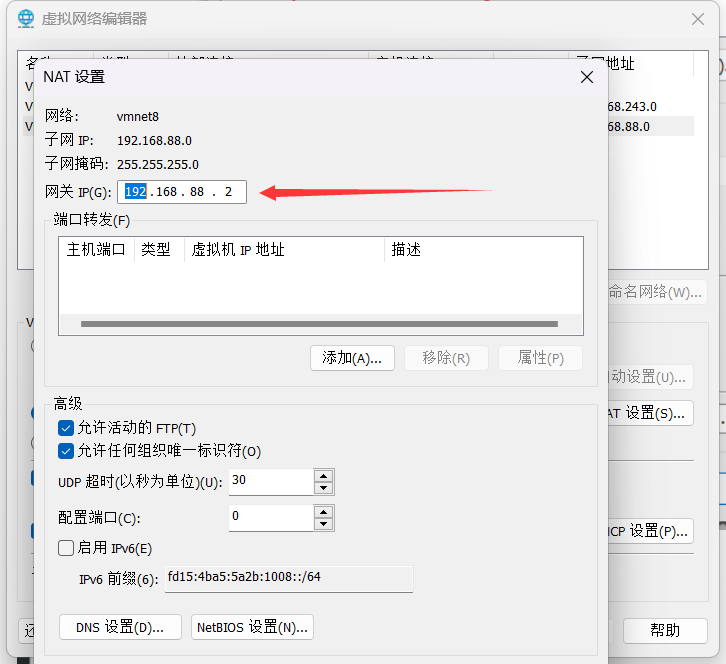

2. 在Linux中修改配置文件固定IP

   1. 进入管理员模式

   2. 打开配置文件`vi /etc/sysconfig/network-scripts/ifcfg-ens33`

   3. 修改

      ```
      BOOTPROTO="static"
      ```

   4. 添加

      ```
      IPADDR="192.168.88.130"
      NETMASK="255.255.255.0"
      GATEWAY="192.168.88.2"
      DNS1="192.168.88.2"
      ```

   5. 保存配置文件

   6. 重启网关指令

      ```bash
      systemctl restart network
      ```

      

##### 网络传输

ping 

```bash
ping [-c num] ip或主机名
```

- 检查该地址是否联通
- -c num 检查的次数，默认无限次


wget

```bash
wget [-b -f] url
```

- 非交互式文件下载
- -b 选项，后台下载
- -f 选项，持续追踪进度


curl

```bash
curl baidu.com#发送请求
curl -O xxx #下载文件
```

- 发起网络请求


端口

- 0~1023	公认端口，如ssh服务
- 1024~49151 注册端口，松散地绑定程序
- 49152~65535动态端口，临时使用


查看端口占用情况

```bash
yum -y install nmap
nmap url
#eg 
nmap 127.0.0.1
```


#### 进程


进程管理

程序运行时会被操作系统注册为进程，并分配唯一的进程ID


查看进程

```bash
ps [-e -f]
#eg
ps -ef | grep "xxx"
```


关闭进程

```bash
kill [-9] 进程ID
```

-  -9 选项表示强制关闭，不加要看进程自身的关闭机制


#### 主机状态

查看资源占用

```bash
top
```

- 类似资源管理器
- 每五秒刷新
- ctrl+c 或者q键退出


可用选项：

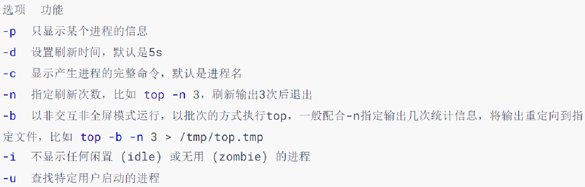


交互式模式中，可用快捷键：


磁盘信息监控

```bash
#查看磁盘使用率
df [-h]

#查看cpu、磁盘信息
iostat [-x] [num1] [num2]
#-x更多信息，刷新时间，刷新次数
```


网络状态监控

```bash
sar -n DEV num1 num2
```

-  -n 表示查看网络
- DEV表示查看网络接口
- 刷新间隔（不写就查看一次）、查看次数（不填就无限次数）


- rxKB/S
- txKB/S


#### 环境变量

操作系统记录的关键信息

```bash
#查看系统中的环境变量
env
#进行过滤
env | grep "xxx"
#临时设置环境变量
export 变量名=变量值
```

设置环境变量

- 当前用户：`~/.bashrc`文件
- 所有用户：`/etc/profile`文件

```bash
vim ~/.bashrc		#编辑文件
source ~/.bashrc	#重新加载

#eg
touch ~/haha
echo "echo haha" > ~/haha #写入命令
chmod 777 ~/haha #给予执行权限
~/haha #测试命令
vim ~/.bashrc#追加export haha=~/haha
source ~/.bashrc
```

###### PATH

环境变量PATH：记录了系统命令的执行路径，按顺序搜索

```bash
echo $PATH
echo ${PATH}
```

设置：

系统用户

```bash
#添加系统变量
cd /
mkdir myenv
cd myenv
touch haha
echo "echo haha" > haha
chmod 777 haha
vim /etc/profile #尾部追加 export PATH=$PATH:/myenv
source /etc/profile #重新加载

haha #测试命令
```


#### 文件传输

##### 使用终端

- 下载：右键目录中的文件，选择下载，即可将文件下载到电脑中（需要用户有权限）
- 上传：拖拽

##### 命令

- ```bash
  #安装
  yum -y install Lrzsz
  
  #下载
  sz 文件路径
  #上传（会弹出窗口操作）
  rz
  ```


#### 压缩和解压

##### tar或gzip文件

- tar文件是简单组装，没有体积压缩
- gz文件是gzip压缩算法压缩后的文件

```bash
tar [-c -v -x -f -z -C] 参数1 参数2 ...
#eg压缩
tar -cvf test.tar 1.txt 2.txt
tar -zcvf test.tar.gz 1.txt 2.txt
#eg解压缩
tar -xvf test.tar -C ~/test
tar -zxvf test.tar.gz -C ~/test
#解压到当前路径
tar -xvf test.tar
```

- -c 创建压缩文件（压缩模式）
- -v 显示压缩/解压
- -x 解压模式(和c冲突)
- -f 要创建/解压的文件，必须位置最后
- -z gzip模式
- -C选择解压目的地（解压模式）

##### zip文件

```bash
zip [-r] 参数1 参数2 ……
```

- -r 文件夹递归

```bash
unzip [-d] 参数
#eg
unzip test.zip -d ./test
```

- -d 指定解压路径
- 同名内容会替换


## 五、实战

MySQL 8.0 在CentOS安装


# Linux基础命令


## Linux的目录结构


- `/`，根目录是最顶级的目录了
- Linux只有一个顶级目录：`/`
- 路径描述的层次关系同样适用`/`来表示
- /home/itheima/a.txt，表示根目录下的home文件夹内有itheima文件夹，内有a.txt


## ls命令

功能：列出文件夹信息

语法：`ls [-l -h -a] [参数]`

- 参数：被查看的文件夹，不提供参数，表示查看当前工作目录
- -l，以列表形式查看
- -h，配合-l，以更加人性化的方式显示文件大小
- -a，显示隐藏文件


### 隐藏文件、文件夹

在Linux中以`.`开头的，均是隐藏的。

默认不显示出来，需要`-a`选项才可查看到。


## pwd命令

功能：展示当前工作目录

语法：`pwd`


## cd命令

功能：切换工作目录

语法：`cd [目标目录]`

参数：目标目录，要切换去的地方，不提供默认切换到`当前登录用户HOME目录`


## HOME目录

每一个用户在Linux系统中都有自己的专属工作目录，称之为HOME目录。

- 普通用户的HOME目录，默认在：`/home/用户名`

- root用户的HOME目录，在：`/root`


FinalShell登陆终端后，默认的工作目录就是用户的HOME目录


## 相对路径、绝对路径

- 相对路径，==非==`/`开头的称之为相对路径

  相对路径表示以`当前目录`作为起点，去描述路径，如`test/a.txt`，表示当前工作目录内的test文件夹内的a.txt文件

- 绝对路径，==以==`/`开头的称之为绝对路径

  绝对路径从`根`开始描述路径


## 特殊路径符

- `.`，表示当前，比如./a.txt，表示当前文件夹内的`a.txt`文件
- `..`，表示上级目录，比如`../`表示上级目录，`../../`表示上级的上级目录
- `~`，表示用户的HOME目录，比如`cd ~`，即可切回用户HOME目录


## mkdir命令

功能：创建文件夹

语法：`mkdir [-p] 参数`

- 参数：被创建文件夹的路径
- 选项：-p，可选，表示创建前置路径


## touch命令

功能：创建文件

语法：`touch 参数`

- 参数：被创建的文件路径


## cat命令

功能：查看文件内容

语法：`cat 参数`

- 参数：被查看的文件路径


## more命令

功能：查看文件，可以支持翻页查看

语法：`more 参数`

- 参数：被查看的文件路径
- 在查看过程中：
  - `空格`键翻页
  - `q`退出查看


## cp命令

功能：复制文件、文件夹

语法：`cp [-r] 参数1 参数2`

- 参数1，被复制的
- 参数2，要复制去的地方
- 选项：-r，可选，复制文件夹使用

示例：

- cp a.txt b.txt，复制当前目录下a.txt为b.txt
- cp a.txt test/，复制当前目录a.txt到test文件夹内
- cp -r test test2，复制文件夹test到当前文件夹内为test2存在


## mv命令

功能：移动文件、文件夹

语法：`mv 参数1 参数2`

- 参数1：被移动的
- 参数2：要移动去的地方，参数2如果不存在，则会进行改名


## rm命令

功能：删除文件、文件夹

语法：`rm [-r -f] 参数...参数`

- 参数：支持多个，每一个表示被删除的，空格进行分隔
- 选项：-r，删除文件夹使用
- 选项：-f，强制删除，不会给出确认提示，一般root用户会用到


> rm命令很危险，一定要注意，特别是切换到root用户的时候。


## which命令

功能：查看命令的程序本体文件路径

语法：`which 参数`

- 参数：被查看的命令


## find命令

功能：搜索文件

语法1按文件名搜索：`find 路径 -name 参数`

- 路径，搜索的起始路径
- 参数，搜索的关键字，支持通配符*， 比如：`*`test表示搜索任意以test结尾的文件


## grep命令

功能：过滤关键字

语法：`grep [-n] 关键字 文件路径`

- 选项-n，可选，表示在结果中显示匹配的行的行号。
- 参数，关键字，必填，表示过滤的关键字，带有空格或其它特殊符号，建议使用””将关键字包围起来
- 参数，文件路径，必填，表示要过滤内容的文件路径，可作为内容输入端口


> 参数文件路径，可以作为管道符的输入


## wc命令

功能：统计

语法：`wc [-c -m -l -w] 文件路径`

- 选项，-c，统计bytes数量
- 选项，-m，统计字符数量
- 选项，-l，统计行数
- 选项，-w，统计单词数量
- 参数，文件路径，被统计的文件，可作为内容输入端口


> 参数文件路径，可作为管道符的输入


## 管道符|

写法：`|`

功能：将符号左边的结果，作为符号右边的输入

示例：

`cat a.txt | grep itheima`，将cat a.txt的结果，作为grep命令的输入，用来过滤`itheima`关键字


可以支持嵌套：

`cat a.txt | grep itheima | grep itcast`


## echo命令

功能：输出内容

语法：`echo 参数`

- 参数：被输出的内容


## `反引号

功能：被两个反引号包围的内容，会作为命令执行

示例：

- echo \`pwd\`，会输出当前工作目录


## tail命令

功能：查看文件尾部内容

语法：`tail [-f] 参数`

- 参数：被查看的文件
- 选项：-f，持续跟踪文件修改


## head命令

功能：查看文件头部内容

语法：`head [-n] 参数`

- 参数：被查看的文件
- 选项：-n，查看的行数


## 重定向符

功能：将符号左边的结果，输出到右边指定的文件中去

- `>`，表示覆盖输出
- `>>`，表示追加输出


## vi编辑器

### 命令模式快捷键


### 底线命令快捷键

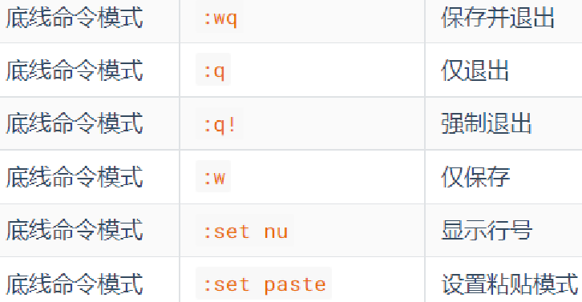


## 命令的选项

我们学习的一系列Linux命令，它们所拥有的选项都是非常多的。

比如，简单的ls命令就有：-a -A -b -c -C -d -D -f -F -g -G -h -H -i -I -k -l -L -m -n -N -o -p -q -Q -r-R -s -S -t -T -u -U -v -w -x -X -1等选项，可以发现选项是极其多的。

课程中， 并不会将全部的选项都进行讲解，否则，一个ls命令就可能讲解2小时之久。

课程中，会对常见的选项进行讲解， 足够满足绝大多数的学习、工作场景。


### 查看命令的帮助

可以通过：`命令 --help`查看命令的帮助手册


### 查看命令的详细手册

可以通过：`man 命令`查看某命令的详细手册


# Linux常用操作

## 软件安装

- CentOS系统使用：
  - yum [install remove search] [-y] 软件名称
    - install 安装
    - remove 卸载
    - search 搜索
    - -y，自动确认
- Ubuntu系统使用
  - apt [install remove search] [-y] 软件名称
    - install 安装
    - remove 卸载
    - search 搜索
    - -y，自动确认

> yum 和 apt 均需要root权限


## systemctl

功能：控制系统服务的启动关闭等

语法：`systemctl start | stop | restart | disable | enable | status 服务名`

- start，启动
- stop，停止
- status，查看状态
- disable，关闭开机自启
- enable，开启开机自启
- restart，重启


## 软链接

功能：创建文件、文件夹软链接（快捷方式）

语法：`ln -s 参数1 参数2`

- 参数1：被链接的
- 参数2：要链接去的地方（快捷方式的名称和存放位置）


## 日期

语法：`date [-d] [+格式化字符串]`

- -d 按照给定的字符串显示日期，一般用于日期计算

- 格式化字符串：通过特定的字符串标记，来控制显示的日期格式
  - %Y   年%y   年份后两位数字 (00..99)
  - %m   月份 (01..12)
  - %d   日 (01..31)
  - %H   小时 (00..23)
  - %M   分钟 (00..59)
  - %S   秒 (00..60)
  - %s   自 1970-01-01 00:00:00 UTC 到现在的秒数


示例：

- 按照2022-01-01的格式显示日期

  

- 按照2022-01-01 10:00:00的格式显示日期

  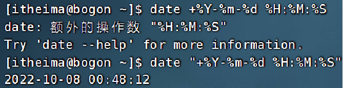

- -d选项日期计算

  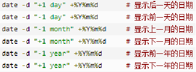

  - 支持的时间标记为：

    


## 时区

修改时区为中国时区

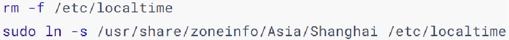


## ntp

功能：同步时间

安装：`yum install -y ntp`

启动管理：`systemctl start | stop | restart | status | disable | enable ntpd`


手动校准时间：`ntpdate -u ntp.aliyun.com`


## ip地址

格式：a.b.c.d

- abcd为0~255的数字


特殊IP：

- 127.0.0.1，表示本机
- 0.0.0.0
  - 可以表示本机
  - 也可以表示任意IP（看使用场景）


查看ip：`ifconfig`


## 主机名

功能：Linux系统的名称

查看：`hostname`

设置：`hostnamectl set-hostname 主机名`


## 配置VMware固定IP

1. 修改VMware网络，参阅PPT，图太多

2. 设置Linux内部固定IP

   修改文件：`/etc/sysconfig/network-scripts/ifcfg-ens33`

   示例文件内容：

   ```shell
   TYPE="Ethernet"
   PROXY_METHOD="none"
   BROWSER_ONLY="no"
   BOOTPROTO="static"			# 改为static，固定IP
   DEFROUTE="yes"
   IPV4_FAILURE_FATAL="no"
   IPV6INIT="yes"
   IPV6_AUTOCONF="yes"
   IPV6_DEFROUTE="yes"
   IPV6_FAILURE_FATAL="no"
   IPV6_ADDR_GEN_MODE="stable-privacy"
   NAME="ens33"
   UUID="1b0011cb-0d2e-4eaa-8a11-af7d50ebc876"
   DEVICE="ens33"
   ONBOOT="yes"
   IPADDR="192.168.88.131"		# IP地址，自己设置，要匹配网络范围
   NETMASK="255.255.255.0"		# 子网掩码，固定写法255.255.255.0
   GATEWAY="192.168.88.2"		# 网关，要和VMware中配置的一致
   DNS1="192.168.88.2"			# DNS1服务器，和网关一致即可
   ```


## ps命令

功能：查看进程信息

语法：`ps -ef`，查看全部进程信息，可以搭配grep做过滤：`ps -ef | grep xxx`


## kill命令

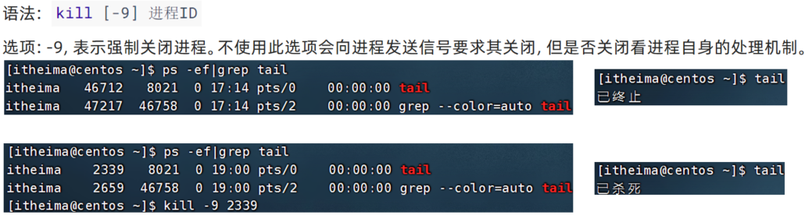


## nmap命令


## netstat命令

功能：查看端口占用

用法：`netstat -anp | grep xxx`


## ping命令

测试网络是否联通

语法：`ping [-c num] 参数`


## wget命令

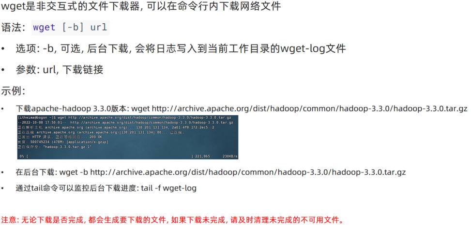

## curl命令

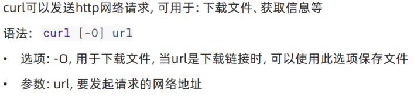


## top命令

功能：查看主机运行状态

语法：`top`，查看基础信息


可用选项：


交互式模式中，可用快捷键：


## df命令

查看磁盘占用

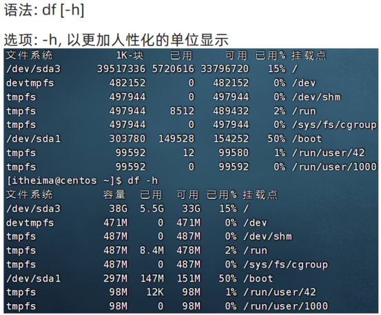


## iostat命令

查看CPU、磁盘的相关信息

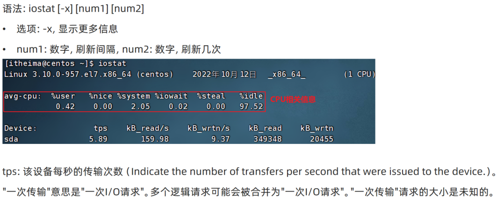


## sar命令

查看网络统计


## 环境变量

- 临时设置：export 变量名=变量值
- 永久设置：
  - 针对用户，设置用户HOME目录内：`.bashrc`文件
  - 针对全局，设置`/etc/profile`


### PATH变量

记录了执行程序的搜索路径

可以将自定义路径加入PATH内，实现自定义命令在任意地方均可执行的效果


## $符号

可以取出指定的环境变量的值

语法：`$变量名`

示例：

`echo $PATH`，输出PATH环境变量的值

`echo ${PATH}ABC`，输出PATH环境变量的值以及ABC

如果变量名和其它内容混淆在一起，可以使用${}


## 压缩解压

### 压缩

`tar -zcvf 压缩包 被压缩1...被压缩2...被压缩N`

- -z表示使用gzip，可以不写


`zip [-r] 参数1 参数2 参数N`

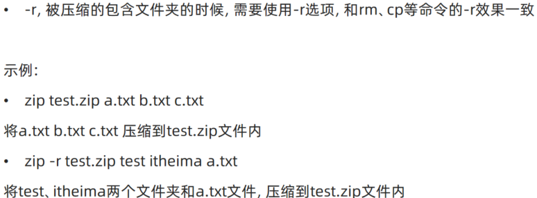


### 解压

`tar -zxvf 被解压的文件 -C 要解压去的地方`

- -z表示使用gzip，可以省略
- -C，可以省略，指定要解压去的地方，不写解压到当前目录


`unzip [-d] 参数`


## su命令

切换用户

语法：`su [-] [用户]`


## sudo命令


比如：

```shell
itheima ALL=(ALL)       NOPASSWD: ALL
```

在visudo内配置如上内容，可以让itheima用户，无需密码直接使用`sudo`


## chmod命令

修改文件、文件夹权限


语法：`chmod [-R] 权限 参数`

- 权限，要设置的权限，比如755，表示：`rwxr-xr-x`

  

- 参数，被修改的文件、文件夹

- 选项-R，设置文件夹和其内部全部内容一样生效


## chown命令

修改文件、文件夹所属用户、组


语法：`chown [-R] [用户][:][用户组] 文件或文件夹`


## 用户组管理


## 用户管理


## genenv命令

- `getenv group`，查看系统全部的用户组

  

- `getenv passwd`，查看系统全部的用户

  


## env命令

查看系统全部的环境变量

语法：`env`

