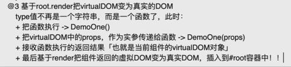
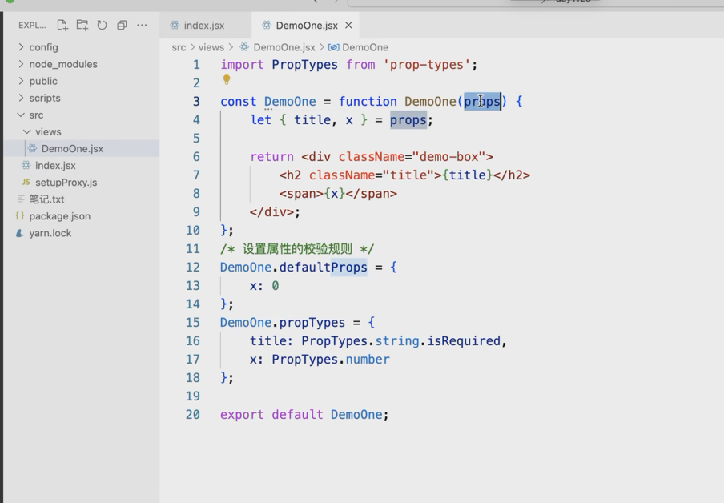
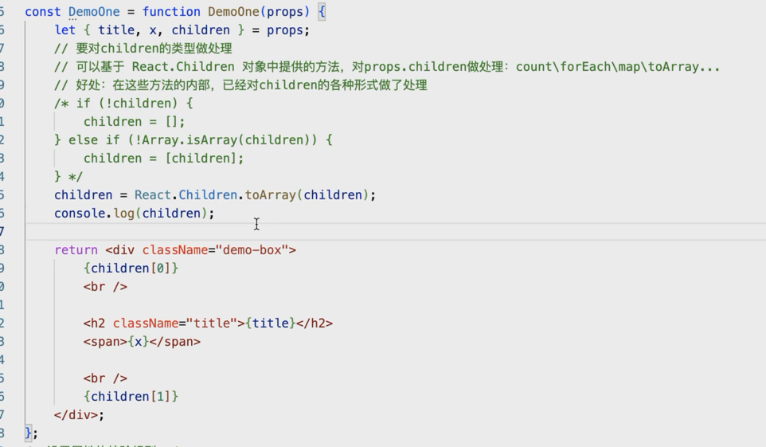
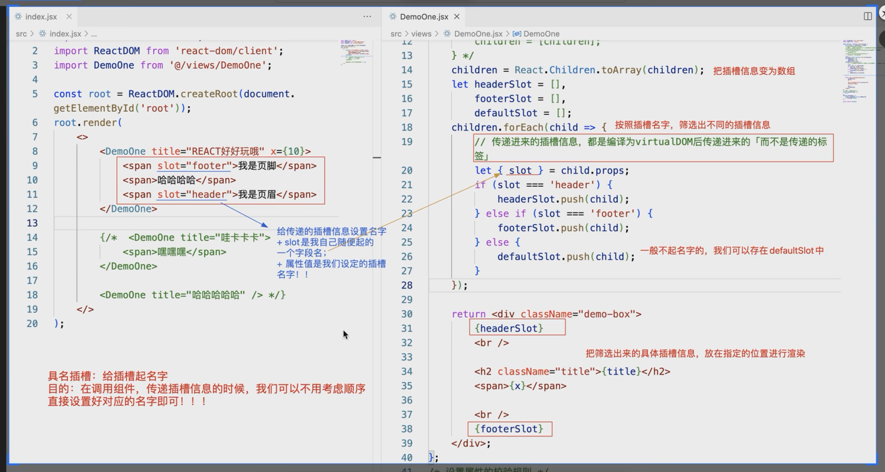
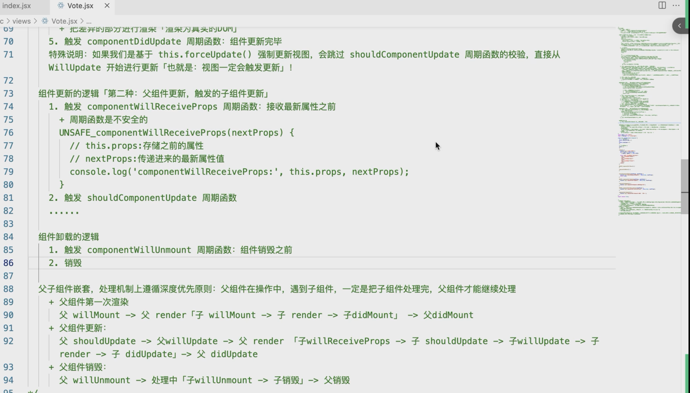
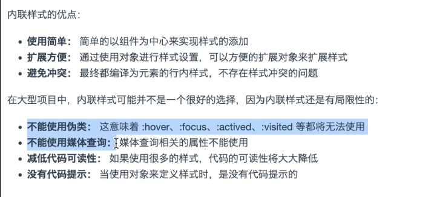
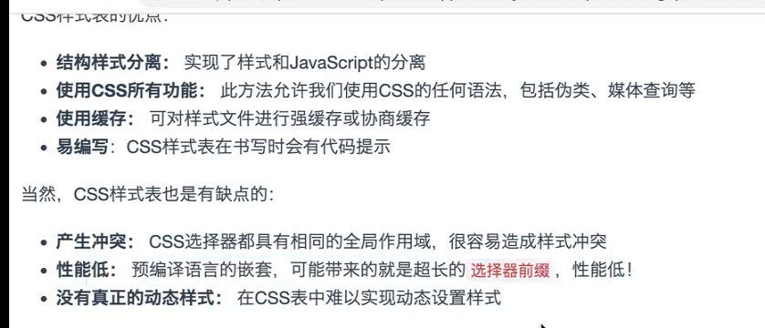
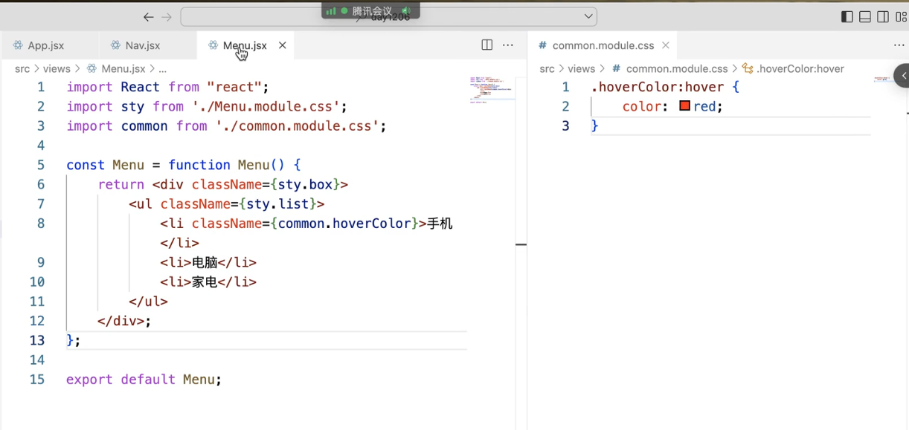

# React 珠峰

### 3 脚手架的进阶应用

##### 暴露webpack配置

用于修改打包规则。执行命令`yarn eject`，执行前需要在git提交。暴露操作是单向的，一般在创建后就执行

- 这个过程会暴露config文件夹，包含webpack配置文件；
  - path：路径相关
  - webpack.config.js：webpack配置文件
- 暴露srcipts文件夹，包含打包等命令的脚本；
- 将webpack的各种模块添加到package并重新安装；
- script会基于node执行scripts文件夹下的脚本，不再使用react-script插件的命令，也没有eject命令了
- babel配置多了presets：[react-app]


babel-preset-react-app


默认配置有sass预编译语言，无需配置。less/stylus需要配置

##### 添加less支持

安装less和less-loader，在webpack配置文件添加less/less Module匹配规则和加载器

##### 脚本环境变量


##### 修改兼容列表


代理服务器设置


### 4 MVC模式和MVVM模式

React是前端框架类的库


React采用MVC体系，Vue使用MVVM体系（双向驱动，数据双向流动）


Vue：


### 7 JSX底层渲染机制 创建虚拟DOM


### 9 函数组件的底层渲染机制




### 10 props的细节【】

属性的校验规则



### 11 react中的插槽处理机制

children：数组/对象



react需要自己实现插槽机制，vue有内置



### 16 类组件渲染逻辑【】

### 17 类组件更新逻辑【】




### 49 样式私有化处理

vue里可以为style标签设置scoped，react没有

##### 基础方案

###### 内联样式

使用内联样式，不再使用样式和类名处理。简单、以React组件为中心

- 不利于样式的复用。如果提取成共用样式对象，没有代码提示
- 不能使用伪类、媒体查询、选择子元素
- 样式和结构混淆，不利于优化

内联样式可用于

- 样式覆盖
- 动态样式



###### CSS类人为规范化类名

路径+组件名作为最外层容器的类名，然后内部元素内嵌到外层容器下



##### 使用CSSModule



##### 使用ReactJSS

```js
import {createUseStyles}from 'react-jss';
const useStyles=use
```


