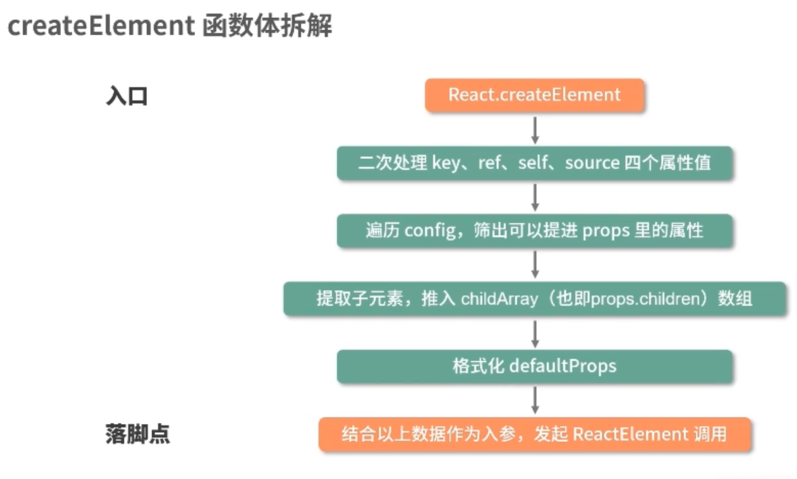

# React进阶

https://www.bilibili.com/video/BV12r4y1r7vL/

### 1、JSX代码如何变成虚拟DOM

- JSX是JS的拓展，充分具备JS的语法能力。需要通过Babel转化为浏览器可识别的语法
- Babel是一个工具链，主要用于ES6+版本的JS转化为向下兼容的语法，提高在浏览器上的兼容性

- JSX相对于React.createElement，层次清晰。允许前端开发者使用最熟悉的类HTML标签语法创建虚拟DOM

React.createElement

将虚拟DOM渲染到真实DOM

### 2、React15组件生命周期

##### React15

- 加载阶段Mounting阶段
  - constructor，构造器，state可以在这里初始化
  - componentWillMount，render前执行
  - render方法被触发。render方法不会操作真实DOM，只是把需要渲染的内容返回出来。操作真实DOM是ReactDON.render操作的
  - componentDidMount，渲染结束后触发，对真实DOM的操作可以在这里进行

- 更新阶段Update阶段
  - 

###### 组件更新

componentReceiveProps不是props更新触发的，而是父组件的更新触发的

为了不必要地调用render 产生的性能开销，提供shouldComponentUpdate

###### 组件卸载

一般的触发

- 组件在父组件中被移除了
- 组件中设置了key属性，父组件在render过程中发生key值和上一次不一样

### 3、react16组件生命周期

##### React 16.3

###### 1、废除componentWillMounted

有问题

###### 2、新增getDerivedStateFromProps与移除componentWillReceiveProps

用来props派生/更新state

static getDrivedStateFromProps(props,state)

- 这是一个静态方法，访问不到this。this为null
- 两个参数：父组件传入的props、自身的state
- 需要对象格式或者null的返回值，用于更新state。不能undefined
- 这个方法是对state某些属性的定向更新，而非state的覆盖更新

为什么要用getDrivedStateFromProps代替componentWillReceiveProps?

- 静态方法，获取不到this，避免在该钩子里调用setState等可能会产生副作用的函数。通过返回值，完成props到state的映射。使生命周期更加可预测

###### 3、新增getSnapshotBeforeUpdate

- getSnapshotBeforeUpdate(prveProps,prevState)
- 返回值会作为componentDidUpdate的第三个参数
- 执行时间是render后，真实DOM之前
- 可以同时获取更新前的真实DOM和更新前后的state、props

需要和componentDidUpdate配合才能发挥作用

###### 4、Fiber架构

React16对React核心算法一次重写，使原来同步的渲染过程变成可打断的异步渲染模式

- React16前，组件更新都会形成新的虚拟DOM，和上一个虚拟DOM进行diff算法对比，对真实DOM定向更新。
  - 占用主线程，浏览器无法处理用户交互。有卡顿、卡死分享
- Fiber会把大的更新任务分割成小个任务，执行完一个，更新渲染都会交回主线程，看看有没有优先级更高的线程

根据能否被打断的标准，React16生命周期被划分成render和commit两个阶段

- render阶段允许被打断
  - render阶段对用户不可见，暂停、中止、重启对用户0感知
  - componentWillMount、componentWillUpdate、componentWillReceiveProps 出于render阶段可能被==重复执行==，长期滥用导致异步渲染存在风险。包括setState、fetch发起异步请求、操作真实DOM……
    - 完全可以转移到其他生命周期里去做
    - 新的getDeriveStateFromProps，不允许访问this防止骚操作
- commit阶段不允许被打断
  - commit阶段涉及到渲染，用户可见，因此是同步的

### 4、组件间数据流动【？】

基于props的单向数据流：props只能流向更低层级的

发布-订阅机制

### 6、React-Hook 设计动机

类组件和函数组件形式

类组件：

函数组件：

不同之处：

- 类组件适用于面向对象思想
  - 提供了很多东西，大而全。但是学习成本高、理解成本高
  - 组件和逻辑粘合，内部逻辑难以拆分和复用
- 函数组件
  - 轻巧。进数据，出UI，把数据层面映射到用户页面
  - 更加契合React的设计理念

函数组件中，props在执行时就被捕获。而类式组件，props需要转成state，render直接使用的是this的数据。函数组件真正把数据和渲染绑定在一起

---

hook，通过可选的钩子，为函数组件补全缺少于类组件的东西。

### 7、