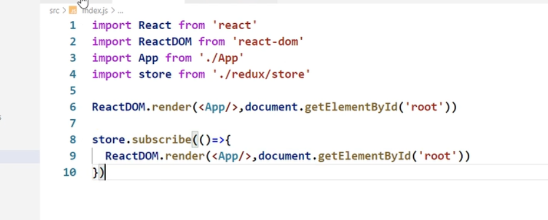

# Redux学习笔记

https://www.bilibili.com/video/BV1wy4y1D7JT?p=97

## 一、Redux

### 1 简化使用

##### producer

```js
export default function countReducer(preState=0,action){
    const {type,data}=action
    console.log(preState,action)
    switch(type){
        case 'increment':
            return preState+data;
        case 'decrement':
            return preState-data;
        default:
            return preState;
    }
}
```

##### store

```js
import { createStore } from "redux";
import countReducer from "./count_reducer";

export default createStore(countReducer);
```

##### 写数据

```js
store.dispatch({ type: 'increment', data: 1 })
```

##### 读数据

```js
store.getState()
```

##### 订阅状态更新

###### 在组件内订阅

```js
componentDidMount(){
    store.subscribe(()=>{
        this.setState({})
    })
}
```

###### 在根节点订阅

```js
import React from 'react'
import ReactDOM from 'react-dom/client'
import { HashRouter } from 'react-router-dom'
import App from './App'
import store from './redux/store'
//ReactDOM.render(<App/>,document.getElementById('root'))
let root=ReactDOM.createRoot(document.getElementById('root'))
root.render(
        <App/>
)
store.subscribe(()=>{
    root.render(
        <App/>
    )
})
```

旧版本react




### 2 完整使用

##### 使用ActionCreator

###### 定义

```js
//该文件专门为count组件生成action
export function createIncrementAction(){
    return {type:'increment',data:1}
}
export function createDecrementAction(){
    return {type:'decrement',data:1}
}
```

简写

```js
import * as const_constant from './count_constant'
export const createIncrementAction=(data=1)=>({type:const_constant.INCREMENT,data})
export const createDecrementAction=(data=1)=>({type:const_constant.DECREMRNT,data})
```

###### 使用

在发布消息处（组件内）使用

```jsx
import React, { Component } from 'react'
import store from '../../redux/store' //导入store
import * as count_action_creater from '../../redux/count_action-creater'
export default class index extends Component {
    increment = () => {
        store.dispatch(count_action_creater.createIncrementAction())
    }
    decrement = () => {
        store.dispatch(count_action_creater.createDecrementAction())
    }
    render() {
        return (
            <div>
                number:{store.getState()}
                <button onClick={this.increment}>+</button>
                <button onClick={this.decrement}>-</button>
            </div>
        )
    }
}
```

##### 使用Constant

定义常量防止消息写错

###### 声明

```js
//定义action.type的常量值，便于管理、防止打错
export const INCREMENT = 'increment'
export const DECREMRNT = 'decrement'
```

###### 使用

在producer和actionCreator处使用

producer

```js
import * as const_constant from './count_constant'
export default function countReducer(preState=0,action){
    const {type,data}=action
    console.log(preState,action)
    switch(type){
        case const_constant.INCREMENT:
            return preState+1*data;
        case const_constant.DECREMRNT:
            return preState-1*data;
        default:
            return preState;
    }
}
```

actionCreator


```js
//该文件专门为count组件生成action
import * as const_constant from './count_constant'
export function createIncrementAction(){
    return {type:const_constant.INCREMENT,data:1}
}
export function createDecrementAction(){
    return {type:const_constant.DECREMRNT,data:1}
}
```


### 3 异步action

- action是对象，同步action
- action是函数，异步action

异步交给action，而不是组件。（非必须，可以在异步方法后再调用action

需要中间件，让store接受函数。

##### 安装

```bash
npm i redux-thunk
```

##### 在store加中间件

```js
import { createStore,applyMiddleware } from "redux";
import countReducer from "./count_reducer";
import thunk from 'redux-thunk'
export default createStore(countReducer,applyMiddleware(thunk));
```

##### 在producer

```js
//该文件专门为count组件生成action
import * as const_constant from './count_constant'
import store from './store'
import thunk from 'redux-thunk'
//同步action,返回action对象
export const createIncrementAction=(data=1)=>({type:const_constant.INCREMENT,data})
export const createDecrementAction=(data=1)=>({type:const_constant.DECREMRNT,data})
//异步action,返回action为函数。同步调用action。
export const createAsyncIncrementAction=(data=1,time=1000)=>{
    return (dispatch)=>{
        setTimeout(()=>{
            dispatch(createIncrementAction(data))
        },time)
    }
}
```

##### 使用

在组件中使用

```js
store.dispatch(count_action_creater.createAsyncIncrementAction(1,1000))
```


## 二、react-redux 

优点：无需自己监测变化了

### 基本使用

##### 模型图


##### 安装

```bash
 npm i react-redux
```

##### 容器组件

```js
//引入UI组件
import CountUI from "../components/Count";
//引入connect用于连接UI组件和容器组件
import { connect } from "react-redux";
import * as count_action_creater from '../redux/count_action_creater'

function mapStateToProps(state){
    return {
        //用于传递状态
        //返回对象，对象的key作为props中的key，对象的value（属性）作为props中的value（状态）
        "key":"value",
        count:state
    }
}
function mapDispatchToProps(dispatch){
    return {
        //用于传递操作状态的方法
        //返回对象，对象的key作为props中的key，对象的value（函数）作为props中的value（操作状态的方法）
        increment : () => {
            dispatch(count_action_creater.createIncrementAction())
        },
        decrement : () => {
            dispatch(count_action_creater.createDecrementAction())
        },
        incrementAsync : ()=>{
            dispatch(count_action_creater.createAsyncIncrementAction())
        },
    }
}
//创建并暴露容器组件
//两个括号是，第一个函数执行后返回值是函数，第二个括号代表调用该函数
export default connect (mapStateToProps,mapDispatchToProps)(CountUI)
```


##### UI组件

```jsx
import React, { Component } from 'react'

export default class CountUI extends Component {
    render() {
        return (
            <div>
                Count:{this.props.count}
                {/* number:{store.getState()} */}
                <button onClick={this.props.increment}> + </button>
                <button onClick={this.props.decrement}> - </button>
                <button onClick={this.props.incrementAsync}> Async + </button>
            </div>
        )
    }
}
```


##### 使用

==在组件内，给容器组件传入store==

```js
import React, { Component } from 'react'
import * as count_action_creater from '../../redux/count_action_creater'
import Count from '../../containers/Count'
import store from '../../redux/store'
export default class index extends Component {
    render() {
        return (
            <div>
                <Count store={store}></Count>
            </div>
        )
    }
}
```

### 优化

##### 1 分发函数

mapStateToProps和mapDispatchToProps的优化

原来写法

```js
//引入UI组件
import CountUI from "../components/Count";
//引入connect用于连接UI组件和容器组件
import { connect } from "react-redux";
import * as count_action_creater from '../redux/count_action_creater'

export default connect(
    state => ({
        count: state
    }),
    dispatch => ({
        increment: () => dispatch(count_action_creater.createIncrementAction()),
        decrement: () => dispatch(count_action_creater.createDecrementAction()),
        incrementAsync: () => dispatch(count_action_creater.createAsyncIncrementAction()),
    })
)(CountUI)
```

使用对象，自动分发属性操作方法

不用自己dispatch、调用

```js
//引入UI组件
import CountUI from "../components/Count";
//引入connect用于连接UI组件和容器组件
import { connect } from "react-redux";
import * as count_action_creater from '../redux/count_action_creater'

export default connect(
    state => ({
        count: state
    }),
    {
        increment: count_action_creater.createIncrementAction,//没有括号！！！
        decrement: count_action_creater.createDecrementAction,
        incrementAsync: count_action_creater.createAsyncIncrementAction
    }
)(CountUI)
```

##### tip redux好处 

- 无需自己监测属性变化


##### 2 使用Provider

- 问题：组件多时每次传入store很麻烦
- 解决：在根节点使用provider包裹App，让App所有后代容器组件都能接受到store


```jsx

import React from 'react'
import ReactDOM from 'react-dom/client'
import { HashRouter } from 'react-router-dom'
import App from './App'
import store from './redux/store'
import { Provider } from 'react-redux'
//ReactDOM.render(<App/>,document.getElementById('root'))
let root=ReactDOM.createRoot(document.getElementById('root'))

root.render(
    <Provider store={store}>
        <HashRouter>
            <App/>
        </HashRouter>
    </Provider>
)
```


##### 3 整合UI组件和容器组件

UI组件和容器组件整合成一个文件

 ```jsx
 import React, { Component } from 'react'
 //容器
 import { connect } from "react-redux";
 import * as count_action_creater from '../redux/count_action_creater'
 
 //1.定义UI组件，无需暴露
 class CountUI extends Component {
     render() {
         return (
             <div>
                 Count:{this.props.count}
                 <button onClick={()=>{this.props.increment()}}> + </button>
                 <button onClick={()=>{this.props.decrement()}}> - </button>
                 <button onClick={()=>{this.props.incrementAsync()}}> Async + </button>
             </div>
         )
     }
 }
 
 //2.定义容器组件，并暴露
 export default connect(
     //映射属性到props
     state => ({
         count: state
     }),
     //映射操作属性的方法到props
     {
         increment: count_action_creater.createIncrementAction,
         decrement: count_action_creater.createDecrementAction,
         incrementAsync: count_action_creater.createAsyncIncrementAction
     }
 )(CountUI)
 ```


### 多组件数据共享

文件


##### 整合Reducer

需要用combineReducers整合Reducer（并命名，这里的key就是store里属性的key

```js
import { createStore,applyMiddleware,combineReducers } from "redux";
import countReducer from "./reducer/count";
import personReducer from "./reducer/person";
import thunk from 'redux-thunk'

const allReducer=combineReducers({
    count:countReducer,
    person:personReducer
});
export default createStore(allReducer,applyMiddleware(thunk)); 
```

##### 分发

```js
state=>({
    count:state.count,//store里属性的key
    person_data:state.person
}),
    {
    addPerosn: AddPerson
}
```

## 三、杂项

#### 一些概念

- 纯函数：相同的输入，总是会的到相同的输出，并且在执行过程中没有任何副作用。(Redeucer必须是纯函数)
- 高阶函数：参数或返回值是函数。eg、forEach/map/

#### Redux开发者工具

浏览器插件：Redux DevTools

###### 1.安装浏览器插件


###### 2.为项目安装拓展包

```bash
npm i redux-devtools-extension
```

###### 3.在store配置

在store配置composeWithDevTools

```js
import { createStore,applyMiddleware,combineReducers } from "redux";
import countReducer from "./reducer/count";
import personReducer from "./reducer/person";
import thunk from 'redux-thunk'
import { composeWithDevTools } from "redux-devtools-extension";

const allReducer=combineReducers({
    count:countReducer,
    person:personReducer
});
export default createStore(allReducer,composeWithDevTools(applyMiddleware(thunk))); 
```

## 四、最终版

https://www.bilibili.com/video/BV1wy4y1D7JT/?p=114
