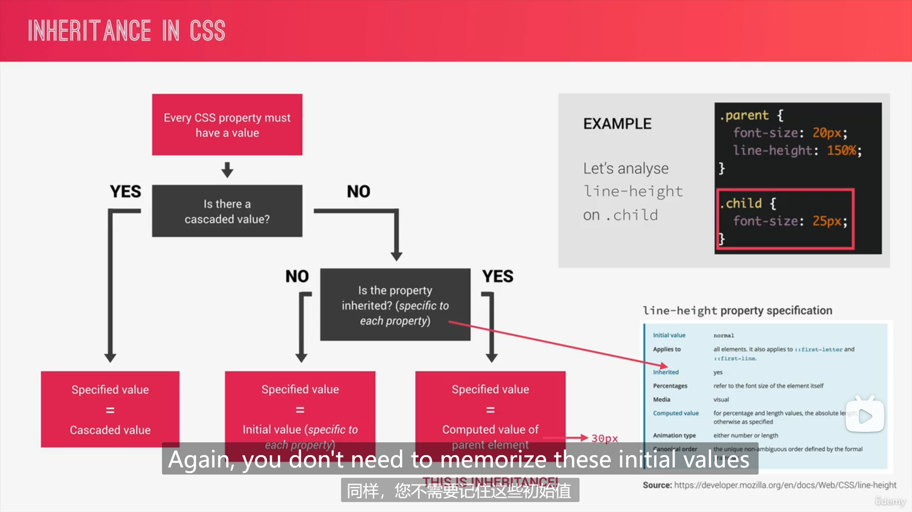
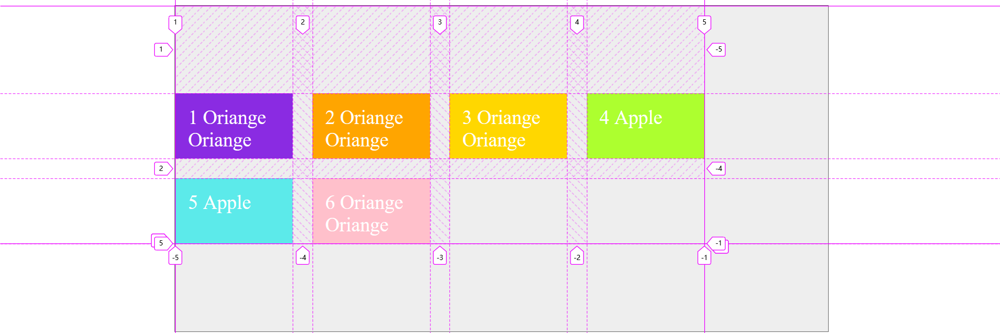

# CSS进阶和Sass学习笔记（Advanced CSS and Sass）

英文视频教程：https://www.bilibili.com/video/BV1n94y1o7yS

代码框架仓库：https://github.com/jonasschmedtmann/advanced-css-course

#### 开发环境

vscode、浏览器

vscode插件：Emmet、color hightlight

# 第一部分 流动布局项目

知识点：渐变、伪类、伪元素、动画、CSS解析原理、级联（CSS冲突）、相对单位、强制继承、定位、Sass、Sass文件架构、变量、嵌套、混入、函数、拓展、剪辑、背景剪辑、响应式设计、网格布局、变换、兄弟元素选择器、子一代元素选择器、变换、视频背景、图片滤镜、背景滤镜、Sass颜色函数、媒体查询、响应式图像、渐变、calc函数、透视、形状、纯色渐变、光标、堆叠。包含剪辑、转换、动画、背景视频这些现代css属性

## 速查手册

### transform

```scss
/* Keyword values */
transform: none;

/* Function values */
transform: matrix(1.0, 2.0, 3.0, 4.0, 5.0, 6.0);
transform: translate(12px, 50%);//位置偏移
transform: translateX(2em);
transform: translateY(3in);
transform: scale(2, 0.5);//按XY方向拉伸
transform: scaleX(2);
transform: scaleY(0.5);
transform: rotate(0.5turn);
transform: skew(30deg, 20deg);//按XY轴翻转
transform: skewX(30deg);
transform: skewY(1.07rad);
transform: matrix3d(1.0, 2.0, 3.0, 4.0, 5.0, 6.0, 7.0, 8.0, 9.0, 10.0, 11.0, 12.0, 13.0, 14.0, 15.0, 16.0);
transform: translate3d(12px, 50%, 3em);
transform: translateZ(2px);
transform: scale3d(2.5, 1.2, 0.3);
transform: scaleZ(0.3);
transform: rotate3d(1, 2.0, 3.0, 10deg);
transform: rotateX(10deg);
transform: rotateY(10deg);
transform: rotateZ(10deg);
transform: perspective(17px);

/* Multiple function values */ 
transform: translateX(10px) rotate(10deg) translateY(5px);//多个变换必须一次指定，中间没有逗号

/* Global values */
transform: inherit;
transform: initial;
transform: unset;

```

### 图形函数

图形函数https://developer.mozilla.org/zh-CN/docs/Web/CSS/basic-shape

```scss
/* Keyword values */
clip-path: none;

/* <clip-source> values */
clip-path: url(resources.svg#c1);

/* <geometry-box> values */
clip-path: margin-box;
clip-path: border-box;
clip-path: padding-box;
clip-path: content-box;
clip-path: fill-box;
clip-path: stroke-box;
clip-path: view-box;

/* <basic-shape> values */
clip-path: inset(100px 50px);
clip-path: circle(50px at 0 100px);
clip-path: ellipse(50px 60px at 0 10% 20%);
clip-path: polygon(50% 0%, 100% 50%, 50% 100%, 0% 50%);
clip-path: path('M0.5,1 C0.5,1,0,0.7,0,0.3 A0.25,0.25,1,1,1,0.5,0.3 A0.25,0.25,1,1,1,1,0.3 C1,0.7,0.5,1,0.5,1 Z');

/* Box and shape values combined */
clip-path: padding-box circle(50px at 0 100px);

/* Global values */
clip-path: inherit;
clip-path: initial;
clip-path: revert;
clip-path: revert-layer;
clip-path: unset;

```


## 开始网站

#### 下载源码

使用git

```bash
git clone git@github.com:jonasschmedtmann/advanced-css-course.git
```

#### 重置浏览器CSS

```css
/* 重置浏览器的填充，取消盒子模型的填充 */
 *{
    margin:0;
    padding:0;
    box-sizing:border-box;
 }

 /* 字体的属性通常是继承的 */
 body{
    font-family: "Lato",sans-serif;
    font-weight: 400;
    font-size: 16px;
    line-height: 1.7;
    color: #777;
 }
```


#### 背景设置

##### 渐变

```css
background:linear-gradinent([to 方向 [方向]],颜色,颜色)
background:linear-gradinent(角度 deg,颜色,颜色)
/*多种颜色*/

/*设置渐变的中心点*/
background:linear-gradinent(颜色,50%,颜色)
```


##### 剪辑

```css
.header{
    height: 95vh;
    background-image:
      linear-gradient(
         to right bottom,
         #6fc2d5bc,
         #2888b42f),
      url(../img/hero.jpg);
    background-size:cover ;
    background-position: top;
    position: relative;

    clip-path: polygon(0 0,100% 0,100% 80%,0% 100%);
 }
```

#### 文本设置

##### 动画

```css
.text-box{
   position: absolute;
   top:45%;
   left:50%;
   transform: translate(-50%,-50%);
   text-align: center;
 }
 .heading-primary{
   color: #fff;
   text-transform: uppercase;
   margin-bottom: 20px;
   backface-visibility: hidden;
 }
 .heading-primary-main{
   display: block;
   font-size: 60px;
   font-weight: 400;
   letter-spacing: 35px;

   animation-name: moveInLeft;
   animation-duration: 1s;
   animation-timing-function: ease-out;
   /* animation-delay: 0s;
   animation-iteration-count: 1; */
 }

 @keyframes moveInLeft{
   0%{
      opacity: 0;
      transform: translateX(-80px);
   }
   80%{
      opacity: 1;
      transform: translateX(10px);
   }
 }
```

#### 按钮设置

##### 伪类

##### 伪元素

##### 进入动画  

```css

.btn:link,.btn:visited{
   text-decoration: none;/*去掉下划线*/
   padding:10px 40px;
   display: inline-block;
   border-radius: 100px;/*放一个超出的*/
   position: relative;
}
.btn:hover{
   transform: translateY(-3px);
   box-shadow: 0 10px 20px rgba(0, 0, 0, 0.3);/*x偏移 y偏移 模糊量*/
}
.btn:active{
   transform: translateY(-1px);
   box-shadow: 0 5px 10px rgba(0, 0, 0, 0.3);
}
.btn-white{
   background-color: #fff;
   color:#777;
}
.btn::after{
   content:"";/*必须指定，可以指定空*/
   display:inline-block;
   width: 100%;
   height: 100%;
   border-radius: 100px;
   position: absolute;
   top:0px;
   left: 0px;
   z-index: -1;
   transition: all .4s;
}
.btn-white::after{
   background-color: white;
}
.btn:hover::after{
   transform: scale(2);
   opacity: 0;
}
.btn-animated{
   animation: moveInBottom .5s ease-out .75s;
   /* 动画名 持续时间 计时函数 延迟时间 */
   animation-fill-mode: backwards;
}
```

## CSS背后原理

### 现代网站设计原则

现代网站设计原则：响应式设计、编写可维护和可拓展的代码、网络性能

响应式设计：在所有尺寸和分辨率的屏幕上良好显示。


### 加载页面过程

加载HTML，解析HTML生成DOM，解析CSS生成CSSOM，生成渲染树，生成格式化视图模型，显示内容


### CSS解析过程

##### CSS声明内容


#### 1 解决CSS冲突（级联） 

来源：作者声明，用户声明，浏览器声明

###### 级联工作原理

1. 根据声明的重要性：用户重要声明、作者重要声明、作者声明、用户声明、浏览器默认声明

2. 根据选择器的特异性：内联样式、ID、类/伪类、元素/伪元素

3. 根据声明的顺序：如果前面的比较均一致，则最后一个声明生效

   

###### 设计技巧


#### 2 处理CSS值

使用相对单位，最终需要转换成px

###### 处理流程

声明值，级联值，指定值（没声明就是 初始值），计算值，使用值，实际值


 


###### 相对单位转换


###### 要点


#### 继承

没有级联值时就考虑是否能够继承，继承的不仅是声明，还有计算值

如果不能继承（如padding）就用初始值

- 一般，文本相关的属性（行高、颜色、字体）是继承的，其他属性不是继承的
- 可以用inherit关键字强制继承
- 可以用innitial关键字强制使用初始值



## 回到网站

#### 使用相对单位rem

设置html根字体

```css
 html{
   font-size: 62.5%;/*改成10px便于计算,或者%允许用户修改*/
 }
```

IE9-不支持rem 

#### 强制继承

对一些默认不继承的属性，加inherit

```css
*{
    box-sizing:ingerit;
}
body{
    box-sizing:border-box;
}
```


## 继续背后原理

#### 渲染阶段


CSS视觉格式化模型

##### 1,盒子模型

- 内容
- 填充
- 边框
- 边距
- 填充区域


如果不指定宽度和高度，会根据盒子模型的内容计算宽度和高度；


指定宽度/高度，填充和边框将被添加。

使用bix-sizing


##### 2, box类型

block、inline、inline-box


##### 3, 定位方式

正常


##### 4 堆叠上下文

决定内容元素在页面呈现的顺序，底部的先，顶部的晚

z-index属性

除此之外，不同透明度、一个转换、过滤器或者其他属性将创建新的新的堆叠上下文


## 架构CSS

模块化、复用性

#### 架构


##### 1 思考 

- 组件驱动设计原则
- 考虑在页面中的位置
- 项目内/项目间复用
- 独立的组件


##### 2 类的构建


##### 3 文件组织

7+1


基本、组件、布局、页面样式、主题、？


#### 实践BEM方法


# SaSS

练习地址：


### 内容

变量、嵌套、运算、导入、混入、函数、拓展、控制语句

### 配置

#### 安装

Sass中文网：https://sass.bootcss.com/guide

使用npm安装：

```bash
npm install -g sass
```

#### 使用

最直接的方式就是在命令行中调用 sass 命令。安装 Sass 之后，你就可以用 `sass` 命令将 Sass 编译为 CSS 了。 首先你需要告诉 Sass 从哪个文件开始构建，以及将生成的 CSS 输出到哪里。 例如，在命令行中执行 `sass input.scss output.css` 命令， 将会把 Sass 文件 `input.scss` 编译输出为 `output.css`。

你还可以利用 `--watch` 参数来监视单个文件或目录。 `--watch` 参数告诉 Sass 监听源文件的变化， 并在每次保存 Sass 文件时重新编译为 CSS。如果你只是想监视 （而不是手动构建）`input.scss` 文件，你只需在 sass 命令后面添加 `--watch` 参数即可，如下：

```
sass --watch input.scss output.css
```

可以使用文件夹路径作为输入和输出， 并使用冒号分隔它们，来监听文件并输出到目录。例如:

```
sass --watch app/sass:public/stylesheets
```

Sass 将会监听 `app/sass` 目录下所有文件的变动，并 编译 CSS 到 `public/stylesheets` 目录下。

### 两种Sass语法

Sass（原始）语法：缩进敏感、不使用花括号和分号

SCSS语法：缩进不敏感、使用花括号和分号（保留原始CSS外观）

## 基本使用

### 变量


#### Sass内置颜色函数

#### tip:清除元素塌陷

### 嵌套


### 混入

```scss
//混入
@mixin clearfix{
    &::after{
        content: "";
        clear:both;
        display: table;
    }
}
```

使用混入

```scss
nav{
    margin: 30px;
    background-color: $color-primary;

    @include clearfix;
}
```


#### 传入参数

```scss
@mixin link-text($color,$backcolor){
    &:link{
        padding: 10px;
        display: inline-block;
        text-align: center;
        border-radius: 100px;
        text-decoration: none;
        text-transform: uppercase;
        width: 10rem;
        color: $color;
        background-color: $backcolor;
    }
}
```

使用混入

```scss
a{
    @include link-text($color-text-dark,$color-secondary)
}
```


### 函数

内置函数


自定义函数

```scss
//定义函数
@function  divide($a,$b){
    @return $a/$b;
}
```

加单位

```scss
width: divide(60,2)*1px
```

### 拓展

```scss
//定义占位符
%btn-placeholder{
    padding: 10px;
    display: inline-block;
    text-align: center;
    border-radius: 100px;
    text-decoration: none;
    text-transform: uppercase;
    width: 10rem;
}
```


```scss
&:link{
        // padding: 10px;
        // display: inline-block;
        // text-align: center;
        // border-radius: 100px;
        // text-decoration: none;
        // text-transform: uppercase;
        // width: 10rem;
        @extend %btn-placeholder;
    }
```


#### 混入和拓展的区别

编译后，混入把代码带给选择器，拓展把选择器带给代码（占位符声明位置）


### tip几种运算符小结

```
& 复制当前的选择器
@
%
```


## Sass文件结构化

1. abstracts
   1. _function.scss 函数
   2. _mixins_scss 混入
   3. _variables.scss 变量
2. base 全局可用
   1. _animation.scss 动画
   2. _base.scss 全局
   3. _typography.scss 排版
   4. _unilities.scss
3. components 组件
4. layout 布局
5. pages 页面
6. themy 主题
7. 第三方

## 响应式设计

调整网页适应不同屏幕，在所有可能设备上显示

### 响应式设计四大原则

1. fluid layouts 流动布局：内容适应窗口、使用相对单位（%、hv）、max-width
2. 响应式单元：使用rem定义长度
3. 灵活的图像：%和max-width
4. 媒体查询：创建断点改变样式


### 流动布局

#### 主流三种方法

Float Layouts（旧）, Flexbox（一维，现代）, CSS Grid（二维，现代）


#### 浮动布局（旧）

##### 网格系统

html

```html
<div class="row">
    <div class="col-1-of-2">
        Col 1 of 2
    </div>
    <div class="col-1-of-2">
        Col 1 of 2
    </div>
</div>
```

css

```scss
@mixin col-width($num,$total){
    width: calc(#{$num} * (100% - (#{$total} - 1) * #{$gutter-horizontal})/#{$total} + (#{$num} - 1) * #{$gutter-horizontal})  ;
}

[class^="col-"]{
    background-color: orange;
    float: left;
    &:not(:last-child){
        margin-right: $gutter-horizontal;
    }
}

.col-1-of-2{
    @include col-width(1, 2)
        }
.col-1-of-3{
    @include col-width(1, 3)
        }
```

##### 原生calc函数

```css
//width: calc(1 * (100% - 1 * #{$gutter-horizontal})/2);
//可以混合单位运算
//CSS函数，使用sass变量需要用哈希#{}
```

##### 属性选择器

```css
//使用属性选择器
    //[class="col-"]//等于
    //[class^="col-"]//开头
    //[class*="col-"]//包含
```

##### 伪类选择器not()当前是否结尾

```css
&:not(:last-child){//not伪类选择器
    margin-bottom: $gutter-vertical;
}
```


### 二级标题

```scss
.heading-secondary{
    font-size: 3.5rem;
    text-transform: uppercase;
    font-weight: 700;
    display: inline-block;
    background-image: linear-gradient(to right,$color-primary,$color-primary-dark);
    -webkit-background-clip: text;//剪裁背景到文本的颜色
    color: transparent;//透明颜色
    letter-spacing: 0.2rem;
    //margin: auto;
    transition: all .2s;//所有转换用时0.2s
    &:hover{
        transform: skewX(2deg) skewY(2deg) scale(1.2);
        text-shadow: .5rem 1rem 2rem rgba(rgba($color-primary-dark, 0.9),1.0);
    }
}
```


#### 背景剪裁文本形状

```scss
background-image: linear-gradient(to right,$color-primary,$color-primary-dark);
-webkit-background-clip: text;//剪裁背景到文本的颜色
```

#### 转换和动画时间

```scss
transition: all .2s;//所有转换用时0.2s
```

#### 盲文lorem

elemt快捷生成：lorem

## 回到网站

### About Section

#### 组件复用

#### 相似类名的识别

```scss
.xxx{
    &-1{//识别类名xxx-1
        ...
    }
}
```

#### utility

通过一个元素选择此类来获得属性

#### 悬停放大

```scss
.composition{
    &-photo{
        &:hover{
            outline: 1.5rem solid rgba($color-primary,0.6);
            transform: scale(1.3);
            box-shadow: 0 1.5 2 rgba($color-black,0.4);
            z-index: 20;
        }
    }
}
```

#### 悬停缩小其他图片

#### 多个转换

#### 轮廓偏移属性

#### 选择NOT

```scss
.composition{
    position: relative;
    &-photo{
        width: 55%;
        box-shadow: 0 1.5rem 4rem rgba($color-black,0.4);
        position:absolute;
        z-index: 10;
        transition: all .3s;
        border-radius: .2rem; 
        outline-offset: .4rem;
        &-p1{
            left:0; 
            top:-2rem;
        }
        &-p2{
            right: 0;
            top:4rem;
        }
        &-p3{
            left:20%;
            top:12rem;
        }
        &:hover{
            outline: 1.5rem solid rgba($color-primary,0.6);
            transform: scale(1.3);
            box-shadow: 0 1.5 2 rgba($color-black,0.4);
            z-index: 20;
        }

    }
    &:hover &-photo:not(:hover){
        transform: scale(0.9);
    }
}
```


### Features Section图片列表

#### 图标字体

下载网址：https://linea.io/

```html
<link rel="stylesheet" href="css/icon-font.css">
...
<i class="feature-box-icon icon-basic-world"></i>
```

#### 倾斜和子元素回正

```scss
{
    transform: skewY(-7deg);
    & > *{
        transform: skewY(7deg)
    }
}
```


#### 选择器：选择子一代

```scss
transform: skewY(-7deg);
& > *{
    transform: skewY(7deg)
}
```


### Tours Section旋转卡片

#### 创建透视

```scss
.card{
    perspective: 150rem;//创建透视
    -moz-perspective: 150rem;//适配火狐浏览器
}
```

#### 实现翻转

```scss
.card{
    perspective: 150rem;//创建透视
    -moz-perspective: 150rem;//适配火狐浏览器
    position: relative;
    height: 50rem;
    //@include clearfix; 
    &-side{
        position: absolute;
        top: 0;
        left: 0;
        font-size: 2rem;
        height: 50rem;
        width: 100%;
        transition: all .8s ease;
        backface-visibility: hidden;//背面可见性
        box-shadow: $box-shadow-2;
        &-back{
            transform: rotateY(180deg);
            background-image: linear-gradient(to right bottom , $color-gold-light ,30%,$color-orange);
        }
        &:hover &-side-front{
        transform: rotateY(-180deg);
        }
        &:hover &-side-back{
            transform: rotateY(0deg);
        }
    }
}
```

#### 背面可见性

```scss
backface-visibility: hidden;//背面可见性
```

#### 修复错误动画方向

注意负号：

- front:    0 => 180deg
- back:   -180deg => 0

#### 非透明背景的混合

#### 背景混合模式

```scss
background-blend-mode: screen;
background-image: linear-gradient(to right bottom ,$color-gold,$color-orange),url(../../img/nat-5.jpg);
```

#### 背景剪辑和适配浏览器

```scss
-webkit-background-clip: polygon(0 0, 100% 0, 100% 85%,0 100%);
background-clip: polygon(0 0, 100% 0, 100% 85%,0 100%);
clip-path: polygon(0 0, 100% 0, 100% 85%,0 100%);
```

### Stories Section评价列表

#### 形状

#### 文本围绕

```scss
float: left;
position: relative;
//1.指定形状
-webkit-shape-outside: circle(50% at 50% 50%);//必须指定宽高、必须浮动、必须加webkit-
shape-outside: circle(50% at 50% 50%);
//2.指定剪裁
//需要剪裁，不然形状变了，视觉背景还是方形
clip-path: circle(50% at 50% 50%);
transform: translateX(-3rem) skewX(12deg);
```

#### 形变与回正失效

```scss
transform: skewX(-12deg);
// &>*{
//     //因为目前的transform只能同时指定一次，下面的圆形指定了一次导致这里不生效
//     transform: skewX(15deg);
// }
//transform: translateX(-3rem);
transform: translateX(-3rem) skewX(12deg);//只能在其他转换处一次性指定
```

#### 悬停覆盖内容

```html
<figcaption class="story-caption">Mary Smith</figcaption>
```

#### 图像过滤器 filter

```scss
&:hover img{
    transform: scale(1.2);
    filter: blur(3px) brightness(80%);//模糊化、亮度降低
}
```

#### 视频背景

```html
<div class="bg-video">
    <video class="bg-video-content" autoplay muted loop>
        <source src="./img/video.mp4" type="video/mp4"/>
        <source src="./img/video.webm" type="video/webm"/>
        你的浏览器不支持视频背景！
    </video>
</div>
```

```scss
.bg-video{
    position: absolute;
    top: 0;
    left: 0;
    width: 100%;
    height: 100%;
    z-index: -1;//背景视频放到其他元素之后
    opacity: 0.2;
    &-content{
        height: 100%;
        width: 100%;
        object-fit: cover;//填充满父元素并保持纵横比
    }
}
```

#### objectfit 适配图片比例

```scss
height: 100%;
width: 100%;
object-fit: cover;//填充满父元素并保持纵横比
```

### Booking Section

#### 纯色渐变代替简单剪裁

指定0、50%是白色，指定50%是其他颜色，就会在50%的位置产生边界


```scss
background-image: linear-gradient(105deg,rgba($color-white,0.8) 0%,rgba($color-white,0.8) 50%, transparent 50%);
```


#### general, adjacent

#### 文本输入框

```scss
&-input{
    font-size: 1.5rem;
    padding: 1.5rem 2rem;
    border-radius: 2px;
    background-color: rgba($color-white,0.5);
    font-family: inherit;//input默认不继承字体
    color: inherit;//input默认不继承和文字有关的属性
    width: 35rem;
    display: block;
    transition: all .3s;

    border: none;
    border-bottom: 5px solid transparent;//透明的底部边框进行占位，以免出现跳动
}
```

##### 不合法输入的显示

```scss
 &:focus{//选中时显示
     outline: none;//取消浏览器的默认蓝色边框
     box-shadow: 0 1rem 2rem rgba($color-black,0.1);
     border-bottom: 5px solid rgba($color-primary-dark,0.8);
     &:invalid{//不合法的输入
         border-bottom: 5px solid rgba($color-volcano,0.8);
     }
}
```

##### 修改placeholder样式、适配火狐

```scss
&::-webkit-input-placeholder,&::-moz-placeholder{
    color:$color-grey-dark;
}
```

##### 兄弟元素选择器

###### 相邻兄弟选择器 +

相邻兄弟选择器 (+) 介于两个选择器之间，当第二个元素紧跟在第一个元素之后，并且两个元素都是属于同一个父 element 的子元素，则第二个元素将被选中。

https://developer.mozilla.org/zh-CN/docs/Web/CSS/Adjacent_sibling_combinator

###### 通用兄弟选择器 ~

通用兄弟选择器（~）将两个选择器分开，并匹配第二个选择器的所有迭代元素，位置无须紧邻于第一个元素，只须有相同的父级元素。

https://developer.mozilla.org/zh-CN/docs/Web/CSS/General_sibling_combinator


##### 实现placeholder移动

标签放在input下，平时通过位移+不透明度变换藏在input下面，input内有内容时，使用:placeholder-shown伪类和兄弟元素选择器选中

```scss
&-label{
    font-size: 1.3rem;
    font-weight: 700;
    margin-left: 2rem;
    display: block;
    transition: all,0.2s;
}
&-input:placeholder-shown + &-label{//选择下一个相邻的兄弟
    opacity: 0;//因为hidden没有有动画
    visibility: hidden;
    transform: translateY(-3rem);

}
```


#### 自定义radio按钮

radio不能设定样式。我们将input隐藏起来，通过label改变值，通过伪类选择器ckeck+兄弟选择器将样式显示在新的元素上

```scss
&-radio-input{//隐藏原来的radio
    width: 0;
    opacity: 0;
}
```

##### 创建边框

创建一个内容空白，但是有边框的元素，并设置边框的圆角使其成为一个环形

```scss
&-btn{
    display: inline-block;//使高度和宽度生效
    height: 3rem;
    width: 3rem;
    position: absolute;
    left: -0.6rem;
    top:-0.5rem;
    border: 4px solid rgba($color-primary,0.8);//边框
    border-radius: 50%;//边框变圆形
}
```

##### 创建伪元素显示选中状态

创建一个有背景色，圆角的伪元素，设置不透明度为0；radio被选中时使用兄弟元素选择器+伪类改变不透明度

```scss
&::after{//伪元素，显示选中状态
    content: "";
    display: block;
    height: 1.3rem;
    width: 1.3rem;
    border-radius: 50%;//圆形
    position: absolute;
    top:50%;
    left: 50%;
    transform: translate(-50%,-50%);//定位到和文字等高
    background-image: linear-gradient($color-blue-light,$color-primary);
    opacity: 0;//未选中时不显示
    transition: opacity .3s;//不透明度渐变动画
}
```

选中

```scss
 &-radio-input:checked + &-radio-label &-radio-label-btn::after{//checked伪类+兄弟选择器
     opacity: 1;//显示为选中
}
```

##### cursor属性设置光标

设置光标的类型（如果有），在鼠标指针悬停在元素上时显示相应样式。

MDN：https://developer.mozilla.org/zh-CN/docs/Web/CSS/cursor

##### 代码

```scss
&-radio-label{
        font-size: $default-font-size;
        cursor:pointer;//指针放在此元素上时会变成手
        position:relative;
        padding: 0 3rem;
        &-btn{
            display: inline-block;//使高度和宽度生效
            height: 3rem;
            width: 3rem;
            position: absolute;
            left: -0.6rem;
            top:-0.5rem;
            border: 4px solid rgba($color-primary,0.8);//边框
            border-radius: 50%;//边框变圆形
            &::after{//伪元素，显示选中状态
                content: "";
                display: block;
                height: 1.3rem;
                width: 1.3rem;
                border-radius: 50%;//圆形
                position: absolute;
                top:50%;
                left: 50%;
                transform: translate(-50%,-50%);//定位到和文字等高
                background-image: linear-gradient($color-blue-light,$color-primary);
                opacity: 0;//未选中时不显示
                transition: opacity .3s;//不透明度渐变动画
            }
        }
    }
    &-radio-input{//隐藏原来的radio
        width: 0;
        opacity: 0;
    }
    &-radio-input:checked + &-radio-label &-radio-label-btn::after{//checked伪类+兄弟选择器
        opacity: 1;//显示为选中
    }
```

#### 自定义普通按钮

由于a和button的可用伪类不同，使用为a元素创建的btn，btn-blue类时，需要在其中添加按钮拥有的伪类，以便按钮能被选择器正确地选中

```scss
.btn {
    &,//link和visited不适用于button，所以添加此项选择按钮
    &:link,
    &:visited {}
}
```

#### 应用类css类

可以加`! importent`标签确保应用生效，因为选择应用类就是要把相应的属性添加上

### 页脚!!!!!!!!!!!!!!!!!!!!!!!!!!!!!!!!!!!!!!!!!!!!!!!!!!!!!!

### 导航

工作原理：checkbox hack

```scss
<div class="navigation">
            <input type="checkbox" class="navigation-checkbox" id="navigation-toggle"/>
            <label for="navigation-toggle" class="navigation-button">
                <div class="navigation-icon"></div>
            </label>
            <div class="navigation-background">%nbsp;</div>
            <nav class="navigation-nav">
                <ul class="navigation-list">
                    <li class="navigation-item"><a href="#" class="navigation-link"><span>1</span>About Natours</a></li>
                    <li class="navigation-item"><a href="#" class="navigation-link"><span>2</span>Your benfits</a></li>
                    <li class="navigation-item"><a href="#" class="navigation-link"><span>3</span>Popular tours</a></li>
                    <li class="navigation-item"><a href="#" class="navigation-link"><span>4</span>Stories</a></li>
                    <li class="navigation-item"><a href="#" class="navigation-link"><span>5</span>Book now</a></li>
                </ul>
            </nav>
        </div>
```

#### 1、隐藏的选择框

```scss
.navigation{
    &-checkbox{
        width: 0;
        height: 0;
        position: absolute;
        opacity: 0;
    }
```

#### 2、按钮

```scss
&-button{
        background-color: $color-white;
        height: 7rem;
        width: 7rem;
        position: fixed;
        top: 6rem;
        right: 6rem;
        border-radius: 50%;
        z-index: 200;
        box-shadow: $box-shadow-2;
        @include respond(phone){
            right: 3rem;
            top: 3rem;
        }
    }
```


#### 3、背景

```scss
&-background{
        height: 6rem;
        width: 6rem;
        border-radius: 50%;
        //background-color: orange;
        position: fixed;//和绝对定位类似，但是滚动页面时，和屏幕相对位置不变
        top:6.5rem;
        right: 6.5rem;
        background-image: radial-gradient($color-primary 20%, scale-color($color-blue-light,$lightness:80%));
        z-index: 100;
        transition: all .5s;
        //transform: scale(60);
        @include respond(phone){
            right: 3rem;
            top: 3rem;
        }
    }
```

#### 4、导航

```scss
&-nav{
        height: 100vh;
        //width: 100vw;
        position: fixed;
        top: 0;
        left: 0;
        z-index: 150;

        opacity: 0;//不可见
        width: 0;//不可交互
        transition: all .5s;
    }
    &-list{
        position: absolute;
        top:50%;
        left: 50%;
        width: 100%;
        transform: translate(-50%,-50%);
        list-style: none;
        text-align: center;
        cursor: pointer;
    }
    &-item{
        margin: 1rem;
    }
    &-link{
        span{
            margin-right: 1rem;
        }
        &:link,&:visited{
            display: inline-block;//使位移生效
            font-size: 3rem;
            font-weight: 300;
            color: $color-white;
            text-decoration: none;
            text-transform: uppercase;
            padding: 1rem;
            background-image: linear-gradient(130deg,transparent 0%,transparent 50%,$color-white 50% );
            background-size: 300%;
            transition: all .4s;
        }
        
        &:hover,&:active{
            //background-image: linear-gradient(120deg,$color-orange 0%,$color-orange 100%,$color-white 100% );
            background-position: 100%;
            color: $color-primary;
            transform: translateX(1rem);
        }   
    }
```

#### 5、背景和导航切换

```scss
&-checkbox:checked ~ &-nav{
        opacity: 1;
        width: 100vw;
        
    }
    &-checkbox:checked ~ &-background{
        transform: scale(70);
    }
```


#### 6、按钮图标切换

```scss
 //ICON
    &-icon{
        position:absolute;
        left: 50%;
        top:50%;
        transform: translate(-50%,-50%);
        &,&::before,&::after{
            content: "";
            width: 3rem;
            height: 2px;
            background-color: $color-grey-dark;
            display: inline-block;
            transition: all .2s;
        }
        &::before,&::after{
            content: "";
            position:absolute;
            left:0;
        }
        &::before{
            top:-1rem;
            //transform-origin: center;
            //改变旋转的中心点
        }
        &::after{
            top:1rem;
        }
    }
    &-button:hover &-icon::before{
        transform: translateY(-.2rem);
    }
    &-button:hover &-icon::after{
        transform: translateY(.2rem);
    }
    &-checkbox:checked ~ &-button &-icon::before{
        top:0;
        transform:rotateZ(45deg);
    }
    &-checkbox:checked ~ &-button &-icon::after{
        top:0;
        transform:rotateZ(-45deg);
    }
    &-checkbox:checked ~ &-button &-icon{
        height: 0;
    }
```

### 渐变函数

https://developer.mozilla.org/zh-CN/docs/Web/CSS/gradient

类型：线性、径向、重复

#### 线性渐变

颜色值沿着一条隐式的直线逐渐过渡。由[`linear-gradient()`](https://developer.mozilla.org/en-US/docs/Web/CSS/gradient/linear-gradient)产生。

```scss
.linear-gradient {
  background: linear-gradient(to right,
      red, orange, yellow, green, blue, indigo, violet);
}
```

#### 径向渐变

颜色值由一个中心点（原点）向外扩散并逐渐过渡到其他颜色值。由[`radial-gradient()`](https://developer.mozilla.org/en-US/docs/Web/CSS/gradient/radial-gradient)函数产生。

```scss
.radial-gradient {
  background: radial-gradient(red, yellow, rgb(30, 144, 255));
}
```

#### 重复渐变

重复多次渐变图案直到足够填满指定元素。由 [`repeating-linear-gradient()` (en-US)](https://developer.mozilla.org/en-US/docs/Web/CSS/gradient/repeating-linear-gradient)和[`repeating-radial-gradient()` (en-US)](https://developer.mozilla.org/en-US/docs/Web/CSS/gradient/repeating-radial-gradient)函数产生。

```scss
.linear-repeat {
  background: repeating-linear-gradient(to top left,
      lightpink, lightpink 5px, white 5px, white 10px);
}

.radial-repeat {
  background: repeating-radial-gradient(powderblue, powderblue 8px, white 8px, white 16px);
}
```

### 弹出窗口

使用target伪类，选中ID匹配网址哈希的块；


## 响应式设计

### 移动优先和桌面优先

选择桌面优先/移动优先，并为另外一个添加媒体查询断点


#### 优缺点

移动优先

- 优点
  - 移动体验好
  - 优先考虑内容而不是设计
- 缺点
  - 桌面端过于空洞

桌面优先

- 优点
  -  桌面体验好

#### 考虑的原则


### 断点的选择


#### 使用常用设备的宽度（Bad


#### 将常用设备进行归类划分（Good

0-600px:   Phone

600-900px:  平板（纵向）

900-1200px: 平板（横向）

1200-1800px:桌面

1800px+:   大屏幕


#### 忽略设备，根据内容划分（Perfect


### 写法

#### CSS媒体查询

```scss
html {
    font-size: 62.5%; /* 改成10px便于计算,或者%允许用户修改 */
     @media (min-width:600px) {
         font-size: 50%;
     }
}
```

#### 混入

```scss
html {
     @include respond-phone{
         font-size: 50%;
     }
}
```

```scss
@mixin respond-phone {
    @media (min-width: 600px) {
        //用@content代表混入时写入混入体的内容
        @content;
    }
}

```

#### 带参数混入
```scss
html {
    @include respond(phone){
        font-size: 50%;
    }
    @include respond(tab-port){}
    @include respond(tab-land){}
    @include respond(big-desktop){}
}
```

```scss

@mixin respond($breakpoint) {
    @if $breakpoint == phone {
        @media (min-width: 600px) {
            @content;
        }
    }
    @if $breakpoint == tab-port {
        @media (min-width: 900px) {
            @content;
        }
    }
}

```

### tips

#### 使用相对单位

媒体查询中rem和em总是等于字体大小，不受根元素字体影响

#### 摆放顺序问题

最后一个匹配的生效


### 考虑顺序

基础和排版，布局，页面，组件

#### 基础

字体大小

#### 排版

标题

#### 布局

grid

#### 细节

按钮、组件 等

### 响应式图像

为不同尺寸的设备下载不同尺寸的图片，减少不必要的网络负担

#### 使用场景

- 屏幕尺寸
- 像素密度
- 艺术指导


#### 在HTML中响应

##### 密度切换

img的src属性改成srcset，设置多个源

```html
<!--  -->

```

##### 艺术指导

使用picture 元素，用媒体匹配source，用img做默认显示

```html
<picture class="footer-logo-box">
    <source 
            srcset="./img/logo-green-1x.png 1x , ./img/logo-green-2x.png 2x"
            media="(max-width:37.5em)"
            > 
    
</picture>
```

##### 使用尺寸选择

```html

```

#### 在CSS中响应

##### 媒体查询宽度和分辨率

```scss
background-image: linear-gradient(
    to right bottom,
    rgba($color-primary-light, 0.2),
    40%,
    rgba($color-primary-dark, 0.8)
),
url(../img/hero-small.jpg);

background-size: cover;

@media (min-resolution: 192dpi) and (min-width: 600px) {
    background-image: linear-gradient(
        to right bottom,
        rgba($color-primary-light, 0.2),
        40%,
        rgba($color-primary-dark, 0.8)
    ),
        url(../img/Alice.jpg);
}

```

### 浏览器适配性检查


背景滤镜（谷歌不适用，Safari适用

```scss
backdrop-filter:blur(10px);
-webkit-backdrop-filter:blur(10px);
```

特征查询

```scss
@supports(backdrop-filter:blur(10px) or -webkit-backdrop-filter:blur(10px)){
    //如果（）内的代码不支持，则此处的代码无效
    backdrop-filter:blur(10px);
    -webkit-backdrop-filter:blur(10px);
}
```


### 调用构造流程

编译、串联、加前缀、压缩


#### 在npm中配置构建流程!!!!!!!!!!!!!!!!!!!!!


### 最后

#### 改变选中文本效果


```scss
::selection{
    background-color: $color-primary-light;
    color: $color-white;
}
```

#### only屏幕显示

媒体查询条件only scree n（而不是打印）

#### 网站根据屏幕宽度显示

（防止浏览器自动放到，导致响应式失效）

```html
<meta name="viewport" content="width=device-width, initial-scale=1.0">
```

#### 触控设备没法悬停

注意一些悬停效果不可用

#### 识别触控设备

媒体查询条件：

```
hover:none
hover:hover
```


# 第二部分 弹性布局项目

### 弹性盒子Flexbox

#### 基本属性


#### 基本使用

父元素（弹性盒子）

```scss
display:flex;//弹性布局
align-items: center;//沿交叉轴居中
justify-content: center;//沿主轴居中
flex-direction: column;//改变主轴方向
flex-warp:warp;//空间不足时运行换行
```

子元素（弹性项目）

```scss
flex: 0 0 40%;//扩大 缩小 宽度
flex:1;//尽可能的扩大，占据所有可用空间
margin_right:auto;//将所有可用空间在该项目的右侧留白
align-self: stretch;//覆盖了父元素的align-item: center
```


### CSS自定义属性（变量）

- 优势：不需要被编译，可以在JS中操作
- 作用域：当前选择器选中元素及其子元素
- 通常写在==根伪类==中

```css
:root{//根伪类
    --grey-dark-1: #333;
    --grey-dark-2: #777;
    --grey-dark-3: #999;
}
body{
    color:var(--grey-dark-2);
}
```

### SVG图标

相对于字体图标的优点：更容易定位、控制大小

下载：https://icomoon.io/

使用包含多个图标的精灵svg：

```html
<svg class="user-nav-icon">
    <use xlink:href="img/sprite.svg#icon-chat"></use>
</svg>
```

#### 填充颜色

```scss
fill: var(--color-primary);
```


### 按钮动画

```scss
.btn-inline{
    border: none;
    color:var(--color-primary);
    font-size: inherit;
    border-bottom: 1px solid currentColor;//和文本拥有相同颜色（color属性）
    padding-bottom: 2px;
    display: inline-block;
    background-color: transparent;
    cursor: pointer;
    transition: all .2s;
    //font-size: 1.6rem;
    &:hover{
        color: var(--color-primary-dark);
    }
    &:active{
        outline: none;
        animation: pulsate .5s infinite;//无限次的动画
    }
}

@keyframes pulsate{
    0%{
        transform: scale(1);
        box-shadow: none;
    }
    50%{
        transform: scale(1.05);
        box-shadow: 0 1rem 4rem rgba(0,0,0,.25);
    }
    100%{
        transform: scale(1);
        box-shadow: none;
    }
}
```

#### 向右跃动的箭头

##### 循环动画

```scss
span{
            animation: right-jump .5s infinite;
        }
```


### 自定义列表图标

```scss
.list{
    margin: 3rem 0;
    list-style: none;
    padding: 3rem;
    border-top: var(--line);
    border-bottom: var(--line);
    //columns: 2;
    //使用flex
    display: flex;
    flex-wrap: wrap;//允许元素换行
    &-item{
        flex: 0 0 50%;//代替width
        margin-bottom: .7rem;
        &::before{//自定义列表图标
            content: '';//一定要写，不然不显示
            display: inline-block;
            height: 1rem;
            width: 1rem;
            margin-right: .7rem;

            //旧浏览器
            // background-image: url(../img/chevron-thin-right.svg);
            // background-size: cover;
            //支持masks属性的浏览器
            //将图标作为蒙板
            background-color: var(--color-primary);
            -webkit-mask-image: url(../img/chevron-thin-right.svg);
            -webkit-mask-size: cover;
            //为未来其他浏览器适配
            mask-image: url(../img/chevron-thin-right.svg);
            mask-size: cover;
        }
    }
}
```


#### 背景图片（不能改变颜色）

```scss
//旧浏览器
background-image: url(../img/chevron-thin-right.svg);
background-size: cover;
```


#### 背景颜色+使用svg作为蒙版（现代）

掩码图像

```scss
//支持masks属性的浏览器
//将图标作为蒙板
background-color: var(--color-primary);
-webkit-mask-image: url(../img/chevron-thin-right.svg);
-webkit-mask-size: cover;
//为未来其他浏览器适配
mask-image: url(../img/chevron-thin-right.svg);
mask-size: cover;
```


### 头像列表

```scss
.recommend{
    font-size: 1.3rem;
    color: var(--color-grey-dark-3);
    display: flex;
    align-items: center;
    justify-content:space-between;//左右分开
    &-photo{
        height: 4rem;
        width: 4rem;
        border-radius: 50%;
        border: 3px solid #fff;
        box-sizing: content-box;
        //盒子的尺寸默认包含填充和边框进入元素的宽度和高度
        //使用box-sizing: content-box;来使边框添加到原来的尺寸上
        &:not(:last-child){
            margin-right: -1.15rem;//部分重叠效果
        }
    }
}
```

#### box-sizing的细节

 ```scss
  box-sizing: content-box;
         //盒子的尺寸默认包含填充和边框进入元素的宽度和高度
         //使用box-sizing: content-box;来使边框添加到原来的尺寸上
 ```


### 引用内容

##### html元素

```html
<!-- figure 使用文字和描述 -->
<figure class="review">
    <!-- 块级引用元素 -->
    <blockquote class="review-text">
```


##### 巨大的引号

```scss
.review{
    &::before{//巨大的引号背景
        content: "“";//\201C
        position: absolute;
        top: -2rem;
        left: -1rem;
        font-size: 20rem;
        color: var(--color-grey-light-3);
        font-family: sans-serif;
        line-height: 1;
        z-index: 1;//z-index只有设置了定位才会生效
    }
    position: relative;
}
```


##### z-index要定位才能生效！

```scss
z-index: 10;
position: relative;//z-index只有设置了定位才会生效
```

### 媒体查询

策略：在设计失效的位置设置断点

弹性盒子：通常可以改变主轴方向来实现一定的适配

### 浏览器支持

查询网址https://caniuse.com


##### 适配

```scss
@support (-webkit-mask-image:url() or ...){
    ...
}
```

# 第三部分 网页布局项目


### 网格布局

##### 属性

容器、项目、轴


轨道、线、区域、单元


属性概览


##### 基本使用

html

```html
<div class="container">
    <div class="item item-1">1 Oriange</div>
    <div class="item item-2">1 Oriange</div>
    <div class="item item-3">1 Oriange</div>
    <div class="item item-4">1 Oriange</div>
    <div class="item item-5">1 Oriange</div>
    <div class="item item-6">1 Oriange</div>
</div>
```

scss

```scss
.container{
    background-color: #eee;
    border: #666 solid 1px;
    width: 1000px;
    margin: 30px auto;
    display: grid;
    //  行/列的数量和宽度
    grid-template-rows: 150px 150px;
    // grid-template-columns: 150px 150px 150px;
    grid-template-columns: repeat(3,150px);//重复函数

    //  行/列的间距
    // grid-row-gap: 30px;
    // grid-column-gap: 30px;
    grid-gap: 30px;
}
.item{
    padding: 20px;
    font-size: 30px;
    color: #fff;
}
.item-1{background-color:blueviolet;}
.item-2{background-color:orange;}
.item-3{background-color:gold;}
.item-4{background-color:greenyellow;}
.item-5{background-color:rgb(92, 234, 234);}
.item-6{background-color:pink;}
```

##### 分数单位


```scss
grid-template-columns: 1fr 2fr 1fr;//分割可能的空间
```


##### 位置和多行

```scss
.item-1{
    background-color:blueviolet;
    //位置
    //1.start-end
    grid-row-start: 1;
    grid-row-end: 2;
    grid-column-start: 1;
    grid-column-end: 2;
    //2.
    grid-row: 1 / 2;
    grid-column: 3 / 4;
    //3.area
    grid-area: 1/3/2/4;//开始的行/列，结束的行/列
}
```


多行

```scss
  grid-area: 1/2/2/4;
```


##### 命名网格线

```scss
grid-template-rows: [header-start] 150px [header-end box-start] 150px [box-end];
//命名网格线
grid-template-columns: repeat(3,[col-start] 150px [col-end]);
//在重复函数中命名
//被命名为col-start 1,col-start 2,col-start 3
```

```scss
//使用命名网格线
grid-row-start: header-end;
```

##### 命名网格区域

```scss
//命名网格区域
grid-template-areas:    "head head head head"
                        "main main main side"
                        "main main main side"
                        "foot foot foot foot";
grid-template-areas:    ". head head ."
                        "main main main side"
                        "main main main side"
                        "foot foot foot foot";
```

```scss
//使用命名网格区域
grid-area: head;
```

##### 显式/隐式网格

隐式可以在未知项目数量的情况下使用，为未显示声明的行/列指定大小

```scss
//隐式网格自动排列方向
grid-auto-flow:column;//row
//默认列宽度
gird-auto-columns:1fr;

//dense致密排列，避免出现空区域
gird-auto-rows:1fr dense;
```

##### 对齐网格项目

当项目和网格大小不一致时

```scss
//列方向
align-item:stretch;//默认情况，拉伸
align-item:center;//start,end,center
//行方向
justify-item:stretch;//默认情况，拉伸
justify-item:center;//start,end,center
```


##### 对齐网格容器

当所有项目在网格中有多余空间时，网格如何放置

1 . justify-content 行方向上

```scss
justify-content: start;//默认
```


```scss
justify-content: center;
```


```scss
justify-content: space-between;
```


2 .  align-content 列方向上

```scss
align-content: center;
```


##### 适应项目内容的长度

1、使用max-content / min-content

适应项目内容的最大/最小宽度

```scss
grid-template-columns: max-content min-content 1fr;
```


2、使用minmax函数

在二者之间取值

```scss
//grid-template-columns: minmax(min-content,max-content) 160px 160px;
grid-template-columns: minmax(150px,max-content) 160px 160px;
```


##### 响应性布局

```scss
//auto-fill数量
grid-template-columns: repeat(auto-fill,180px);
grid-template-rows: repeat(auto-fill,100px);
```


```scss
grid-template-columns: repeat(auto-fit,180px);
grid-template-rows: repeat(auto-fit,100px);
```



```scss
    grid-template-columns: repeat(auto-fit,minmax(150px,1fr));
    grid-template-rows: repeat(auto-fit,150px);
```


### 项目开始


##### 整体布局

```scss
*,*::before,*::after{
    margin: 0;
    padding: 0;
    box-sizing: inherit;
}
html{
    box-sizing: border-box;
    font-size: 10px;
}
body{
    font-family: $font-primary;
    color: $color-grey-dark-2; 
    font-weight: 300;
    line-height: 1.6;
}
.container{
    display: grid;
    grid-template-rows: 80vh min-content 40vw repeat(3,min-content);
    grid-template-columns: [sidebar-start] 8rem [sidebar-end full-start] minmax(6rem,1fr) [center-start] repeat(8,[col-start] minmax(min-content,14rem) [col-end]) [center-end] minmax(6rem,1fr) [full-end];

    &>*{
        padding: 40px;
        font-size: 3rem;
    }
}
```


##### feature


快捷键创建节点

```html
<!--		.feature{feature $}*6		-->
<div class="feature">feature 1</div>
<div class="feature">feature 2</div>
<div class="feature">feature 3</div>
<div class="feature">feature 4</div>
<div class="feature">feature 5</div>
<div class="feature">feature 6</div>
<!----------------------------------------->
<div class="feature">
    <svg class="feature_icon">
        <use xlink:href="img/sprite.svg#icon-lock"></use>
    </svg>
    <h4 class="heading-4">Secure payments on nexter</h4>
    <p class="feature_box">Lorem ipsum dolor sit amet consectetur adipisicing elit. Quos voluptates porro officia voluptatem laborum. Quam tempora explicabo est itaque eveniet maiores consequuntur nesciunt, eaque hic perferendis ducimus debitis facere quae.</p>
</div>
```


```scss
.features{
    grid-column: center-start / center-end ;
    margin: 15rem 0;

    display: grid;
    // grid-template-columns: repeat(3, 1fr);
    grid-template-columns: repeat(auto-fit,minmax(25rem,1fr));
    grid-gap: 6rem;
    align-items: start;
    
}
.feature{
    display: grid;
    grid-template-columns: min-content 1fr;
    justify-self: center;
    align-items: center;
    grid-gap: 1.5rem 2.5rem;
    &_icon{
        fill:$color-primary;//svg图标颜色
        width: 4.5rem;
        height: 4.5rem;
        transform: translateY(-1rem);
    }
    &_text{
        font-size: 1.7rem;
        grid-column: 2 / -1;
    }
}
```


##### 标题

```scss
%heading{
    font-family: $font-display;
    font-weight: 400;
}
//使用拓展
.heading-1{
    @extend %heading;
}
.heading-2{
    @extend %heading;    
}
.heading-3{
    @extend %heading;    
}
.heading-4{
    @extend %heading;
    font-size: 2rem;    
    &_light{
        color:$color-grey-light-1
    }
    &_dark{
        color:$color-grey-dark-1
    }
}
```


##### story-content

使用表格定位，隐式


```scss
&_content{
    background-color: $color-grey-light-1;
    grid-column: col-start 5 / full-end;

    padding: 6rem 8rem;

    // display: flex;
    // flex-direction: column;
    // justify-content: center;
    // align-items: flex-start;

    display: grid;
    justify-content: center;
    align-content: center;
}
&_text{
    font-size: 1.5rem;
    font-style: italic;
    margin-bottom: 4rem;
}
```


##### story-picture

###### 使用表格定位图片


```scss
.story{
    &_pictures{
        background-color: $color-primary;
        grid-column: full-start /col-end 4;
        background-image: linear-gradient(rgba($color-primary,0.5),rgba($color-primary,0.5)),url(../img/back.jpg);

        display: grid;
        grid-template-columns: repeat(6,1fr);
        grid-template-rows: repeat(6,1fr);
        align-items: center;
    }
    &_img-1{
        width: 100%;
        grid-column: 2/-2;
        grid-row: 2/-2;
        box-shadow: 0 2rem 5rem rgba(#000,.1);
    }
    &_img-2{
        width: 115%;
        //让图片超出表格
        z-index: 20;
        //图片超出部分显示在上面
        grid-column: 4/7;
        grid-row: 4/-1;
        box-shadow: 0 2rem 5rem rgba(#000,.1);
    }
```

###### 色彩覆盖的背景


```scss
background-image: linear-gradient(rgba($color-primary,0.5),rgba($color-primary,0.5)),url(../img/back.jpg);
```


##### home

使用pading和margin避免创建更多复杂的轨道


##### 照片墙


elemt快捷键

```html


<!-- (img.gallery_img[src="img/gal-$.jpeg"][alt="gallery_img $"])*9 -->
```


```scss
.gallery{
    background-color: $color-grey-light-1;
    grid-column: full-start / full-end ;

    display: grid;
    grid-template-columns: repeat(8,1fr);
    grid-template-rows: repeat(7,5vw);
    grid-gap: 1rem;
    &_img{
        width: 100%;
        height: 100%;
        object-fit: cover;
    }
    :nth-child(1){
        grid-column: 1/3;
        grid-row: 1/3;
    }
    :nth-child(2){
        grid-column: 3/6;
        grid-row: 1/4;
    }
}
```

##### footer


html

```html
<div class="footer">
    <ul class="nav">
        <li class="nav_item"><a href="#" class="nav_link">Find your dream home</a></li>
        <li class="nav_item"><a href="#" class="nav_link">Request proposal</a></li>
        <li class="nav_item"><a href="#" class="nav_link">Download home planner</a></li>
        <li class="nav_item"><a href="#" class="nav_link">Contact us</a></li>
        <li class="nav_item"><a href="#" class="nav_link">Submit your property</a></li>
        <li class="nav_item"><a href="#" class="nav_link">Come work with us</a></li>
    </ul>
    <p class="copyright">
        &copy; Copyright 2023 by xxx.Feel free to use on your own project Lorem ipsum dolor sit amet consectetur, adipisicing elit. Iusto cum distinctio culpa rerum in harum recusandae possimus! Ullam, impedit perspiciatis veniam ea officia nam tempore, unde corporis minima dignissimos illo?
    </p>
</div>
```

```scss
.footer{
    background-color: $color-secondary;
    grid-column: full-start / full-end ;
    padding: 8rem;
}
.nav{
    list-style: none;
    display: grid;
    grid-template-columns: repeat(auto-fit,minmax(20rem,1fr));
    grid-gap: 2rem;
    &_item{}
    &_link{
        &:link,&:visited{
            font-size: 1.4rem;
            color: #fff;
            text-decoration: none;
            font-family: $font-display;
            text-transform: uppercase;
            text-align: center;
            display: block;
            padding: 1.5rem;
            transition: all .2s;
        }
        &:hover,&:active{
            background-color: rgba(#fff,0.05);
            transform: translateY(-.5rem);
        }
    }
}
.copyright{
    font-size: 1.4rem;
    color: $color-grey-light-2;
    margin-top: 6rem;
    text-align: center;
}
```

