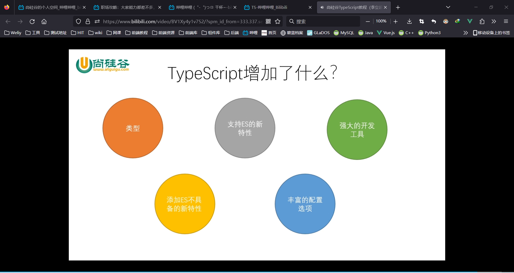

# TypeScript学习笔记

# 第一章 入门

#### TS简介

JS灵活（不容易报错）、易学易用、开发速度快

- 但开发过程容易留下安全隐患，测试、维护成本高
- 不适合大项目
  - 写面向对象时麻烦
  - 变量没有类型检查，编译没有报错，有安全隐患
  - 函数参数也没有类型

TypeScript

- 是以JavaScript为基础构建的语言
- 是JavaScript的超集
- 添加了类型
- 可以在任何支持JavaScript的平台中执行
  - 但是不能直接被JS解析器执行
  - 需要编译成JS




#### 开发环境搭建

- 安装Node.js
- 使用npm全局安装ts`npm i -g typescript`
- 编译命令`tsc xxx.ts`


#### 基本使用

```tsx
//声明变量时指定类型
let a:number;
a=10;
// a='a';//编译报错，但依然会编译成功（默认配置下）

//声明变量的同时进行赋值，ts会自动进行变量类型检测
let b=1;
//b='b';//报错

//声明变量的时候没有赋值，则没有类型检测
let c;
c=1;
c='a';


//声明函数时指明参数类型
function sum(a:number,b:number){
    return a+b;
}

sum(100,100)//不报错
// sum(100,'a')//类型不对，报错
// sum(100,100,100)//多余参数，报错

//指明函数返回值类型
function sum2(a:number,b:number):number{
    return a+b;
}

```


#### 类型


```tsx
// 1.使用字面量进行类型声明
let num:10;
// 2.联合类型 |
let sex:"male"|"female";
// 3.任意类型any，相当于对变量关闭TS的类型检测(建议避免使用)。any可以赋值给任意类型的变量
let a:any;
// 4.不指定类型且不声明时赋值，则为隐式any(避免使用)
let b;

// 5.未知类型unknown。类似any，但是不能赋值给其他类型的变量（哪怕数值的类型是相同的）
let unkn:unknown;
let str:string;
// s=e;// 报错
// 方法1：进行类型检查
if(typeof unkn === "string"){
    str=unkn;//不报错
}
// 方法2：类型断言，告诉解析器 变量的实际类型
str=unkn as string;
str=<string>unkn;


// 函数特殊返回值类型
// void表示空，没有返回值
function vFun():void{
    1;
}
// never表示永远不返回，比如报错
function nFun():never{
    throw new Error('错误')
}
```

```tsx
// object 表示对象（不常用，因为限制太小了，只限制是不是对象）
let obj_a:object;

// 常用写法，限制对象的内容
let obj_b:{name: string}

//加?表示可选内容
let obj_c:{name: string ,age?:number}

// [任意属性名:string]:类型 ，可以有任意属性
let obj_d:{name: string ,[propName:string]:any}

// 设置函数结构的类型声明
let fun: (a:number,b:number)=>number;
fun=function(a:number,b:number):number{
    return a+b;
}

//数组内容的类型指定
let arr1:string[]
let arr2:Array<number>;

//元组：固定长度的数组，效率较高（数组长度没有限制）
let arr_l3:[string,string,string]

//枚举类型enum(是TS中的新增类型)
let person:{name:string,gender:'male'|'female'}
enum eGender{
    Male,
    Female
}
let person2:{name:string,gender:eGender}
person2={
    name:'666',
    gender:eGender.Male
}


// &表示同时
let j: {name:string} & {age:number}
//对象要同时满足这两个成员类型的条件

// 类型的别名
type myTypeS=string;
type myTypeObj={name:string,gender:eGender};
let myS:myTypeS;
let myObj:myTypeObj;
```


#### 编译选项

##### 自动编译文件

- 加上`-w`选项，则会持续监测ts文件变化并自动编译

```bash
tsc xxx.ts -w
```

##### 自动编译项目

文件夹内创建文件`tsconfig.json`，作为TS编译器的配置文件

```json
{}	//控制台输入`tsc`，所有TS都被编译成JS
```

配置选项：

```json
// ts编译配置选项
{
    "include": ["./src/**/*"],//要编译的文件范围
    "exclude": [],//排除的文件范围
    "extends":[],//继承配置文件
    "files": [],//
    "compilerOptions": {
        "target": "ESNext",//编译的目标版本
        "module": "ESNext",//设置编译后代码使用的模块化系统
        "lib":[],//指定代码运行时所包含的库（宿主环境）
        "outDir": "./dist",//编译后文件的所在目录,默认情况下和ts文件同目录
        // "outFile": "./dist/app.js", //  ,将全局作用域的代码合成一个文件。module使用amd或system，才能将模块化代码也合成一个文件。不常用，常交给打包工具。
        "allowJs": false, //是否对js文件进行编译，默认false
        "checkJs": false, //是否对js文件进行语法检查，默认false
        "removeComments": false, //编译结果是否移除注释，默认false
        "noEmit": false, //不生成编译文件，默认false
        "noEmitOnError": true, //出错时不生成编译文件，默认false
        "strict": true,// 严格检查的总开关,设置该值后其他严格都不用写了
        
        "alwaysStrict": false, //在编译后的JS中使用严格模式
        "noImplicitAny": true, //不允许使用隐式any
        "noImplicitThis": true, // 不允许使用类型 不明确的this（eg.this:Window）
        "strictNullChecks": true, //开启严格的空值检查
    }
}
```

- 如果直接使用tsc指令，则可以自动将当前项目下的所有ts文件编译为js文件。

- 但是能直接使用tsc命令的前提时，要先在项目根目录下创建一个ts的配置文件 tsconfig.json

- tsconfig.json是一个JSON文件，添加配置文件后，只需只需 tsc 命令即可完成对整个项目的编译

- 配置选项：

  - include

    - 定义希望被编译文件所在的目录

    - 默认值：["\*\*/\*"]

    - 示例：

      - ```json
        "include":["src/**/*", "tests/**/*"]
        ```

      - 上述示例中，所有src目录和tests目录下的文件都会被编译

  - exclude

    - 定义需要排除在外的目录

    - 默认值：["node_modules", "bower_components", "jspm_packages"]

    - 示例：

      - ```json
        "exclude": ["./src/hello/**/*"]
        ```

      - 上述示例中，src下hello目录下的文件都不会被编译

  - extends

    - 定义被继承的配置文件

    - 示例：

      - ```json
        "extends": "./configs/base"
        ```

      - 上述示例中，当前配置文件中会自动包含config目录下base.json中的所有配置信息

  - files

    - 指定被编译文件的列表，只有需要编译的文件少时才会用到

    - 示例：

      - ```json
        "files": [
            "core.ts",
            "sys.ts",
            "types.ts",
            "scanner.ts",
            "parser.ts",
            "utilities.ts",
            "binder.ts",
            "checker.ts",
            "tsc.ts"
          ]
        ```

      - 列表中的文件都会被TS编译器所编译

    - compilerOptions

      - 编译选项是配置文件中非常重要也比较复杂的配置选项

      - 在compilerOptions中包含多个子选项，用来完成对编译的配置

        - 项目选项

          - target：设置ts代码编译的目标版本

            - 可选值：ES3（默认）、ES5、ES6/ES2015、ES7/ES2016、ES2017、ES2018、ES2019、ES2020、ESNext

          - lib：指定代码运行时所包含的库（宿主环境）

            - 可选值：ES5、ES6/ES2015、ES7/ES2016、ES2017、ES2018、ES2019、ES2020、ESNext、DOM、WebWorker、ScriptHost ......

          - module

            - 设置编译后代码使用的模块化系统
            - 可选值：

              - CommonJS、UMD、AMD、System、ES2020、ESNext、None

          - outDir：编译后文件的所在目录。

            - 默认情况下，编译后的js文件会和ts文件位于相同的目录，设置outDir后可以改变编译后文件的位置

          - outFile：将所有的文件编译为一个js文件

            - 默认会将所有的编写在全局作用域中的代码合并为一个js文件，如果module制定了None、System或AMD则会将模块一起合并到文件之中

          - rootDir：指定代码的根目录，默认情况下编译后文件的目录结构会以最长的公共目录为根目录，通rootDir可以手动指定根目录

          - allowJs：是否对js文件编译

          - checkJs：是否对js文件进行检查

          - removeComments：是否删除注释，默认值：false

          - noEmit：不对代码进行编译，默认值：false

          - sourceMap：是否生成sourceMap，默认值：false

            

        - 严格检查

          - strict：启用所有的严格检查，默认值为true，设置后相当于开启了所有的严格检查
          - alwaysStrict：总是以严格模式对代码进行编译
          - noImplicitAny：禁止隐式的any类型
          - noImplicitThis：禁止类型不明确的this
          - strictBindCallApply：严格检查bind、call和apply的参数列表
          - strictFunctionTypes：严格检查函数的类型
          - strictNullChecks：严格的空值检查
          - strictPropertyInitialization：严格检查属性是否初始化

        - 额外检查

          - noFallthroughCasesInSwitch：检查switch语句包含正确的break
          - noImplicitReturns：检查函数没有隐式的返回值
          - noUnusedLocals：检查未使用的局部变量
          - noUnusedParameters：检查未使用的参数

        - 高级

          - allowUnreachableCode：检查不可达代码
            - true，忽略不可达代码
            - false，不可达代码将引起错误
          - noEmitOnError：有错误的情况下不进行编译，默认值：false

#### 使用webpack

- 通常情况下，实际开发中我们都需要使用构建工具对代码进行打包，TS同样也可以结合构建工具一起使用，下边以webpack为例介绍一下如何结合构建工具使用TS。

- 步骤：

  1. 初始化项目

     - 进入项目根目录，执行命令 ``` npm init -y```
       - 主要作用：创建package.json文件

  2. 下载构建工具

     - ```npm i -D webpack webpack-cli webpack-dev-server typescript ts-loader clean-webpack-plugin```
       - 共安装了7个包
         - webpack：构建工具webpack
         - webpack-cli：webpack的命令行工具
         - webpack-dev-server：webpack的开发服务器
         - typescript：ts编译器
         - ts-loader：ts加载器，用于在webpack中编译ts文件
         - html-webpack-plugin：webpack中html插件，用来自动创建html文件
         - clean-webpack-plugin：webpack中的清除插件，每次构建都会先清除目录

  3. 根目录下创建webpack的配置文件webpack.config.js

     - ```javascript
       const path = require("path");
       const HtmlWebpackPlugin = require("html-webpack-plugin");
       const { CleanWebpackPlugin } = require("clean-webpack-plugin");
       
       module.exports = {
           optimization:{
               minimize: false // 关闭代码压缩，可选
           },
       
           entry: "./src/index.ts",
           
           devtool: "inline-source-map",
           
           devServer: {
               contentBase: './dist'
           },
       
           output: {
               path: path.resolve(__dirname, "dist"),
               filename: "bundle.js",
               environment: {
                   arrowFunction: false // 关闭webpack的箭头函数，可选
               }
           },
       
           resolve: {
               extensions: [".ts", ".js"]
           },
           
           module: {
               rules: [
                   {
                       test: /\.ts$/,
                       use: {
                          loader: "ts-loader"     
                       },
                       exclude: /node_modules/
                   }
               ]
           },
       
           plugins: [
               new CleanWebpackPlugin(),
               new HtmlWebpackPlugin({
                   title:'TS测试'
               }),
           ]
       
       }
       ```

  4. 根目录下创建tsconfig.json，配置可以根据自己需要

     - ```json
       {
           "compilerOptions": {
               "target": "ES2015",
               "module": "ES2015",
               "strict": true
           }
       }
       ```

  5. 修改package.json添加如下配置

     - ```json
       {
         ...略...
         "scripts": {
           "test": "echo \"Error: no test specified\" && exit 1",
           "build": "webpack",
           "start": "webpack serve --open chrome.exe"
         },
         ...略...
       }
       ```

  6. 在src下创建ts文件，并在并命令行执行```npm run build```对代码进行编译，或者执行```npm start```来启动开发服务器

# 第二章 面向对象

### 1、类

- 定义类：

  - ```typescript
    class 类名 {
    	属性名: 类型;
    	
    	constructor(参数: 类型){
    		this.属性名 = 参数;
    	}
    	
    	方法名(){
    		....
    	}
    
    }
    ```

### 2、面向对象的特点

- 封装
  - 权限修饰符
  - 属性存取器
  - 静态属性
- 继承
  - 重写
  - 抽象类

### 3、接口

接口的作用类似于抽象类，不同点在于接口中的所有方法和属性都是没有实值的，换句话说接口中的所有方法都是抽象方法。接口主要负责定义一个类的结构，接口可以去限制一个对象的接口，对象只有包含接口中定义的所有属性和方法时才能匹配接口。同时，可以让一个类去实现接口，实现接口时类中要保护接口中的所有属性。

```tsx
interface Person{
    name: string;
    sayHello():void;
}
```

### 4、泛型

```tsx
function test<T>(arg: T): T{
	return arg;
}
```

