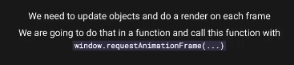

# ThreeJS

### 关于WebGL和ThreeJS

WebGL

- JavaScript API
- Renders triangles at a remarkable speed
- Result can be drawn in a` <canvas>`
- Compatible with most modern browsers
- Uses the Graphic Processing Unit (GPU)

CPU能一个一个地、快速绘制三角形，但是GPU能以慢一点的速度绘制大量三角形


三角形（片元）转化为像素


上色、阴影


ThreeJS


### 基本场景

```js
import { useEffect, useRef } from 'react';
import './App.css';
import * as THREE from 'three';
const sizes={
  width:1600,
  height:1200
}
function App() {
  const appRef= useRef();
  const canvasRef = useRef();
  useEffect(() => {
    //创建场景，场景是所有物体的容器
    const scene = new THREE.Scene();
    //创建透视相机，透视指的是远小近大。除此之外还有正交相机，正交指的是远近一样大
    //相机的位置默认是0,0,0，朝向默认是z轴负方向
    //参数：视野角度，长宽比，近截面，远截面
    const camera = new THREE.PerspectiveCamera(75, sizes.width/sizes.height , 0.1, 1000);
    camera.position.z = 5;
    scene.add(camera);
    //创建渲染器，渲染器决定了渲染的结果应该画在页面的什么元素上面，以及渲染的时候应该考虑多大的区域
    const renderer = new THREE.WebGLRenderer({canvas: canvasRef.current});
    renderer.setSize(sizes.width, sizes.height);
    renderer.render(scene, camera);//渲染器渲染场景和相机
    
    //创建一个立方体,默认只能看到“向外的那一面”
    const geometry = new THREE.BoxGeometry(1,1,1);
    //创建一个材质
    const material = new THREE.MeshBasicMaterial({color: 0x00ff00});
    //创建一个立方体网格。网格是由几何体和材质组成的
    const cube = new THREE.Mesh(geometry, material);
    scene.add(cube);
    renderer.render(scene, camera);//重绘

  }, []);
  return (
    <div className="App" ref={appRef}>
      <canvas ref={canvasRef}></canvas>
    </div>
  );
}

export default App;

```


### 3d物体基本属性

```js
    //AxesHelper：坐标轴辅助工具，新版本叫AxisHelper
    const axesHelper = new THREE.AxisHelper();
    scene.add(axesHelper);

    const geometry = new THREE.BoxGeometry(1,1,1);
    const material = new THREE.MeshBasicMaterial({color: 0x00ff00});
    const cube = new THREE.Mesh(geometry, material);

    //继承自Object3D的常见属性
    //mesh网格、scene场景、camera相机等都继承自Object3D
    //position定位、rotation旋转、scale缩放、quaternion四元数、up向上方向、matrix矩阵、matrixWorld世界矩阵、modelViewMatrix模型视图矩阵、normalMatrix法线矩阵、visible是否可见、castShadow是否投射阴影、receiveShadow是否接受阴影、frustumCulled是否裁剪、renderOrder渲染顺序、userData用户数据、name名称、type类型、id唯一标识符、uuid唯一标识符、parent父级、children子级、onBeforeRender渲染前、onAfterRender渲染后、applyMatrix应用矩阵、applyQuaternion应用四元数、setRotationFromAxisAngle设置旋转轴角度、setRotationFromEuler设置旋转欧拉角、setRotationFromMatrix设置旋转矩阵、setRotationFromQuaternion设置旋转四元数、rotateOnAxis绕轴旋转、rotateX绕X轴旋转、rotateY绕Y轴旋转、rotateZ绕Z轴旋转、translateOnAxis沿轴移动、translateX沿X轴移动、translateY沿Y轴移动、translateZ沿Z轴移动、localToWorld本地转世界、worldToLocal世界转本地、lookAt朝向某个点、add添加子级、remove移除子级、getObjectById通过id获取子级、getObjectByName通过name获取子级、getObjectByProperty通过属性获取子级、getWorldPosition获取世界坐标、getWorldQuaternion获取世界四元数、getWorldScale获取世界缩放、getWorldDirection获取世界方向、traverse遍历子级、traverseVisible遍历可见子级、traverseAncestors遍历祖先、updateMatrix更新矩阵、updateMatrixWorld更新世界矩阵、raycast射线检测、clone克隆、copy复制、toJSON转JSON、dispose
    
     //position：定位，相对于父级的位置
    cube.position.x = 0.7;
    cube.position.y = -0.6;
    cube.position.z = 1;
    cube.position.set(0.7,-0.6,1);
    cube.position.copy(new THREE.Vector3(0.7,-0.6,1));
    //距离函数
    console.log(cube.position.distanceTo(camera.position));

    //scale：缩放
    cube.scale.x = 2;
    cube.scale.y = 0.5;
    cube.scale.z = 0.5;
    cube.scale.set(2,0.5,0.5);
    //旋转顺序
    cube.rotation.order = 'YXZ';
    //lookAt：将物体的-z轴指向某个点
    camera.position.set(4,4,4);
    camera.lookAt(new THREE.Vector3(0,0,0));

    //rotation：旋转，欧拉角   
    //欧拉角：x轴旋转、y轴旋转、z轴旋转，转轴是相对于物体本身的
    cube.rotation.x = Math.PI * 0.25;
    cube.rotation.y = Math.PI * 0.25;
    cube.rotation.z = Math.PI * 0.25;
    
    //上述属性都是相对父级的，因此可以把物体放入一个group中，然后对group进行操作
    const group = new THREE.Group();
    group.add(cube);
    group.position.y = 1;


    // scene.add(cube);
    scene.add(group);
    renderer.render(scene, camera);
```


### 动画


每秒拍60张=fps60



```js

    const clock = new THREE.Clock();

    //请求动画帧，目的是在下一帧调用函数
    //1.自己写每帧发生的变化
    const tick = () => {
      // cube.rotation.x += 0.01;
      //这样的写法会导致速度和帧数相关，因此需要使用clock。或者手写时间差

      const elapsedTime = clock.getElapsedTime();
      cube.rotation.x = 0.1 * elapsedTime;//单位是s


    };

    //2.使用gsap动画库：yarn add gsap
    gsap.to(cube.rotation, { duration: 1, x: 1, y: 1, });

    //不管那种方式，每帧的渲染是必需的
    const animate = () => {
      // tick();//自己写的每帧动画
      renderer.render(scene, camera);
      window.requestAnimationFrame(animate);
    };
    animate();
```


### 相机

#### 控件

### 屏幕宽度（暂时略过）

### 几何

### debugUI


### 纹理/贴图


