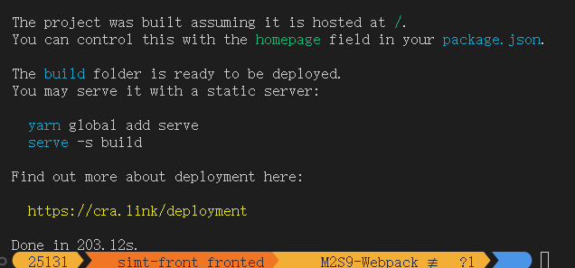
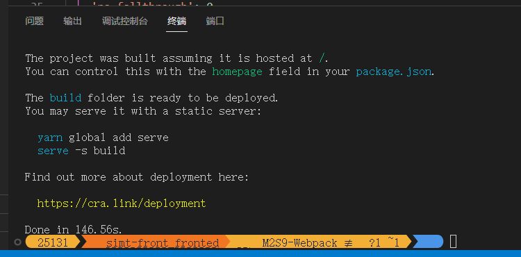
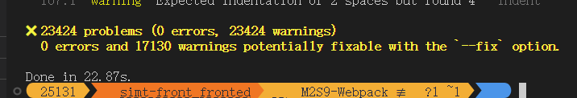

#### 背景

优化方法学习自https://juejin.cn/post/7046616302521155614#heading-1

优化对象：SIMTFronted-M2S9

优化前：



第二次运行（可能是生成了缓存）



#### 优化

##### 打包过程进度条：


```js
//progress-bar-webpack-plugin  #查看进度条

// 引入进度条插件
const chalk = require("chalk");//引入node 颜色的插件
const ProgressBarPlugin = require("progress-bar-webpack-plugin");
module.exports = {
  plugins: [
    // 进度条
    new ProgressBarPlugin({
      format: `  :msg [:bar] ${chalk.green.bold(":percent")} (:elapsed s)`,
    }),
  ],
};
```


##### eslint：

- 打包过程有2万条Eslint警告输出，较占用时间。测试发现单独运行eslint命令需要22s，移除了一些不必要的警告规则后，只需要12s就运行完成
- 也可以使用eslint --fix自动修复，部分修复需要另外配置

##### 


---

添加打包进度条

耗时较长的babel-loader，通过thread-loader使用独立进程

配置terser-webpack-plugin进行多线程压缩