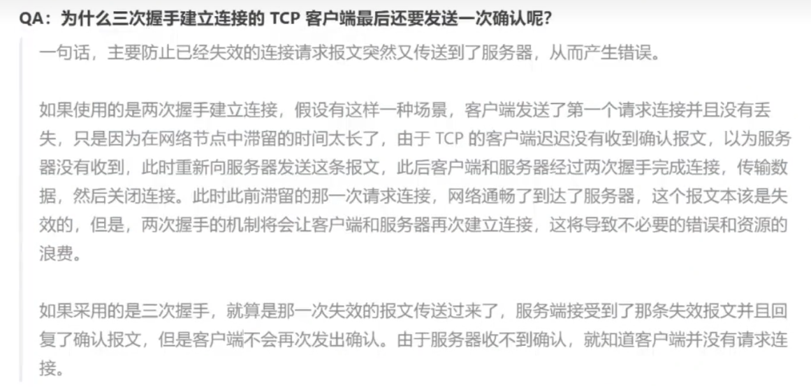
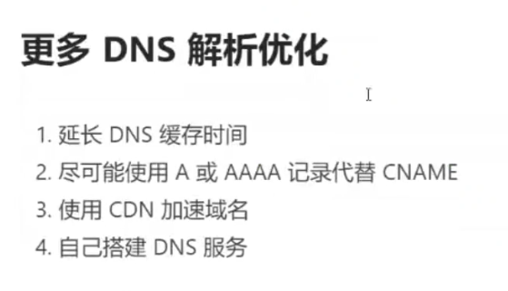
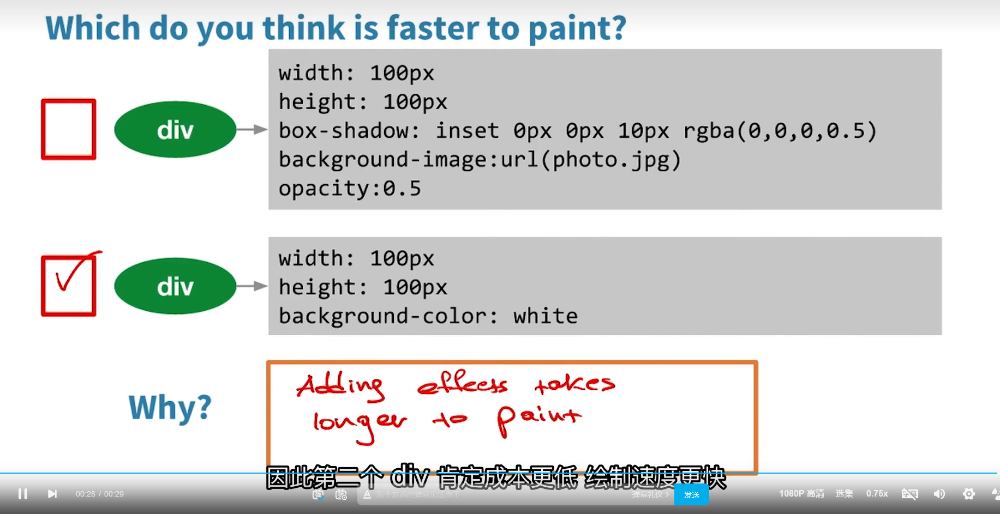

# Web性能优化 1

https://developer.mozilla.org/zh-CN/docs/learn/Performance

## Web性能

https://developer.mozilla.org/zh-CN/docs/Learn/Performance/What_is_web_performance

打开速度、动画效果、表单提交、列表滚动、页面切换等

MDN：Web 性能就是让网站变得更快，以及让缓慢过程*看起来*更快。网站加载速度是否很快，是否允许用户快速开始与之交互，是否在某些东西需要时间加载时提供可靠的反馈（例如，一个“加载中”的旋转指示器）？网页的滚动和动画是否流畅

Web 性能是对网站或应用程序的客观度量和用户的体验。这包括以下主要方面：

- **减少总体负载时间**：需要多长时间才能将渲染网站所需的文件下载到用户的计算机上？这往往受到[延迟 (en-US)](https://developer.mozilla.org/en-US/docs/Web/Performance/Understanding_latency)、文件大小、文件数量以及其他因素的影响。一般策略是==使文件尽可能小，尽可能减少 HTTP 请求的次数，并采用巧妙的加载技术（例如 [preload](https://developer.mozilla.org/zh-CN/docs/Web/HTML/Attributes/rel/preload)）使文件更快可用==。
- **尽快使网站可用**：简单来说就是以==合理的顺序加载你的网站资源==，以便用户能够更快地开始使用。在用户继续执行主要任务的同时，任何其他资源都可以在后台继续加载。有时我们也会在实际需要时才加载资源（这被称为[懒加载](https://developer.mozilla.org/zh-CN/docs/Web/Performance/Lazy_loading)）。网站从开始加载，到达到可用状态为止所需的时间被称为[交互等待时间 (en-US)](https://developer.mozilla.org/en-US/docs/Glossary/Time_to_interactive)。
- **流畅性和交互性**：应用程序是否可靠，使用起来是否愉快？滚动是否流畅？按钮是否可点击？弹出窗口是否能够快速打开，并且在打开时动画是否流畅？使用 CSS 动画而不是 JavaScript 来制作动画，并尽量减少由于 DOM 变化而引起重绘 UI 的次数。
- **[感知性能](https://developer.mozilla.org/zh-CN/docs/Learn/Performance/Perceived_performance)**：用户所体验到的，是网站看起来有多快，而不是网站实际有多快。
- **[性能测量](https://developer.mozilla.org/zh-CN/docs/Learn/Performance/Measuring_performance)**：Web 性能包括测量应用程序的实际速度和感知速度，在可能的情况下进行优化，然后监视性能，以确保已经优化过的内容保持优化状态。这涉及到许多度量标准（可以指示成功或失败的可度量指标）和测量这些度量标准的工具，我们将在本节中讨论这些度量标准。

总而言之，许多特性都会影响性能。包括延迟、应用程序大小、DOM 节点数量、资源请求数量、JavaScript 性能、CPU 负载等等。重要的是尽量缩短加载和响应时间，并通过增加额外的功能来隐藏延迟：先使网站变得可以交互，同时在后台加载用户体验中的次要部分。

## Web性能指标

### RAIL性能模型

Response、Animation、Idle、Load

RAIL 模型的理念是”以用户为中心，最终目标不是让您的网站在任何特定设备上都能运行很快，而是使用户满意”

- 响应 (Response)应该尽可能快速的响应用户,应该在 100ms 以内响应用户输入。
- 动画(Animation):在展示动画的时候，每一应该以16ms （每秒60帧）进行染，这样可以保持动画效果的一致性，并且避免卡顿
- 空闲 (ldle): 当使用 Javascript 主线程的时候，应该把任务划分到执行时间小于 50ms 的片段中去，这样可以释放线程以进行用户交互。
- 加载 (Load): 应该在小于 1s 的时间内加载完成你的网站，并可以进行用户交互。

（根据网络条件和硬件的不同，用户对性能延迟的理解也有所不同。例如，通过快速的Wi-Fi连接在功能强大的台式机上加载站点通常在1秒内完成，用户对此已经习以为常。在3G连接速度较慢的移动设备上加载网站需要花费更多时间，因此移动用户通常更耐心，在移动设备上加载5 s是一个更现实的目标。）

### 基于用户体验的性能指标

#### FCP（首次内容绘制

也就是“白屏时间”

#### LCP（最大内容绘制

#### FID（首次输入延迟

#### TTI（完全可交互

#### TBT（总阻塞时间

Total Block Time(TBT）总阻塞时间，度量了FCP和TTI之间的总时间，在该时间范围内，主线程被阻塞足够长的时间以防止输入响应。

#### CLS（累计布局偏移

布局抖动

### Web Vitals

Google 开发了许多实用指标和工具，帮助衡量用户体验和质量，从而发掘优化点。一项名为Web Vitals 的计划降低了学习成本，为网站体验提供了一组统一的质量衡量指标 - Core WebVitals，其中包括加载体验、交互性和页面内容的视觉稳定性。

有很多方法可以优化网站的用户体验。若能预先了解最佳的优化衡量方法，可以大大节省时间和成本。

Google 在 2020 年5月5 日提出了新的用户体验量化方式 Web Vitals 来量网站的用户体验，并将这些衡量结果用作其排名算法的一部分。

## Web性能测试

### 灯塔Lighthouse

Lighthouse 直译过来是“灯塔”的意思，它是由 Google 开发并开源的一个 Web 性能测试工具。该性能检测工具以此命名也蕴涵了相同的含义，即通过监控和检测网站应用的各方面性能表现，来为开发者提供优化用户体验和网站性能的指导建议

已经集成到谷歌浏览器的调试工具，一般无需安装

关于性能报告部分的检测结果，Lighthouse 给出的信息包括: 检测得分、性能指标、优化建议、诊断结果及已通过的性能

### 在线工具WebPageTest

webpagetest.org

### Chrome DevTools

任务管理器、网络分析

## Web生命周期

在前端性能优化方面理解和掌握此过程的深入程度，与快速定位性能瓶颈及高效权衡出恰当的性能优化解决方案是正相关的。
如果面试者的回答是:首先浏览器发起请求，然后服务器返回数据，最后脚本执行和页面渲染，那么这种程度大概在不堪一击与初窥门径之间，属于刚入门前端，对性能优化还没什么概念。
如果知道在测览器输入 URL后会建立 TCP 连接，并在此之上有 HTTP 的请求与响应，在浏览器接收到数据后，了解 HTML与 CSS文件如何构成染树，以及 JavaScript 引擎解析和执行的基本流程，这种程度基本算是初窥门径，在面对网站较差的性能表现时，能够尝试从网络连接、关键渲染路径及 S 执行过程等角度去分析和找寻可能存在的问题。本课程的目标便是带领各位同学从初窥门径的程度向更高的级别提升。
其实这个问题的回答可以非常细致，能从信号与系统、计算机原理、操作系统聊到网络通信、浏览器内核，再到 DNS 解析、负载均衡页面渲染等，但这门课程主要关注前端方面的相关内容，为了后文表述更清楚，这里首先将整个过程划分为以下几个阶段。

1. 浏览器接收到 URL，到网络请求线程的开启
2. 一个完整的 HTTP 请求并的发出。
3. 服务器接收到请求并转到具体的处理后台
4. 前后台之间的 HTTP交互和涉及的缓存机制
5. 浏览器接收到数据包后的关键渲染路径
6. JS引擎的解析过程

### 网络请求线程开启

浏览器内部完成

1.url的解析

解析 URL后，如果是HTTP 协议，则浏览器会新建一个网络请求线程去下载所需的资源，要明白这个过程需要先了解进程和线程之间的区别，以及目前主流的多进程浏览器结构。

#### 进程与线程

简单来说，进程就是一个程序运行的实例，操作系统会为进程创建独立的内存，用来存放运行所需的代码和数据;而线程是进程的组成部分，每个进程至少有一个主线程及可能的若干子线程，这些线程由所属的进程进行启动和管理。由于多个线程可以共享操作系统为其所属的同一个进程所分配的资源，所以多线程的并行处理能有效提高程序的运行效率

进程和线程之间的区别:

1. 只要某个线程执行出错，将会导致整个进程崩溃。
2. 进程与进程之间相互隔离。这保证了当一个进程挂起或崩溃的情况发生时，并不会影响其他进程的正常运行，虽然每个进程只能访问系统分配给自己的资源，但可以通过IPC 机制进行进程间通信。
3. 进程所占用的资源会在其关闭后由操作系统回收。即使进程中存在某个线程产生的内存泄漏，当进程退出时，相关的内存资源也会被回收
4. 线程之间可以共享所属进程的数据

#### 单进程浏览器

在熟悉了进程和线程之间的区别后，我们在此基础上通过了解浏览器架构模型的演变，来看看网络请求线程的开启处在怎样的位置。
说到底浏览器也只是一个运行在操作系统上的程序，那么它的运行单位就是进程，而早在 2008 年谷歌发布Chrome 多进程浏览器之前，市面上几乎所有浏览器都是单进程的，它们将所有功能模块都运行在同一个进程中，其架构示意图如下图所示

单线程内部，运行多个进程 

#### 多进程浏览器

出于对单进程浏览器存在问题的优化，Chrome 推出了多进程浏览器架构浏览器把原先单进程内功能相对独立的模块抽离为单个进程处理对应的任务，主要分为以下几种进程

1. 浏览器主进程：一个浏览器只有一个主进程，负责如菜单栏、标题栏等界面显示，文件访问，前进后退，以及子进程管理等。
2. GPU 进程：GPU(图形处理单元)最初是为了实现 3D 的 CSS 效果而引入的，后来随着网页及浏览器在界面中的使用需求越来越普遍，Chrome便在架构中加入了GPU进程。
3. 插件进程：主进程会为每个加入浏览器的插件开辟独立的子进程，由于进程间所分配的运行资源相对独立，所以即便某个插件进程意外崩溃，也不至于对浏览器和页面造成影响。另外，出于对安全因素的考虑，这里采用了沙箱模式(即上图中虚线所标出的进程)，在沙箱中运行的程序受到一些限制:不能读取敏感位置的数据，也不能在硬盘上写入数据。这样即使插件运行了恶意脚本，也无法获取系统权限。
4. 网络进程：负责页面的网络资源加载，之前属于浏览器主进程中的一个模块，最近才独立出来
5. 渲染进程：也称为浏览器内核，其默认会为每个标签窗口页开辟一个独立的渲染进程，负责将HTML、CSS和JavaScript 等资源转为可交与的页面，其中==包含多个子线程==，即JS引警线程、GUI渲染线程、事件触发线程、定时触发器线程、异步 HTTP 请求线程等。当打开一个标签页输入 URL后，所发起的网络请求就是从这个进程开始的。另外，出于对安全性的考虑，渲染进程也被放入沙箱中。

谷歌浏览器任务管理器：

### 建立HTTP请求

#### DNS解析

 

首先查询浏览器自身的 DNS 缓存，如果查到P 地址就结束解析，由于缓存时间限制比较大，一般只有1分钟，同时缓存容量也有限制，所以在浏览器缓存中没找到 P 地址时，就会搜索系统自身的 DNS 缓存如果还未找到，接着就会尝试从系统的 hosts文件中查找。
在本地主机进行的查询若都没获取到，接下来便会在本地域名服务器上查询。如果本地域名服务器没有直接的目标IP 地址可供返回，则本地域名服务器便会采取迭代的方式去依次查询根域名服务器、COM 顶级域名服务器和权限域名服务器等，最终将所要访问的目标服务器IP 地址返回本地主机，若查询不到，则返回报错信息。
由此可以看出DNS解析是个很耗时的过程，若解析的域名过多，势必会延缓首屏的加载时间。本节仅对DNS解析过程进行简要的概述，而关于原理及优化方式等更为详细的介绍会在后续课程中单独展开介绍

#### 网络模型

#### TCP连接

建立tcp连接的三次握手

关闭标签页/请求完成，断开连接的四次挥手

### 前后端交互

#### 反向代理服务器

对需要提供复杂功能的网站来说，通常单一的服务器资源是很难满足期望的。一般采用的方式是将多个应用服务器组成的集群由反向代理服务器提供给客户端用户使用，这些功能服务器可能具有不同类型，比如文件服务器、邮件服务器及 Web 应用服务器，同时也可能是相同的Web服务部署到多个服务器上，以实现负载均衡的效果，反向代理服务器的作用如图所示。

反向代理服务器根据客户的请求，从后端服务器上获取资源后提供给客户端。反向代理服务器通常的作用如下:
负载均衡。0
安全防火墙。
加密及SSL加速
数据压缩。
解决跨域。.
。对静态资源缓存。
常用作反向代理服务器的有 Nginx、lIS、Apache我们会在后面针对 Nginx 深入介绍一些可用于性能优化的配置。

#### 后端处理流程

经反向代理收到请求后，具体的服务器后台处理流程大致如下
(1)首先会有一层统一的验证环节，如跨域验证、安全校验拦截等。如果发现是不符合规则的请求，则直接返回相应的拒绝报文。
(2)通过验证后才会进入具体的后台程序代码执行阶段，如具体的计算、数据库查询等(3)完成计算后，后台会以一个HTTP响应数据包的形式发送回请求的前端，结束本次请求

#### HTTP相关协议特性

HTTP 是建立在传输层TCP 协议之上的应用层协议，在TP 层面上存在长连接和短连接的区别。所谓长连接，就是在客户端与服务器端建立的 TCP 连接上，可以连续发送多个数据包，但需要双方发送心跳检查包来维持这个连接

短连接就是当客户端需要向服务器端发送请求时，会在网络层P 协议之上建立一个TCP 连接，当请求发送并收到响应后，则断开此连接。根据前面关于 TCP 连接建立过程的描述，我们知道如果这个过程频繁发生，就是个很大的性能耗费，所以从 HTTP的10版本开始对于连接的优化一直在进行。
在HTTP 1.0时，默认使用短连接，浏览器的每一次 HTTP 操作就会建立一个连接，任务结束则断开连接。
在HTTP 1.1时，默认使用长连接，在此情况下，当一个网页的打开操作完成时，其中所建立用于传输HTTP的TCP 连接并不会断开关闭，客户端后续的请求操作便会继续使用这个已经建立的连接。如果我们对浏览器的开发者工具留心，在查看请求头时会发现一行 Connection: keep-alive。长连接并非永久保持，它有一个持续时间，可在服务器中进行配置。

在 HTTP 2.0之后，便可以在一个TCP 连接上请求多个资源，分割成更小的请求，其速度性能便会明显上升，所以之前针对HTTP 1.1限制的优化方案也就不再需要了。
HTTP2.0除了一个连接可请求多个资源这种多路复用的特性，还有如下一些新特性
(1)二进制分帧: 在应用层和传输层之间，新加入了一个二进制分帧层，以实现低延迟和高吞吐量。(2)服务器端推送:以往是一个请求带来一个响应，现在服务器可以向客户端的一个请求发出多个响应，这样便可以实现服务器端主动向客户端推送的功能。
(3)设置请求优先级:服务器会根据请求所设置的优先级，来决定需要多少资源处理该请求。
(4)HTTP头部压缩: 减少报文传输体积。

#### 浏览器缓存

在基于 HTTP的前后端交互过程中，使用缓存可以使性能得到显著提升。具体的缓存策略分为两种:强缓存和协商缓存。
强缓存就是当浏览器判断出本地缓存未过期时，直接读取本地缓存，无须发起 HTTP 请求，此时状态为:200 from cache。在HTTP 1.1版本后通过头部的 cache-contro 字段的 max-age 属性值规定的过期时长来判断缓存是否过期失效，这比之前使用expires 标识的服务器过期时间更准确而且安全
协商缓存则需要浏览器向服务器发起 HTTP 请求，来判断浏览器本地缓存的文件是否仍未修改，若未修改则从缓存中读取，此时的状态码为:304。具体过程是判断浏览器头部 if-none-match 与服务器短的e-tag是否匹配，来判断所访问的数据是否发生更改。这相比HTTP 1.0 版本通过 last-modified判断上次文件修改时间来说也更加准确。具体的浏览器缓存触发逻辑如图所示。

在浏览器缓存中，强缓存优于协商缓存，若强缓存生效则直接使用强缓存，若不生效则再进行协商缓存的请求，由服务器来判断是否使用缓存，如果都失效则重新向服务器发起请求获取资源。本节仅简要说明浏览器缓存的触发过程，由于这部分对性能优化来说比较重要，所以在后续章节也会详细介绍。

### 关键渲染路径

#### 构建对象模型

首先浏览器会通过解析 HTML和 CSS 文件，来构建DOM (文档对象模型)和 CSSOM (层叠样式表对象模型)，为便于理解，我们以如下 HTML 内容文件为例，来观察文档对象模型的构建过程。

##### 构建DOM

##### 构建CSSOM

DOM 树表示文档标记的属性和关系，但未包含其中各元素经过渲染后的外观呈现，这便是接下来CSSOM 的职责了，与将 HTML 文件解析为文档对象模型的过程类似，CSS 文件也会首先经历从字节到字符串，然后令牌化及词法分析后构建为层叠样式表对象模型。

##### 渲染绘制

当完成文档对象模型和层叠样式表对象模型的构建后，所得到的其实是描述最终渲染页面两个不同方面信息的对象:一个是展示的文档内容，另一个是文档对象对应的样式规则，接下来就需要将两个对象模型合并为渲染树，渲染树中只包含渲染可见的节点，该HTML 文档最终生成的渲染树如图所示

渲染绘制的大致步骤如下

(1)从所生成DOM 树的根节点开始向下遍历每个子节点，忽略所有不可见的节点(脚本标记不可见CSS隐藏不可见)，因为不可见的节点不会出现在染树中(2)在CSSOM 中为每个可见的子节点找到对应的规则并应用。
(3)布局阶段，根据所得到的染树，计算它们在设备视图中的具体位置和大小，这一步输出的是一个“盒”
(4)绘制阶段，将每个节点的具体绘制方式转化为屏幕上的实际像素
此处所举的例子较为简单，读者要明白执行构建渲染树、布局及绘制过程所需要的时间取决于实际文档的大小。文档越大，浏览器需要处理的任务就越多，样式也复杂，绘制需要的时间就越长，所以关键渲染路径执行快慢，将直接影响首屏加载时间的性能指标
当首屏渲染完成后，用户在和网站的交互过程中，有可能通过 JavaScript 代码提供的用户操作接口更改演染树的结构，一旦 DOM 结构发生改变，这个染过程

## Web性能优化

### 前端页面的生命周期

性能问题呈现给用户的感受往往是简单而直接的: 加载资源缓慢、运行过程卡顿或响应交互迟缓等，当把这些问题呈现到前端工程师面前时，却是另一种系统级别复杂的图景。
从域名解析、TCP 建立连接到 HTTP 的请求与响应，以及从资源请求、文件解析到关键渲染路径等，每一个环节都有可能因为设计不当、考虑不周、运行出错而产生性能不佳的体验。作为前端工程师，为了能在遇到性能问题时快速而准确地定位问题所在，并设计可行的优化方案，熟悉前端页面的生命周期是一堂必修课。
本章就从一道常见的前端面试题开始，通过对此问题的解答，来分析前端页面生命周期的各个环节，并着重分析其中关键渲染路径的具体过程和优化实践，希望以此为基础帮读者建构一套完整知识框架的图谱而后续章节的专题性优化，也都是对此生命周期中某个局部过程的优化分析。

### DNS解析

当浏览器从(第三方)服务器请求资源时，必须先将该跨域域名解析为 P 地址，然后浏览器才能发出请求。此过程称为 DNS 解析。DNS 作为互联网的基础协议，其解析的速度似乎很容易被网站优化人员忽视。现在大多数新浏览器已经针对 DNS 解析进行了优化，比如 DNS 缓存。典型的一次 DNS 解析需要耗费 20-120 毫秒，所花费的时间几乎可以忽略不计，但是当网站中使用的资源依赖于多个不同的域的时候，时间就会成倍的增加，从而增加了网站的加载时间。比如在某些图片较多的页面中，在发起图片加载请求之前预先把域名解析好将会有至少5%的图片加载速度提升。
一般来说，在前端优化中与 DNS 有关的有两点

- 减少DNS的请求次数
- 进行DNS 预获取:DNS Prefetch

#### 减少DNS查找

域名系统(DNS)将主机名映射到IP地址，就像电话簿将人们的姓名映射到他们的电话号码一样。在浏览器中输入 www.taobao.com 时，浏览器联系的 DNS 解析器将返回该服务器的 P 地址。DNS 有成本。DNS 通常需要 20-120 毫秒来查找给定主机名的IP地址。在 DNS 查找完成之前，浏览器无法从该主机名下载任何内容。

##### 缓存DNS

缓存DNS 查找以提高性能。这种缓存可以在由用户的 SP 或局域网维护的特殊缓存服务器上进行，但是在个别用户的计算机上也会发生缓存。DNS 信息保留在操作系统的 DNS 缓存中(Microsoft Windows上的“DNS客户端服务”)。大多数浏览器都有自己的缓存，与操作系统的缓存分开。只要浏览器将 DNS记录保留在其自己的缓存中，它就不会对操作系统发出记录请求进行打扰。
默认情况下，Internet Explorer 会缓存30 分钟的DNS 查找，这是由 DnsCacheTimeout 注册表设置指定的。Firefox在network.dnsCacheExpiration 配置设置的控制下缓存DNS 查找1分钟。Chrome也是1分钟。

##### 减少域名数量

当客户端的 DNS 缓存为空(对于浏览器和操作系统)时，DNS查找的次数等于网页中唯一主机名的数目。这包括在页面的 URL，图像，脚本文件，样式表，Flash 对象等中使用的主机名。减少唯一主机名的数量将减少DNS查找的数量。
减少域名的数量有可能减少页面中并行下载的数量。避免 DNS 查找会减少响应时间，但是减少并行下载可能会增加响应时间。我的指导原则是将这些资源划分为至少两个但不超过四个域名。这将在减少 DNS查找和允许高度并行下载之间取得良好的折衷。

#### DNS预取

DNS-prefetch(DNS 预获取)是尝试在请求资源之前解析域名。这可能是后面要加载的文件，也可能是用户尝试打开的链接目标。域名解析和内容载入是串行的网络操作，所以这个方式能减少用户的等待时间提升用户体验。
dns-prefetch可帮助开发人员掩盖DNS解析延迟。HTML<link>元素通过dns-prefetch 的 rel属性值提供此功能。然后在href 属性中指要跨域的域名:

异步操作，不会造成阻塞

每当站点引用跨域域上的资源时，都应在《head》元素中放置 dns-prefetch 提示，但是要记住一些注意事项。
(1)dns-prefetch 仅对跨域域上的 DNS 查找有效，因此请避免使用它来指向您的站点或域。这是因为，到浏览器看到提示时，您站点域背后的IP已经被解析。
(2)dns-prefetch 需慎用，多页面重复 DNS 预解析会增加重复DNS 查询次数
(3)默认情况下浏览器会对页面中和当前域名(正在浏览网页的域名)不在同一个域的域名进行预获取，并且缓存结果，这就是隐式的 DNS Prefetch。如果想对页面中没有出现的域进行预获取，那么就要使用显示 DNS Prefetch 了。
(4)虽然使用 DNS Prefetch 能够加快页面的解析速度，但是也不能滥用，因为有开发者指出禁用 DNS预读取能节省每月100亿的DNS查询

#### HTTP长连接

##### 长短链接

http1.1默认开启

##### 管道机制

请求是并发的，响应是串行的

分块传输编码

#### HTTP2

响应也可以并发了，解决了队头堵塞问题

#### 避免重定向

# Web性能优化 2：Web Performance Optimization

## 开始

#### 手机链接调试

手机打开USB调试。手机和电脑都使用谷歌浏览器

电脑打开inspect

## web生命周期/关键呈现路径

### DOM 文档对象模型

获取html并开始构建文档对象模型，获取CSS并构建CSS对象模型。将二者相结合，创建渲染树，形成布局，然后将像素显示

访问一个URL，浏览器就会向服务器发送一个请求

（命令行窗口：`curl xxxurl`）

HTML规范包含了

规定如何接收数据，根据<标签，使用令牌生成器生成令牌，同时另一个工作是消耗令牌并转化为节点对象，最后生成文档对象模型（DOM树）

浏览器会逐步构建DOM，可以利用这一点

google：逐步交付内容

使用开发者工具-时间轴，查看加载时发生的事件

### CSSOM 叠层样式对象模型

样式有些会继承

### Render Tree 渲染树

将DOM和CSSOM结合

从DOM根开始，检索是否有匹配的css样式。然后向下检索其他DOM节点

遇到display：none跳过子节点

### Layout 布局过程

如果布局视口的尺寸更改了 ，浏览器需要重新运行布局步骤（旋转手机或者调整浏览器大小）。修改样式或更新内容导致更新渲染树时，就可能重新运行布局步骤。

优化：批量更新，避免出现多个布局事件

在谷歌时间轴中查看，只选中渲染Render事件

### Paint 绘制像素

（回顾：网页性能的基本原则，先衡量，再优化）

更新渲染树时，除了重新布局步骤，浏览器会重新绘制最小的请求区域

### 小结 呈现内容关键步骤 Critical Rendering Path

关键路径：

1. 请求HTML文档
2. 解析HTML、构建DOM（可以逐步构建，不是一次性出现。
3. 请求在head里发现的CSS和JS
4. 解析CSS、构建CSSOM
5. （3完成后）取消屏蔽JS引擎，执行JS
6. 合并DOM和CSSOM成RenderTree
7. 计算布局
8. 绘制页面

CSS的优化：删除空白字符减少解析、最后集成到一个文件减少请求

## 优化

### Optimizing The DOM

1. 移除注释：html、css、js注释，没必要展示给浏览器
2. 压缩文件
3. 浏览器缓存

### Unblocking CSS

删除不必要的样式

运行灯塔时，会推荐查看阻止呈现的CSS

CSS对特定范围应用样式，如媒体查询。写在同一个CSS文件中时，解析过程中会阻止页面的呈现。

优化：把print的媒体查询移动到单独的文件，并添加media，这样浏览器仍会下载样式表，但不会对print对应的css阻止呈现

复杂的断点同样适用

### Optimizing JS

缩小、压缩、缓存文件

灯塔中提出了解析器屏蔽脚本：

解析DOM过程中遇到了JS标记，会暂停DOM解析构建，JS运行完才能继续构建

移入外部JS文件：会停止解析，等待获取

内联的JS减少了请求次数，但是可能无法复用，有时候需要衡量

CSS的解析会阻止呈现并阻止执行JS（优化CSS非常重要

优化：内联CSS

---

有些JS不修改DOM、CSSOM的脚本，不应该阻止呈现

- 在网页加载后（onload事件发生后），再去加载脚本
- 或者在JS标签添加async属性即可，告诉浏览器遇到这个js标签时无需阻止DOM树构建过程、脚本不会被CSS对象模型阻止。
  - 但是内联脚本始终会被CSS阻止，除非把JS标签放在CSS标签上方

---

三者的对比

### General Strategies 一般策略

1. 减少、压缩、缓存
2. 减少CSS的阻止渲染
   1. 在样式的link标签使用媒体查询
   2. 内联CSS
3. 减少JS的阻止解析
   1. 在页面加载完成后加载1JS
   2. async的JS标签

特点：

1. 减少网络传输量
2. 从呈现的关键路径中移除非关键内容
3. 缩短呈现关键路径（减少关键资源

#### 缩短关键路径

---

关键路径只有一个html的情况

理想情况下关键路径只有一次请求，但是网页比较大（>14KB）可能会多次请求

---

关键路径里有html+css的情况

2个关键资源、2次关键请求

使用内联CSS的话，2个关键资源，1次关键请求

---

被JS阻塞的情况

3个关键资源，2次关键路径长度（浏览器可以同时下载JS和CSS这两个，所以关键路径长度不变

---

优化后的情况

预加载扫描机制：即使DOM的构建被block，浏览器仍会扫描并获取需要加载的资源

---

示例2

### Final Project

使关键路径尽可能地短

