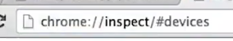
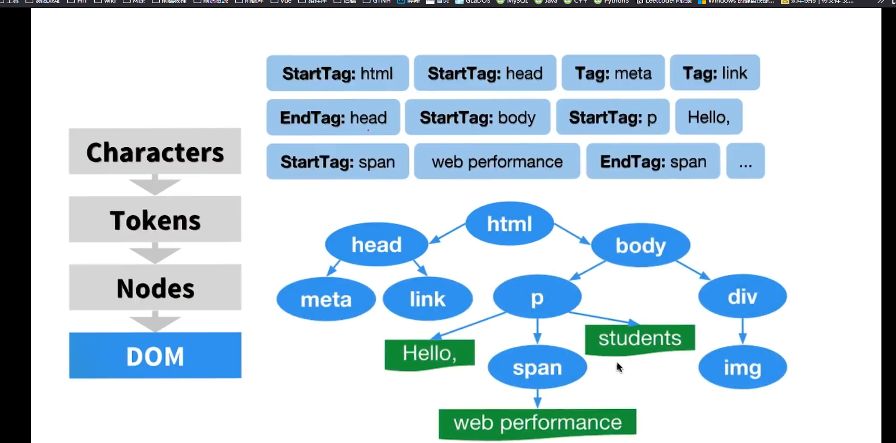
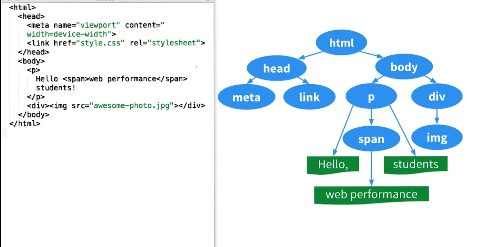
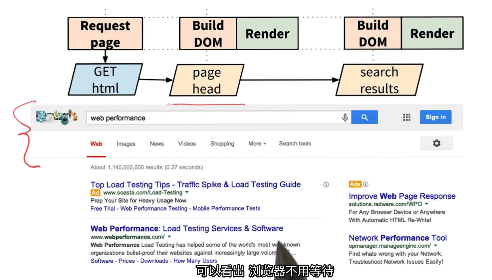
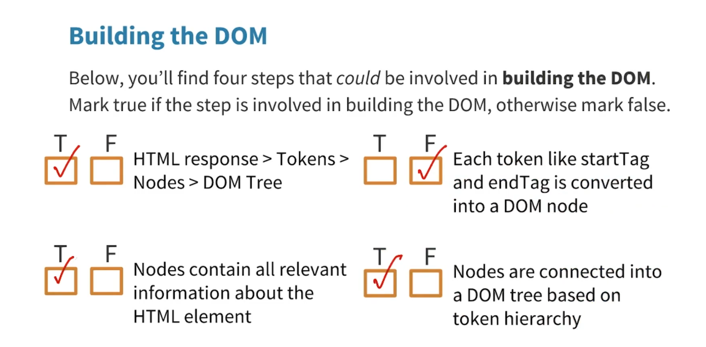
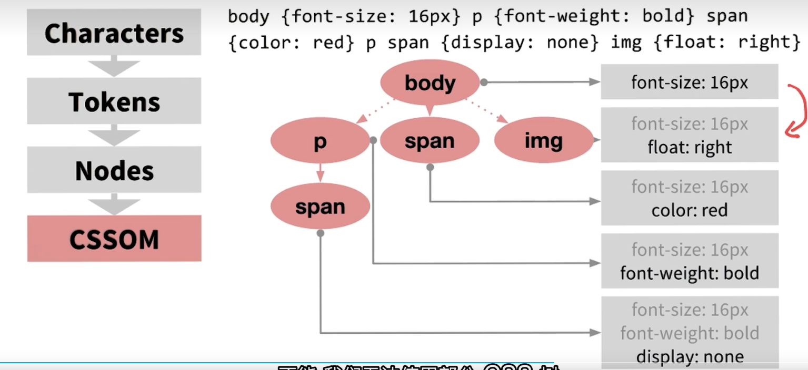
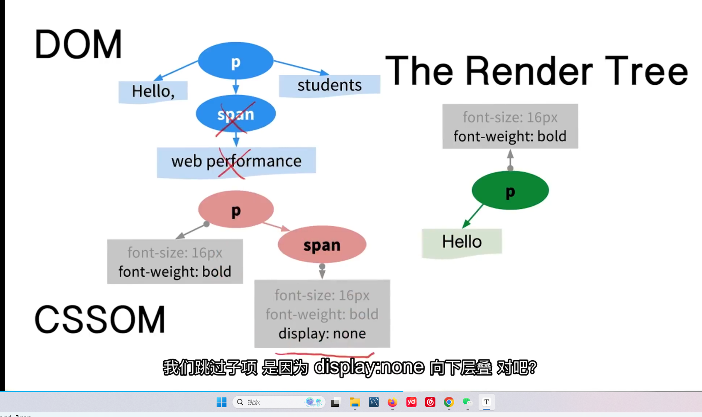

# Web Performance Optimization

## 开始

#### 手机链接调试

手机打开USB调试。手机和电脑都使用谷歌浏览器

电脑打开inspect

## 关于web生命周期

### The DOM

获取html并开始构建文档对象模型，获取CSS并构建CSS对象模型。将二者相结合，创建渲染树，形成布局，然后将像素显示

访问一个URL，浏览器就会向服务器发送一个请求

（命令行窗口：`curl xxxurl`）

HTML规范包含了

规定如何接收数据，根据<标签，使用令牌生成器生成令牌，同时另一个工作是消耗令牌并转化为节点对象，最后生成文档对象模型（DOM树）

浏览器会逐步构建DOM，可以利用这一点

google：逐步交付内容

使用开发者工具-时间轴，查看加载时发生的事件

### CSSOM

样式有些会继承

### Render Tree

将DOM和CSSOM结合

从DOM根开始，检索是否有匹配的css样式。然后向下检索其他DOM节点

遇到display：none跳过子节点

