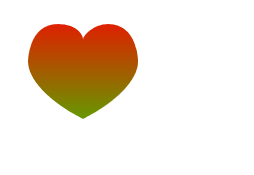
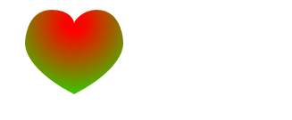

# Canvas

### 初识

```html
<body>
    <canvas id="canvas" width="800" height="600">
        <!-- 不支持的浏览器会将canvas识别为普通标签识别 -->
        <h3>您的浏览器不支持canvas!请更新浏览器!</h3>
    </canvas>
    <script>
        //1.获取画布
        let canvas = document.getElementById('canvas');
        //2.获取画笔(上下文对象)
        let ctx = canvas.getContext('2d');
        //3.绘制
        ctx.fillRect(0,0,100,100);
    </script>
</body>
```

### 绘制填充/描边/清除

```js
//1.获取画布
let canvas = document.getElementById('canvas');
//2.获取画笔(上下文对象)
let ctx = canvas.getContext('2d');
//3.绘制
ctx.fillRect(0,0,100,100);//绘制填充矩形,位置(0,0)宽高(100,100)
ctx.strokeRect(100,100,100,100);//绘制描边矩形
ctx.clearRect(50,50,100,100);//清除矩形（清除矩形范围内像素）
//可以设置定时器做擦除的动画
function myClear(x,y,height,width,time,ctx){
}

//分步完成填充/描边矩形

ctx.beginPath();//开始路径
ctx.moveTo(200,200);//移动画笔到(200,200)
ctx.lineTo(300,200);//画笔连线到(300,200)
ctx.lineTo(300,300);//画笔连线到(300,300)
ctx.lineTo(200,300);//画笔连线到(200,300)
//或者用rect方法直接选出矩形
ctx.closePath();//闭合路径
ctx.stroke();//描边
ctx.fill();//填充
```

### 绘制多线段（多边形）

```js
//绘制多段线
        ctx.beginPath();
        ctx.moveTo(100, 100);
        ctx.lineTo(200, 100);
        ctx.moveTo(100, 100);
        ctx.lineTo(200, 200);
        ctx.moveTo(100, 100);
        ctx.lineTo(100, 200);
        ctx.stroke();
        ctx.closePath();

        //绘制三角形 
        ctx.beginPath();
        ctx.moveTo(300, 100);
        ctx.lineTo(400, 100);
        ctx.lineTo(400, 200);
        ctx.lineTo(300, 100);
        ctx.stroke();
        ctx.closePath();
```

### 绘制圆(圆弧)

```js
            let canvas = document.getElementById('canvas');
            let ctx = canvas.getContext('2d');
            //绘制圆(圆弧)
            ctx.arc(200,200,100,0,Math.PI*2,true);//圆心坐标x/y，半径，起始角度，结束角度,是否为逆时针
            ctx.stroke();
            //绘制多笔圆弧
            ctx.beginPath();
            ctx.arc(200,200,100,0,Math.PI*2,true);
            ctx.stroke();
            ctx.closePath();
```

### 绘制贝塞尔曲线

```js
//绘制贝塞尔三次曲线
        ctx.beginPath();
        ctx.moveTo(300, 300);
        ctx.bezierCurveTo(400, 300, 400, 400, 300, 400);//控制点1x/y，控制点2x/y，结束点x/y
        ctx.stroke();
        ctx.closePath();
```

### 封装路径、改变颜色

```js
        let canvas = document.getElementById('canvas');
        let ctx = canvas.getContext('2d');


        let myHeartPath = new Path2D();//参数为SVG路径字符串
        myHeartPath.moveTo(75, 40);
        myHeartPath.bezierCurveTo(75, 37, 70, 25, 50, 25);
        myHeartPath.bezierCurveTo(20, 25, 20, 62.5, 20, 62.5);
        myHeartPath.bezierCurveTo(20, 80, 40, 102, 75, 120);
        myHeartPath.bezierCurveTo(110, 102, 130, 80, 130, 62.5);
        myHeartPath.bezierCurveTo(130, 62.5, 130, 25, 100, 25);
        myHeartPath.bezierCurveTo(85, 25, 75, 37, 75, 40);
        myHeartPath.closePath();
        ctx.strokeStyle = 'rgb(255,0,0)';//改变颜色
        ctx.fillStyle = 'rgba(255,0,0,0.2)';
        ctx.stroke(myHeartPath);
        ctx.fill(myHeartPath);

```

### 线性渐变

```js
        let canvas = document.getElementById('canvas');
        let ctx = canvas.getContext('2d');


        let myHeartPath = new Path2D();//参数为SVG路径字符串
        myHeartPath.moveTo(75, 40);
        myHeartPath.bezierCurveTo(75, 37, 70, 25, 50, 25);
        myHeartPath.bezierCurveTo(20, 25, 20, 62.5, 20, 62.5);
        myHeartPath.bezierCurveTo(20, 80, 40, 102, 75, 120);
        myHeartPath.bezierCurveTo(110, 102, 130, 80, 130, 62.5);
        myHeartPath.bezierCurveTo(130, 62.5, 130, 25, 100, 25);
        myHeartPath.bezierCurveTo(85, 25, 75, 37, 75, 40);
        myHeartPath.closePath();

        let linearGradient = ctx.createLinearGradient(0, 0, 0, 200);//创建线性渐变，参数为起始点和结束点
        linearGradient.addColorStop(0, 'rgb(255,0,0)');
        linearGradient.addColorStop(1, 'rgb(0,255,0)');
        ctx.fillStyle = linearGradient;


        // ctx.stroke(myHeartPath);
        ctx.fill(myHeartPath);


        //绘制一个渐变平移的矩形
        let path=0;
        function render(){
            ctx.clearRect(300,300,400,400);
            path+=0.01;
            if(path>1){
                path=0;
            }
            let linearGradient = ctx.createLinearGradient(300,300,400,400);//创建线性渐变，参数为起始点和结束点
        }

```



### 径向渐变

两个圆心不重合可产生3D效果

```js
        let canvas = document.getElementById('canvas');
        let ctx = canvas.getContext('2d');


        let myHeartPath = new Path2D();//参数为SVG路径字符串
        myHeartPath.moveTo(75, 40);
        myHeartPath.bezierCurveTo(75, 37, 70, 25, 50, 25);
        myHeartPath.bezierCurveTo(20, 25, 20, 62.5, 20, 62.5);
        myHeartPath.bezierCurveTo(20, 80, 40, 102, 75, 120);
        myHeartPath.bezierCurveTo(110, 102, 130, 80, 130, 62.5);
        myHeartPath.bezierCurveTo(130, 62.5, 130, 25, 100, 25);
        myHeartPath.bezierCurveTo(85, 25, 75, 37, 75, 40);
        myHeartPath.closePath();

        // let linearGradient = ctx.createLinearGradient(0, 0, 0, 200);//创建线性渐变，参数为起始点和结束点
        // linearGradient.addColorStop(0, 'rgb(255,0,0)');
        // linearGradient.addColorStop(1, 'rgb(0,255,0)');
        // ctx.fillStyle = linearGradient;

        let radioGradient=ctx.createRadialGradient(75,40,10,75,40,100);//创建径向渐变，参数为两个圆的圆心和半径
        radioGradient.addColorStop(0,'rgb(255,0,0)');
        radioGradient.addColorStop(1,'rgb(0,255,0)');
        ctx.fillStyle=radioGradient;


        // ctx.stroke(myHeartPath);
        ctx.fill(myHeartPath);
```


