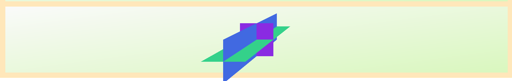
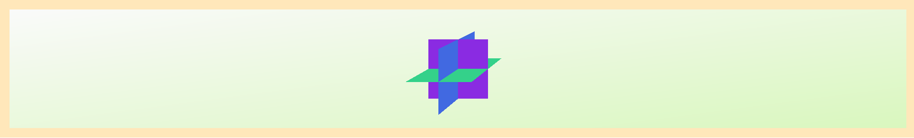
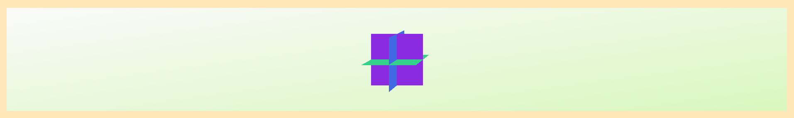
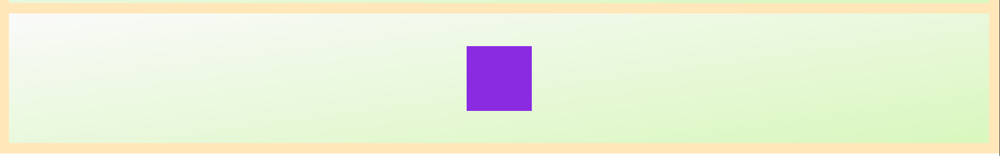
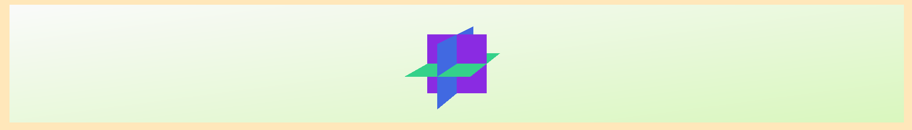
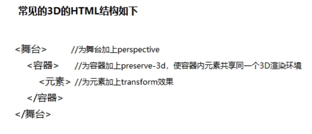

# CSS 3D

## 一、开始

### 1、使用3D

##### 启用 3D 模式

使用`transform-style` 属性， `transform-style` 只有两个值可以选择：

```scss
transform-style: flat; // 默认，子元素将不保留其 3D 位置(2d舞台)
transform-style: preserve-3d; // 子元素将保留其 3D 位置(3d舞台)
```

当指定一个容器的 `transform-style` 属性值为 `preserve-3d` 时，容器的后代元素便会具有 3D 效果。即当容器设置了 `preserve-3d` 后，它的**子元素**就可以相对于父元素所在的平面，进行 3D 变形操作

2d


3d


```scss

.item .content{
    transform-style: preserve-3d;
    /* perspective: 400px; */
}

.item-1 .div-1{
    transform: perspective(200px) rotateY(45deg);
}
.item-1 .div-2{
}
```

##### 视角距离

 **`perspective`**指定了观察者与 z=0 平面的距离，使具有三维位置变换的元素产生透视效果。z>0 的三维元素比正常大，而 z<0 时则比正常小，大小程度由该属性的值决定。

```scss
// perspective 表示观察者的位置（距离）
// 元素没有设置 `perspective` 时，所有后代元素被压缩在同一二维平面上，不存在景深的效果
// 设置 `perspective` 后，将会看到三维效果
perspective: number;
```

在200px观察100px的图形



在500px



在1000px



##### 视角基点

**`perspective-origin`**指定了观察者的位置，用作 [`perspective`](https://developer.mozilla.org/zh-CN/docs/Web/CSS/perspective) 属性的消失点。

个人理解：在xy平面上移动相机


```scss
// `perspective-origin` 表示观察者的角度。
// 默认视角基点是 `perspective` 所在元素的中点，也就是 `perspective-origin: 50% 50%`
// 通过修改`perspective-origin`可以实现从不同角度观察 3D 图形（例如从右上角观察）
perspective-origin: x-axis y-axis;
//perspective-origin: 200px -100px;
```

50%,50%



70% -50%：



### 2、基本属性

##### transform-origin

旋转中心

##### 3D位移

translateZ()函数用于将元素在3D空间沿Z轴进行位移。

```

translateZ(t)
```

- t:表示乙轴移动的偏移量。当其值为正值时，元素向Z轴越移动越近，导致元素变得越大;反之其值为负值时，元素向Z轴越移动越远，导致元素变得越小。

CSS3中还提供了translate3d())函数用于将元素在3D空间进行位移。

```

translate3d(tx.ty.tz)
```

- tx:表示X轴移动的偏移量。
- ty:表示Y轴移动的偏移量。
- tz:表示乙轴移动的偏移量。

##### 3D旋转

rotateZ()的数用于将元素在3D空间沿Z轴进行旋转。

```

rotateZ(a)
```

- a:表示Z轴进行旋转

CSS3中还提供了rotate3d()函数用于将元素在3D空间进行旋转。

```

rotate3d(x,y,z,a)
```

- x:表示X轴旋转的矢量值。
- y:表示Y轴移动的矢量值。
- z:表示乙轴移动的矢量值。
- a:表示旋转的角度值。


##### 3D缩放

scaleZ()函数用于将元素在3D空间沿Z轴进行缩放。

```

scaleZ(s)
```

- s:表示Z轴的缩放向量

CSS3中还提供了scale3d()函数用于将元素在3D空间进行缩放。

```

scale3d(sx,sy,sz)
```

- sx:表示X轴的缩放向量。
- sy:表示Y轴的缩放向量。
- sz:表示Z轴的缩放向量。


### 3、实例



##### 立方体

```scss
/* item-3 */
.item-3 .content{
    perspective-origin: 50% -70%;
}
.item-3 .cube{
    /* transform: rotateY(180deg); */
    
    transform-style: preserve-3d;
    width: 100px;
    height: 100px;

    animation: 'rotateaxiosY' 8s linear 0s infinite;
}

.item-3 .div{
    position: absolute;
    text-align: center;
    line-height: 100px;
    backface-visibility: hidden;
}
.item-3 .div-front{
    background-color: royalblue;
    transform: translateZ(50px);
}
.item-3 .div-after{
    background-color: orange;
    transform: translateZ(-50px) rotateY(180deg);
}
.item-3 .div-left{
    background-color: olivedrab;
    transform: translateX(-50px) rotateY(-90deg);
}
.item-3 .div-right{
    background-color: orchid;
    transform: translateX(50px) rotateY(90deg);
}
.item-3 .div-up{
    background-color: blueviolet;
    transform: translateY(-50px) rotateX(90deg);
}
.item-3 .div-down{
    background-color: yellowgreen;
    transform: translateY(50px) rotateX(-90deg);
}

@keyframes rotateaxiosY {
    100%{
        transform: rotateY(360deg);
    }
}
```

