### 常用CMD命令

| 命令          | 作用                 |
| ------------- | -------------------- |
| 盘符名称+冒号 | 盘符切换             |
| dir           | 查看当前路径下的内容 |
| cd 目录       | 进入目录             |
| cd ..         | 回退到上一级目录     |
| cd \          | 回退到盘符目录       |
| cls           | 清屏                 |
| exit          | 退出                 |


## 面向对象

https://www.bilibili.com/video/BV17F411T7Ao?p=82&vd_source=b3a61f4abb2aa7da517f6cf364e96fdd

### 2 设计对象

```
public class 类名{
	成员变量；成员方法；构造器；代码块；内部类
}
```

### 3 封装

成员方法调用

成员变量使用private，通过`getXXX`和`setXXX`访问与修改，修改时要进行校验

### 4 就近原则和this关键字

### 5 构造方法

#### 特点

1. 方法名与类名完全相同
2. 没有返回值类型
3. 没有具体返回值

#### 执行时机

1. 创建对象时由虚拟机自动调用
2. 每创建一个对象调用一次

#### 注意事项

1. 定义：如果没有自己写构造方法，虚拟机会自动加一个默认的空参数构造方法
2. 重载：带参数（变量赋值）和无参数（变量初始化为默认值）
3. 推荐：无论是否使用，都写带参数和无参数的构造方法

### 6 标准JavaBean

1. 类名见名知义
2. 成员变量采用private修饰
3. 提供至少两个构造方法（无参和全参）
4. 成员方法提供`getxxx`和`setxxx`，以及其他行为

快捷键：`alt+insert`或者`Fn+alt+insert`

插件PTG：快速生成JavaBean类。文件-》设置-》插件

### 7 三种情况的对象内存图

#### 栈、堆、方法区、本地方法栈、寄存器

J8：栈、堆、元空间、本地方法栈、寄存器

- 方法区：字节码文件加载时进入的内存
- 栈内存：方法运行时进入的内存（变量也在这里）
- 堆内存：new出来的东西会在这里开辟空间产生地址

#### 创建对象虚拟机七步操作

1. 加载class文件到方法区
2. 声明局部变量
3. 在堆内存开辟空间
4. 默认初始化
5. 显示初始化
6. 构造方法初始化

### 8 


### 9


### 10

## 字符串

`java.lang.String`类

注意：字符串创建后不能更改

### 构造方法和内存实现

1. 直接赋值。会检查串池String Table内是否已有重复，有的话会复用（在方法区/堆）

2. `new`关键字

   1. 不传入参数
   2. 传入字符串
   3. 字符数组
   4. 字节数组

   

### 字符串比较

- 基本数据类型比的是数据值
- 引用数据类型比较的是地址值

```java
String s1="abc";//串池里加
String s2="abc";//串池复用
s1==s2
```

```java
String s1=new String("abc");//记录堆里的地址值
String s2=new String("abc");//记录串池里的地址值
```

- `boolean equals(String)`方法：比较字符串，考虑大小写
- `boolean equalsIgnoreCase`方法：比较字符串，不考虑大小写

### String 字符串

```java
boolean equals(String);//比较字符串，考虑大小写
boolean equalsIgnoreCase(String);//比较字符串，不考虑大小写
String substring(int beginIndex ,int endIndex);//截取字符串，包头不包尾

 String concat(String string2);//拼接字符串

```

### StringBuilder 字符串容器

string变化每次都要生成一个新的string，很低效；用stringbuilder操作字符串操作会快得多

```java
//构造方法
StringBuilder();
StringBuilder(String str);
//成员方法
StringBuilder append(任意类型);//添加数据，返回对象本身
StringBuilder reverse();//反转容器内的内容
int length();//返回容器内容长度
String toString();//将字符串容器转化成字符串
```

### StringJoiner

JDK8+

```java
//构造
StringJoiner(间隔符号);
StringJoiner(间隔符号，开始符号，结束符号);

```

## ArrayList集合

范型

```java
//构造
ArrayList<String> list=new ArrayList<String>();//JDK7
ArrayList<String> list=new ArrayList<>();//JDK8
//成员
boolean add(E e);//增
boolean remove(E e);//删
E remove(int index);//删
E set(int index,E e);//改
E get(int index);//查
int size();//长度
```

## 工具类

- 不描述任何事物，不描述事物
- 私有化构造方法
- 方法静态


# 进阶

### static 静态变量

### 封装

将事物封装成JavaBean类，并提供相应的属性和方法

### 继承

多种类有相同成员，可写父类用来继承

#### 特点

- 只能单继承，不能多继承，不过可以多层继承

#### 子类能继承父类的哪些内容

|          | 非私有 | 私有               |
| -------- | ------ | ------------------ |
| 构造方法 | 不能   | 不能               |
| 成员变量 | 能     | 能（需要函数调用） |
| 方法     | 能     | 不能               |


#### 继承中成员变量的访问特点

- 就近原则，先局部，后本类成员，后父类成员

#### 继承中成员方法的访问特点

- 就近原则
- 可以用super访问父类方法
- 方法重写
  - 返回小，权限大

#### 继承中构造方法的特点

- 父类中的构造方法不会被子类继承
- 子类中所有的构造方法默认先访问父类中的无参构造，再执行自己

### 多态

- 同一类可以有多种形态

- 表现形式：`父类类型 对象名称 = 子类对象`

- 前提：有继承/实现关系、有父类引用指向子类对象、有方法重写

- 优势：右边对象可以实现解耦合，便于拓展和维护；定义方法时用父类作参，可以接收所有子类对象，便利

- 弊端：不能使用子类的特有功能，要使用需要强转（加instanceof进行判断）

#### 调用成员的特点：

- 变量：编译看左边，运行看左边（子类会继承父类相同变量）

- 方法：编译看左边，运行看右边（子类会覆盖父类相同方法）

### 包

- 作用：文件夹，管理不同功能的java类
- 写法：公司域名反写+包的作用，全部英文小写，见名知义
- 全类名=包名.类名
- 使用同一包、java.lang(java核心包)之外的其他类需要导包
- 使用不同包的同名类需要使用全类名

### final

- 加在方法上：最终方法，不能重写
- 加类上：最终类，不能被继承
- 加在变量上：常量，只能被复制一次（基本数据类型数据不能变；引用数据类型地址值不能变，内部属性值可以变）

### 权限修饰符

- 控制成员能被访问的范围
- 可以修饰成员变量、成员方法、构造方法、内部类
- private、默认（不写）、protected、public（作用范围从小到大）

#### 作用范围

- private：同一类中
- 默认：同一类中、同一包中其他类
- protected：同一类中、同一包中其他类、不同包下的子类
- public：同一类中、同一包中其他类、不同包下的子类、不同包下的无关类（全部）

#### 使用规则

- 一般只用private和public，变量私有，方法公开；
- 特例：方法中的代码来自外界，只供自己使用

### 代码块

类的五大成员：属性、方法、构造方法、代码块、内部类

局部代码块、构造代码块、静态代码块

#### 局部代码块

（已淘汰，现代硬件足够）

```java
public class Test{
    public static void main(String[] args){
        {//局部代码块
            int a=10;
        }//内存释放变量a
        //其他代码，访问不了a
    }
}
```

#### 构造代码块

（逐渐被淘汰，不够灵活）

- 写在成员位置
- 作用：把多个构造方法中重复的代码抽取出来
- 执行时间：创建本类对象时，调用构造方法前

```java
public class Student{
    private String name;
    {//构造代码块
        System.out.println("开始创建对象");//抽取出多个构造方法中重复的代码
    }
    Student(){
        //System.out.println("开始创建对象");
    };
    Student(String name){
        //System.out.println("开始创建对象");
        this.name=name;
    }
}
```

- 代替1：用`this(null,0)`调用其他构造函数内的代码
- 代替2：抽取成成员方法，在构造函数内调用

#### 静态代码块（重点）

- 写在成员位置，格式：`static{}`
- 通过static关键字修饰，随着类的加载而加载，而且自动触发，只执行一次
- 使用场景：在类加载时，做数据初始化

### 抽象类和抽象方法

- 抽象方法：将共性的方法抽取到父类之后。由于每一个子类执行的内容是不一样的，所以在父类中不能确定具体的方法体，该方法就可以定义为抽象方法
- 抽象类：类中存在抽象方法必定为抽象类

作用：

- 抽取共性无法确定方法体
- 强制人子类按某种格式重写

定义格式

```java
public abstract 返回值类型 方法名(参数列表);//抽象方法
public abstract class 类名{};//抽象类
```

- 抽象类不能实例化
- 抽象类中不一定有抽象方法，有抽象方法的类一定是抽象类
- 可以有构造方法
- 抽象类的子类要么重写抽象类中的==所有==抽象方法，要么是抽象类

### 接口

- 用关键字interface定义`public interface 接口名 {}`
- 不能实例化
- 接口和类之间是实现关系，通过implements关键字表示`public class 类名 implements 接口名 {}`
- 接口的子类（实现类）要么重写接口中的==所有==抽象方法，要么是抽象类
- 接口和类的实现关系，可以是单实现，也可以多实现。`public class 类名 implements 接口1，接口2`
- 实现类还可以在继承一个类的同时实现多个接口`public class 类名 extends 父类 implements 接口1，接口2`

成员特点

- 成员变量只能是常量，默认修饰符 public static final（不需要写）
- 没有构造方法
- 成员方法只能是抽象方法，默认public abstract不需要写(JDK8+可以定义有方法体的方法)

### 内部类

类的五大成员：属性、方法、构造方法、代码块、内部类

- 定义：在一个类的里面再定义一个类（对应外部类、外部无关类）
- 使用时机：B类表示的事物是A类的一部分
- 内部类表示的事物是外部类的一部分，内部类单独出现没有任何意义
- 访问特点：内部类可以直接访问外部类成员，包括私有；外部类要访问内部类的成员，必须创建对象

分类

- 成员内部类
- 静态内部类
- 局部内部类
- 匿名内部类

#### 成员内部类

- 写在成员位置，属于外部类的成员
- 可以被一些修饰符修饰，比如：private, 默认, protected, public, static
- JDK16+可以在成员内部类里面定义静态变量，JDK16-不能
- 获取成员内部类的方式： 
  - 内部类被private修饰时，外部类编写方法，对外提供内部类对象
  - 内部类被非私有修饰时，直接创建对象`外部类.内部类 对象名 = 外部类对象（构造函数）.内部类对象(构造函数)`
- 注意内部类和外部类不是继承关系，不能用`super`访问
- 内部类成员变量与外部类成员变量重名时，定义内部类访问方法并使用`outer().this.成员变量名`在外部类内部访问内部类成员变量

#### 静态内部类

- 静态内部类是一种特殊的成员内部类
- 静态内部类只能访问外部类中的静态变量和静态方法，如果想要访问非静态的需要创建对象。
- 创建静态内部类对象的格式：`外部类名.内部类名 对象名 = new 外部类名.内部类名()`
  - 调用非静态方法的格式：先创建对象，用对象调用
  - 调用静态方法的格式：直接调用`外部类名.内部类名.方法名()`

#### 局部内部类

- 内部类定义在方法里面，类似于方法里面的局部变量
- 外界无法直接使用，需要在方法内部创建对象并使用
- 该类可以直接访问外部类成员，也可以直接访问方法内的局部变量

#### 匿名内部类

- 本质是隐藏了名字的内部类

```java
new 类名或接口名(){	//继承/实现，创建对象
    @Override
    重写方法;		 //方法重写，重写接口中的所有抽象方法
}
```

使用场景

- 当方法的参数是接口或者类时，可以传递这个接口的实现类对象，如果实现类只要使用一次，就可以用匿名内部类简化代码

## 阶段项目

GUI：图形化用户页面

- AWT包（会有兼容性、中文乱码问题）
- Swing包

java主要做后端开发


### 鼠标监听

```java
组件.addMouseListener();
@Override void mouseClicked(MouseEvent e){}//点击
@Override void mousePressed(MouseEvent e){}//按下
@Override void mouseReleased(MouseEvent e){}//松开
@Override void mouseEntered(MouseEvent e){}//进入
@Override void mouseExited(MouseEvent e){}//划出
```

### 键盘监听

```java
窗口.addKeyListener();
@Override void keyType(KeyEvent e){}
@Override void keyPressed(KeyEvent e){}//按下
@Override void keyReleased(Key  Event e){int keyCode=e.getKeyCode()}//松开
//abcd键对应ABCD的ASCII码
```


### 程序打包

1. 代码打包成jar
2. jar转换成exe
3. exe+图片+JDK打包成最终的exe

## 一些类

### Math数学类

java.lang.Math, JDK1.0+, 工具类

```java
static double E;//自然对数
static double PI;//圆周率
```

| 方法            | 返回（作用）     |
| --------------- | ---------------- |
| abs(int a)      | 绝对值           |
| ceil(double a)  | 向上取整         |
| floor(double a) | 向下取整         |
| round(float a)  | 四舍五入         |
| max(int a,b)    |                  |
| pow(double a,b) |                  |
| random()        | double [0.0,1.0) |


### System系统类

工具类

计算机中的时间原点：1970/1/1 00:00:00，中国+8h

```java

```

|                                                              |                        |
| ------------------------------------------------------------ | ---------------------- |
| void exit(int status)                                        | 终止虚拟机             |
| long currentTimeMillis()                                     | 返回当前系统的时间毫秒 |
| void arrcopy(数据源数组，起始索引，目的地数组，起始索引，拷贝个数) | 拷贝数组               |
|                                                              |                        |
|                                                              |                        |
|                                                              |                        |
|                                                              |                        |

### Runtime


|                              |                                         |
| ---------------------------- | --------------------------------------- |
| static Runtime getRuntime()  | 当前系统的运行环境对象                  |
| void exit(int status)        | 停止虚拟机                              |
| int                          | 获得的CPU线程数                         |
| long maxMemory()             | JVM能从系统中获取总内存大小（单位byte） |
| long totalMemory()           | JVM已经从系统中获取总内存大小           |
| long freeMemory()            | JVM剩余内存大小                         |
| Process exec(String command) | 运行cmd命令                             |

### Object

顶级父类。所有类没有共性，所以Object没有成员变量，也只有空参构造

|                               |                          |
| ----------------------------- | ------------------------ |
| Object()                      | 空参构造（只有空参）     |
| String toString()             | 返回对象的字符串表示形式 |
| boolean equals(Object obj)    | 比较对象是否相等         |
| protected Object clone(int a) | 对象克隆                 |
|                               |                          |
|                               |                          |
|                               |                          |

### Objects

### BigInteger大数字

整数：byte,short,int,long，占用字节数：1,2,4,8

BigInteger对象一旦创建，内部记录的值不能发生改变

| 方法                                | 作用                                       |
| ----------------------------------- | ------------------------------------------ |
| BigInteger(int num,Radom rnd)       | 构造方法，获取随机大整数（0~2的num次方-1） |
| BigInteger(String val)              | 构造方法，获取指定的大整数                 |
| BigInteger(String val,int radix)    | 构造方法，获取指定进制的大整数             |
| static BigInteger valueOf(long val) | 静态方法获取BigInteger对象，有优化         |
|                                     |                                            |

| 方法                                | 作用                  |
| ----------------------------------- | --------------------- |
| BigInteger add(BigInteger val)      | 加法                  |
| BigInteger subtract(BigInteger val) | 减法                  |
| BigInteger multiply(BigInteger val) | 乘法                  |
|                                     | 除法，获取商          |
|                                     | 除法，获取商和余数    |
|                                     | 比较是否相同          |
|                                     | 次幂                  |
|                                     | 返回较大值/较小值     |
|                                     | 转为int类型，可能溢出 |

### BigDecimal大小数

精确运算小数、表示很大的小数

| 方法                                  | 作用             |
| ------------------------------------- | ---------------- |
| BigDecimal(double val)                | 构造方法         |
| BigDecimal(String val)                | 构造方法         |
| static BigDecimal valueOf(double val) | 静态方法获取对象 |
|                                       |                  |
|                                       |                  |

### 正则表达式

作用：

- 校验字符串是否满足规则
- 在一段文本中查找满足要求的内容

`bool string.matches("正则表达式")`

只能匹配一个字符

| 字符类   | 含义 | 预定义字符 | 含义 |
| -------- | ---- | ---------- | ---- |
| [abc]    |      |            |      |
| [^abc]   |      |            |      |
| [a-zA-Z] |      |            |      |
| [a]      |      |            |      |
|          |      |            |      |
|          |      |            |      |
|          |      |            |      |


- Pattern 正则表达式
- Matcher文本匹配器，在字符串中寻找符合规则的字串

```java
String str="java8vajajava17"
Pattern p=Pattern.compile('java\\d{0,2}');
Matcher m=p.matcher(str);
bool
```


### 爬虫

本地爬虫和网络爬虫

### JDK7时间

### JDK8时间

### 包装类


## Collection

- 列表List：LinkedList, ArrayList
- 集合Set：TreeSet, HashSet
- 双列集合Map：TreeSet, HashMap

### Set

Set：元素无序、不重复、无索引


### 遍历

通用的遍历，同样适用于无索引

#### 迭代器Interator

Collection集合获取迭代器

```java
Interator<E> interator();
```

成员方法

```java
boolean hasNext();//判断单前位置是否有元素
E next();//获取当前位置的元素并移动迭代器对象到下一个位置

```

eg

```java
List<String> List=...;
Interator<String> interator=list.interator();
while(interator.hashNext()){
    String str=interator.next();
    if(str.equals("xxx")){
        interator.remove();//调用迭代器的方法进行删除
    }
}
```

注意：

- 遍历完毕指针不会复位
- 遍历过程不能用集合的方法进行增加或删除
- 需要用迭代器移除

#### 增强for遍历

简化的迭代器写法，用于单列集合和数组

```java
//idea快速生成：集合名.for
for(E e : 集合名)
```

e在循环的过程中依次表示集合中的每一个数据

细节

- 修改for中的变量无效

#### Lamdba表达式遍历

JDK8+

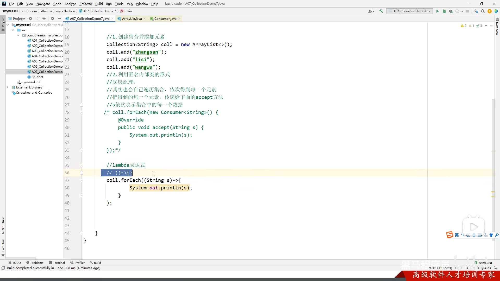


```java
List<String> List=...;

```

### List

特点：有序、有索引、可重复

### 泛型

java中的泛型是伪泛型，在编译阶段就擦除泛型

作用：统一数据类型，把运行时期的问题提前到编译时期

不能写基本数据类型（不能转成Object），写泛型后传递数据只能传该类型或子类，不写泛型类型默认是是Object

泛型类、泛型方法、泛型接口

#### 泛型通配符

泛型只能传递指定类型（不能传子类、父类）

`? extends E`可以传E或E的子类

`? super E`可以传E或E的父类

```java
 void xxxmethod(ArrList< ? extends E> list) 
```

可以限定泛型的范围


# 下部 Java SE

### 双列集合

双列集合内元素成对，一一对应，称为键值对（对象）

特点

- 一次存一对数据，分别为键和值
- 键不能重复，值可能重复
- 键值一一对应，每个键只能找到自己对应的值
- 键值对（对象），在java中叫做Entry对象

### Map

- Map是双列集合的顶部接口，它的功能是全部双列集合都可以继承使用的


| 方法                                | 说明                                                     |
| ----------------------------------- | -------------------------------------------------------- |
| V put(K key,V value)                | 添加元素(如果键值已经存在，覆盖并返回原值，否则返回null) |
| V remove(Object key)                | 根据键删除键值对                                         |
| void clear()                        | 移除所有的键值对                                         |
| boolean containsKey(Object key)     | 判断集合是否包含指定的键                                 |
| boolean containsValue(Object value) | 判断集合是否包含指定的值                                 |
| boolean isEmpty()                   | 判断集合是否为空                                         |
| int size()                          | 集合的长度（键值对的个数）                               |

```java
Map<String,String> m = new HashMap<>();
m.put("123","ssb");
```

遍历方式

1、键找值

```java
Set<String> Keys = map.keySet();//把键放入单列集合
for(String key : Keys){			//使用增强for遍历单列集合
    String value = map.get(key);//根据键找值
}
```

2、键值对

```java
Set<Map.Entry<String,String>> entries = map.entrySet();//将键值对对象放入集合
for(Map.Entry<String,String>entry : entries){
    String key = entry.getKey();
    String value = entry.getValue();
}
```

3、Lambda表达式

```java
map.forEach(new BiConsumer<String,String>(){
    @Override
    public void accept(String key,String String value){
        
    }
});
//简化
map.forEach((key,value)->{
    xxx;
})
```

#### HashMap


特点

- Map的一个实现类
- 直接使用Map里的方法，没有额外要学的特有方法
- 特点由键决定：==无序、不重复、无索引==
- 和HashSet底层原理一样，都是哈希表结构

插入时生成Entry键值对对象，根据键计算出哈希值；链表长度超过8&&数组长度超过64时，链表会自动转化为红黑树

如果键是自定义对象，要重写hashCode和equals方法

##### LinkedHashMap

由键决定：==有序、不重复、无索引==（存储和取出的元素顺序一致）

原理：底层数据结构依然是哈希表，只是每个键值对元素又额外多了一个双链表记录存储的顺序

```java
//创建集合
LinkedHashMap<String,Integer> lhm=new LinkedHashMao<>();
//添加元素
lhm.put("a",111);
lhm.put("a",222);
lhm.put("b",222);
//打印集合
System.out.printlm(lhm);
```

#### TreeMap

- 和Treeset一样，底层是红黑树
- 由键决定特性：不重复、无索引、可排序（对键进行排序）
- 默认按键的大小从小到大进行排序，也可以自己规定键的排序规则
  - 实现Comparable接口
  - 创建集合时传递比较器对象

```java
Tree<Integer,String> tm =new TreeMap<>(new Comparator<Integer>{
    @Override
    public int compare(Integer o1,Integer o2){
        //o2为已经存在的元素
        return o2-o1;
    }
})
```

### Collections工具类


### 异常

异常：代表程序出现的问题


#### Error

系统级错误

#### Exception

程序可能出现的问题

```java
public class void main(String[] args)throws ParseException{}
```

##### 运行时异常

比如：数组越界

##### 编译时异常

比如：日期解析异常；在编译阶段必须处理

作用：

- 查询bug的关键参考信息
- 方法内部的返回值，确定代码的运行情况

处理：

- JVM默认：把异常名称、异常原因、及异常出现的位置 等信息输出在控制台，并停止程序运行
- 捕获异常：try{可能出现异常的代码}catch(异常类名，变量名){处理异常的代码}

### BIO、NIO

#### File类

表示一个文件/文件夹路径

构造函数

```java
public File(String pathname);
public File(String parent,String child);
public File(File parent,String child);
```

windows路径分割符为\，Linux路径分割符为/


#### 字节流

##### FileOutputStream

```java
FileOutputStream f=new FileOutputStream(String 路径);
//如果文件不存在但是父级路径存在，会创建一个新的文件；如果文件已经存在，会清空原有文件
f.write(int 参数);//字符编码，一次写一个
f.write(byte[] b)//一次写一个字节数组
f.write
f.close();
```


1. 该函数的返回值为int数值，表示读取的字符对应的ascii码,当返回为-1表示读取到文件末尾;
2. 返回读入缓冲区的字节总数，到末尾返回-1
3. off表示目标数组b中的起始偏移量，也就是从第几个下标开始写入数组，len表示写入数组的长度；

##### FileInputStream

```java
FileInputStream fis=new FileInputStream("xxx\\xxx.txt");//创建对象，打开资源
int b1=fis.read();//读取，读取一个字节（英文字符会变成ASCII码）
fis.close();//释放资源
```

- 文件不存在直接报错
- 一次读一个字节，读一个字节移动一次指针
- 读到末尾`read`返回`-1`

循环读取

```java
FileInputStream fis=new FileInputStream("xxx\\xxx.txt");//创建对象，打开资源
while(b=fis.read()!=-1){
    ...
}
fis.close();//释放资源
```

拷贝文件（小文件）

```java
//1、创建对象
FileInputStream fis=new FileInputStream("xxx\\xxx.mp4");
FileOutoutStream fos=new FileOutputStream("xxx\\xx0.mp4");
//2、拷贝
//核心思想：边读边写
int b;
while((b=fis.read())!=-1){
    fos.write(b);
}
//3、释放资源
//规则：先开的后关闭
```

弊端：慢，一次一字节

FileInputStream一次读多个字节

- public int read(byte[] buffer)
- 一次读一个字节数组的数据，每次读取会尽可能把数组装满
- 1024的整数倍、1024\*1024\*5

```java
//1、创建对象
FileInputStream fis=new FileInputStream("xxx\\xxx.mp4");
FileOutoutStream fos=new FileOutputStream("xxx\\xx0.mp4");
//2、拷贝
//核心思想：边读边写
int len;
byte[] bs=new byte[1024*1024*5];
while((len=fis.read(bs))!=-1){
    fos.write(bs,0,len);
}
//3、释放资源
//规则：先开的后关闭
```

捕获异常

```java
try{}//尝试执行
catch{}//尝试失败时执行
finally{}//一定执行，除非JVM退出
```

基本做法：手动释放资源

```java
try{
    FileOutputStream fos=...;
    fos.write(97);
    //可能出现异常的代码
}catch(IOException e){
    e.printStackTrace();
    //异常的处理代码
}finally{
    fos.close();
    //执行所有资源释放操作
}
```

JDK7方案：

```java
try(创建流对象1;创建流对象2){
    可能出现异常的代码;
}catch(异常类名 变量名){
    异常的处理代码;
}//资源用完自动释放
```

JDK9方案：

```java
创建流对象1;
创建流对象2;
try(流1;流2){
    可能出现异常的代码;
}catch(异常类名 变量名){
    异常的处理代码;
}//资源用完最终自动释放
```

#### 字符集详解

##### ASCII

一个字符一个字节

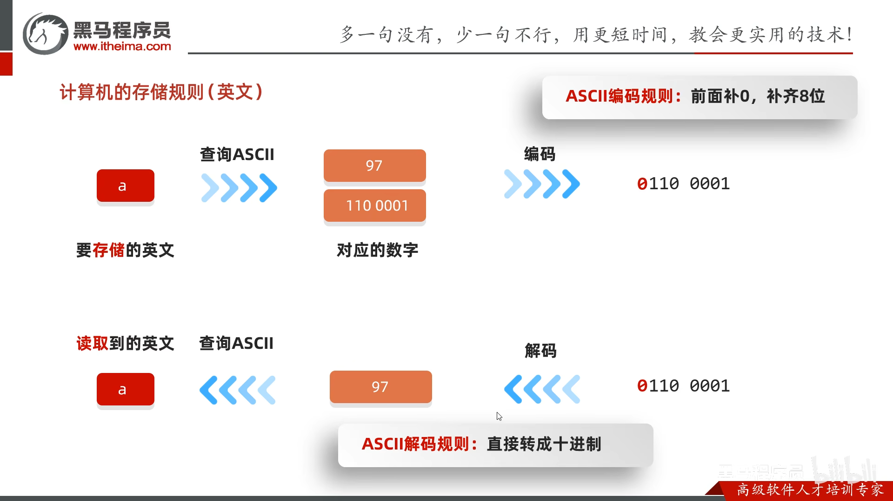

##### GBK


英文兼容ASCII，首位是0，汉字用两个字节，首位是1

##### Unicode

UTF：Unicode Transfer Format

UTF-8：1~4字节

UTF-16：2~4字节

UTF-32编码规则：4字节

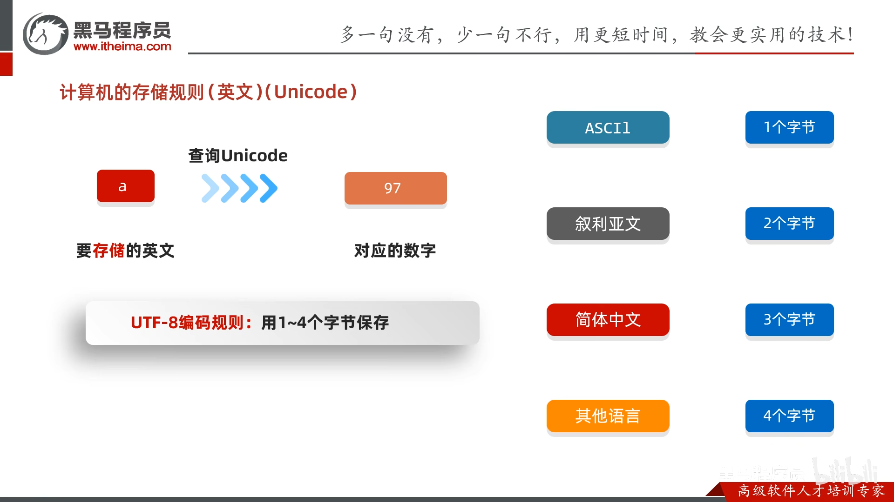

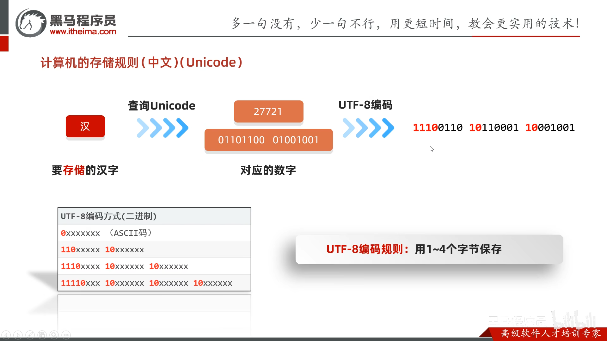


##### 乱码原因

- 读取数据未读完整个汉字
- 编码和解码方式不统一


#### 编码和解码

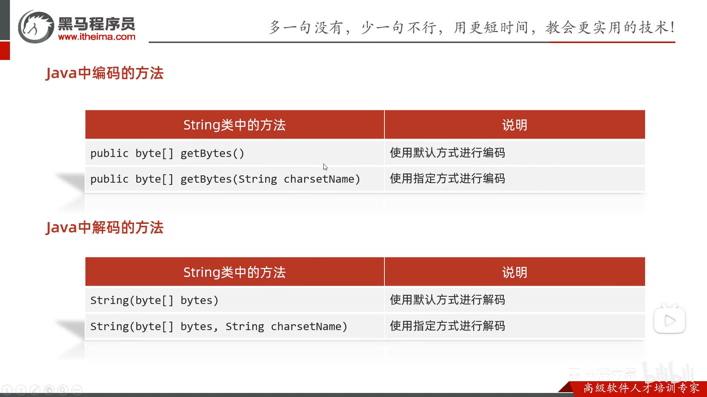

编码


#### 字符流

- 字符流的底层其实是字节流
- 字符流 = 字节流 + 字符集
- 特点：
  - 输入流：一次读一个字节，遇到中文时，一次读多个字节
  - 输出流：底层会把数据按照指定的编码方式进行编码，变成字节再写到文件中
- 使用场景：对于纯文本文件进行读写操作

##### FileReader

1、创建字符输入流对象

| 构造方法                           | 说明                       |
| ---------------------------------- | -------------------------- |
| public FileReader(File file)       | 创建字符输入流关联本地文件 |
| public FileReader(String pathname) | 创建字符输入流关联本地文件 |

2、读取数据

| 成员方法                       | 说明                                                         |
| ------------------------------ | ------------------------------------------------------------ |
| public int read()              | 读取数据，返回编码，读到末尾返回-1，读到中文返回的是解码并转码成十进制（可以char强转成中文） |
| public int read(char[] buffer) | 读取多个数据，返回xxx，读到末尾返回-1                        |

- 按字节进行读取，读到中文，一次读取多个字节并解码；返回一个整数
- 读到文件末尾返回`-1`

3、释放资源`public void close();`

##### FileWriter 

1、创建字符输出流对象


- 字符串/File对象表示的路径
- 如果文件不存在但父级路径存在会创建一个新的文件
- 如果文件已经存在则会清空文件，除非打开续写开关

2、写数据


- 如果write的参数是整数，写到本地文件中的是整数在字符集上对应的字符

3、释放资源

- 使用完要释放资源`close()`

#### 字符缓冲流

Buffer

#### 转换流


#### 序列化流

#### 字节打印流

#### 字符打印流

#### 解压缩流

#### 压缩流（单文件）

#### 压缩流（多文件）

#### 常用工具包

#### 网络爬虫

### 多线程&JUC

#### 概念

线程、进程

使用场景：耗时操作、聊天软件、后台服务器

并发：同一时刻，多个指令在单个CPU上交替执行

并行：同一时刻，多个指令在多个CPU上同时执行

#### 实现

##### 1、继承Thread类

定义类继承Thread、重写run方法、创建对象并启动

```java
public class MyThread extends Thread{//定义类继承Thread
    @Override
    public void run(){
        System.out.println(getName());
    }
}
```

```java
Mythread t1=new MyThread();
t1.setName("xxx");
t1.start();
```


##### 2、实现Runnable接口

定义一个类实现Runnable接口、重写里面的run方法、创建自己类的对象、创建一个Thread类的对象，开启线程

```java
public class MyRun implements Runnable{//实现Runnable接口
    @Override
    public void run(){//重写里面的run方法
        Thread t=Thread.currentThread();
        System.out.println(t.getName());
    }
}
```

```java
MyRun mr=new MyRun();//创建自己类的对象
Thread t1=new Thread(mr);//创建一个Thread类的对象
t1.start();//开启线程
```


##### 3、Callable接口和Future接口实现

特点：可以获取到多线程运行的结果

实现Callable接口，重写call，创建MyCallable对象（任务），创建FutureTask对象（管理运行结果），创建Thread对象并启动线程

```java
public class MyCallable implements Callable<E>{
    @Override
    public E call() throws Exception{//有返回值
        return e;
    }
}
```

```java
MyCallable mc=new MyCallable();
FutureTask<Integer> ft =
```


#### 成员方法

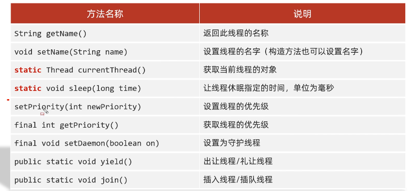

| 方法                              | 说明                 |
| --------------------------------- | -------------------- |
| String getName()                  | 返回此线程的名称     |
| void setName(String name)         | 设置线程的名字       |
| ==static== Thread currentThread() | 获取当前线程的对象   |
| ==static== void sleep(long time)  | 让线程休眠指定的毫秒 |
| setPriority(int newPriority)      | 设置线程的优先级     |
| final int getPriority()           | 获取线程的优先级     |
| final void setDaemon(boolean on)  | 设置为守护线程       |
| public static void yield()        |                      |
|                                   |                      |

#### 线程的优先级

非抢占式调度与抢占式调度

优先级范围：1~10，优先级越大，抢占到的概率越大

优先级默认值为5，主线程默认为5

getPriority,setPriority


##### 守护线程（备胎线程）

当其他的非守护线程执行完毕后，守护线程会陆续结束

eg、聊天为非守护、下载文件为守护线程


##### 礼让线程


##### 插入线程


#### 生命周期

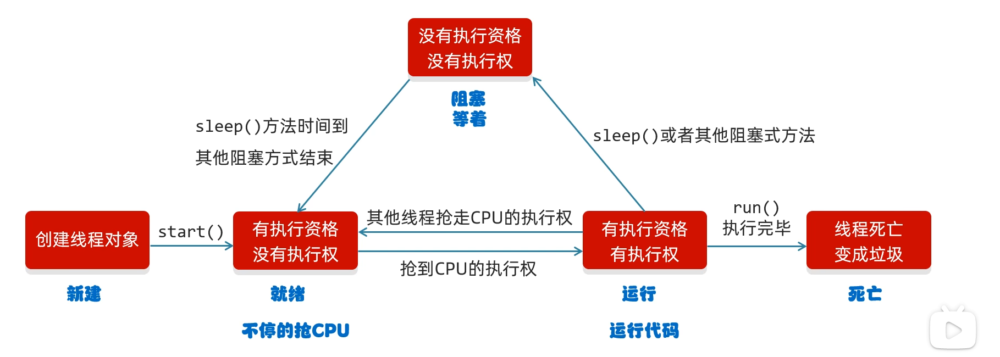


#### 安全问题

##### 同步代码块

```java
static Object obj=new Object;
synchronized (锁对象){}
```


##### 同步方法

```java
修饰符 synchronized 返回值类型 方法名(方法参数){}
```

锁住方法里所有方法，锁对象不能自己指定

非静态方法的锁：this，静态方法的锁：当前类的字节码文件对象


##### Lock锁

 


##### 死锁


##### 等待唤醒机制


常用方法

```java
void wait();
void notify();//随机唤醒单个线程
void notifyAll();//唤醒所有线程
```

多线程代码步骤：

1. 循环
2. 同步代码块
3. 判断共享数据是否到末尾
4. 执行核心逻辑

###### 消费者

```java
public class Foodie extends Thread{
    @Override
    public void run(){
        while(true){
            synchronized(Desk.lock){
                if(Desk.count==0){
                    break;
                }else{
                    //判断桌子上是否有面条
                    if(Desk.foodFlag==0){
                        try{
                            Desk.lock.wait();//当前线程和锁进行绑定
                        }catch(InterruptedExpection e){
                            e.printStackTrace();
                        }
                    }else{
                        System.out.println("1");
                        Desk.lock.notifyAll();//唤醒厨师
                        Desk.count--;
                        Desk.foodFlag=0;
                    }
                }
            }
        }
    }
}
```

###### 生产者

```java
public class Cook extends Thread{
    @Override
    public void run(){
        while(true){
            synchronized(Desk.lock){
                if(Desk.count==0){
                    break;
                }else{
                    if(Desk.foodFlag==0){
                        System.out.println("");
                        Desk.foodFlag=1;
                        Desk.lock.notifyAll();
                    }else{
                        Desk.lock.wait(); 
                    }
                }
            }
        }
    }
}
```

###### 第三者

```java
public class Dask{
    public static int foodFlag=0;
    public static int count=10;
    public static Object lock = new Object();
}
```

运行代码

```java
Cook c=new;
Foodie f=new;
c.setName("厨师");
f.setName("吃货");
c.start();
f.start();
```

##### 阻塞队列实现

接口：Iterable(可用迭代器/增强循环)----Collection(单列集合)----Queue(队列)----BlockingQueue(阻塞队列)

实现类：ArryBlockingQueue(有界)，LinkBlockingQueue(无界)

用了阻塞队列就不用自己加锁了


#### 线程的状态


### 网络编程

网络通信协议下，不同计算机上运行的程序，进行的数据传输

`java.net`包

BS：浏览器/服务器

不需要开发客户端，只需要页面+服务端；用户无需下载安装；

CS：客户端/服务器

画面优美，用户体验好；需要开发客户端/服务端；下载更新麻烦


IP：设备在网络中的地址

端口号：应用程序在设备中的标识

协议：数据在网络中传输的规则

UDP、TCP、http、https、ftp


#### `InetAddress`类

子类：`Inet4Address``Inet6Address`

没有对外构造方法，只能通过静态方法获取

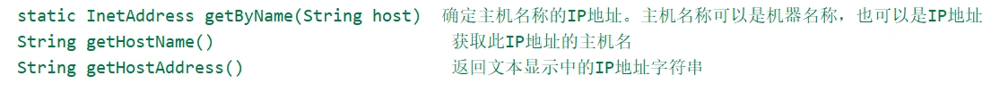

```java
static InetAddress getByName(String host);
String getHostName();
//如果局域网内找不到该主机，则会返回IP地址
String getHostAddress()

```


端口号：

范围：0-65535；


协议


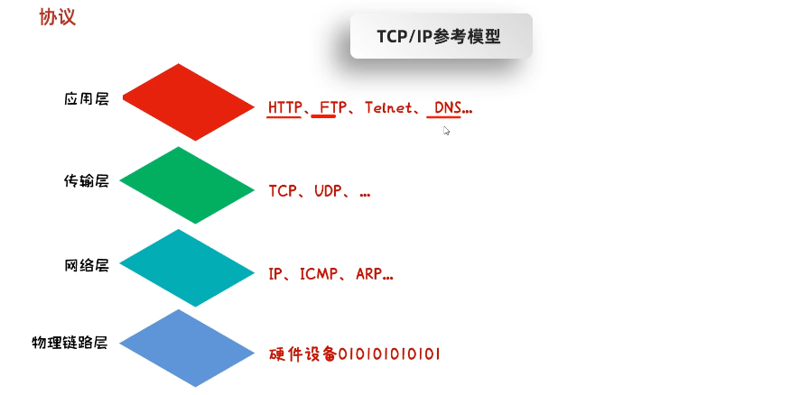


#### UDP协议

##### 发送数据

```java
//创建对象（快递公司），绑定端口号
DatagramSocket ds = new DatagramSocket(12345);
//没写端口号，从可用端口里随机取一个
//2、打包数据
String str = "hello";
byte[] bytes = str.getBytes();
InetAddress address = InetAddress.getByName("127.0.0.1");
int port = 10086;v 
DatagramPack dp = new DatagramPack(bytes,bytes.length,address,port);
//3、发送数据
ds.send(dp);
//4、释放资源
ds.close();

```

##### 接收数据

```java

DatagramSocket ds = new DatagramSocket(10086);
//一定要绑定端口

byte[] bytes = new byte[1024];
DatagramPack dp = new DatagramPacket(bytes,bytes.length);
//2、接收数据包(阻塞的方法)
ds.receive(dp);
//3、解析数据包
byte[] data=new byte[1024];
int len=dp.getLength();
System.out.println(new String(data,0,len));
//4、
ds.close();
```

##### 单播、组播、广播

组播地址：224.0.0.0\~239.255.255.255，其中224.0.0.0\~224.0.0.255为预留端口

广播地址：255.255.255.255

###### 组播

发送

```java
MulticastSocket ms = new MulticastSocket();
```

接收

```java
MulticastSocket ms = new MulticastSocket(10000);
InetAddress address =InetAddress.getByName("224.0.0.2");
ms.joinGroup(address);//将本机添加到224.0.0.2的组播地址
```

###### 广播

单播地址发送代码地址改成255.255.255.255即可


#### TCP通信协议

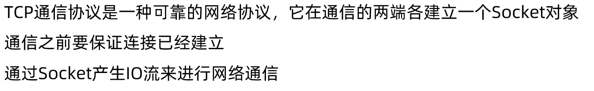

##### 客户端

发送数据

```java
//1、创建对象，链接服务端，连不上会报错
Socket socket = new Socket("127.0.0.1",25565);
//2、从连接通道中获取输出流
OutputStream os = socket.getOutputStream();
//写数据
os.write("hello ".getBytes());
//3
//os.close();//IO流可以不手动关
socket.close();
```


##### 服务端


接收数据

```java
//1、创建对象
ServerSocket ss = new ServerSocket(10000);
//2、监听客户端链接
Socket socket = ss.accept();
//3、从连接通道中获取输入流
InputStream is=socket.getInputStream();
int b;
while((b=is.read())!=-1){
    System.out.print(b);
}
//4、释放资源
socket.close();
ss.close();

```

读中文

```java
//1、创建对象
ServerSocket ss = new ServerSocket(10000);
//2、监听客户端链接
Socket socket = ss.accept();//等待链接
//3、从连接通道中获取输入流
InputStream is=socket.getInputStream();
InputStreamReader isr=new InputStreamReader(is);//转化成字符流
BufferedReader br =new BR(isr);//缓冲流提高效率
//缓冲流提高效率
int b;
while((b=br.read())!=-1){
    System.out.print(b);
}
//4、释放资源
socket.close();
ss.close();
```


三次握手链接，四次挥手断开

##### 三次握手

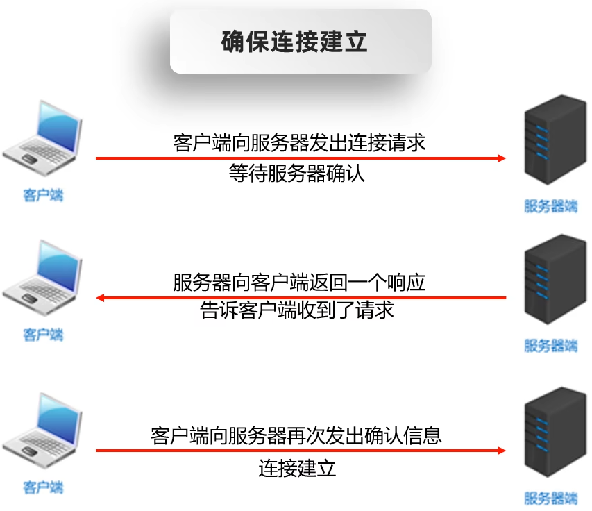

##### 四次挥手

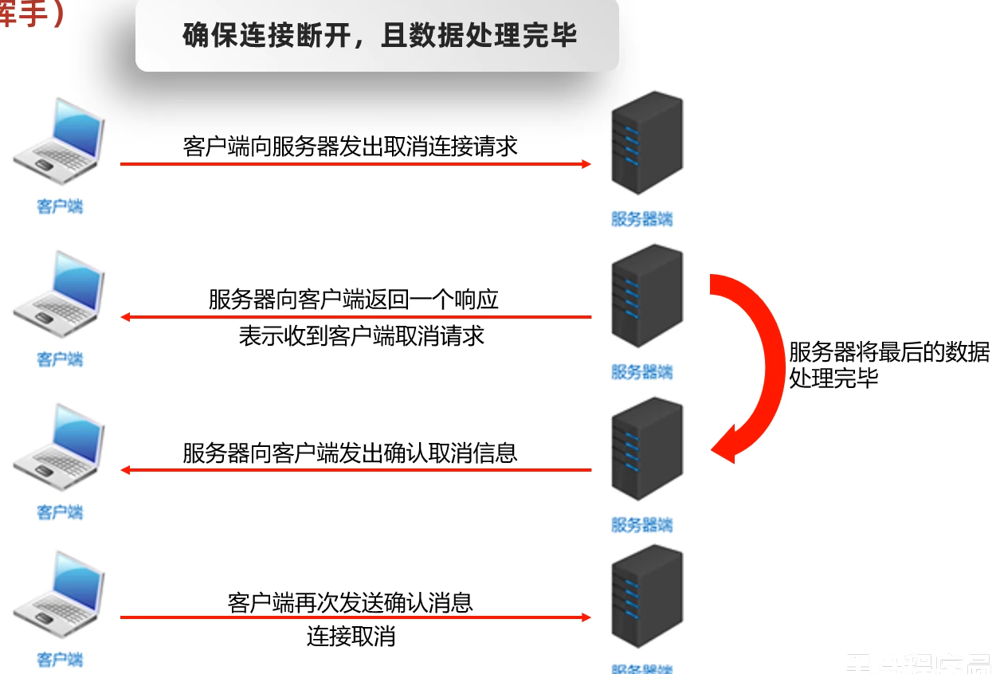


### 聊天软件

### 反射

反射允许对封装类的字段，成员变量和构造方法的信息进行变成访问


获取Class对象

```java
Class xxx = Class.forName("全类名");
Class xxx = Class xxx = 类名.class;
Class xxx = 对象.getClass();
```

获取构造方法

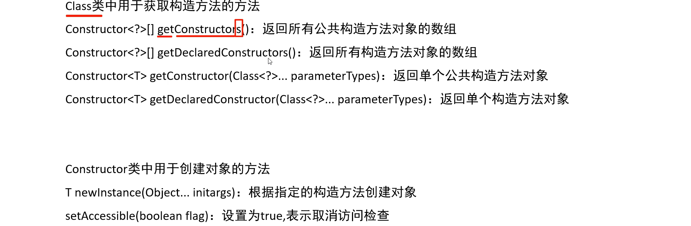

```java
//Class
Constructor<?>[] getConstructors();
Constructor<?>[] getDeclaredConstructors();
Constructor<?> getConstructor(Class<?>... parameterTypes);
Constructor<?> getDeclaredConstructor(Class<?>... parameterTypes);
//Constructor
T newInstance(Object...initargs);
setAccessible(boolean flag);
```

获取成员变量


```java
//Class
Field[] getFields();


//Field
void set(Object obj,Object value);
Object get(Object obj);
```

获取成员方法


```java
//Class


//Method


```

反射的作用

- 获取一个类里所有的信息，获取到后再执行其他业务逻辑
- 结合配置文件动态创建对象并调用方法


### 枚举

### 设计模式

