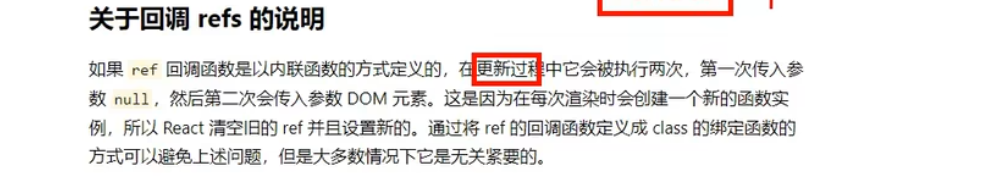
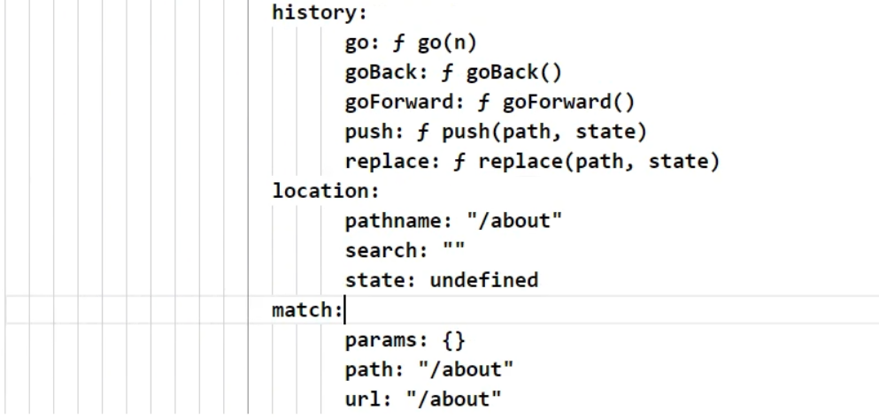
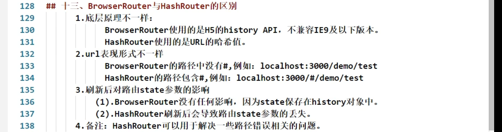
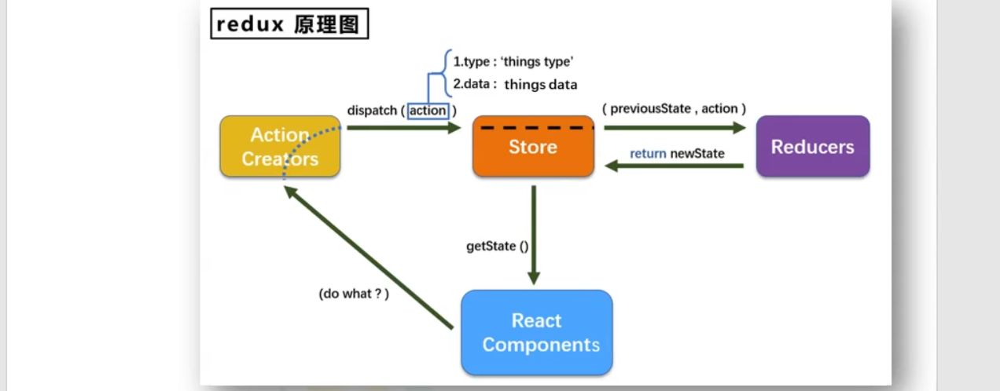
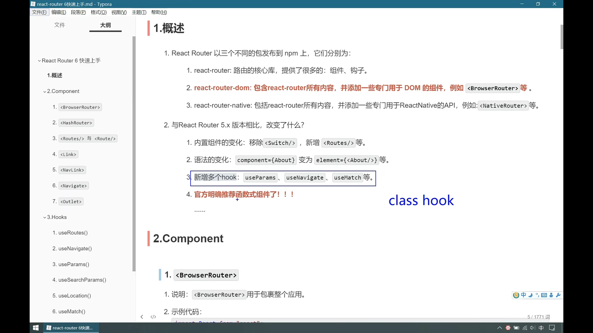

# React学习笔记

## 一、类式组件

#### state属性

#### props属性

#### ref属性

组件内的标签，可以用来标识自己


###### 字符串形式

存在效率问题，不推荐使用

```jsx
<input placeholder='name' ref="input1"></input>
```

在`组件实例.refs.xxxf`访问

```js
const {input1}=this.refs
```

###### 回调函数形式

函数：将当前节点写到组件实例上

```jsx
<input placeholder='email' ref={ currentNode =>{this.input2=currentNode} }></input>
```

回调执行次数问题：



###### 使用createRef

（ref最新api）

获取ref容器

```js
input1=React.createRef();
```

绑定节点

```jsx
<input placeholder='name' ref={this.input1}></input>
```

读取数据

```js
this.input1.current.value
```


## 二、应用

### 脚手架

#### 安装

```
npm i -g create-react-app
```

创建

```
create-react-app 项目名
```

#### 脚手架配置代理

##### 单个配置

在package.json加

```js
"proxy":"http://xxx.xxx"
```

##### 多个配置

src/setupProxy.js

```js
const proxy=require('http-proxy-middleware')
module.exports=function(app){
    app.use(
        proxy('/api',{
            	target:"http://movie.douban.com",
               	changeOrigin:true,
               	pathRewrite:{'^/api':''},
        })
    )
}
```

#### 项目打包

```bash
npm build
```


### 消息订阅与发布

##### 加载

```js
import PubSub from 'pubsub-js'
```

##### 订阅

```js
var token=PubSub.subscribe('消息名',(msg,data)=>{});
```

##### 取消订阅

```js
PubSub.unsubscribe(token);//取消一个订阅
PubSub.unsubscribe(回调)；//取消一个函数对应的所有订阅
```

##### 发布

```js
PubSub.publish('消息名',data);
```


## 三、ajax

### fetch发请求

fetch是window内置的，和xhr同级，不使用xhr发送请求

fetchAPI是Promise风格设计，解决了xhr不符合关注分离的原则

兼容性不高，老版本浏览器不行

```js
fetch(url,{})
    .then(
        (res)=>{return response.json()},//链接服务器成功（非200的状态码也一样）
        (err)=>{return new Promise()}
    )
	.then(
    	(res)=>{},//获取数据成功（200）
    	(err)=>{}
	)
```

```js
//统一处理错误
fetch(url,{})
    .then(
        (res)=>{return response.json()},//链接服务器成功（非200的状态码也一样）
    )
	.then(
    	(res)=>{},//获取数据成功（200）
	)
	.catch(err=>{})
```


```js
async()=>{
    try{
        const response=await fetch(url)
        const data=await response.json()//promise实例
    }catch(e){

    }
}
```

## 四、路由

### 路由Router5

```js
react-router-dom@5
```

##### 基本使用

- 根放HashRouter/
- 导航区写Link
- 展示区写Route

##### 路由组件与一般组件

写法

- 路由组件`<Route path component/>`
- 一般组件`<Demo></Demo>`

props

- 路由组件默认接受三个属性
  - history对象
  - location对象
  - match对象
- 一般组件：自行指定



存放

- 路由组件：pages
- 一般组件：components

##### NavLink和封装

点击链接后应用样式

```css
<NavLink activeClassName="xxx"></NavLink>
```

封装NavLink成组件，避免重复样式：样式写死，props传入to；标签体通过this.props.children传入内容

##### Switch

注册路由的时候，在Switch内的Route匹配到一个就不会继续匹配下去了。单一匹配，提高效率

##### 解决多级路径样式丢失问题

原因：多级路径路由导致样式文件路径出错，返回index.html

解决：

1. `./`改写成`/`
2. 使用%PUBLIC_URL%获取public文件夹位置，只限router
3. 使用hashRouter

##### 模糊匹配和严格匹配

默认模糊匹配，Link尾部给多了可以匹配上

严格匹配`<Route exact />`，不要随便开，有时候可能会出现无法匹配二级路由的问题

##### Redirect

重定向

`<Redirect to="/about"/>`

写在末尾作为默认值

##### 嵌套路由

路径要写完整路径

##### 传递参数

###### params参数

路径传入：

```js
{`xxx/xxx/abc=${a}`}
```

在注册路由route处声明接收参数

```jsx
<Route path="xxx/:id" ../>
```

访问数据

```js
props.match.params.id
```

###### search参数

路径传入：

```js
xxx.xxx?abc=a
```

路由无需声明接收

```
props.history.location.search
```

数据是？xxx=xx的形式，需要自行转化

引入querystring库转化

```js
import qs from 'querystring'
qs.stringify(obj)
qs.parse(str)
```

###### state参数

传入对象

```js
to={{pathname:'xxx.xxx',state:{}}}
```

无需声明接收

访问数据

```
props.history.location.state
```

##### push和replace

link里加replace

##### 编程式路由导航

this.props.history.push('xxx/xxx')

this.props.history.replace('xxx/xxx')

携带state参数

this.props.history.push('xxx/xxx',{})

this.props.history.replace('xxx/xxx',{})

this.props.history.push('xxx/xxx')

this.props.history.go(-1)

goBack()

goForward()

##### withRouter

在非路由组件里操作路由

```js
import {withRouter} from 'react-router-dom'
一般组件............
export default withRouter(一般组件)
```

把一般组件加工成路由组件,让一般组件具有路由组件的API

BrowserRouter和HashRouter




## 五、UI组件库

和vue类似，略

## 六、Redux

#### redux

用于集中式状态管理的JS库（不是react插件库）

不用时困难才用

##### 工作流程



##### 安装

```bash
# 核心库
npm install redux
# 简化工具
npm install @reduxjs/toolkit
#both
npm install @reduxjs/toolkit react-redux
```

创建应用模板

```bash
npx create-react-app my-app --template redux
```


#### 基本使用

https://cn.redux.js.org/tutorials/quick-start

- 使用`configureStore`创建 Redux store

  - `configureStore` 接受 `reducer` 函数作为命名参数
  - `configureStore` 使用的好用的默认设置自动设置 store

- 为 React 应用程序组件提供 Redux store

  - 使用 React-Redux `<Provider>` 组件包裹你的 `<App />`
  - 传递 Redux store 如 `<Provider store={store}>`

- 使用 `createSlice` 创建 Redux "slice" reducer

  - 使用字符串名称、初始状态和命名的 reducer 函数调用“createSlice”

  - Reducer 函数可以使用 Immer 来“改变”状态
  - 导出生成的 slice reducer 和 action creators

- 在 React 组件中使用 React-Redux `useSelector/useDispatch` 钩子

  - 使用 `useSelector` 钩子从 store 中读取数据

  - 使用 `useDispatch` 钩子获取 `dispatch` 函数，并根据需要 dispatch actions

###### 1.创建Redux store

store.js

```js
import { configureStore } from '@reduxjs/toolkit'
import counterReducer from '../features/counter/counterSlice'

export default configureStore({
  reducer: {
    counter: counterReducer
  }
})
```

###### 2.在react中导入store

index.js

```jsx
import React from 'react'
import ReactDOM from 'react-dom'
import './index.css'
import App from './App'
import store from './app/store'
import { Provider } from 'react-redux'

ReactDOM.render(
  <Provider store={store}>
    <App />
  </Provider>,
  document.getElementById('root')
)
```

###### 3.创建 Redux State Slice

features/counter/counterSlice.js

```js
import { createSlice } from '@reduxjs/toolkit'

export const counterSlice = createSlice({
  name: 'counter',
  initialState: {
    value: 0
  },
  reducers: {
    increment: state => {
      // Redux Toolkit 允许我们在 reducers 写 "可变" 逻辑。它
      // 并不是真正的改变状态值，因为它使用了 Immer 库
      // 可以检测到“草稿状态“ 的变化并且基于这些变化生产全新的
      // 不可变的状态
      state.value += 1
    },
    decrement: state => {
      state.value -= 1
    },
    incrementByAmount: (state, action) => {
      state.value += action.payload
    }
  }
})
// 每个 case reducer 函数会生成对应的 Action creators
export const { increment, decrement, incrementByAmount } = counterSlice.actions

export default counterSlice.reducer
```

###### 4.在 React 组件中使用 Redux 状态和操作

```jsx
import React from 'react'
import { useSelector, useDispatch } from 'react-redux'
import { decrement, increment } from './counterSlice'
import styles from './Counter.module.css'

export function Counter() {
  const count = useSelector(state => state.counter.value)
  const dispatch = useDispatch()

  return (
    <div>
      <div>
        <button
          aria-label="Increment value"
          onClick={() => dispatch(increment())}
        >
          Increment
        </button>
        <span>{count}</span>
        <button
          aria-label="Decrement value"
          onClick={() => dispatch(decrement())}
        >
          Decrement
        </button>
      </div>
    </div>
  )
}
```

#### 基础示例

```js
import { createStore } from 'redux'

/**
 * 这是一个 reducer 函数：接受当前 state 值和描述“发生了什么”的 action 对象，它返回一个新的 state 值。
 * reducer 函数签名是 : (state, action) => newState
 *
 * Redux state 应该只包含普通的 JS 对象、数组和原语。
 * 根状态值通常是一个对象。 重要的是，不应该改变 state 对象，而是在 state 发生变化时返回一个新对象。
 *
 * 你可以在 reducer 中使用任何条件逻辑。 在这个例子中，我们使用了 switch 语句，但这不是必需的。
 * 
 */
function counterReducer(state = { value: 0 }, action) {
  switch (action.type) {
    case 'counter/incremented':
      return { value: state.value + 1 }
    case 'counter/decremented':
      return { value: state.value - 1 }
    default:
      return state
  }
}

// 创建一个包含应用程序 state 的 Redux store。
// 它的 API 有 { subscribe, dispatch, getState }.
let store = createStore(counterReducer)

// 你可以使用 subscribe() 来更新 UI 以响应 state 的更改。
// 通常你会使用视图绑定库（例如 React Redux）而不是直接使用 subscribe()。
// 可能还有其他用例对 subscribe 也有帮助。

store.subscribe(() => console.log(store.getState()))

// 改变内部状态的唯一方法是 dispatch 一个 action。
// 这些 action 可以被序列化、记录或存储，然后再重放。
store.dispatch({ type: 'counter/incremented' })
// {value: 1}
store.dispatch({ type: 'counter/incremented' })
// {value: 2}
store.dispatch({ type: 'counter/decremented' })
// {value: 1}
```

#### Redux Toolkit 示例

```js
import { createSlice, configureStore } from '@reduxjs/toolkit'

const counterSlice = createSlice({
  name: 'counter',
  initialState: {
    value: 0
  },
  reducers: {
    incremented: state => {
      // Redux Toolkit 允许在 reducers 中编写 "mutating" 逻辑。
      // 它实际上并没有改变 state，因为使用的是 Immer 库，检测到“草稿 state”的变化并产生一个全新的
      // 基于这些更改的不可变的 state。
      state.value += 1
    },
    decremented: state => {
      state.value -= 1
    }
  }
})

export const { incremented, decremented } = counterSlice.actions

const store = configureStore({
  reducer: counterSlice.reducer
})

// 可以订阅 store
store.subscribe(() => console.log(store.getState()))

// 将我们所创建的 action 对象传递给 `dispatch`
store.dispatch(incremented())
// {value: 1}
store.dispatch(incremented())
// {value: 2}
store.dispatch(decremented())
// {value: 1}
```


## 七、扩展


## 间章、ReactHook

==（注：reacthook部分摘自稀土掘金https://juejin.cn/post/7041551402048421901）==

*Hook* 是 React 16.8 的新增特性。它可以让你在不编写 class 的情况下使用 state 以及其他的 React 特性。

要点

- 只能在**函数外层**调用 Hook，不要在循环、条件判断或者子函数中调用
- 只能在 **React 的函数组件**和**自定义 Hook** 中调用 Hook。不要在其他 JavaScript 函数中调用

##### 状态useState （state）

`useState` 用于在函数组件中调用给组件添加一些内部状态 state，正常情况下纯函数不能存在状态副作用，通过调用该 Hook 函数可以给函数组件注入状态 state

`useState` 唯一的参数就是初始 state，会返回当前状态和一个状态更新函数，并且 `useState` 返回的状态更新函数==不会把新的 state 和旧的 state 进行合并==，如需合并可使用 ES6 的对象结构语法进行手动合并

```jsx
const [state, setState] = useState(initialState);
```

使用

```jsx
import React, { useState } from 'react';

export default function Counter() {
  const [count, setCount] = useState(0);

  return (
    <div>
      <button onClick={() => setCount(count - 1)}>-</button>
      <input type="text" value={count} onChange={(e) => setCount(e.target.value)} />
      <button onClick={() => setCount(count + 1)}>+</button>
    </div>
  );
}
```

###### 惰性初始状态函数

```js
export default function Counter(props) {
  // 函数只在初始渲染时执行一次，组件重新渲染时该函数不会重新执行
  const initCounter = () => {
    console.log('initCounter');
    return { number: props.number };
  };
  const [counter, setCounter] = useState(initCounter);

```

###### 跳过状态更新

setState后isObject没有变化时，不会触发渲染更新

##### 钩子useEffect（didMount+didUpdate）

在函数组件主体内（React 渲染阶段）改变 DOM、添加订阅、设置定时器、记录日志以及执行其他包含副作用的操作都是不被允许的，因为这可能会产生莫名其妙的 bug 并破坏 UI 的一致性

`useEffect` Hook 的使用则是用于完成此类副作用操作。`useEffect` 接收一个包含命令式、且可能有副作用代码的函数

`useEffect`函数会在浏览器完成布局和绘制之后，下一次重新渲染之前执行，保证不会阻塞浏览器对屏幕的更新

```js
  useEffect(() => {})
```

`useEffect` Hook 函数执行时机类似于 class 组件的 `componentDidMount`、`componentDidUpdate` 生命周期，不同的是传给 `useEffect` 的函数会在浏览器完成布局和绘制之后进行异步执行


##### 传递属性 useContext（props）

Context 提供了一个无需为每层组件手动添加 props ，就能在组件树间进行数据传递的方法，`useContext` 用于函数组件中订阅上层 context 的变更，可以获取上层 context 传递的 `value` prop 值

`useContext` 接收一个 context 对象（`React.createContext`的返回值）并返回 context 的当前值，当前的 context 值由上层组件中距离当前组件最近的 `<MyContext.Provider>` 的 `value` prop 决定

###### 上层组件 createContext

```js
import React, { useContext, useState } from 'react';

// 为当前 theme 创建一个 context
const ThemeContext = React.createContext();

const themes = {
  light: {
    foreground: "#000000",
    background: "#eeeeee"
  },
  dark: {
    foreground: "#ffffff",
    background: "#222222"
  }
};

export default function Toolbar(props) {
  const [theme, setTheme] = useState(themes.dark);

  const toggleTheme = () => {
    setTheme(currentTheme => (
      currentTheme === themes.dark
        ? themes.light
        : themes.dark
    ));
  };

  return (
    // 使用 Provider 将当前 props.value 传递给内部组件
    <ThemeContext.Provider value={{theme, toggleTheme}}>
      <ThemeButton />
    </ThemeContext.Provider>
  );
}
```

###### 下层组件 useContext 

```js
function ThemeButton() {
  // 通过 useContext 获取当前 context 值
  const { theme, toggleTheme } = useContext(ThemeContext);
  
  return (
    <button 
      	style={{background: theme.background, color: theme.foreground }}
  		onClick={toggleTheme}>
      Change the button's theme
    </button>
  );
}
```

###### 优化消费 context 组件

##### 状态 useReducer

`useReducer` 作为 `useState` 的代替方案，在某些场景下使用更加适合，例如 state 逻辑较复杂且包含多个子值，或者下一个 state 依赖于之前的 state 等。

使用 `useReducer` 还能给那些会触发深更新的组件做性能优化，因为父组件可以向自组件传递 dispatch 而不是回调函数


## 八、路由


### 路由Router6




##### 安装

```bash
npm i ...
```


##### 变化

- `component={About}``element={<About/>}`
- `<Switch>`改成`<Routes>`且必须写


##### 重定向

渲染`<Navigate/>`即可引起路由变化

`<Route path="/" element={}>`

`{sum==2?<Navigate to="/about"/>:'000000'}`


##### 子路由


