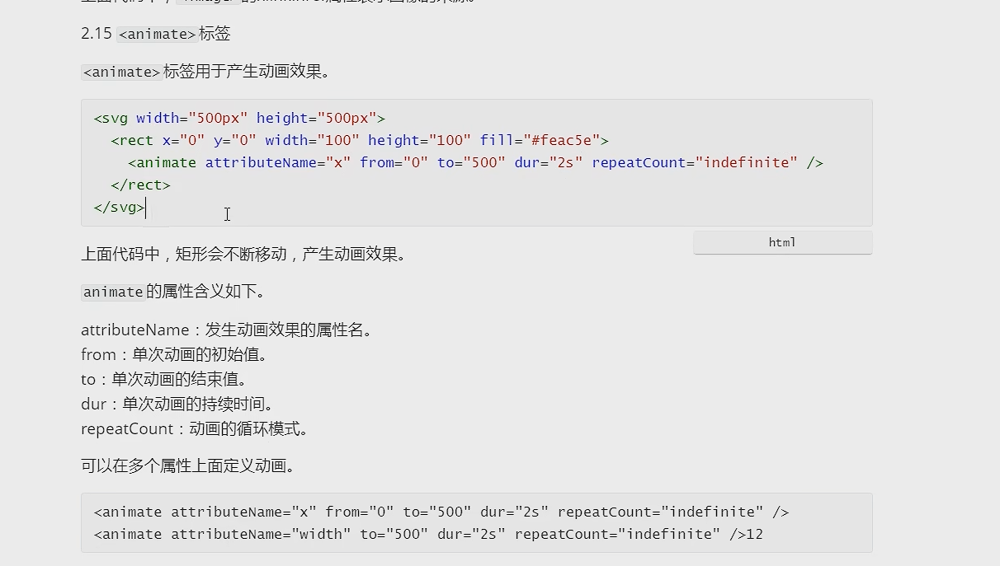
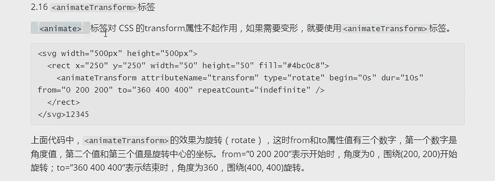

# SVG笔记

SVG是一种基于XML的图像格式（可缩放矢量图），是对图像形状描述的文本

可以直接插入网页 。也可以写到单独文件里，用img（不能操作）、iframe、object、embed等标签+src属性 插入

- 矢量图，不会失真
- 直接作为元素插入页面，相对于图片可以进行操作

## 语法/标签

### `svg`标签

顶层标签，所有SVG代码都放在此标签内

- `width` ,`height`：宽度、高度
- `viewbox`：切出视窗两个顶点的横纵坐标px，在需要显示部分内容时使用

```html
<svg width='100px' height='100px' viewBox='50 50 100 100'>
    <circle cx='50' cy='50' r='50'/>
</svg>
```

==各种标签，可以使用css的各种属性，包括动画等==

### `circle`圆形标签

代表圆形

- cx,cy：圆形坐标x、y
- r：半径
- fill：填充颜色
- stroke：描边颜色
- stroke-width
- 可以使用style/class等属性，将相关属性写到样式内

<svg>
    <circle cx="100" cy="80" r="50" stroke="blue" stroke-width="5" fill="lightblue" />
</svg>

### `line`线段标签

代表线段

- x1 y1 x2 y2

```html
<svg>
    <line x1="0" y1="0" x2="200" y2="100" stroke="black" stroke-width="2" />
</svg>
```

<svg>
    <line x1="8" y1="8" x2="200" y2="100" stroke="blue" stroke-width="5" />
</svg>

### `polyline`折线标签

代表折线

- points

```html
<svg>
    <polyline points="10,10 100,10 100,100 200,100" stroke="black" stroke-width="2" fill="transparent" />
</svg>
```

<svg>
    <polyline points="10,10 100,10 100,100 200,100" stroke="purple" stroke-width="5" fill="transparent" />
</svg>

### `rect`矩形标签

- x,y
- height,width

<svg>
    <rect x='10' y='10' height='100' width='200' fill='yellowgreen' stroke='green' stroke-width='5'/>
</svg>

### `ellsipse` 椭圆标签

- cx,cy
- rx,ry

<svg>
    <ellipse cx='120' cy='60' rx='100' ry='50' fill='orange' stroke='brown' stroke-width='5'/>
</svg>

polygon 多边形

- points

<svg>
    <polygon points='10,10 10,100 200,100' fill='pink' stroke='red' stroke-width='5'/>
</svg>

### `path` 路径

- d：绘制顺序
  - M移动到(m)
  - L画直线到(l)
  - Z闭合路径(z)
  - 贝塞尔曲线、圆弧 等命令

```html
<svg width='100%'>
    <path d='M 10,50 L 120,50 M 150,50 L 250,150 L 350,50 Z' stroke='green' stroke-width='3' fill='none'/>
</svg>
```

<svg width='100%'>
    <path d='M 10,50 L 120,50 M 150,50 L 250,150 L 350,50 Z' stroke='green' stroke-width='3' fill='none'/>
</svg>

### `text` 文本标签

- x,y
- children
- 字体的颜色是用fill填充，

```html
<svg>
    <text x='50' y='50'  fill='yellowgreen'>hello_world</text>
    <text x='80' y='80'  fill='yellowgreen'>hello_world</text>
    <text x='110' y='110'  fill='yellowgreen'>hello_world</text>
</svg>
```

<svg>
    <text x='50' y='50'  fill='yellowgreen'>hello_world</text>
    <text x='80' y='80'  fill='yellowgreen'>hello_world</text>
    <text x='110' y='110'  fill='yellowgreen'>hello_world</text>
</svg>
### `use`复制标签

```html
<svg width='100%'>
    <circle id='circle_1' cx="100" cy="80" r="50" stroke="blue" stroke-width="5" fill="lightblue" />
    <use href='#circle_1' x='20' y='10' fill='orange' stroke='brown'/>
</svg>
```


### `g`组标签

用于把多个标签组合，便于一起操作

```html
<svg width='100%' height='300px'>
    <g id='group'>
        <circle cx='100' cy='100' r='30'/>
        <circle cx='200' cy='100' r='30'/>
        <circle cx='300' cy='100' r='30'/>
    </g>
    <use href='#group' x='30' y='100'/>
</svg>
```

### `pattern`模式标签

可用来填充其他标签

```html
<svg>
<pattern id='id'>形状</pattern>
    <rect fill='#id'></rect>
</svg>
```

`image`图像标签

```html
<svg>
<image xlink:href='./image.jpg'/>
</svg>
```

### `animate`动画标签

动画

- attributeName
- from,to
- dur
- repeatCount



```html
<svg width='100%' height='300px'>
    <rect x='100' y='50' height='50' width='100'>
    	<animate attributeName='x' from='0' to='200' dur='2s' repeatCount="indefinite"/>
    </rect>
</svg>
```


### `animateTransform`css动画标签



## 环形进度条

```html
<svg id="svg_id" width="100%" height="800px">
    <!-- 设置底色的圆环 -->
    <circle cx="350" cy="350" r="300" fill="none" stroke="grey" stroke-width="40" stroke-linecap="round" />
    <!-- 设置进度的圆环 -->
    <circle class="progress" cx="350" cy="350" r="300" fill="none" stroke="red" stroke-width="40" stroke-linecap="round"
            stroke-dasharray="200,10000"
            transform="rotate(-90,350,350)"
            />
    <!-- 设置文本 -->
    <text class="text" x="350" y="350" text-anchor="middle" dy="20" font-size="90" fill="black">100%</text>
    <circle class="progress" />
</svg>
<script>
    let progressElement = document.querySelector('#svg_id .progress');
    let textElement=document.querySelector('#svg_id .text');
    function handleCircle(persent){
        // 计算圆环长度
        let circleLength = Math.floor(2*Math.PI*parseFloat(progressElement.getAttribute('r')));
        // 计算圆环进度
        let progress = circleLength * persent / 100;
        // 计算颜色，从255,0,0到0,191,255
        let red = Math.floor(255 - 255 * persent / 100);
        let green = Math.floor(191 * persent / 100);
        let blue = Math.floor(255 * persent / 100);
        // 设置圆环进度和颜色
        progressElement.setAttribute('stroke-dasharray', progress + ',10000');
        progressElement.setAttribute('stroke', 'rgb(' + red + ',' + green + ',' + blue + ')');
        // 设置文本内容和颜色
        textElement.textContent = persent + '%';
        textElement.setAttribute('fill', 'rgb(' + red + ',' + green + ',' + blue + ')');
    }
    //每80ms增加1%，直到100%
    let persent = 0;
    let intervalId = setInterval(function () {
        handleCircle(persent);
        persent++;
        if (persent > 100) {
            persent = 0;
        }
    }, 80);
</script>
```

## JS操作SVG

当svg直接放入页面，可以使用操作dom的方式操作

- getAttribute(属性名)
- setAttribute(属性名，数值)
- style.属性=...
