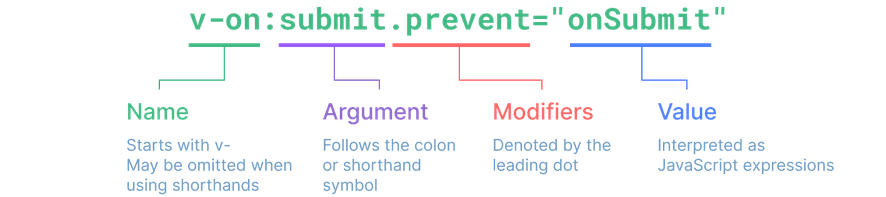
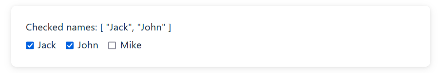
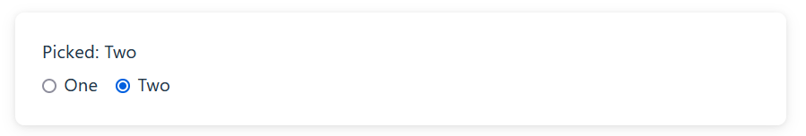
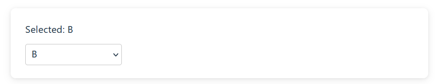
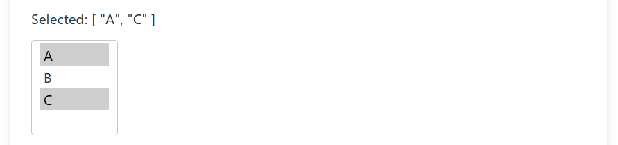
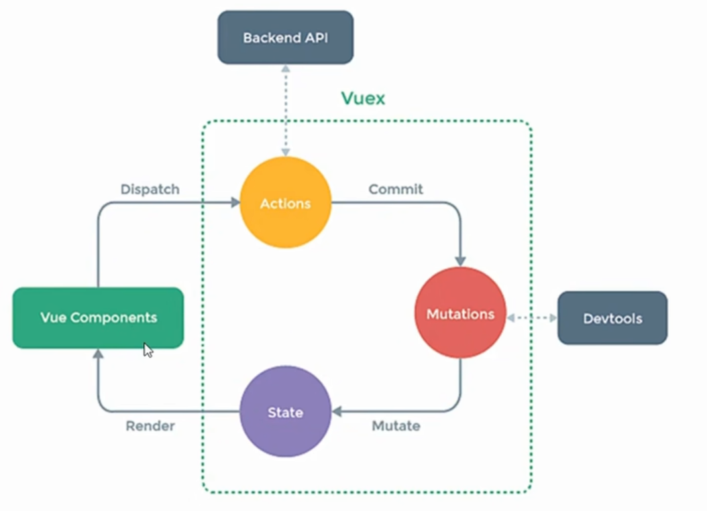

## Vue基础

### 模板语法

#### 模板插值

```html
<span>{{msg}}</span>
```

#### 原生HTML

```html
<span v-html="msg"></span>
```

#### Attribute 绑定 

```html
<div v-bind:id="dynamicId"></div>
<div :id="dynamicId"></div>
```

##### 布尔型 Attribute

```html
<button :disabled="isButtonDisabled">Button</button>
```

##### 动态绑定多个值 

```html
<div v-bind="objectOfAttrs"></div>
```

```js
data() {
  return {
    objectOfAttrs: {
      id: 'container',
      class: 'wrapper'
    }
  }
}

```

#### 使用 JavaScript 表达式 

在 Vue 模板内，JavaScript 表达式可以被使用在如下场景上：

- 在文本插值中 (双大括号)
- 在任何 Vue 指令 (以 `v-` 开头的特殊 attribute) attribute 的值中

```html
{{ number + 1 }}
{{ ok ? 'YES' : 'NO' }}
{{ message.split('').reverse().join('') }}
<div :id="`list-${id}`"></div>
```

#### 指令

指令是带有 `v-` 前缀的特殊 attribute



##### 内置指令


### 表单输入绑定

```html
<input
  :value="text"
  @input="event => text = event.target.value">
```

#### 基本用法

##### 文本

```html
<input v-model="text">
```

- 文本类型的 `<input>` 和 `<textarea>` 元素会绑定 `value` property 并侦听 `input` 事件；
- `<input type="checkbox">` 和 `<input type="radio">` 会绑定 `checked` property 并侦听 `change` 事件；
- `<select>` 会绑定 `value` property 并侦听 `change` 事件。

##### 多行文本


##### 复选框 

###### 绑定布尔

单一的复选框，绑定布尔类型值：

```html
<input type="checkbox" id="checkbox" v-model="checked" />
<label for="checkbox">{{ checked }}</label>
```

###### 绑定数组

将多个复选框绑定到同一个数组或集合的值

```html
<div>Checked names: {{ checkedNames }}</div>

<input type="checkbox" id="jack" value="Jack" v-model="checkedNames">
<label for="jack">Jack</label>

<input type="checkbox" id="john" value="John" v-model="checkedNames">
<label for="john">John</label>

<input type="checkbox" id="mike" value="Mike" v-model="checkedNames">
<label for="mike">Mike</label>
```

效果



单选框

```html
<div>Picked: {{ picked }}</div>

<input type="radio" id="one" value="One" v-model="picked" />
<label for="one">One</label>

<input type="radio" id="two" value="Two" v-model="picked" />
<label for="two">Two</label>
```



##### 选择器

###### 单选

```html
<div>Selected: {{ selected }}</div>

<select v-model="selected">
  <option disabled value="">Please select one</option>
  <option>A</option>
  <option>B</option>
  <option>C</option>
</select>

```



###### 多选绑数组

```html
<div>Selected: {{ selected }}</div>

<select v-model="selected" multiple>
  <option>A</option>
  <option>B</option>
  <option>C</option>
</select>
```



###### 动态渲染

选择器的选项可以使用 `v-for` 动态渲染：

```js
const selected = ref('A')

const options = ref([
  { text: 'One', value: 'A' },
  { text: 'Two', value: 'B' },
  { text: 'Three', value: 'C' }
])
```

```html
<select v-model="selected">
  <option v-for="option in options" :value="option.value">
    {{ option.text }}
  </option>
</select>

<div>Selected: {{ selected }}</div>
```

#### 值绑定

##### 复选框

```html
<input
  type="checkbox"
  v-model="toggle"
  true-value="yes"
  false-value="no" />
```

`true-value` 和 `false-value` 是 Vue 特有的 attributes，仅支持和 `v-model` 配套使用。这里 `toggle` 属性的值会在选中时被设为 `'yes'`，取消选择时设为 `'no'`。你同样可以通过 `v-bind` 将其绑定为其他动态值：

```html
<input
  type="checkbox"
  v-model="toggle"
  :true-value="dynamicTrueValue"
  :false-value="dynamicFalseValue" />
```

##### 单选按钮

```html
<input type="radio" v-model="pick" :value="first" />
<input type="radio" v-model="pick" :value="second" />
```

##### 选择器选项 

```html
<select v-model="selected">
  <!-- 内联对象字面量 -->
  <option :value="{ number: 123 }">123</option>
</select>
```

`v-model` 同样也支持非字符串类型的值绑定！在上面这个例子中，当某个选项被选中，`selected` 会被设为该对象字面量值 `{ number: 123 }`。

#### 修饰符

| 修饰符  | 效果                                                         |
| ------- | ------------------------------------------------------------ |
| .lazy   | 默认情况下，v-model 会在每次 input 事件后更新数据 (IME 拼字阶段的状态例外)。你可以添加 lazy 修饰符来改为在每次 change 事件后更新数据： |
| .number | 让用户输入自动转换为数字；如果该值无法被 `parseFloat()` 处理，那么将返回原始值。`number` 修饰符会在输入框有 `type="number"` 时自动启用。 |
| .trim   | 默认自动去除用户输入内容中两端的空格                         |


### MVVM模型

### 数据代理

### 事件处理

### 计算属性

### 监视属性

### 绑定类&样式

#### 绑定类

```html
<div :class="{ active: isActive }"></div>
```

上面的语法表示 `active` 是否存在取决于数据属性 `isActive` 的真假值。

可以直接绑定一个对象

#### 绑定内联样式

##### 绑定对象

##### 绑定数组


### 条件渲染

### 列表渲染

### 收集表单

### 内置指令

### 自定义指令

### 生命周期


#### 挂载流程

##### beforeCreate

初始化生命周期、事件完成，无法通过vm访问到data和method

##### created 

数据监测、数据代理完成，可以通过vm访问到data和method

一般在此进行

##### beforeMount

虚拟DOM已经生成，页面呈现的是未经Vue编译的DOM结构，所有对DOM的操作均不奏效

##### mounted

页面呈现的是经过Vue编译的DOM结构，对DOM操作有效（不建议这么做），初始化已经结束

一般在此进行：开启定时器、发送网络请求、订阅消息、绑定自定义事件等初始化操作

#### 更新流程

##### beforeUpdate

数据发生更新后，数据是新的，页面是旧的

##### updated

在进行生成新的DOM=>虚拟DOM比较=>页面更新之后，数据和页面都是新的、保持同步

#### 销毁流程

##### beforeDestory

vm中所有内容(data、methods、指令等)都处于可用状态、马上要进行销毁流程

一般在此进行：关闭定时器、取消订阅消息、解绑自定义事件等收尾操作

##### destoryed

所有watch、子组件、（自定义）事件监听器已经没了

#### 特殊：路由组件

##### activated 激活

##### deactivated 失活

#### 特殊：

##### nextTick

若要等待一个状态改变后的 DOM 更新完成，你可以使用 nextTick()这个全局 API：

```js
{
    a++;
    nextTick(()=>{
        xxx;
    })
}
```


### 非单文件组件

### 单文件组件

## vue工程

### vue脚手架

```bash
vue create xxx
```


### ref属性

### props配置

### mixin混入

### 插件

### scoped

### 自定义事件

### 全局事件总线 $bus

#### 1. 安装全局事件总线

在main.js中

```js
//创建vm
new Vue({
	el:'#app',
	render: h => h(App),
	// beforeCreate中模板未解析，且this是vm
	beforeCreate(){
		Vue.prototype.$bus = this	//安装全局事件总线
	}
})
```

#### 2.绑定全局事件总线

在test1.vue中

```js
mounted(){
  // 绑定自定义事件
  this.$bus.$on('自定义事件名', (接收参数)=>{
    console.log('我是TestB组件，收到了数据', 接收参数);
  })
}
```

#### 3.触发全局事件总线

在test2.vue中

```js
methods:{
  // 触发事件,事件名不能重复
  触发事件方法名(){
    this.$bus.$emit('自定义事件名', 传递参数);
  }
},
```


### 消息定阅与发布 pubsub

#### 1.安装pubsub

`npm i pubsub-js`

#### 2.引入pubsub

`import pubsub from 'pubsub-js'`

#### 3.接收数据

A组件想接收数据，则在A组件中订阅消息，订阅的回调留在A组件自身。

```js
methods(){
    demo(data){......}
}
mounted() { 
    this.pid = pubsub.subscribe('xxx',this.demo) //订阅消息
}
```

#### 4.提供数据

`pubsub.publish('xxx',数据)`

#### 5.取消订阅

最好在beforeDestroy钩子中，用PubSub.unsubscribe(pid)去取消订阅。
```js
beforeDestory(){
   	pubsub.unsubscribe(this.pid)
}
```

### 配置代理

##### axios

```bash
npm i axios
```

```js
axios.get('url').then(response=>{},error=>{})
```

同源策略：主机名、协议名、端口号一致

解决跨域：后端配置cors头、jsonp不受同源策略限制、代理服务器

ajax是前端的东西，服务器之间不用

代理服务器：nginx（难）、vue脚手架

#### 方法1 单个代理

优先匹配前端资源,后端资源不能和前端重复

vue.config.js

```js
const { defineConfig } = require('@vue/cli-service')
module.exports = defineConfig({
  transpileDependencies: true,
  lintOnSave:false,//关闭语法检查
  devServer:{//开启代理服务器
    proxy:'http://localhost:5000'
  }
})

```

#### 方法2 配置具体规则

 vue.config.js

```js
const { defineConfig } = require('@vue/cli-service')
module.exports = defineConfig({
  transpileDependencies: true,
  lintOnSave:false,//关闭语法检查
  devServer:{//开启代理服务器
    proxy:{
      '/api':{//请求前缀
        target:'http://localhost:5000', //转发地址
        pathRewrite:{'^/api':''},       //去掉前缀
        ws:true,                        //支持websocket
        changeOrigin:true,              //更改请求头中的host值
      }
    }
  }
})

```


### vue-resource AJAX请求库

- xhr、jQuery、axios、fetch
- vue插件
- vue1.0用的较多，已经过时

#### 安装

```bash
npm i vue-resource
```

引入

```js
import vueResource from 'vue-resource'
Vue.use(vueResource)
```


#### 语法

```js
// 基于全局Vue对象使用http
Vue.http.get('/someUrl', [options]).then(successCallback, errorCallback);
Vue.http.post('/someUrl', [body], [options]).then(successCallback, errorCallback);

// 在一个Vue实例内使用$http
this.$http.get('/someUrl', [options]).then(successCallback, errorCallback);
this.$http.post('/someUrl', [body], [options]).then(successCallback, errorCallback);
```

#### 基本示例

```js
methods:{
    get:function(){
        //发送get请求
        this.$http.get('/try/ajax/ajax_info.txt').then(function(res){
            document.write(res.body);    
        },function(){
            console.log('请求失败处理');
        });
    }
}
```

```js
methods:{
    post:function(){
        //发送 post 请求
        this.$http.post('/try/ajax/demo_test_post.php',{name:"菜鸟教程",url:"http://www.runoob.com"},{emulateJSON:true}).then(function(res){
            document.write(res.body);    
        },function(res){
            console.log(res.status);
        });
    }
}
```

### 插槽

#### 默认插槽

```vue
<template>
    <div>
        <slot></slot>
    </div>
</template>
```

使用


```vue
<t>
	<span></span>
</t>
```

#### 具名插槽

```vue
<template>
    <div>
        <slot name="s1"></slot>
        <slot name="s2"></slot>
    </div>
</template>
```

使用


```vue
<t>
	<span slot="s1"></span>
	<span slot="s2"></span>
    <span v-slot:s2></span>
</t>
```

#### 作用域插槽

```vue
<slot :xxx='xxx '></slot>
```

```vue
<t>
	<template scope='xxx'>
		...
    </template>
</t>
```


### vuex集中式数据管理

集中式数据管理的vue插件




安装`npm i vuex@3` 

```js
import store from './store'
```

```js
import Vuex from 'vuex'
import Vue from 'vue'
Vue.use(Vuex)
const actions={
    
}
const mutations={

}
const state={
    sum:0
}
const getters={
    bigsum(state){
        return state.sum*10;
    }
}
const store=new Vuex.Store({
    // actions:actions,
    // mutations:mutations,
    // state:state,
    actions,
    mutations,
    state,
    getters
})
export default store
```

- State（必须）

  - 状态树
  - 存放数据（状态）
  - 获取：`this.$store.state.xxx`

- Mutation（必须）

  - 只能同步不能异步
  - 可以操作state内的属性
  - 成员：`m(state,payload){state.a++}`
  - 使用：`this.$store.commit('m',payload)`

- Action（异步必须）

  - 可以进行异步
  - 用来触发mutation
  - 成员：`a(context,payload){context.commit('m',payload)}`
  - 使用：

- Getter

  - 可视为store中的计算属性
  - 使用：`this.$store.getters.xxx`

- Module模块

  ```js
  const moduleA = {
    state: () => ({ ... }),
    mutations: { ... },
    actions: { ... },
    getters: { ... }
  }
  
  const moduleB = {
    state: () => ({ ... }),
    mutations: { ... },
    actions: { ... }
  }
  
  const store = createStore({
    modules: {
      a: moduleA,
      b: moduleB
    }
  })
  
  store.state.a // -> moduleA 的状态
  store.state.b // -> moduleB 的状态
  ```

  

### vue router路由

#### 基本使用

##### 安装

```bash
npm install vue-router@3	#vue2
npm install vue-router@4	#vue3
```
##### 使用

###### 1.声明

main.js

```js
// 0. 如果使用模块化机制编程，导入Vue和VueRouter，要调用 Vue.use(VueRouter)

// 1. 定义 (路由) 组件。
// 可以从其他文件 import 进来
const Foo = { template: '<div>foo</div>' }
const Bar = { template: '<div>bar</div>' }

// 2. 定义路由
// 每个路由应该映射一个组件。 其中"component" 可以是
// 通过 Vue.extend() 创建的组件构造器，
// 或者，只是一个组件配置对象。
// 我们晚点再讨论嵌套路由。
const routes = [
  { path: '/foo', component: Foo },
  { path: '/bar', component: Bar }
]

// 3. 创建 router 实例，然后传 `routes` 配置
// 你还可以传别的配置参数, 不过先这么简单着吧。
const router = new VueRouter({
  routes // (缩写) 相当于 routes: routes
})

// 4. 创建和挂载根实例。
// 记得要通过 router 配置参数注入路由，
// 从而让整个应用都有路由功能
const app = new Vue({
  router
}).$mount('#app')

// 现在，应用已经启动了！

```

###### 2.字符串形式引用

html页面(vue)

```vue
<p>
    <!--使用 router-link 组件进行导航 -->
    <!--通过传递 `to` 来指定链接 -->
    <!--`<router-link>` 将呈现一个带有正确 `href` 属性的 `<a>` 标签-->
    <router-link to="/">Go to Home</router-link>
    <router-link to="/about">Go to About</router-link>
</p>
<!-- 路由出口 -->
<!-- 路由匹配到的组件将渲染在这里 -->
<router-view></router-view>
```

通过注入路由器，我们可以在任何组件内通过 `this.$router` 访问路由器，也可以通过 `this.$route` 访问当前路由：

留意一下 `this.$router` 和 `router` 使用起来完全一样。我们使用 `this.$router` 的原因是我们并不想在每个独立需要封装路由的组件中都导入路由。

###### 3.对象形式引用

```vue
:to={
	path:'xxx',
	query:{'xxx':xxx}
}
```


#### 动态匹配路由

##### 动态匹配路由

我们经常需要把某种模式匹配到的所有路由，全都映射到同个组件。例如，我们有一个 `User` 组件，对于所有 ID 各不相同的用户，都要使用这个组件来渲染。那么，我们可以在 `vue-router` 的路由路径中使用“动态路径参数”(dynamic segment) 来达到这个效果：

```js
const User = {
  template: '<div>User</div>'
}

const router = new VueRouter({
  routes: [
    // 动态路径参数 以冒号开头
    { path: '/user/:id', component: User }
  ]
})
```

现在呢，像 `/user/foo` 和 `/user/bar` 都将映射到相同的路由。

一个“路径参数”使用冒号 `:` 标记。当匹配到一个路由时，参数值会被设置到 `this.$route.params`，可以在每个组件内使用。于是，我们可以更新 `User` 的模板，输出当前用户的 ID：

```js
const User = {
  template: '<div>User {{ $route.params.id }}</div>'
}
```

##### 捕获所有路由

```js
{
  // 会匹配所有路径,常放在最后用于404页面
  path: '*'
}
{
  // 会匹配以 `/user-` 开头的任意路径
  path: '/user-*'
}

```

当使用*通配符*路由时，请确保路由的顺序是正确的，也就是说含有*通配符*的路由应该放在最后。路由 `{ path: '*' }` 通常用于客户端 404 错误。如果你使用了*History 模式*，请确保[正确配置你的服务器](https://v3.router.vuejs.org/zh/guide/essentials/history-mode.html)。

当使用一个*通配符*时，`$route.params` 内会自动添加一个名为 `pathMatch` 参数。它包含了 URL 通过*通配符*被匹配的部分：

```js
// 给出一个路由 { path: '/user-*' }
this.$router.push('/user-admin')
this.$route.params.pathMatch // 'admin'
// 给出一个路由 { path: '*' }
this.$router.push('/non-existing')
this.$route.params.pathMatch // '/non-existing'
```


#### 重定向

重定向也是通过 `routes` 配置来完成，下面例子是从 `/a` 重定向到 `/b`：

```js
const router = new VueRouter({
  routes: [
    { path: '/a', redirect: '/b' }
  ]
})
```

重定向的目标也可以是一个命名的路由：

```js
const router = new VueRouter({
  routes: [
    { path: '/a', redirect: { name: 'foo' }}
  ]
})
```

甚至是一个方法，动态返回重定向目标：

```js
const router = new VueRouter({
  routes: [
    { path: '/a', redirect: to => {
      // 方法接收 目标路由 作为参数
      // return 重定向的 字符串路径/路径对象
    }}
  ]
})
```

注意[导航守卫](https://v3.router.vuejs.org/zh/guide/advanced/navigation-guards.html)并没有应用在跳转路由上，而仅仅应用在其目标上。在下面这个例子中，为 `/a` 路由添加一个 `beforeEnter` 守卫并不会有任何效果。

#### 别名

- “重定向”的意思是，当用户访问 `/a`时，URL 将会被替换成 `/b`，然后匹配路由为 `/b``
- ``/a` 的别名是 `/b`，意味着，当用户访问 `/b` 时，URL 会保持为 `/b`，但是路由匹配则为 `/a`，就像用户访问 `/a` 一样。

上面对应的路由配置为：

```js
const router = new VueRouter({
  routes: [
    { path: '/a', component: A, alias: '/b' }
  ]
})
```

“别名”的功能让你可以自由地将 UI 结构映射到任意的 URL，而不是受限于配置的嵌套路由结构。

#### 嵌套路由

使用children属性

```js
const router = new VueRouter({
  routes: [
    {
      path: '/user/:id',
      component: User,
      children: [
        {
          // 当 /user/:id/profile 匹配成功，
          // UserProfile 会被渲染在 User 的 <router-view> 中
          path: 'profile',
          component: UserProfile
        },
        {
          // 当 /user/:id/posts 匹配成功
          // UserPosts 会被渲染在 User 的 <router-view> 中
          path: 'posts',
          component: UserPosts
        }
      ]
    }
  ]
})
```

#### 编程式导航

除了使用 `<router-link>` 创建 a 标签来定义导航链接，我们还可以借助 router 的实例方法，通过编写代码来实现。

##### push()

router.push(location, onComplete?, onAbort?)

- 注意：在 Vue 实例内部，你可以通过 `$router` 访问路由实例。因此你可以调用 `this.$router.push`。
- 想要导航到不同的 URL，则使用 `router.push` 方法。这个方法会向 history 栈添加一个新的记录，所以，当用户点击浏览器后退按钮时，则回到之前的 URL。
- 当你点击 `<router-link>` 时，这个方法会在内部调用，所以说，点击 `<router-link :to="...">` 等同于调用 `router.push(...)`。

| 声明式                    | 编程式             |
| ------------------------- | ------------------ |
| `<router-link :to="...">` | `router.push(...)` |

该方法的参数可以是一个字符串路径，或者一个描述地址的对象。例如：

```js
// 字符串
router.push('home')
// 对象
router.push({ path: 'home' })
// 命名的路由
router.push({ name: 'user', params: { userId: '123' }})
// 带查询参数，变成 /register?plan=private
router.push({ path: 'register', query: { plan: 'private' }})
```

注意：如果提供了 `path`，`params` 会被忽略，上述例子中的 `query` 并不属于这种情况。取而代之的是下面例子的做法，你需要提供路由的 `name` 或手写完整的带有参数的 `path`：

```js
const userId = '123'
router.push({ name: 'user', params: { userId }}) // -> /user/123
router.push({ path: `/user/${userId}` }) // -> /user/123
// 这里的 params 不生效
router.push({ path: '/user', params: { userId }}) // -> /user
```

同样的规则也适用于 `router-link` 组件的 `to` 属性。

##### replace()

router.replace(location, onComplete?, onAbort?)

跟 `router.push` 很像，唯一的不同就是，它不会向 history 添加新记录，而是跟它的方法名一样 —— 替换掉当前的 history 记录。

| 声明式                            | 编程式                |
| --------------------------------- | --------------------- |
| `<router-link :to="..." replace>` | `router.replace(...)` |

##### go()

router.go(n)

这个方法的参数是一个整数，意思是在 history 记录中向前或者后退多少步，类似 `window.history.go(n)`。

例子

```js
// 在浏览器记录中前进一步，等同于 history.forward()
router.go(1)
// 后退一步记录，等同于 history.back()
router.go(-1)
// 前进 3 步记录
router.go(3)
// 如果 history 记录不够用，那就默默地失败呗
router.go(-100)
router.go(100)
```

#### 传递参数

##### query参数

###### 1.传递

```vue
<router-link :to="./xxx?query参数=xxx&...">...</router-link>
```

###### 2.使用

```vue
this.$route.query.参数名
```

##### params参数

###### 1.声明

router/index.js

```js
{//路由
    path:'xxx/:参数名',
}
```

###### 2.传递

直接传递

对象传递（只能用name不能用path）

```vue
<router-link :to={
             name:'xxx',
             params:{
             	参数名:xxx
             }
             }
```
###### 3.使用

```vue
this.$route.params.参数名
```

##### props配置

作用：让组件更好地接受参数

###### 1.声明

router/index.js

方法1：写死

```js
{//写死
    props:{a:1,b:2}
}
```

方法2：布尔值

```js
{//若为真，会把该路由组件收到的所有params参数以props的形式传递给组件
    path:'xxx/:参数名',
    props:true
}
```

方法3：函数

```js
{
    props(){
        return{id:'666'}
    }
}
```

```js
{
    props($route){//可以把query、params、字面值传递到props
        return{
            id:$route.query.id
        }
    }
}
```

```js
{
    props({query:{id}}){//结构赋值
        return{id}
    }
}
```

```js
{
    props(query){
        return{id:query.id}
    }
}
```


#### 缓存路由组件

作用：切换组件时不会被销毁，保持挂载

##### 全部缓存

```vue
<keep-alive>
	<router-view></router-view>
</keep-alive>
```
##### 指定组件缓存

注意是组件名而不是路径

字符串形式（只能一个）

```vue
<keep-alive include="组件名">
	<router-view></router-view>
</keep-alive>
```

数组形式

```vue
<keep-alive :include="[组件名,...]">
	<router-view></router-view>
</keep-alive>
```

##### 路由组件的生命周期钩子

路由组件独有，用于捕获激活状态

###### 激活 activated

显示组件时

###### 失活 deactivated

切出组件时

#### 路由守卫

- 正如其名，`vue-router` 提供的导航守卫主要用来通过跳转或取消的方式守卫导航。有多种机会植入路由导航过程中：全局的, 单个路由独享的, 或者组件级的。
- 参数或查询的改变并不会触发进入/离开的导航守卫。你可以通过[观察 `$route` 对象](https://v3.router.vuejs.org/zh/guide/essentials/dynamic-matching.html#响应路由参数的变化)来应对这些变化，或使用 `beforeRouteUpdate` 的组件内守卫。

##### 全局前置守卫

router/index.js

```js
const router = new VueRouter({
    routes:[
        {
            path:'xxx',
            meta:{
                //这里可以自由使用
                isAuth:true,
                title:'666',
                }
            }
        }
    ]
    ... 
})
router.beforeEach((to, from, next) => {//常用于判断能否进入路径
    if(to.path==='xxx')xxx
    if(to.meta.xxx==='xxx'){
        if(localStorage.getItem(xxx))
    }
})
router.afterEach((to,from)=>{//常用于变化
    document.title=to.title||'xx系统',
})
export default router
```

当一个导航触发时，全局前置守卫按照创建顺序调用。守卫是异步解析执行，此时导航在所有守卫 resolve 完之前一直处于 **等待中**。

每个守卫方法接收三个参数：

- `to: Route`: 即将要进入的目标
- `from: Route`: 当前导航正要离开的路由
- `next: Function`: 一定要调用该方法来 resolve这个钩子。执行效果依赖 `next` 方法的调用参数。
  - `next()`: 进行管道中的下一个钩子。如果全部钩子执行完了，则导航的状态就是 confirmed (确认的)。
  - `next(false)`: 中断当前的导航。如果浏览器的 URL 改变了 (可能是用户手动或者浏览器后退按钮)，那么 URL 地址会重置到 `from` 路由对应的地址。
  - `next('/')` 或者 `next({ path: '/' })`: 跳转到一个不同的地址。当前的导航被中断，然后进行一个新的导航。你可以向 `next` 传递任意位置对象，且允许设置诸如 `replace: true`、`name: 'home'` 之类的选项以及任何用在 [`router-link` 的 `to` prop](https://v3.router.vuejs.org/zh/api/#to) 或 [`router.push`](https://v3.router.vuejs.org/zh/api/#router-push) 中的选项。
  - **`next(error)`**: (2.4.0+) 如果传入 `next` 的参数是一个 `Error` 实例，则导航会被终止且该错误会被传递给 [`router.onError()`](https://v3.router.vuejs.org/zh/api/#router-onerror) 注册过的回调。

**确保 `next` 函数在任何给定的导航守卫中都被严格调用一次。它可以出现多于一次，但是只能在所有的逻辑路径都不重叠的情况下，否则钩子永远都不会被解析或报错**。这里有一个在用户未能验证身份时重定向到 `/login` 的示例：

```js
// BAD
router.beforeEach((to, from, next) => {
  if (to.name !== 'Login' && !isAuthenticated) next({ name: 'Login' })
  // 如果用户未能验证身份，则 `next` 会被调用两次
  next()
})
// GOOD
router.beforeEach((to, from, next) => {
  if (to.name !== 'Login' && !isAuthenticated) next({ name: 'Login' })
  else next()
})
```

##### 全局解析守卫

在 2.5.0+ 你可以用 `router.beforeResolve` 注册一个全局守卫。这和 `router.beforeEach` 类似，区别是在导航被确认之前，**同时在所有组件内守卫和异步路由组件被解析之后**，解析守卫就被调用

##### 全局后置钩子

你也可以注册全局后置钩子，然而和守卫不同的是，这些钩子不会接受 `next` 函数也不会改变导航本身：

```js
router.afterEach((to, from) => {
  // ...
})
```

##### 路由独享守卫（前置）

你可以在路由配置上直接定义 `beforeEnter` 守卫：只有前置

```js
const router = new VueRouter({
  routes: [
    {
      path: '/foo',
      component: Foo,
      beforeEnter: (to, from, next) => { }
    }
  ]
})
```

这些守卫与全局前置守卫的方法参数是一样的

##### 组件内路由守卫

可以在路由组件内直接定义以下路由导航守卫：

- `beforeRouteEnter`
- `beforeRouteUpdate` (2.2 新增)
- `beforeRouteLeave`

```js
const Foo = {
  template: `...`,
  beforeRouteEnter(to, from, next) {
    // 在渲染该组件的对应路由被 confirm 前调用
    // 不！能！获取组件实例 `this`
    // 因为当守卫执行前，组件实例还没被创建
  },
  beforeRouteUpdate(to, from, next) {
    // 在当前路由改变，但是该组件被复用时调用
    // 举例来说，对于一个带有动态参数的路径 /foo/:id，在 /foo/1 和 /foo/2 之间跳转的时候，
    // 由于会渲染同样的 Foo 组件，因此组件实例会被复用。而这个钩子就会在这个情况下被调用。
    // 可以访问组件实例 `this`
  },
  beforeRouteLeave(to, from, next) {
    // 导航离开该组件的对应路由时调用
    // 可以访问组件实例 `this`
  }
}
```

##### 导航解析流程

1. 导航被触发。
2. 在失活的组件里调用 `beforeRouteLeave` 守卫。
3. 调用全局的 `beforeEach` 守卫。
4. 在重用的组件里调用 `beforeRouteUpdate` 守卫 (2.2+)。
5. 在路由配置里调用 `beforeEnter`。
6. 解析异步路由组件。
7. 在被激活的组件里调用 `beforeRouteEnter`。
8. 调用全局的 `beforeResolve` 守卫 (2.5+)。
9. 导航被确认。
10. 调用全局的 `afterEach` 钩子。
11. 触发 DOM 更新。
12. 调用 `beforeRouteEnter` 守卫中传给 `next` 的回调函数，创建好的组件实例会作为回调函数的参数传入。

##### history模式和hash模式

路由器的两种工作模式

#：hash，不会随着http请求发给服务器

hash模式：app认为不合法

history模式：需要后端配合

### 常用组件库


#### element-ui

安装

```bash
npm i element-ui
```

使用

## vue3


### 创建工程

#### vue-cli创建工程

```bush
npm i -g @vue/cli
vue create xxx
cd xxx
npm run serve
```

#### vite创建工程


工程结构

main.js

```js
import {createApp} from 'vue'
import App from './App.vue'
const app=createApp(App)
app.mount('#app')

```

