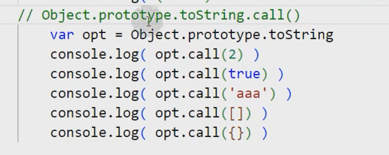
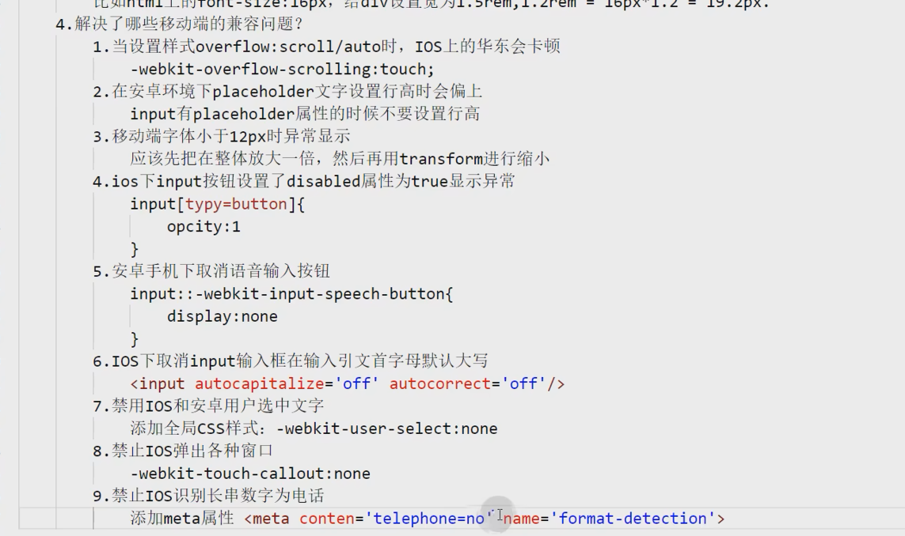

# 前端题库

https://www.bilibili.com/video/BV15z4y1a7MN/


#### 

## 零、个人思考

#### 1. 你的学习方式

- 在网络上查找视频教程进行系统学习，并记成笔记。比如学习CSS进阶、React框架教程
- 找一些项目进行编码实践，遇到问题就找官网、MDN、博客进行解决，并查看相关联的知识进行拓展
  - 比如之前在项目中，向原有页面中加组件，组件的鼠标进入事件不能触发。后面查阅事件的一些博客，详细了解了事件流机制和事件API。然后分析出这个事件可能是阻止流动了，在自己的组件中修改事件监听在捕获阶段处理，就解决了这个问题。

- 然后有时间会看一看官网的文档，对相同内容有一个不同角度的解读或者理解，巩固
- 对一些库/工具的使用，直接查看官网的教程/使用手册，涉及到细节的变化就查阅官网的API文档

#### 2、在项目中遇到过什么问题？怎么解决

- 校内项目，主要是团队沟通
- 真实项目，前人的代码不了解

解决过什么技术难点？

- 在项目中，修别人代码中的bug会比较困难，不了解实现、也就比较难定位bug
- 解决：
  - 通过vscode的内容搜索等功能定位源码，并进行阅读
  - 查阅相关内容的使用文档、接口文档
  - 问项目组的学长/前辈，和其他同学进行交流
    - 之前就遇到过一个，当时代码阅读能力还比较差。就是之前在项目中进行相似组件的替换，但是没有进行API的规定
    - ~~比如遇到过在项目中进行组件替换，监听输入组件数值变化，但是不能正确获取。然后通过和学长交流得知，原来的代码传递参数是value值，但是新的参数第一个却是event，第二个参数才是value。~~


#### 3、AI相关（新技术的看法，拥抱）

- 用过ChatGPT、github colplog插件
- 短期来看，感觉目前AI对代码这种被严格规定的事物能较好处理，但是对于非严格规定的事物不能较好地处理。前端开发最终是为了用户，而用户的体验、需求，不是AI能真正理解的
- 长期来看，我个人认为AI只能模仿，不能真正地创新。前端开发已经日渐工程化了，而这些

## 一、CSS

#### 1.说一下HTML的盒模型

- HTML页面中的所有元素都能看成一个盒子
- 盒子的组成：


#### 2.CSS选择器的优先级

- CSS特性：继承性、层叠性、优先级
- 层叠性：有多个选择器或一个选择器对某个或某几个标签中的多条样式进行选择，如果多个选择器都赋给某个或某几个标签相同属性，样式的作用范围发生了重叠

- 优先级：同一个元素多次声明样式并发生冲突


笔者个人的回答：


CSS解决冲突是经过CSS级联这个过程，这个过程分为三步：

1. 首先看声明的重要性
   1. 用户重要声明，也就是用户在浏览器工具中设置带！important的声明
   2. 作者重要声明，也就是CSS代码中带！important的声明
   3. 作者声明
   4. 用户声明
   5. 浏览器默认声明
2. 如果声明的重要性一样，则看声明的特异性，也就是常说的选择器的优先级
   1. 内联样式，也就是行内样式
   2. id选择器
   3. 类、伪类和属性选择器
   4. 元素和伪元素选择器，也就是标签选择器
   5. 通配符，也就是全局选择器
3. 如果声明的重要性和特异性一样，则看声明的先后顺序
   1. 后声明的覆盖先声明的

#### 3.隐藏元素的方法

```css
.p{
    display:none;
    opacity:0;
    visibility:hiddren;
    position:absolute;top:-100000;//
}
```

- 设置display:none
  - 元素在文档流消失，不占空间
- 设置opacity：0
  - 设置元素的透明度为0，元素不可见，占据空间位置
- 设置定位，position:absolute;top:-100000;远离页面，并设置父元素overflow：hidden
- clip-path：circle(0)；剪切路径，允许用不同的剪切方式创建元素的可显示区域，区域内的内容可以展示，区域外的内容则隐藏。


#### 4.px和rem的区别

- px：像素，画面的像素，是一个绝对单位长度
- rem：相对于html根节点font-size的值，是一个相对单位长度。默认根节点font-size是16px，通常设置为10px或者62.5%
- em：相对于当前元素节点font-size的值，是一个相对单位长度。
- vh/vw：相对于屏幕高度或者宽度1%的值，是一个相对单位长度。
- 


#### 5.重绘和重排的区别

- 重排（也叫回流）：布局引擎根据所有的样式计算出盒模型在页面上的位置和大小
- 重绘：（重排后）浏览器根据每个盒模型的特性进行绘制


#### 6.让一个元素水平居中

- 定位+transiform
  - 父元素设置position：relative
  - 要定位的元素设置positon：absolute；transform：translate（-50%，0）
- 定位+margin
  - 父元素设置position：relative
  - 要定位的元素设置positon：absolute；top、right、bottom、left：0；margin：auto

- flex布局
  - 父元素设置display：flex；jusitify-content：center。
    - 或者flex-direction：column；align-item：center；

- gird布局

  - 父元素设置display：gird，gird-column-template：1fr，max-content或者一个固定的宽度，1fr
  - 要定位的元素设置gird-column：1，2

- table布局

  - 要定位的元素设置

  - ```
      display: table-cell;
      vertical-align: middle;
      text-align: center;
    ```

#### 7.CSS哪些属性可以继承？哪些不可以继承？

- CSS的继承性：子元素可以使用父类元素的部分样式


- 可被继承的
  - 字体相关的属性：
  - 文本相关的属性：color、
  - 元素的可见性：visibiltiy：hidden
  - 表格布局的属性：
  - 列表的属性
  - 页面样式属性：
  - 声音的样式属性
  - ……等
- 不可被继承的，很多了
  - 定位、大小、背景、……

#### 8.有没有用过预处理器

用过Sass，变量、嵌套、运算、导入、混入、函数、拓展、控制语句等功能，当然变量在CSS也有。Sass的SCSS语法，和CSS相似，非常友好

## 二、JavaScript

#### 1.JS有哪三部分组成

- ECMAScript：JS的核心内容，描述了脚本语言的语法。
- 文档对象模型DOM：HTML应用的API，将页面规划成元素组成的文档。
- 浏览器对象模型BOM：浏览器运行环境下的API，提供了和浏览器窗口访问、操作的手段。比如history、localStore这些东西

#### 2.JS有哪些内置对象(内置构造函数)

- ==String==、Boolean、Number、==Array==、Object、Function、==Math==、==Date==、Regexp
- Math：求绝对值abs、开平方sqrt、max、min
- Data：获取当前时间或者生成一个新的时间对象new Data、getYear
- Array
- String

##### String

https://juejin.cn/post/7010928535053271077

1.str.length获取长度

2.str.charAt(index)、str[index]获取指定位置的字符

3.字符串检索

- str.indexOf(str2)
- str.lastIndexOf(str2)
- str.includes(str2)
- str.startsWith(str2)
- str.endsWith(str2)

4.字符串拼接

- str.concat(string1, string2, ..., stringX)，不会改变原字符串，返回一个新字符串
- str1+str2

5.字符串分成数组

- string.split(separator,limit)，指定分割的字符串/正则表达式位置，数组最大值
  - str.split('')，转化为字符数组
  - str.split(/[,;]/)，以，或者；为分隔符

6.截取字符串

- string.slice(start,end),start必须，end可选。该方法返回的子串**包括开始处的字符**，但**不包括结束处的字符**。
- string.substr(start,length)，start必须，length可选
- string.substring(from, to)

7.字符串的大小写转换

- toLowerCase() 
- toUpperCase()

8.字符串匹配

- `replace(searchvalue, newvalue)`：该方法用于在字符串中用一些字符替换另一些字符，或替换一个与正则表达式匹配的子串
- `match()`：该方法用于在字符串内检索指定的值，或找到一个或多个正则表达式的匹配。该方法类似 indexOf() 和 lastIndexOf()，但是它返回指定的值
- `search()`方法用于检索字符串中指定的子字符串，或检索与正则表达式相匹配的子字符串。返回 str 中第一个与 regexp 相匹配的子串的起始位置

9.移除字符串收尾空白符

- trim()、trimStart()和trimEnd()这三个方法可以用于移除字符串首尾的头尾空白符，空白符包括：空格、制表符 tab、换行符等其他空白符等。

10.重复字符串

- repeat() 方法返回一个新字符串，表示将原字符串重复n次

11.补全字符串

- padStart()和padEnd()方法用于补齐字符串的长度。如果某个字符串不够指定长度，会在头部或尾部补全。
- 第一个参数是一个数字，表示字符串补齐之后的长度；第二个参数是用来补全的字符串。 

12.字符串转为数字

- parseInt(string, radix)
  - string：必需。要被解析的字符串。
  - radix：可选。表示要解析的数字的基数。该值介于 2 ~ 36 之间。
- parseFloat(string)

解析到第一个非数字或者科学计数法的字符，会停止解析并返回

##### Array

- 操作数组的方法
  - push(arr/num)，数组的尾部加数据，返回数组长度
  - pop()，尾部删除1个数据，返回被删掉的数据
  - shift(arr/num)，数组的头部加数据，返回数组长度
  - unshift()，头部删除1个数据，返回被删掉的数据
  - reverse()，翻转数组，同时也会返回操作结果
  - sort()，数组排序。如果想要不改变原数组，可以使用 toSorted()。
    - sort()，转化成字符串后数据的编码位排序
    - sort((a,b)=>a-b)，传入函数，返回值决定两个数的排序
  - splice()，移除/替换/新增部分元素
    - splice(start)，移除start位置到末尾
    - splice(start, deleteCount)
    - splice(start, deleteCount, item1...)，移除元素后添加元素
- 不改变原数组的方法
  -  concat(数据1, 数据2...)，合并数据，返回一个新的数组
  - join('连接符')，数组转字符串
  - slice(fromIndex,endIndex)，截取数据，包前不包后
  - toSplice(start, deleteCount, item1...)，移除/替换/新增部分元素，splice的不修改版本
  - toSorted()，数组排序，sort的不修改版本
  - indexOf(要查询的数据，开始索引)，从前向后检查数组中是否包含这个数据
  - lastIndexOf(要查询的数据，开始索引)，从后往前检查数组是否包含这个数据
- ES6新增,这些也不改变原数组
  - forEach(function(item,index,arr)=>{})，用于遍历数组
  - map(function(item,index,arr)=>{return 'newItem'})，用于映射数组，也就是遍历并返回数组
  - filter(function(item,index,arr)=>{return true})，用于过滤数组
  - every(function(item,index,arr)=>{return true})，用于判断数组的每一项是否都符合条件
  - some(function(item,index,arr)=>{return true})，用于判断数组是否有一项符合条件
  - find(function(item,index,arr)=>{return true})，用于寻找数组中满足条件的第一项，返回的是数据
  - reduce(function (prev,item,index,arr) {return prev+=item},初始值)，用于数组的叠加

##### Object

- Object类的静态方法

  - Object.keys(obj)：返回对象的成员属性组成的数组

  - Object.values(obj)：返回对象的成员属性值组成的数组

  - Object.entries(obj)：返回对象的成员属性 键值对 组成的数组

  - assign(target,...sources)，复制对象的所有属性到目标对象并返回目标对象

  - freeze,冻结对象，使其不能修改、增删属性

  - seal，封闭对象，使其不能增删属性，但是可以修改现有属性

  - Object.create(proto, [propertiesObject])：创建一个新对象，使用现有的对象作为新对象的原型，并可选择添加其他属性

    Object.hasOwnProperty(prop)：返回一个布尔值，指示对象是否具有指定的属性。该方法不会检查原型链上的属性。

#### 3.操作数组的方法有哪些

push,pop,shift,unshift,sort,splice,reserve

#### 4.JS对数据类型的检测方式有哪些

- typeof运算符，适用于基本数据类型。
  - 引用数据类型全部会返回object，比如`typeof [] == 'object'`
- instanceof运算符，适用于引用数据类型。
  - 比如 `[] instanceof  Array == true` `'aaa' instanceof String == false`
- constructor几乎可以判断基本数据类型和引用数据类型
  - 比如`('abc').constructor == String`
  - 如果声明构造函数并修改原型指向，那么就判断不出来
- Object.prototype.toString.call(数据)
  - 完美解决方案
  - 

#### 5.说一下闭包，闭包有什么特点

-  函数嵌套函数，内部函数被外部函数返回并保存下来时，就会产生闭包
- 特点：
  - 可以重复利用变量，而且这个变量不会影响全局（不会命名冲突）
  - 这个变量一直保存在内存中，不会被垃圾回收机制回收
  - 闭包较多时，会消耗内存，导致页面的性能下降。在IE浏览器中导致内存泄漏
    - 解决：手动删除/赋值为空
- 使用场景：防抖/节流，防止全局污染


#### 6.前端的内存泄漏怎么理解？

- JS里已经分配内存地址的对象，由于长时间没有释放或没办法清除，造成长期占用内存的现象，会让内存资源大幅浪费，最终导致运行速度慢甚至崩溃的情况。
- 垃圾回收机制不能正常回收的情况
- 因素：一些未声明直接赋值的变量，一些未清空的定时器；过度闭包；一些引用元素没有被清除

##### 怎么解决

使用谷歌浏览器内存工具进行查看，定位到未回收的内存，查看占用多的函数、数据。然后根据实际的代码，排除掉上述引起内存泄漏的情况

#### 7.事件委托/代理

- 利用事件冒泡的机制，把多个相同子元素的事件绑定到父元素上，减少了重复绑定带来的不必要开销
- 

##### 事件流机制

https://developer.mozilla.org/zh-CN/docs/Learn/JavaScript/Building_blocks/Events

如果有嵌套的元素处理事件，

avaScript 事件分为三个阶段：

- **捕获阶段**：事件从父元素开始向目标元素传播，从 `Window` 对象开始传播。
- **目标阶段**：该事件到达目标元素或开始该事件的元素。
- **冒泡阶段**：这时与捕获阶段相反，事件向父元素传播，直到 `Window` 对象。

- 利用冒泡机制进行事件委托：把处理事件的方法绑定在父元素，避免在多个子元素重复绑定
  - event.target来获取事件的目标元素
  - event.currentTarget来获取处理事件的元素，也就是当前回调函数绑定的元素
- 在回调函数中使用event.stopPropagation()阻止事件继续向上或者向下传播
- 事件监听默认是在冒泡阶段监听，在`addEventListener()` 的 `capture` 选项可以选择在捕获阶段执行


#### 8.基本数据类型和引用数据类型的区别

- 基本数据类型：String、Number、Boolean、undefined、null、Symbol、BigInt（7种）
  - 基本数据类型保存在栈中，保存的就是一个具体的值
- 引用数据类型（复杂数据类型）：Object、Function、Array
  - 保存在堆中，声明一个应用引用类型的变量，保存的是引用类型数据的地址
  - 假如声明两个引用类型同时指向了一个地址，修改一个的同时另一个也会改变


#### 9.说一下原型链

- 原型是一个对象，包含构造函数的实例所共享的属性和方法，这些实例的对象原型指向同一个对象
- JS里可以通过原型来实现继承，实例化一个对象并使继承者构造函数的原型对象指向该对象，就实现了继承
- 基于原型对象的继承使得不同构造函数的原型对象关联在一起，并且这种关联的关系是一种链状结构。也就是对象的原型对象指向一个对象，这个对象又有对象原型指向一个对象，一直到Object原型对象指向null
- 一个实例对象在调用属性和方法时，会从实例自身开始，顺着原型链去查找


#### 10.new操作符做了什么

1. 创建一个空对象
2. 把空对象和构造函数通过原型链进行链接
3. 把构造函数的this绑定到新的空对象身上
4. 根据构造函数返回的类型判断，如果是值类型，则返回对象；如果是引用类型，就要返回这个引用类型


#### 11.JS是如何实现继承的？【？】


#### 12.JS中关于this指向的问题【？】

### 【？】

#### 14、script标签里的async和defer有什么区别？

- 当没有async和defer这两个属性的时候，浏览器会立刻加载并执行指定的脚本
- 有async的时候，加载和渲染后面元素的过程将和script的加载和执行并行进行（异步
  - 用于防止JS执行时间阻塞页面呈现
- 有defer的时候，加载和渲染后面元素的过程将和script的加载并行进行，但是执行要等所有元素解析完成后执行
  - 可用于保证脚本执行的顺序（async是谁先下载完谁就执行），也可保证JS执行时DOM已经出现在页面里

#### 15、setTimeout最小执行时间是多少？

- HTML5规定了
  - setTimeout最小执行时间是4ms
  - setInterval最小执行时间是10ms
- 小于最小执行时间，会被自动调整为最小执行时间

#### 16、ES6和ES5有什么区别

#### 17、ES6的新特性有哪些【需要拓展】

- 新增块级作用域，使用let、const定义局部的数据
  - var可以多次声明，后者覆盖前者。具有全局作用域。有变量提升，声明前可以调用，得到undefined
  - let、const具有块级作用域。不能在同一个作用域重复声明。不存在变量提升，声明前不能调用
- 新增定义类的语法题，关键字class
- 新增基本数据类型symbol
- 新增解构赋值
- 对象和数组都新增拓展运算符
- 新增函数参数的默认值
- 数组新增API
- Promise
  - 

- 新增了模块化import、export
- 新增了set和map数据结构
  - set类似于数组，但是数据不能重复
  - map类似于对象，但是key可以是容易类型

- 新增了generator
- 新增箭头函数
  - 不能作为构造函数，不能用new关键字。没有原型
  - 没有arguments
  - 没有自己的this，this指向函数所处作用域的this。也不能用call、apply、bind修改this的指向

#### 18、call、apply、bind有什么区别

- 这三个都用于函数绑定this
  - call的参数除了this，是原函数的参数
  - apply的参数除了this，是原函数参数组成的数组
  - 前面两个都是立即调用，bind是返回一个新函数，不立即执行。参数除了this，是原函数的参数

#### 19、递归要注意的问题

- 要注意写退出条件

#### 20、如何实现深浅拷贝

- 浅拷贝
  - 拓展运算符
  - 对象用assign，数组用slice
- 深拷贝
  - 转化成JSON字符串再转化成对象
  - 利用递归函数，遍历成员
    - 判断成员类型是否是object，如果是就递归调用。typeof === object
    - 不是就浅拷贝

#### 21、说一下事件循环


#### 22.AJAX是什么？怎么实现的？

- 创建交互式网页应用的网页开发技术
- 创建XMLHttpRequest对象，调用请求方法、指定URL和onReadyStateChange的事件监听处理函数
- 然后调用send发送数据
- 处理函数根据响应结果，修改页面上的元素

#### 23、get和post方法

- 最初GET和POST是浏览器和服务器间的协议，GET用于请求资源，POST用于提交表单
  - 后来被扩充成接口，就成了接口定义的两种METHOD
- 语义上，一般get用于请求获取数据，post用于提交数据

- 数据位置
  - get没有请求体，参数只能放在query参数，只支持url编码
  - post数据可以放在请求体里面，支持多种编码
- 长度
  - url的长度有较严格的限制，所以get不能传输过大的数据。（反正解析url就挤爆服务器）
  - body的大小限制比较宽松，post可以传输较多数据
  - 当然url长度和body大小，在协议里没有硬性规定，取决于浏览器和服务器的设置
- 缓存
  - get一般用于获取资源，如果是静态资源可以设置允许缓存和缓存时间，来减少传输的压力
- ~~安全~~
  - 都一样，http协议都是明文，传输过程在任意一个网络节点上都能被截取
  - https双端加密，才能防止被截取


#### 27、token、sessionStorage、localStorage


#### 28、传统token登录流程

1. 客户端用账号密码请求登录
2. 服务端收到请求后，查表验证账号密码，通过后生成一个token，发给客户端
3. 客户端收到token后保存起来，然后每次请求，请求头的authorization字段都带上token
4. 服务端收到请求后，查表验证token，成功后才进一步处理请求

#### 29、页面渲染流程【？】

#### 30、DOM Tree和Render Tree的区别

DOM Tree 是指通过解析 HTML 或 XML 文档所创建的树形结构。它将整个文档表示为一个层次化的节点树，每个 HTML 元素、文本节点、注释等都作为树的一个节点。DOM Tree 代表了文档的逻辑结构，这意味着它反映了 HTML 元素的层次关系、父子关系、兄弟关系等。通过 DOM Tree，我们可以对文档进行查询、遍历和修改操作。

Render Tree 是将 DOM Tree 结合 CSS 样式信息进行计算后生成的树形结构。Render Tree 描述了网页的可见呈现，它包括渲染对象（RenderObject）的集合，每个渲染对象对应 DOM 树中的一个节点，并关联了渲染的样式、布局和绘制信息等。Render Tree 具体决定了网页中哪些节点将被显示出来，以及它们在页面上的位置和样式。

DOM Tree 和 Render Tree 之间的区别主要有：

1. 内容表示：DOM Tree 表示整个文档的逻辑结构，包括所有节点，而 Render Tree 则表示页面的可见呈现，只包括需要显示的部分节点。
2. 布局信息：DOM Tree 不包含具体的布局信息，而 Render Tree 中的渲染对象包含了节点的布局信息，例如尺寸、位置等。
3. 样式信息：DOM Tree 仅包含 HTML 元素的原始属性，不包含计算后的样式，而 Render Tree 中的渲染对象关联了 CSS 样式信息。
4. JS 操作：DOM Tree 可以通过 JavaScript 进行动态修改，而这些修改可能会触发 Render Tree 的重新计算和更新。

#### 31、精灵图和base64的区别


精灵图（Sprite）和 Base64 是在 Web 开发中常用的优化技术，它们用于减少页面的请求次数和网页加载时间，但它们的具体实现方式和作用有所不同。

精灵图（Sprite）是将多个小图标或图片合并成一张大图的技术。通过将多个小图标或图片合并为一张大图，并利用 CSS 的背景定位来显示特定的图标或图片。这样可以减少网页向服务器发送的请求次数，从而加快页面加载速度。通过将多个图标合并到一张图中，还可以利用 CSS 的背景定位来进行图标的切换和显示。

Base64 是一种将二进制数据转换成可打印字符的编码方式。在 Web 开发中，Base64 编码常用于将小的图像文件（如图标或背景图）直接嵌入到 HTML 或 CSS 代码中。通过将图像文件的内容转换为 Base64 字符串，并将其包含在 HTML 或 CSS 文件中，可以避免额外的 HTTP 请求，从而减少网页加载时间。但是，由于 Base64 编码会增加文件的体积，所以对于大型图片来说，使用 Base64 编码可能会导致加载时间增加。

区别总结如下：

1. 实现方式：精灵图是将多个小图标或图片合并成一张大图，并利用 CSS 的背景定位来显示特定的图标或图片；Base64 是将图像文件的内容转换为 Base64 字符串，直接嵌入到 HTML 或 CSS 代码中。
2. 请求次数：精灵图减少了网页向服务器发送的请求次数；Base64 编码避免了额外的 HTTP 请求。
3. 图片体积：精灵图不增加图片的体积；Base64 编码增加了文件的体积。
4. 适用场景：精灵图适用于多个小图标或图片的切换和显示；Base64 适用于小型图像文件的嵌入。

需要根据具体的情况来选择使用精灵图还是 Base64 编码，以优化页面加载效果。

#### 32、svg格式

SVG（Scalable Vector Graphics，可缩放矢量图形）是一种基于 XML 的矢量图形格式

- SVG 图形是矢量图形，通过形状描述图像，而不是像素。这使得 SVG 图形可以在不损失清晰度的情况下被放大或缩小到任意大小。
- 内部的元素支持动画效果
- 可以作为图片的src属性嵌入页面，也可以直接作为html的一部分嵌入页面。后者svg的子元素也会形成DOM，可以通过JS或者CSS直接操控

#### 33、JWT

全称是JSON Web Token

通过JSON格式作为在Web应用中的身份令牌，可以把信息通过JSON对象传输

传统认证：Session认证，和http无状态矛盾，服务端开销比较大。token在服务端不需要保存，只需要每次拿到token后进行解析

JWT包含三个部分：Header头部，Payload负载和Signature签名

- 头部包含了token类型、使用的hash算法
- 载荷信息，包含用户身份信息等
- 签名，由指定hash算法和一个存在服务端的密钥加密header和payload进行加密

认证流程


因为JWT是JSON形式保存在客户端，所以JWT是跨语言的，任何形式的Web都支持

##### JWT和传统token的区别

传统的token，服务端解析后需要查表校验是否过期和获取身份信息。

而JWT由头部、载荷、签名组成，服务端将JWT解密后就能获取有效性、用户身份信息，无需查表或者少查表，速度较快。

不过呢，我在实践过程中发现JWT有个缺陷，如果用户信息，比如用户权限被修改，如果只用JWT没有进行查表，服务端不能应用新的用户权限。所以我觉得JWT携带的信息不应该是随时可能发生变更的，比如说只携带userID

#### 34、npm的底层环境是什么

npm全称是Node Package Manager，Node包管理和分发工具，已经成为分发Node模块的标准，会随着Node环境的安装而安装

而NodeJS，是JS能脱离浏览器的一个运行环境

以下是 npm 的主要特点和功能：

1. 包管理：npm 提供了一个庞大的 JavaScript 包生态系统，开发人员可以使用 npm 安装、更新和删除各种 JavaScript 包。开发人员可以通过 npm 快速获取所需的代码库，并在自己的项目中使用这些包。
2. 命令行工具：npm 提供了一个强大的命令行工具，使开发人员能够在终端中执行各种操作。例如，安装和卸载包、管理版本、运行脚本等。
3. 包版本管理：npm 使用语义化版本控制（Semantic Versioning）来管理包的版本。这意味着每个包都有一个版本号，由主版本号、次版本号和修订号组成，是为了确保向后兼容性和版本控制。
4. 脚本执行：npm 允许开发人员在 package.json 文件中定义脚本，这些脚本可以通过 npm 的命令行工具来执行。开发人员可以自定义脚本来进行构建、测试、部署等操作。
5. 依赖管理：npm 允许在项目中声明和管理依赖关系。通过 package.json 文件，开发人员可以记录项目所依赖的包及其版本。当项目需要部署或在其他环境中重建时，npm 可以自动安装所需的依赖项。
6. 发布和共享：开发人员可以使用 npm 将自己开发的包发布到 npm 的官方注册表或私有的注册表中。发布后，其他开发人员就可以使用 npm 安装和使用这些包。

##### yarn与npm的区别

yarn构建在npm的基础上，兼容npm，但是提高了包下载速度、稳定性和一致性等方面的表现

1. 快速和并行安装：Yarn 使用并行和增量安装的策略，在安装依赖包时能够更快地处理包解析和下载。它还引入了一个本地缓存，使得已下载的包在多次安装过程中可以被重复使用。
2. 安全性：Yarn 通过使用 SHA-1 校验和和包签名来确保下载的软件包的完整性和安全性。这有助于防止在下载过程中的篡改或注入恶意代码。
3. 完全确定性：Yarn 使用一个锁定文件（lock file）来记录当前项目中所使用的确切依赖版本。这确保了在不同开发环境中（比如团队成员之间或 CI/CD 环境）的依赖版本一致性，避免潜在的兼容性问题。
4. 离线模式：Yarn 通过本地缓存机制支持离线模式，即使在没有网络连接的情况下，开发人员仍然可以使用之前下载的缓存来安装依赖。
5. 交互式界面：Yarn 提供了一个交互式界面，使开发人员能够更直观地了解正在进行的操作，并能够快速反馈任何可能出现的问题。
6. 小的依赖树：Yarn 使用一种智能算法来减小项目的依赖树大小，优化了包的安装速度和整体性能。

#### 35【？】

#### 36【？】

#### 41、无感登录、无感刷新

- 可以在响应中拦截，如果token过期，调用刷新token的接口，然后再重新发请求 
- 可以后端返回过期时间，前端判断token过期时间后调用刷新token的接口
- 前端也可以用定时器控制刷新，但是有不必要的开销


#### 42、大文件上传

分片上传：

- 把需要上传的文件按照一定的规则，分割成相同大小的数据块
- 初始化一个分片上传任务，返回本次分片上传的唯一标识
- 把各个分片进行上传
- 发送完成后，核对完整性，如果完整，就会将数据合并成原始文件

断点续传


## 三、HTML

#### 1.语义化的理解

- 在写html页面结构时所用的标签有意义，头部用head、主部用main、底部用footer，导航nav，不是只用div
- 如何判断页面语义化：去掉CSS，能够看出来页面结构
- 为什么：
  - 让html文档结构清晰；让团队其他成员容易理解；
  - 有利于爬虫、SEO（也就是搜索引擎的抓取
  - 让浏览器更好地解析代码，在网络受限的环境下，CSS未加载出来的时候能有更好的用户体验

#### 2.H5C3有哪些新特性

- HTML5
  - 语义化标签
  - 新增音视频
  - 画布canvas
  - 数据存储：localStorage、SessionStorage
  - 表单控件
  - 拖拽释放API
- CSS3
  - 选择器：属性、伪类、伪元素、兄弟选择器
  - 增加媒体查询
  - 文本阴影
  - 边框
  - 盒子模型选择：boxSizing
  - 渐变
  - 过度动画
  - 自定义动画
  - 背景属性
  - 剪裁、背景剪裁
  - 2D、3D

#### 3.rem如何做适配


通过CSS媒体查询或者JS监听resize事件，对不同大小的屏幕为html根节点设置不同的fontSize也就是为rem设置了不同px，从而实现适配

#### 4.移动端适配



## 四、React

https://www.bilibili.com/video/BV1Zt4y1A7FE

### 一）组件基础

#### 2、React是什么？谈一谈对React的理解

方法论：讲概念、说用途、理思路（可深可浅）、列优缺点（对比切忌踩一捧一）

1. React出现前，jQuery提供了一个工具集合（浏览器兼容性问题），而后AngularJS开始提供一整套解决方案（概念过多）。需要UI组件复用的开发方案、需要组件为单位进行测试。
   1. 脸书开发团队开发了React，模式是View=fn(props)，数据一定，视图也就一定的
   2. 只有组件，没有页面，没有控制器……
   3. 通过组合组件来构建页面
   4. 虚拟dom
2. 用途？
3. 核心思路是：声明式、组件化、通用性
   1. 声明式编程，相对于命令式编程，直观、一目了然，便于组件的组合
   2. 组件化，降低系统间功能的耦合性，提高功能内部的聚合性
   3. 通用性，由于虚拟DOM技术，开发者不会操作DOM，这使React不局限于Web开发
4. 缺点
   1. 是一个工具库，很多内容交给社区完成，技术选型难度打


可以谈一下对React优化、虚拟DOM的看法

#### 3、为什么React要用JSX

- JSX是一个JavaScript

#### 4、如何避免

### 二）状态管理

### 三）渲染流程

### 四）性能优化

### 五）React Hooks

### 六）React生态

## React

https://www.bilibili.com/video/BV1y94y1v7TL/

#### 1、高阶组件HOC

higher order component

传入组件，返回一个新的组件。是纯函数，没有副作用

1. 抽离重复的代码，实现组件的复用
2. 条件渲染、渲染拦截
3. 拦截 组件生命周期

#### 2、HOC 属性代理 

props属性代理


state属性代理


条件渲染


外部逻辑


反向继承（类组件）


---

生命周期拦截


修改React树


#### 13、React是什么【？】

JS库，提供UI层面的解决方案。单向数据流。通过组件的嵌套组成页面

#### 13、state和props有什么区别

- state是组件内部的状态值，通过setState修改state数据，引起组件组件的更新
  - this.setState({新值},()=>{渲染完成的回调})
- props是组件的输入值，父组件单向传入组件的数据
  - 在组件内部是不可修改的。只能通过父组件传入新的props


- 相同点：都是JS对象，保存数据信息，都能触发渲染更新
- 不同点：
  - props由父组件传入，而state是组件自己管理的
  - props在组件内是不可修改的，只能通过父组件传入新的props；state组件内通过setState修改

#### 14、super()和super(props)的区别

super将父类的this对象传给子类

## 五、Vue

#### 0.Vue和React的区别

- 数据流动原理的角度上
  - Vue的数据绑定依赖数据劫持，Object.defineProperty中的getter和setter，更新视图使用发布订阅模式来监听值的变化，从而让虚拟DOM驱动模型和视图的更新，也就是MVVM模型。通过v-model这个语法糖实现数据双向绑定，无需显式编写两个单向数据流
  - React的数据呢，则需要通过onChange、setStage来实现数据的双向绑定，需要编写单向数据流
- 组件通信方式上（这个感觉可以不说）
  - 
- 语法上
  - React使用JSX语法，来实现插值、条件渲染、列表渲染等
  - Vue使用模板语法，依赖指令进行。容易上手，但是封装程度更高，调试成本更大，难以定位Bug
- 渲染更新的方式上，或者说性能角度上
  - React组件的更新渲染是从数据发生变化的根组件开始往子组件逐层渲染
  - Vue是通过watch监听数据变化后，通过diff算法，在虚拟DOM中以最低成本更新视图。性能较好
    - 因此，Vue的性能较好。不过react也可以通过shouldCommonUpdate优化不需要渲染更新的组件
- 我个人的使用感受上，使用React开发上逻辑比较清晰，出bug也容易定位，我更喜欢用React

#### 1.v-if和v-show的区别


#### 2.如何理解 模型-视图-视图模型


#### 3.v-for中key的作用

- key属性是

#### 34.说说对组件的理解

- 单独抽离出来的模块
- 对代码中相同或相似的部分进行抽离
- 提高代码复用率
- 实际开发过程中，还可用于对大块的代码进行拆分，提高代码可读性

#### 35.如何规划项目文件

- public：存放图片、index.html等静态资源
- src
  - pages
  - components
  - actions。接口的调用函数也放在里面
  - reducer、store
  - router
  - utils，公用的方法
  - static，较小的静态资源

## 九、HR

#### 1.离职原因

结合实际情况说明。薪资问题，个人发展，技术提升，家庭因素，社会层面

离开旧的项目：在项目里干了一年，认为继续待下去，个人在项目中获得的能力也不能进一步提升

#### 2.工作到现在，项目中遇到最难的问题是什么？怎么解决的？

结合实际情况说明。

- 不要回答没有问题
- 不要说一些常见的、简单的问题，不要说本应该会的。要说逻辑上出现的问题

解决：自行查找资料寻求解决方法，然后再请教其他人


我觉得最大的痛点是，项目里不同开发者的信息传递问题

1. 首先是旧项目中，比如在Wiley特刊管理系统的项目中，有时候需要修改旧的内容，但是不清楚旧的业务逻辑；然后在开发UI的时候，不清楚是否已有组件可以复用，在这一期开发早期非常困扰前端开发人员
2. 而在项目中和同期其他成员，同样也存在信息传递的需要。比如前后端、测试掌握不同的信息，有时候需要同步，但是又不知道该找谁

解决：

1. 首先作为开发者，我首先是尽可能地提升自己技术相关知识，这样子在开发过程中能更快地借助已有知识 达成一些默契或者共识。
2. 我最重要的一点，是形成文档，比如Wiley项目中，在开发过程中我们开始逐步地记录一些文档，比如形成通用组件记录到文档中以备复用时查阅，使用线上的API工具以便前后端接口的对接，任务的指派、监督、进度、讨论、这些内容借助任务看板文档进行
3. 开发过程中多沟通交流

#### 3.你的优势在哪里？

喜欢钻研新技术

#### 4.你的缺点在哪里？

> **尽量避开三观，性格方面的缺点。[思维方式](https://www.zhihu.com/search?q=思维方式&search_source=Entity&hybrid_search_source=Entity&hybrid_search_extra={"sourceType"%3A"answer"%2C"sourceId"%3A1234518404})****作为[可选项](https://www.zhihu.com/search?q=可选项&search_source=Entity&hybrid_search_source=Entity&hybrid_search_extra={"sourceType"%3A"answer"%2C"sourceId"%3A1234518404})****，但不是优选项。最好还是着眼于知识和技能。**
>
> 缺点+改进

我是比较缺乏条理性的人，当需要完成的事情一多我容易乱了节奏、手忙脚乱。

比如在之前参加的开发项目中，每到两个Sprint交界的时候，不仅工作相对集中，而且两个Sprint的事情叠加在一起，加上学校课程的报告、实验，一周最多的时候3个实验和报告。这种情况下一方面会觉得内心压力很大，一方面呢不能很好地分配时间，手忙脚乱。

不过呢，经历了几次这种情况之后，我也在反思自己、寻求改进

比如要完成的事情多的时候，我就会列一个事项清单，然后根据轻重缓急，有规划地顺序完成。然后也会提前准备，比如在一个Sprint中，完成开发任务后我就先研读下个Sprint的用户故事，虽然甲方还没完全准备好，但是我可以先读个大概，列个任务大纲，这样在Sprint开始前不会那么手忙脚乱。

相信经过更多磨练，在不久的将来我能克服这个问题。

