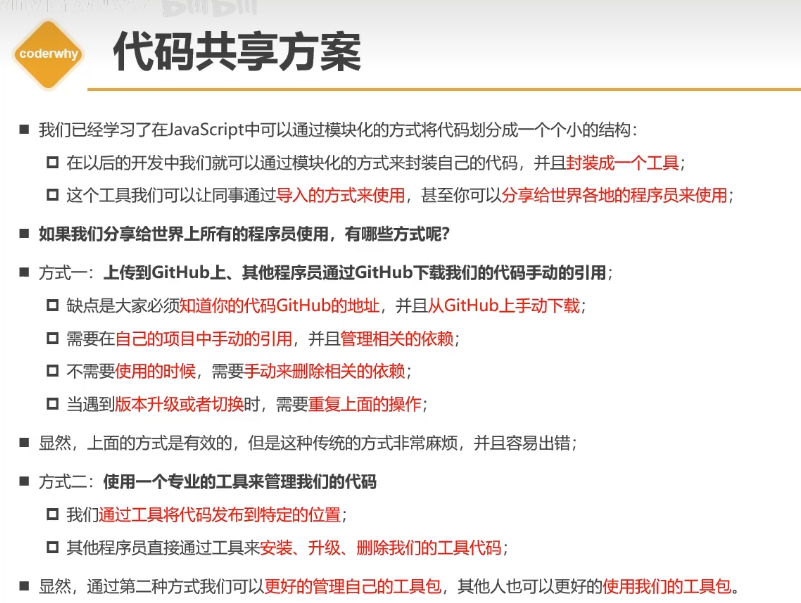
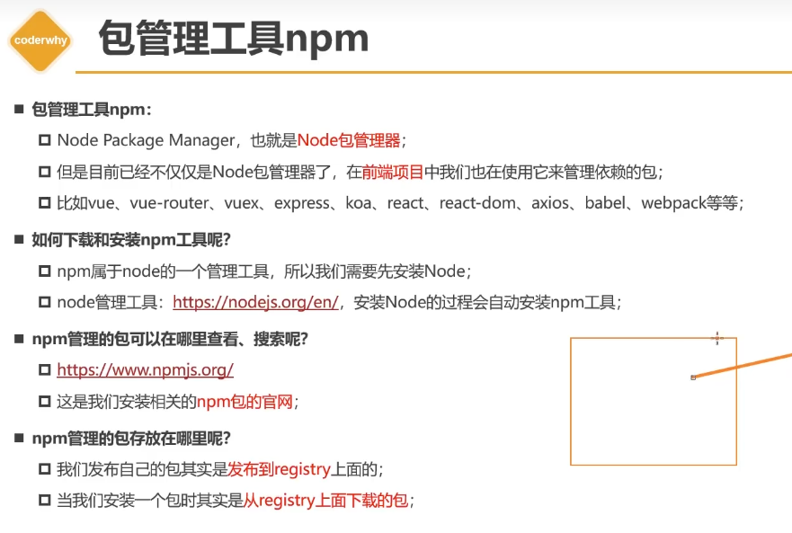

# 包管理工具

## NPM包管理工具

https://www.bilibili.com/video/BV1U44y1f7ZZ


### 1 NPM包管理工具

代码共享方案

- 在官网/github提供js包，下载后通过srcipt标签手动引用
- 使用npm下载包，然后直接模块化引用
  - 再次执行可以更新



NPM

- Node包管理器
- 现在前端的webpack也基于node，所以前端也能用
- 比如vue、koa、babel、webpack等包

安装：安装node就会自动安装npm

npm包官网 

registry仓库



初始化项目

```bash
npm init
```

安装包

```bash
npm install xxx
```

### 2 package配置文件

##### package.json

```js
{
  "name": "snake",//项目名称
  "version": "1.0.0",//项目的版本
  "description": "",//项目描述
  "main": "webpack.config.js",//项目的入口文件
  "scripts": {//项目的脚本
    "test": "echo \"Error: no test specified\" && exit 1",
    "build": "webpack",
    "start": "webpack serve --open chrome.exe"
  },
  "keywords": [],//关键字
  "author": "",//作者
  "license": "ISC",//
  "devDependencies": {//开发环境依赖项
    "clean-webpack-plugin": "^4.0.0",
    "ts-loader": "^9.4.2",
    "typescript": "^5.0.4",
    "webpack": "^5.83.1",
    "webpack-cli": "^5.1.1",
    "webpack-dev-server": "^4.15.0"
  },
  "dependencies": {//生产环境依赖项
    "scss-loader": "^0.0.1"
  }
}
```

初始化包

```bash
npm init #填写信息
npm init -y #yes，使用默认信息
```

private属性：记录当前项目私有，防止私有项目/模块发布。默认为true


### 3 npm install原理

### 4 yarn、cnpm、npx

### 5 发布自己的开发包

### 6 pnmp使用和原理


## yarn包管理工具

https://yarn.nodejs.cn

### 一、入门

#### 安装

安装 npm 后，你可以运行以下命令 **安装** 和 **更新** Yarn：

```
npm install --global yarn
```

  通过运行以下命令检查 Yarn 是否已安装：

```
yarn --version
```

#### 基本命令

**开始新项目**

```
yarn init
```

**添加依赖**

```
yarn add [package]
yarn add [package]@[version]
yarn add [package]@[tag]
```

**将依赖添加到不同类别的依赖**

分别添加到 `devDependencies`、`peerDependencies`、`optionalDependencies`：

```
yarn add [package] --dev
yarn add [package] --peer
yarn add [package] --optional
```

**升级依赖**

```
yarn upgrade [package]
yarn upgrade [package]@[version]
yarn upgrade [package]@[tag]
```

**删除依赖**

```
yarn remove [package]
```

**安装项目所有依赖**

```
yarn
```

或者

```
yarn install
```

### 二、工作流程

#### 创建新项目

在终端/控制台中要添加 Yarn 的目录（几乎应该始终是项目的根目录）中，运行以下命令：

```
yarn init
```

这将打开一个交互式表单，用于创建一个新的 Yarn 项目

运行 `yarn init` 时，它所做的就是创建package.json文件。 后台什么也没有发生。 你可以随意编辑此文件。

你的 `package.json` 用于存储有关你的项目的信息。 这包括项目的名称、维护者、源代码所在的位置，但最重要的是项目需要安装哪些依赖。

#### 管理依赖

当你想要添加、升级或删除依赖时，你需要了解几个不同的命令。

每个命令都会自动更新你的 [`package.json`](https://yarn.nodejs.cn/en/docs/package-json) 和 [`yarn.lock`](https://yarn.nodejs.cn/en/docs/yarn-lock) 文件。

##### 添加依赖

如果要使用其他包，首先需要将其添加为依赖。 为了做到这一点，你应该运行：

```
yarn add [package]
```

这会自动将 `[package]` 添加到 `package.json` 中的依赖中。 它还会更新你的 `yarn.lock` 以反映更改。

```
  {
    "name": "my-package",
    "dependencies": {
+     "package-1": "^1.0.0"
    }
  }
```

你还可以使用标志添加其他 [依赖类型](https://yarn.nodejs.cn/en/docs/dependency-types)：

- `yarn add --dev` 添加到 `devDependencies`
- `yarn add --peer` 添加到 `peerDependencies`
- `yarn add --optional` 添加到 `optionalDependencies`

你可以通过指定 [依赖版本](https://yarn.nodejs.cn/en/docs/dependency-versions) 或 [tag](https://yarn.nodejs.cn/en/docs/cli/tag) 来指定要安装的软件包版本。

```
yarn add [package]@[version]
yarn add [package]@[tag]
```

`[version]` 或 `[tag]` 将添加到 `package.json` 中，然后在安装依赖时进行解析。

例如：

```
yarn add package-1@1.2.3
yarn add package-2@^1.0.0
yarn add package-3@beta
{
  "dependencies": {
    "package-1": "1.2.3",
    "package-2": "^1.0.0",
    "package-3": "beta"
  }
}
```

##### 升级依赖

```
yarn upgrade [package]
yarn upgrade [package]@[version]
yarn upgrade [package]@[tag]
```

这将升级你的 `package.json` 和 `yarn.lock` 文件。

```
  {
    "name": "my-package",
    "dependencies": {
-     "package-1": "^1.0.0"
+     "package-1": "^2.0.0"
    }
  }
```

##### 删除依赖

当你想要添加、升级或删除依赖时，你需要了解几个不同的命令。

每个命令都会自动更新你的 [`package.json`](https://yarn.nodejs.cn/en/docs/package-json) 和 [`yarn.lock`](https://yarn.nodejs.cn/en/docs/yarn-lock) 文件。

#### 安装依赖

如果你刚刚从 [版本控制](https://yarn.nodejs.cn/en/docs/version-control) 签出软件包，则需要安装这些依赖。

> 如果你的项目是 [添加依赖](https://yarn.nodejs.cn/en/docs/managing-dependencies#toc-adding-a-dependency)，那么这些依赖会在此过程中自动安装。

[`yarn install`](https://yarn.nodejs.cn/en/docs/cli/install) 用于安装项目的所有依赖。 从项目的 `package.json` 文件中检索依赖，并将其存储在 `yarn.lock` 文件中。

开发包时，安装依赖通常是在以下之后完成：

1. 你刚刚签出了需要这些依赖才能运行的项目的代码。
2. 该项目的另一位开发者添加了一个新的依赖，你需要选择该依赖。

安装依赖有很多选项，包括：

1. 安装所有依赖： `yarn` 或 `yarn install`
2. 安装一个且仅一个版本的软件包： `yarn install --flat`
3. 强制重新下载所有包： `yarn install --force`
4. 仅安装生产依赖： `yarn install --production`

请参阅 [完整列表](https://yarn.nodejs.cn/en/docs/cli/install) 个可传递给 `yarn install` 的标志。

#### 使用版本控制

为了让人们成功开发或使用你的软件包，你需要确保所有必要的文件都已签入你的源代码控制系统。

必须将以下文件签入源代码管理，以便任何人都能够管理你的包：

- `package.json`： 这包含你的包的所有当前依赖。
- `yarn.lock`： 这存储了包的每个依赖的确切版本。
- 为你的包提供功能的实际源代码。

#### 持续集成（不懂）

### 六、依赖和版本

包依赖对于包的成功至关重要。 当你开发包的功能时，你很可能会使用其他包中定义的现有代码。 这些包随后将成为你项目的依赖。

你的 `package.json` 文件是所有依赖声明的所在地，从开发到生产再到可选。 你将为每个依赖指定包名称和最低版本信息。

你的 `yarn.lock` 文件通过存储与你的软件包一起安装的依赖的版本来确保你的软件包在安装过程中保持一致。

#### 依赖的类型

依赖有许多不同的用途。 构建项目需要一些依赖，运行程序时需要其他依赖。 因此，你可以拥有多种不同类型的依赖（例如 `dependencies`、`devDependencies` 和 `peerDependencies`）。

你的 `package.json` 将包含所有这些依赖：

```
{
  "name": "my-project",
  "dependencies": {
    "package-a": "^1.0.0"
  },
  "devDependencies": {
    "package-b": "^1.2.1"
  },
  "peerDependencies": {
    "package-c": "^2.5.4"
  },
  "optionalDependencies": {
    "package-d": "^3.1.0"
  }
}
```

大多数人只有 `dependencies` 和 `devDependencies`，但理解它们都很重要。

`dependencies` 

这些是你的正常依赖，或者更确切地说是你运行代码时需要的依赖（例如 React 或 ImmutableJS）。

`devDependencies` 

这些是你的开发依赖。 你在开发工作流程中的某个时刻需要但在运行代码时不需要的依赖（例如 Babel 或 Flow）。

`peerDependencies` 

对等依赖是一种特殊类型的依赖，只有在你发布自己的包时才会出现。

具有对等依赖意味着你的包需要一个与安装你的包的人完全相同的依赖。 这对于像 `react` 这样需要有 `react-dom` 的单个副本（也可供安装它的人使用）的软件包很有用。

`optionalDependencies` 

可选依赖就是： 可选的。 如果安装失败，Yarn 仍会说安装过程已成功。

这对于不一定在每台机器上都有效的依赖很有用，并且你有一个后备计划，以防它们未安装（例如 Watchman）。

`bundledDependencies` 

发布包时将打包的包名称数组。

打包的依赖应该位于你的项目内部。 功能与普通依赖基本相同。 运行 `yarn pack` 时它们也会被打包。

普通依赖通常从 npm 注册表安装。 当普通依赖不够时，打包依赖非常有用：

- 当你想要重用不是来自 npm 注册表或已修改的第三方库时。
- 当你想将自己的项目作为模块重新使用时。
- 当你想用你的模块分发一些文件时。

#### 依赖的版本

语义化版本控制：https://semver.org/lang/zh-CN/

Yarn 中的包遵循 [语义版本控制](http://semver.org/)，也称为 “semver”。 当你从注册表安装新软件包时，它将使用 semver 版本范围添加到你的 `package.json` 中。

这些版本分为 `major.minor.patch`，看起来像以下之一： `3.14.1`、`0.42.0`、`2.7.18`。 版本的每个部分都会在不同的时间递增：

- 当你对包的 API 进行 **breaking** 或 **incompatible** 更改时，增加 `major`。
- 在保持 **backwards-compatible** 的同时添加 **新功能** 时增加 `minor`
- 当你在保持 **backwards-compatible** 的同时完成 **bug 修复** 时，增加 `patch`

> **Note:** 有时，semver 格式也有 “labels” 或 “extensions”，用于标记预发布或测试版等内容（例如 `2.0.0-beta.3`）

当开发者谈论两个 semver 版本彼此为 “compatible” 时，他们指的是 **backwards-compatible** 更改（`minor` 和 `patch`）。

---

##### 版本范围

当你想要指定依赖时，你可以指定其名称和 `package.json` 中的 **版本范围**，如下所示：

```
{
  "dependencies": {
    "package-1": ">=2.0.0 <3.1.4",
    "package-2": "^0.4.2",
    "package-3": "~2.7.1"
  }
}
```

你会注意到我们有一堆与版本分开的字符。 这些字符 `>=`、`<`、`^` 和 `~` 是 **operators**，它们用于指定 **版本范围**。

版本范围的目的是指定依赖的哪些版本适用于你的代码。

语法：https://yarn.nodejs.cn/en/docs/dependency-versions

##### 选择性依赖解决方案

Yarn 支持选择性版本解析，它允许你通过 [`package.json`](https://yarn.nodejs.cn/docs/package-json) 文件中的 `resolutions` 字段定义依赖内的自定义包版本或范围。 通常，这需要在 `yarn.lock` 文件中进行手动编辑。

完整规范请参见 [选择性版本决议 RFC](https://github.com/yarnpkg/rfcs/blob/master/implemented/0000-selective-versions-resolutions.md)。

使用到的可能情况：

- 你可能依赖于一个不经常更新的软件包，而这又依赖于另一个进行了重要升级的软件包。 在这种情况下，如果你的直接依赖指定的版本范围没有覆盖新的子依赖版本，你就会陷入等待作者的困境。
- 你的项目的子依赖获得了重要的安全更新，并且你不想等待直接依赖发布最低版本更新。
- 你依赖于一个未维护但可以工作的包，并且它的依赖之一已升级。 你知道升级不会破坏任何东西，并且你也不想复刻你所依赖的包，只是为了更新次要依赖。
- 你的依赖定义了广泛的版本范围，并且你的子依赖刚刚获得了有问题的更新，因此你希望将其固定到早期版本。

使用操作：

将 `resolutions` 字段添加到 `package.json` 文件并定义你的版本覆盖：

**package.json**

```
{
  "name": "project",
  "version": "1.0.0",
  "dependencies": {
    "left-pad": "1.0.0",
    "c": "file:../c-1",
    "d2": "file:../d2-1"
  },
  "resolutions": {
    "d2/left-pad": "1.1.1",
    "c/**/left-pad": "^1.1.2"
  }
}
```

然后运行 `yarn install`。

### 七、配置

Yarn 会查找 `package.json` 文件来识别每个包并配置在该包内运行时 Yarn 的行为。

`pet-kitten` 包的示例配置可在 `pet-kitten/package.json` 中找到：

```
{
  "name": "pet-kitten",
  "version": "0.1.0",
  "main": "pet.js",
  "dependencies": {
    "hand": "1.0.0"
  }
}
```

Yarn 还在项目根目录中使用 `yarn.lock` 文件来使依赖解析快速可靠。 你永远不需要接触这个文件，yarn 拥有它，并且在管理依赖时会更改它。

为了确保你的应用始终如一地运行，**你应该始终将 `yarn.lock` 文件保存在代码存储库中。**

#### package.json

`package.json` 中最重要的两个字段是 `name` 和 `version`，没有它们，你的软件包将无法安装。 `name` 和 `version` 字段一起使用来创建唯一的 id。

##### name

```
{
  "name": "my-awesome-package"
}
```

这是你的包的名称。 它在 URL 中使用，作为命令行上的参数，以及 `node_modules` 中的目录名。

```
yarn add [name]
node_modules/[name]
https://registry.npmjs.org/[name]/-/[name]-[version].tgz
```

**规则**

- 必须小于或等于 214 个字符（包括范围包的 `@scope/`）。
- 不得以点 (`.`) 或下划线 (`_`) 开头。
- 名称中不得包含大写字母。
- 必须仅使用 URL 安全字符。

**提示**

- 不要使用与核心 Node.js 模块相同的名称
- 请勿在名称中添加 `js` 或 `node`。
- 保持名称简短且具有描述性。 你希望人们从名称中了解它是什么，但它也会在 `require()` 调用中使用。
- 确保 [registry](https://www.npmjs.com/) 中没有同名的内容。

##### 其他

https://yarn.nodejs.cn/en/docs/package-json

#### 环境变量

#### .yarnrc

`.yarnrc` 文件允许你配置其他 Yarn 功能。 [`config` 命令](https://yarn.nodejs.cn/en/docs/cli/config/) 也可用于设置这些选项。 Yarn 会将 `.yarnrc` 个文件合并到文件树中。

#### .yarn.lock

为了获得跨机器的一致安装，Yarn 需要比你在 `package.json`.conf 中配置的依赖更多的信息。 Yarn 需要准确存储安装的每个依赖的版本。

为此，Yarn 在项目根目录中使用 `yarn.lock` 文件。 这些 “lockfiles” 看起来像这样：

```
# THIS IS AN AUTOGENERATED FILE. DO NOT EDIT THIS FILE DIRECTLY.
# yarn lockfile v1
package-1@^1.0.0:
  version "1.0.3"
  resolved "https://registry.npmjs.org/package-1/-/package-1-1.0.3.tgz#a1b2c3d4e5f6g7h8i9j0k1l2m3n4o5p6q7r8s9t0"
package-2@^2.0.0:
  version "2.0.1"
  resolved "https://registry.npmjs.org/package-2/-/package-2-2.0.1.tgz#a1b2c3d4e5f6g7h8i9j0k1l2m3n4o5p6q7r8s9t0"
  dependencies:
    package-4 "^4.0.0"
package-3@^3.0.0:
  version "3.1.9"
  resolved "https://registry.npmjs.org/package-3/-/package-3-3.1.9.tgz#a1b2c3d4e5f6g7h8i9j0k1l2m3n4o5p6q7r8s9t0"
  dependencies:
    package-4 "^4.5.0"
package-4@^4.0.0, package-4@^4.5.0:
  version "4.6.3"
  resolved "https://registry.npmjs.org/package-4/-/package-4-2.6.3.tgz#a1b2c3d4e5f6g7h8i9j0k1l2m3n4o5p6q7r8s9t0"
```

这与其他包管理器（如 Bundler 或 Cargo）中的锁定文件相当。 它与 npm 的 `npm-shrinkwrap.json` 类似，但它不是有损的，并且可以创建可重现的结果。

- 你的 `yarn.lock` 文件是自动生成的，应该完全由 Yarn 处理。 当你使用 Yarn CLI 添加/升级/删除依赖时，它将自动更新你的 `yarn.lock` 文件。 不要直接编辑此文件，因为很容易破坏某些内容。
- 在安装过程中，Yarn 将仅使用顶层 `yarn.lock` 文件，并忽略依赖中存在的任何 `yarn.lock` 文件。 顶层 `yarn.lock` 文件包含 Yarn 锁定整个依赖树中所有包的版本所需的所有内容。
- 所有 `yarn.lock` 文件都应签入源代码管理（例如 git 或 Mercurial）。 这允许 Yarn 在所有机器上安装完全相同的依赖树，无论是你同事的注意本电脑还是 CI 服务器。框架和库作者还应该将 `yarn.lock` 检查到源代码管理中。 不必担心发布 `yarn.lock` 文件，因为它不会对库的用户产生任何影响。