# 噪声

https://www.bilibili.com/video/BV11V4y1M7N6

随机的噪声：白噪声

平滑的噪声：

- 柏林噪声
- 值噪声
- Simplex噪声
- FBM噪声叠加

## 柏林噪声函数

输入空间中任意一点，返回[-1,1]的值

#### 要点

1.晶格：能把整个空间分片的单元

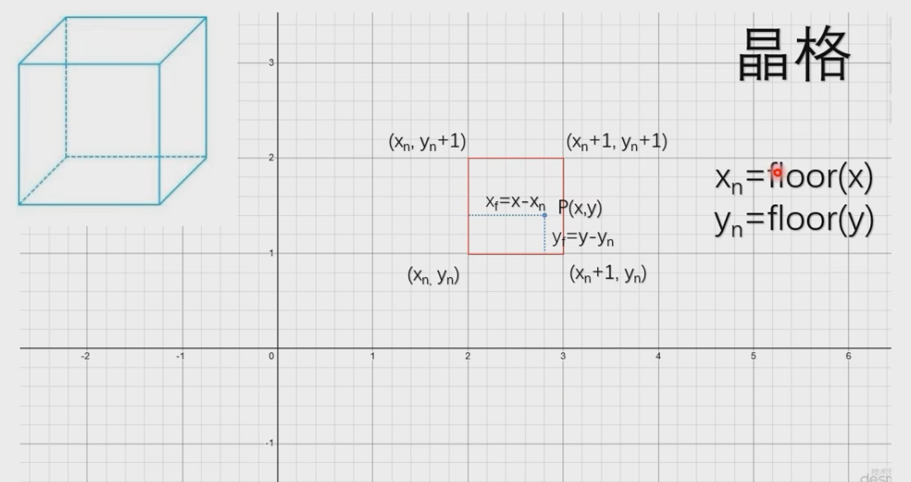

2.梯度向量

不同的顶点坐标会返回不同的向量，相同的顶点坐标会返回相同的向量

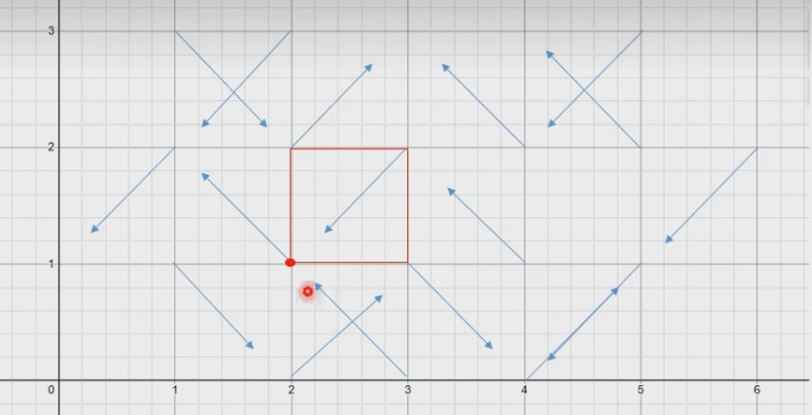

3.顶点的距离向量和晶格左下角的梯度向量点积，共计算四个点积

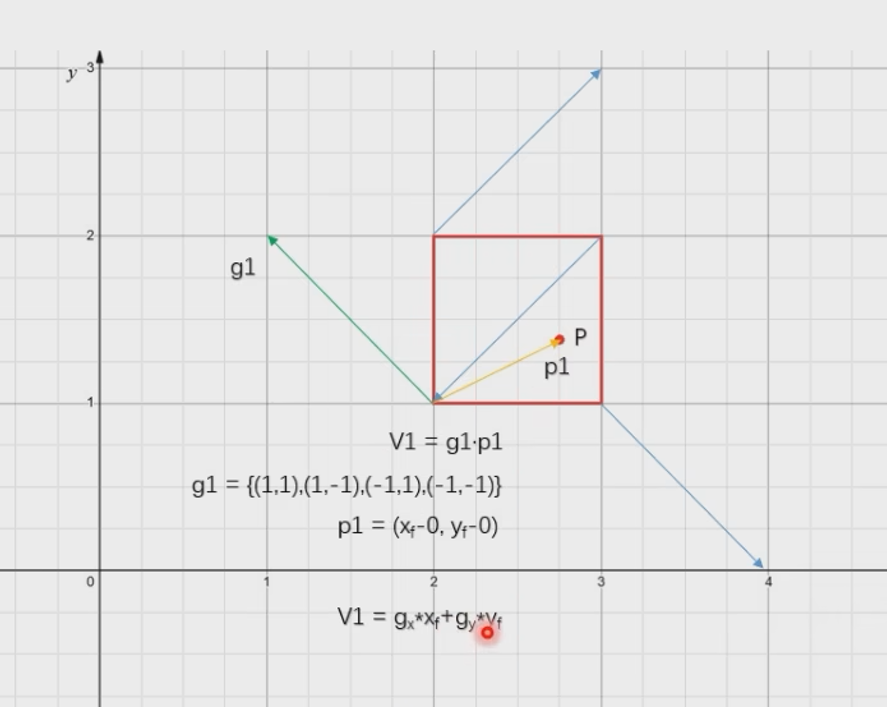

4.各个方向上对各个顶点进行线性插值

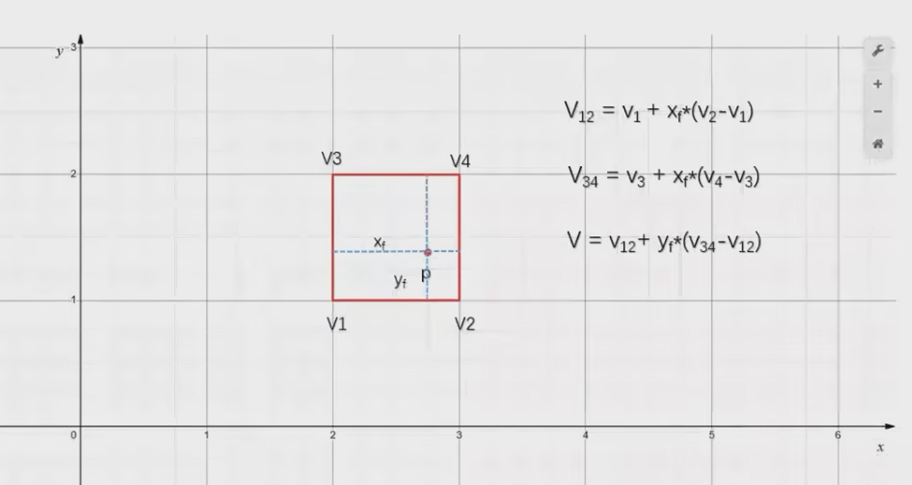

5.引入缓和曲线，解决晶格处突变的问题

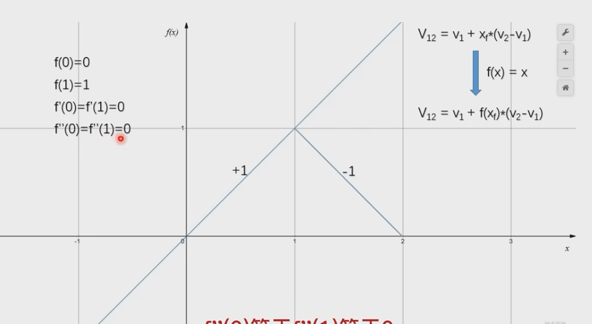

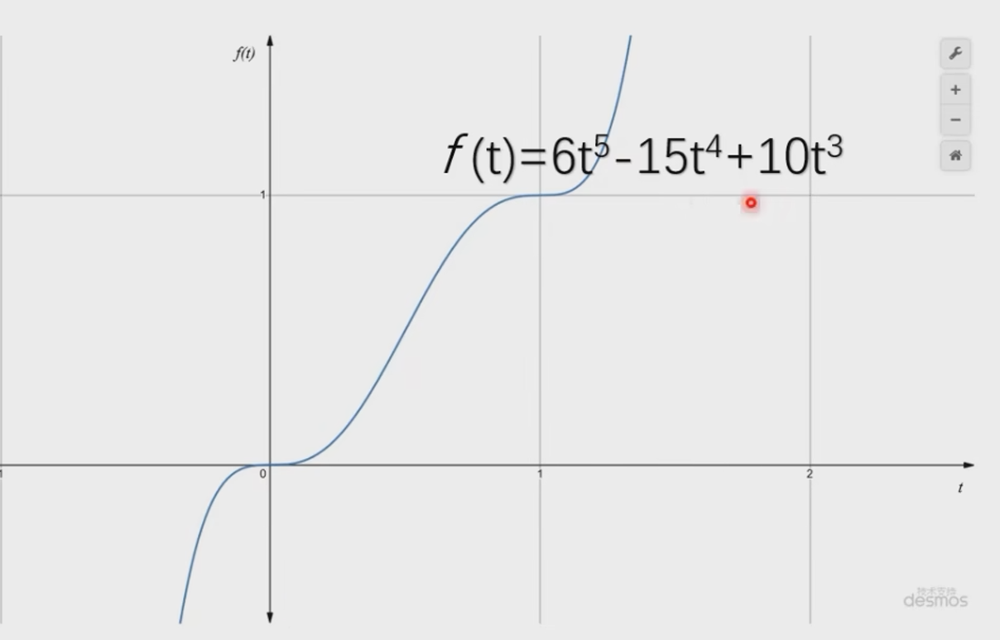

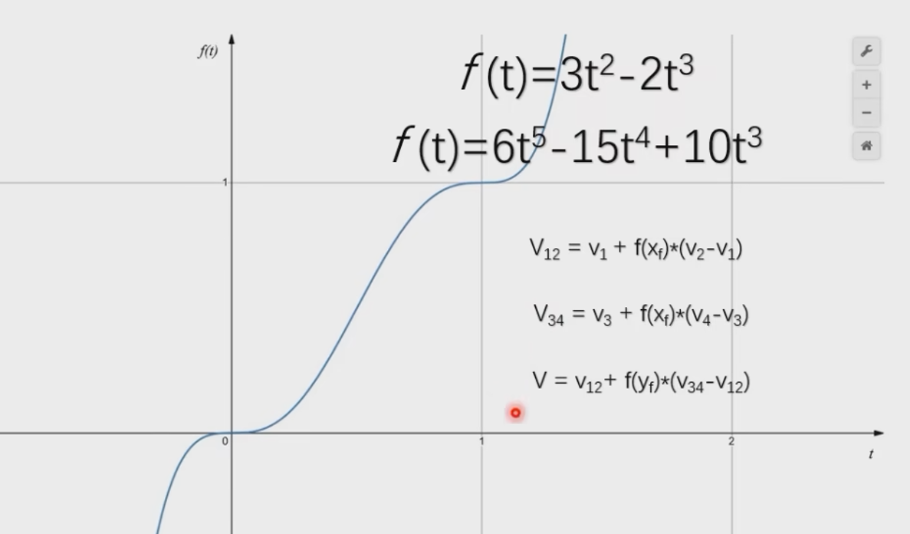

引入缓和曲线进行插值

6.获取伪随机梯度向量

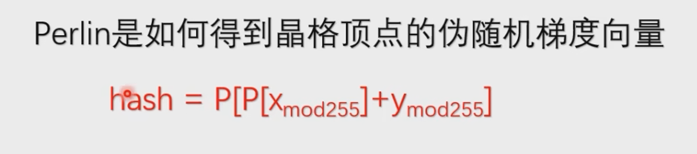

7.归一化

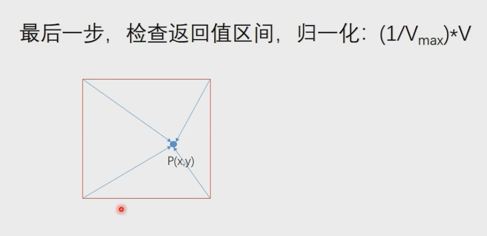

#### c源码

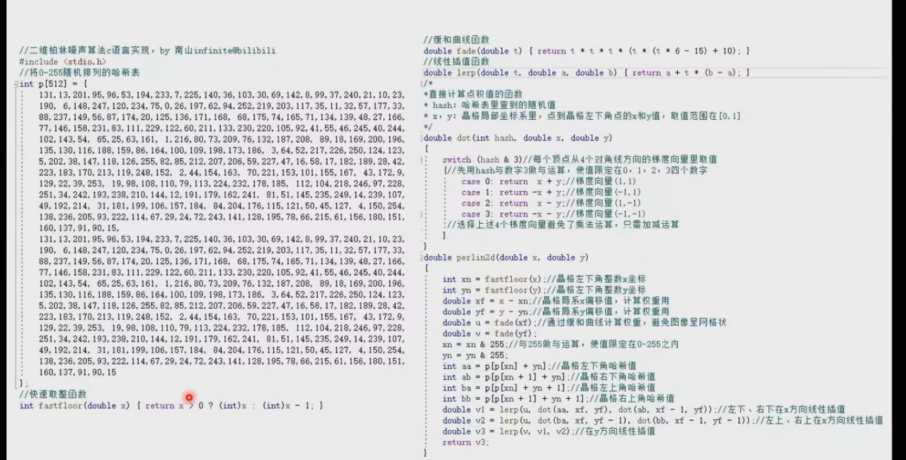

## FBM叠加

单一噪声不满足要求，需要进行叠加。

FBM：分形布朗运动

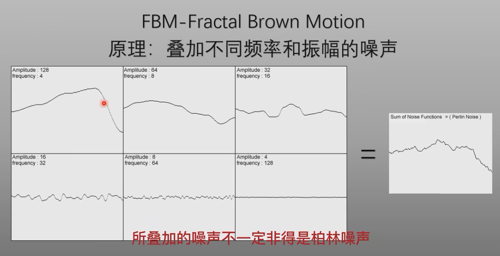

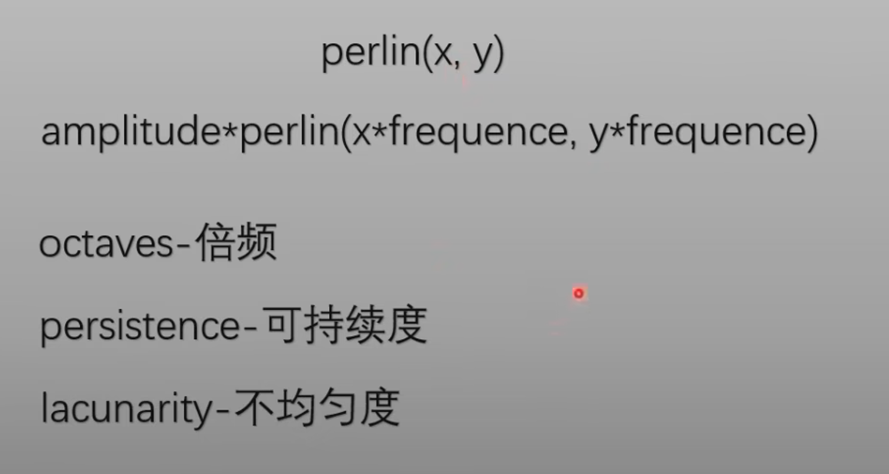

- 倍频：叠加次数
- 可持续度：振幅的变化率
- 不均匀度：频率的变化率
- 初始频率和初始振幅

## Value噪声函数

## Simplex噪声函数