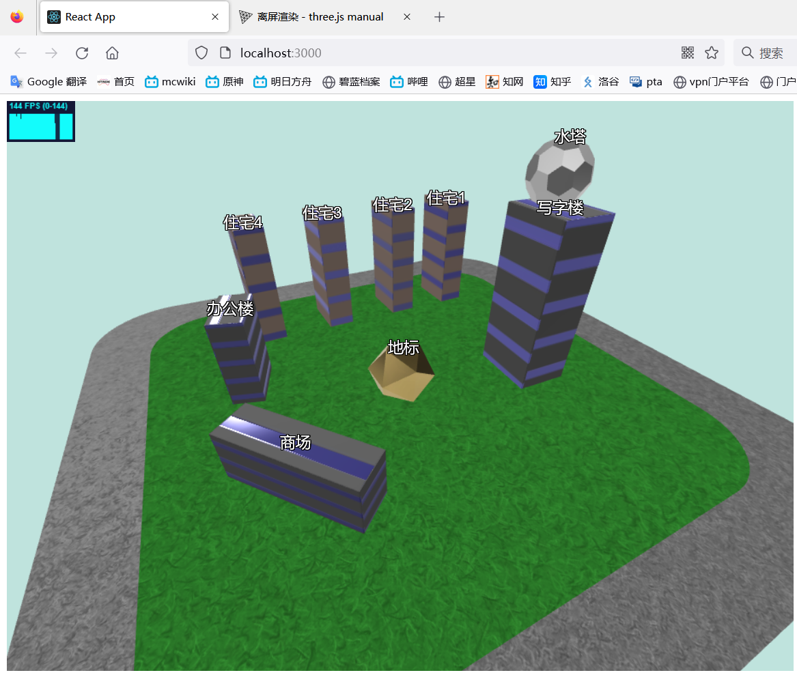
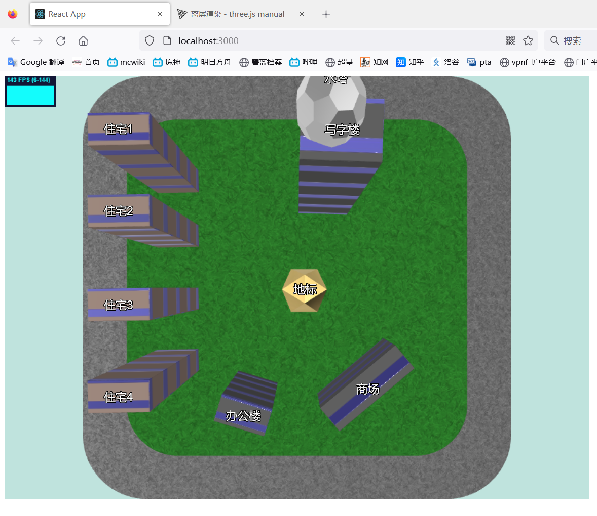
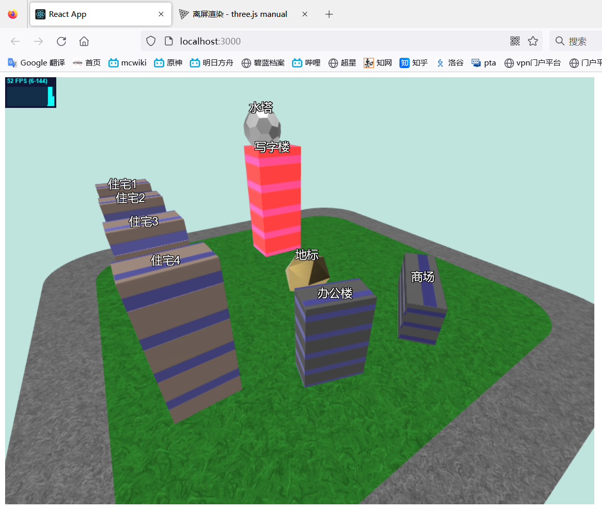
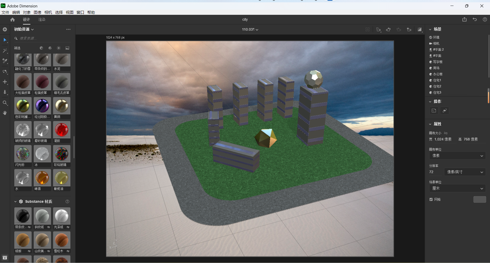

# 网页渲染3D内容

#### 原理

- webGL是通过JavaScript操作OpenGL接口的一套图形API，可在Web浏览器中渲染2D/3D图形。而Three.js对于webGL进行封装，使得可用较为简单的代码实现3D图形的渲染。
- 使用react脚手架作为开发环境，调用Three.js渲染3D模型，并提供可能的交互行为

#### 要点

- 创建场景、相机、渲染器、轨道控制器、光源
- 加载外部3D模型
- 定义物体选择器的类用于选中物体（未来可在此拓展物体交互行为）
- 创建html标签并对齐指定物体
- 添加FPS监视器

#### 网页截图

##### 模型展示

##### 模型俯视

##### 鼠标选中物体（闪烁红光）

#### 3d建模过程截图

