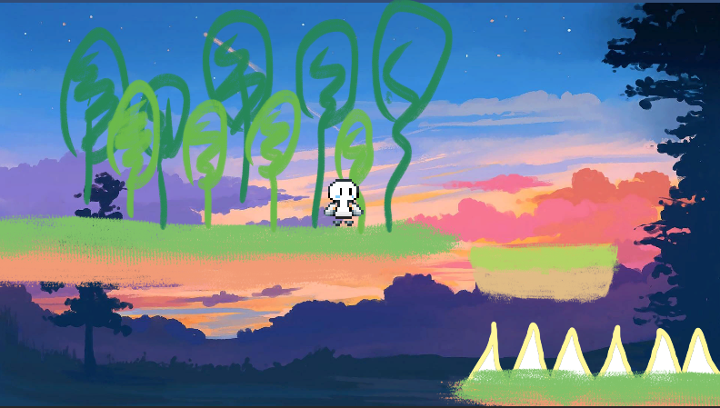
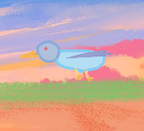
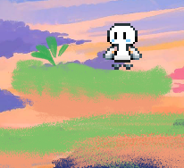
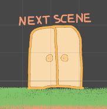
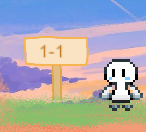
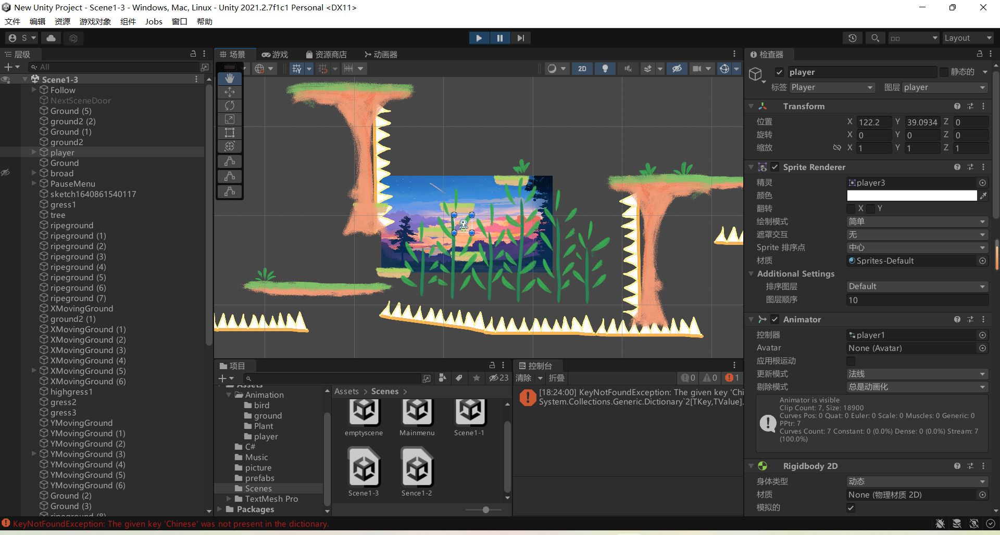

## Unity2D游戏：控制角色避开危险并到达终点

该程序/系统可提供访问 ：）

## 简介

该程序为笔者大一秋季学期编写。该程序为一种横版动作游戏，灵感来源于动画短片《Kaizo Trap》（孔明的陷阱）。游戏内容为控制角色移动、避开危险并到达终点以取得胜利，游戏引擎为Unity。

### 操作

角色：向左移动：A/←，向右移动：D/→，跳跃/二段跳：W/space，疾跑：移动+X
系统：暂停：Esc，退出暂停：Esc

地刺

凶鸟

### 游戏设定

地刺：这种尖刺扎到角色会使角色退场

凶鸟：这种鸟会在一定范围内来回移动，被它的喙和爪击中会导致角色退场，但是背部是它的弱点。可通过踩踏背部使凶鸟退场。

坠落：如果角色跳下了悬崖，场景底部有巨大的地刺等着他！

### 场景设计

固定地块

移动地块

关卡终点

关卡起点

关卡终点：到达终点以进入下一关卡；到达最后一关的终点即获得胜利。

关卡起点：每一个关卡（场景）的起始点和重生位置

固定地块：可为角色提供落脚点，固定不动

移动地块：可为角色提供落脚点，按一定逻辑做往返运动。颜色比固定地块稍浅。

### 下载

百度网盘：https://pan.baidu.com/s/16Ggf39uU6Ws9foCJgchybw?pwd=1111

### 使用展示

暂无

### 系统实现

Unity提供了一个很便捷的框架，笔者只需在Photoshop和Asepritr绘制角色和场景素材，在Unity的场景编辑器可视化编辑场景，编写C#脚本控制角色和场景的行为

例如凶鸟的设计
在photoshop里绘制鸟飞行的多个帧，链接便获得了鸟的飞行动画。
鸟的身上放置两种碰撞箱，一种检测到碰撞就使角色退场，另一种（鸟背部的弱点）检测到碰撞就使鸟退场(播放死亡动画，然后删除掉鸟这个对象），这样就实现了鸟和角色的交互。
脚本为鸟添加速度、坐标最大/最小值等属性，方便在场景编辑器里设置鸟的运行范围。鸟运行到范围外时使速度乘以-1，这样就实现了鸟在一定范围内运动。
实现了鸟这种类型，在场景编辑器里设置鸟的初始位置，编辑实例化后鸟的属性即可完成鸟在场景中的部署。