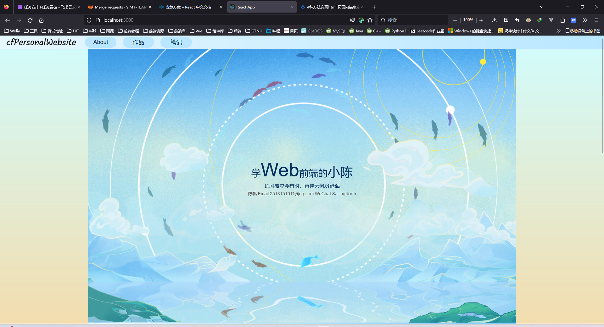
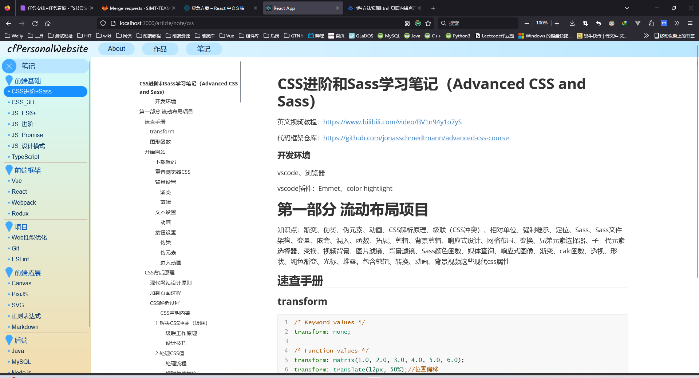
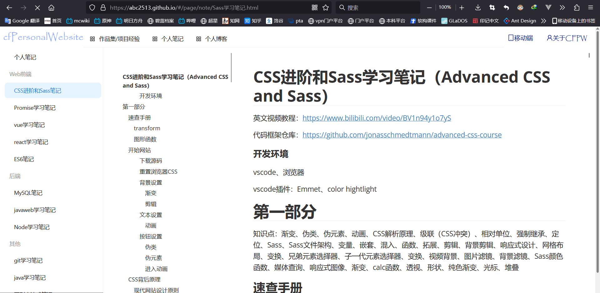
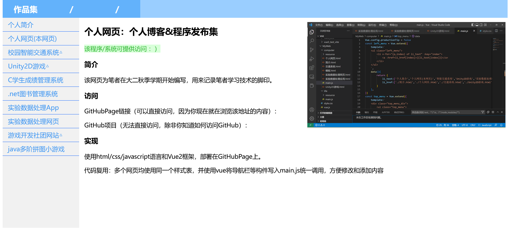

# 个人网站

## 概览

个人网站，纯前端项目（便于部署在GitHub Page上），用于存放和展示个人作品集等内容。第二版网站可提供便捷的复用

1. 第一版网站
   1. 采用Vue编写，多页面网站
   2. 文章需要写入html代码
2. 第二版网站
   1. 采用React脚手架编写，使用react路由，单页面web应用
   2. 使用ante组件库，优化页面
   3. 文章只需要使用==Markdown==、HTML、PDF放入指定文件夹，并编写JSON格式的目录文件即可。网站使用AXIOS读取，并使用marked、PDF Reader显示
   4. 以上工作均考虑到==供他人复用==。构建后的网站文件，可供他人使用（无需更改代码）
3. 第三版网站
   1. 文章显示、读取部分沿用了第二版
   2. 使用函数式组件+hook
   3. 合并目录文件到config文件，以减少网络请求次数。config文件内同时可存放配色方案等内容。
   4. 使用pixi.js绘制了精美的==canvas背景动态首页==
   5. 使用redux存储数据，优化了不必要的重复请求
   6. 不再使用第三方组件库，自己封装高度==定制化的组件==，并添加恰到好处的动画效果
   7. ==响应式设计==，桌面优先，但在移动端同样可获得良好的使用体验
   8. 由于网站首页高度定制化，不再提供他人使用的支持

## 第三版网站 CFPP_2

CFPP_2项目，于2023/9开始。重构自第二版的个人网站(CFPP)

### canvas动态背景首页



### 文章显示页面



## 第二版网站 CFPP

github仓库地址：https://github.com/abc2513/CFPersonalWebsite

基本DEMO展示：https://abc2513.github.io/CFPersonalWebsite/demo/

笔者网站展示：https://abc2513.github.io/

本项目于2023/3/29（笔者大二春季学期）提出，目标是开发一款易用性好、复用性高、页面优美的个人作品集展示网站。



### 更新

v0.4 

4/21 优化了左侧菜单过长时，右侧显示文件窗口滚动问题

2023/4/14 优化MD文件读取方式，需要将md读取器放到每个文章目录下，但解决了md文件路径问题

2023/4/4 修复BUG：转移页面瞬间仍尝试显示原来的文件

v0.3 实现PDF文件和HTML文件显示

v0.2 优化目录数据结构，优化文件结构

v0.1 实现基本结构，能够识别目录、显示md

### 架构说明

#### 整体架构

使用React脚手架，分别开发用于移动端、桌面端的两套单页面网络应用，从静态JSON中读取目录、从md/html/pdf中读取内容并展示。网站本身是静态的，方便使用者将其免费地部署到GithubPage上，通过向github仓库推送JSON文件更新内容。

#### 数据文件

位于`/data`文件夹下，包含目录配置文件、文章内容

#### 桌面端应用

单页面网络应用，使用Ant Design组件库（已完成）

#### 移动端应用

单页面网络应用，使用Ant Design Mobile组件库（计划中）

### 文件说明

#### 概念图


#### 目录文件

##### 顶部导航栏

###### 概念说明

顶部导航栏用于不同page（比如作品集和博客集）的切换

###### 数据说明

key是识别不同内容的唯一标识，除了index以外所有的key不能重复；title是显示在导航栏上的文字

###### 位置

`/data/catalogue/page.json`

###### 示例

```js
[
    {
        "key":"work",
        "title":"作品集/项目经验"
    },
    {
        "key":"blog",
        "title":"个人博客"
    },
    {
        "key":"note",
        "title":"个人笔记"
    }
]
```

##### 侧边导航栏

###### 概念说明

一个page（比如作品集）拥有一个侧边导航栏，用于一系列文章（比如一系列xxxxx.md文件）的切换。

###### 数据说明

- key是识别不同内容的唯一标识，除了index以外所有的key不能重复；
- label是显示在侧边栏的文字；
- file是内容对应的文件名，文件需要放在`/data/article/page的key名/文件名`；
- 在没有file的情况下，使用children可以使用子导航栏
- 子导航栏可以添加`"type":"group"`可以

###### 位置

`/data/catalogue/{page名}.json`，比如在顶部导航栏配置了一个key为work的page，则该页面的侧边菜单栏配置文件就是`/data/catalogue/page的key名.json`

###### 示例

```js
[
    {
        "key":"index",
        "label":"个人博客",
        "file":"index.md"
    },
    {
        "key":"blog-se",
        "label":"hit软件构造",
        "children":[
            {
                "key":"blog-se-lab1",
                "label":"软构lab1",
                "file":"index.md"
            },
            {
                "key":"blog-se-lab2",
                "label":"软构lab2",
                "file":"index.md"
            },
            {
                "key":"blog-se-lab3",
                "label":"软构lab3",
                "file":"index.md"
            }
        ],
        "type":"group"
    }
]
```

#### 静态文件

##### 展示内容数据

###### 概念说明

用于展示的内容，比如文章、PDF、网页。

###### 数据说明

目前支持的文件类型有markdown、html、pdf 。

###### 位置

`/data/article/page的key名/展示内容文件`

###### ==安装md阅读器==

请将`/lab/md-reader/`下的所有文件复制到`/data/article/page的key名/`下。

（由于一些路径问题，不得不采取这样的实现方式）

## 第一版

### 简介

该网页为笔者在大二秋季学期开始编写，用来记录笔者学习技术的脚印。

### 实现

使用html/css/javascript语言和Vue2框架，部署在GitHubPage上。

代码复用：多个网页均使用同一个样式表，并使用vue将导航栏等构件写入main.js统一调用，方便修改和添加内容


