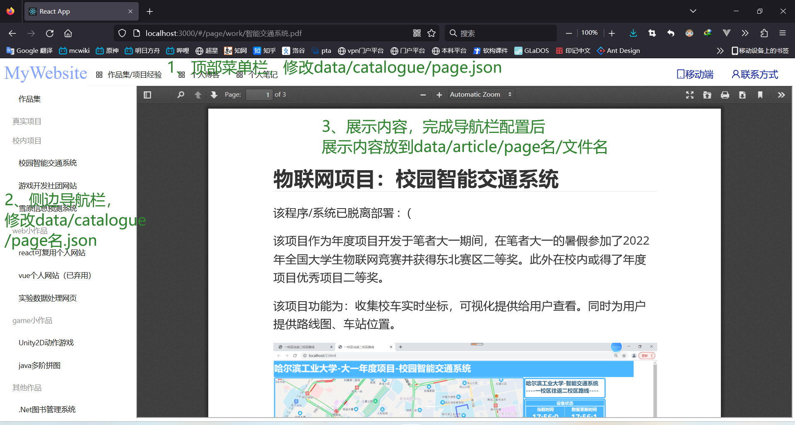

# React可复用个人网站


本项目于2023/3/29（笔者大二春季学期）提出，目标是开发一款易用性好、复用性高、页面优美的个人作品集展示网站。

### 架构说明

#### 整体架构

使用React脚手架，分别开发用于移动端、桌面端的两套单页面网络应用，从静态JSON中读取目录、从md/html/pdf中读取内容并展示。网站本身是静态的，方便使用者将其免费地部署到GithubPage上，通过向github仓库推送JSON文件更新内容。

#### 数据文件

位于`/data`文件夹下，包含目录配置文件、文章内容

#### 桌面端应用

单页面网络应用，使用Ant Design组件库

#### 移动端应用

单页面网络应用，使用Ant Design Mobile组件库

### 文件说明

#### 概念图



#### 目录文件

##### 顶部导航栏

###### 概念说明

顶部导航栏用于不同page（比如作品集和博客集）的切换

###### 数据说明

key是识别不同内容的唯一标识，除了index以外所有的key不能重复；title是显示在导航栏上的文字

###### 位置

`/data/catalogue/page.json`

###### 示例

```js
[
    {
        "key":"work",
        "title":"作品集/项目经验"
    },
    {
        "key":"blog",
        "title":"个人博客"
    },
    {
        "key":"note",
        "title":"个人笔记"
    }
]
```

##### 侧边导航栏

###### 概念说明

一个page（比如作品集）拥有一个侧边导航栏，用于一系列文章（比如一系列xxxxx.md文件）的切换。

###### 数据说明

- key是识别不同内容的唯一标识，除了index以外所有的key不能重复；
- label是显示在侧边栏的文字；
- file是内容对应的文件名，文件需要放在`/data/article/page的key名/文件名`；
- 在没有file的情况下，使用children可以使用子导航栏
- 子导航栏可以添加`"type":"group"`可以

###### 位置

`/data/catalogue/{page名}.json`，比如在顶部导航栏配置了一个key为work的page，则该页面的侧边菜单栏配置文件就是`/data/catalogue/page的key名.json`

###### 示例

```js
[
    {
        "key":"index",
        "label":"个人博客",
        "file":"index.md"
    },
    {
        "key":"blog-se",
        "label":"hit软件构造",
        "children":[
            {
                "key":"blog-se-lab1",
                "label":"软构lab1",
                "file":"index.md"
            },
            {
                "key":"blog-se-lab2",
                "label":"软构lab2",
                "file":"index.md"
            },
            {
                "key":"blog-se-lab3",
                "label":"软构lab3",
                "file":"index.md"
            }
        ],
        "type":"group"
    }
]
```

#### 静态文件

##### 展示内容数据

###### 概念说明

用于展示的内容，比如文章、PDF、网页。

###### 数据说明

目前支持的文件类型有markdown、html、pdf 。==注意！展示内容中通过引用的内容（比如md中的本地图片，html中的css/js）需要考虑路径问题。相对路径是当前路径的需要将被引用文件需要移动到项目根目录；外部引用的资源需要注意是否配置了CORS==

###### 位置

`/data/article/page的key名/展示内容文件`


