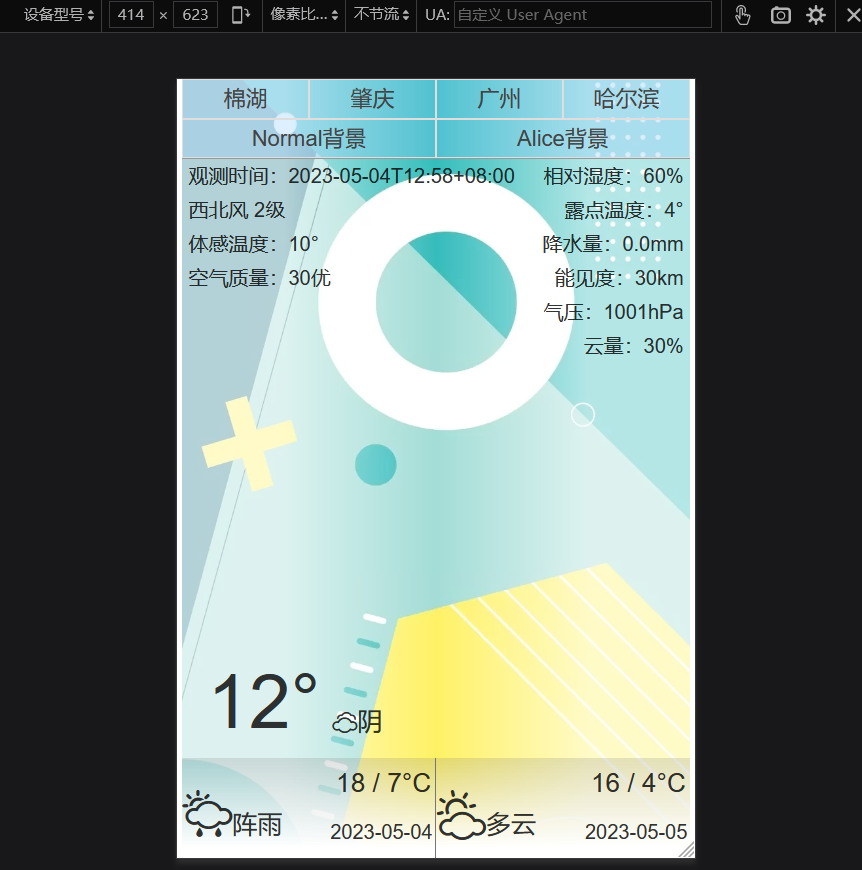
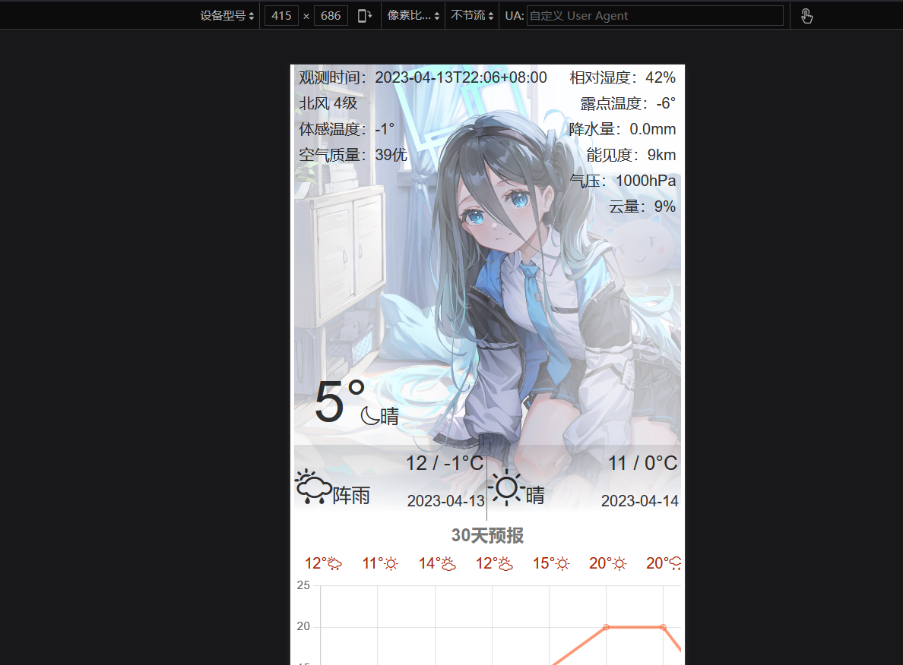
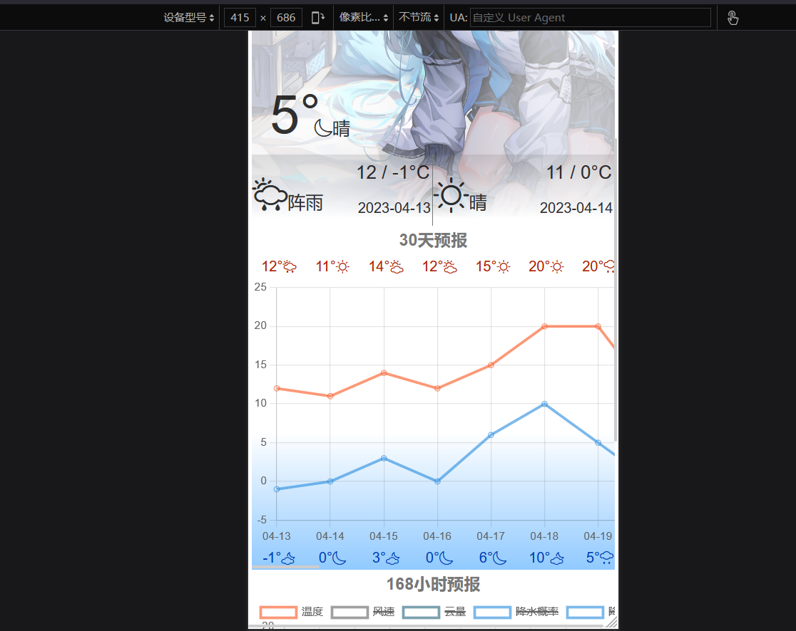
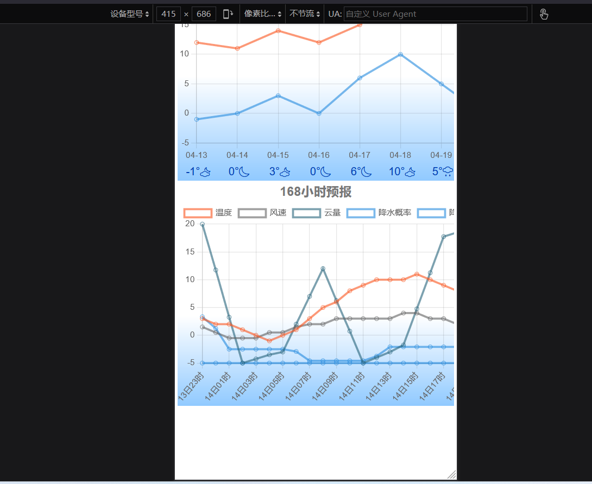
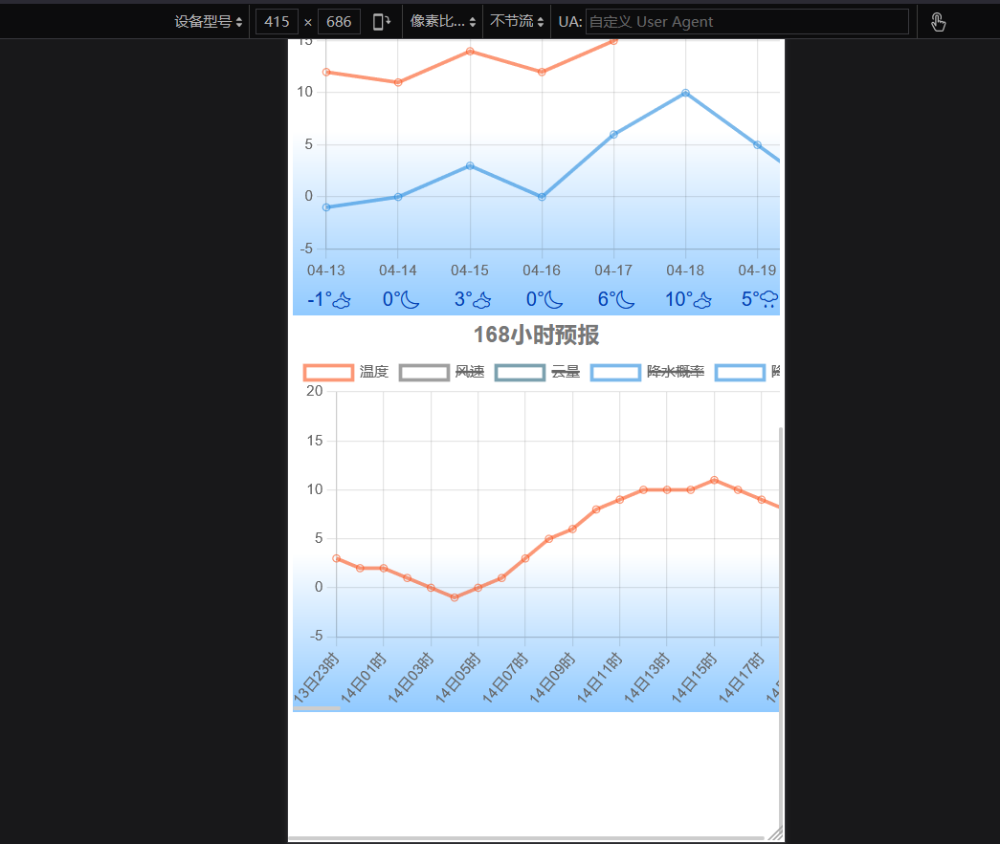

# 发条花天气

移动端单页面网络应用。代码仓库地址：https://github.com/abc2513/my_weather_app

- 前端：基于React脚手架搭建，调用ChartJS用于绘制图表；
- 后端：使用NodeJS+Express，托管静态网页资源，转发api请求到和风天气api接口用于获取天气数据

#### 开发日志

- 2023/5/？ 重构当前天气的UI
  - UI优化：新增主题选项，将城市和主题选项隐藏；将当前详细信息隐藏，并支持更多信息
  - 功能优化：修改城市选择逻辑
- 2023/4/？根据拓展需求，新增修改城市和背景功能
- 2023/？ 开发基本功能，显示当前天气、每天天气预报、每小时天气预报

## v1 最终UI

## 初始UI

#### 当前天气

#### 每日预报

#### 每小时预报

