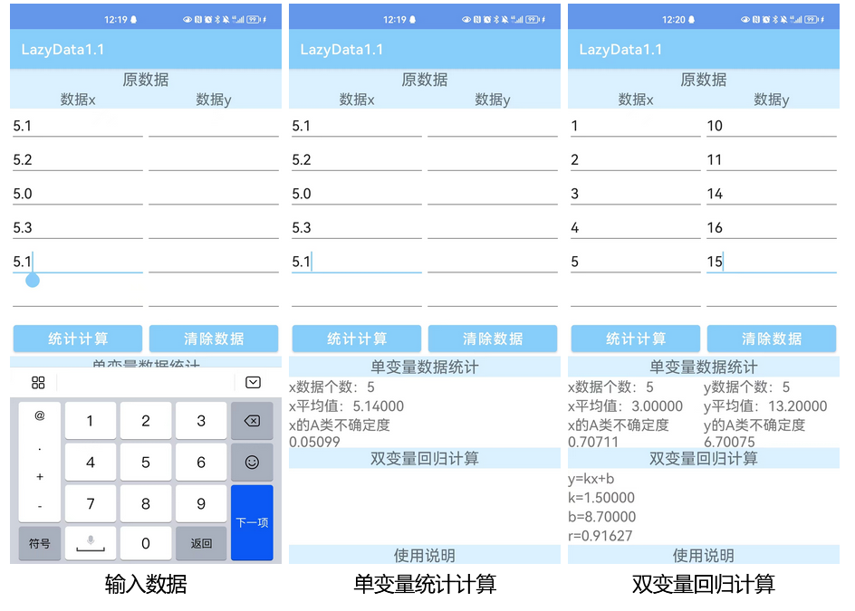

## 安卓APP：实验数据处理工具

该程序/系统可提供访问 ：）
该应用的更新已被网页版代替,建议使用[网页版](https://abc2513.github.io/computer/实验数据处理网页.html)

### 简介

该程序为笔者在大二秋季学期开发。可用于对大学物理实验课上的数据进行简单处理，能对一列数据进行统计计算，输出平均值、平均值不确定度；对两列数据进行回归计算，输出k、b、r。

### 用例

数据输入：在数据输入框内填入数据，点击换行输入下一个数据。

单变量统计计算：当数据输入框内只有一列数据时，进行单变量统计计算，输出平均值、平均值不确定度

双变量回归计算：当数据输入框内有两列数据时，进行双变量回归计算，输出k,b,r。

### 下载

百度网盘：https://pan.baidu.com/s/1iLNnNAhOonuUl-4rJteb-Q?pwd=1111