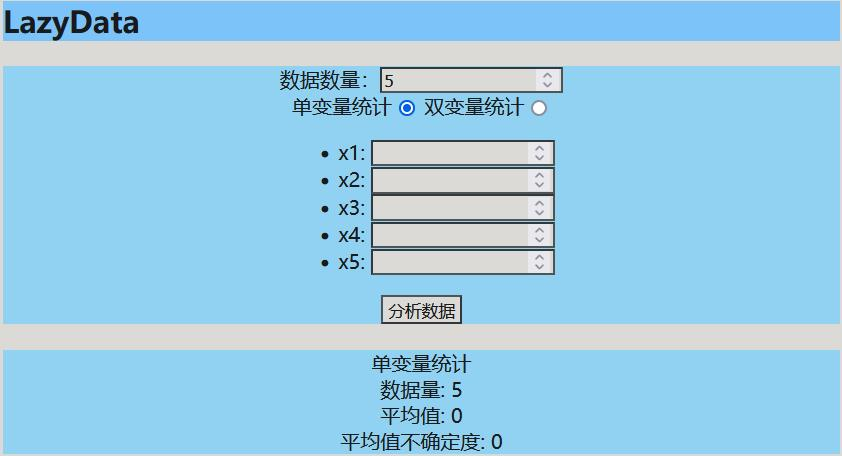
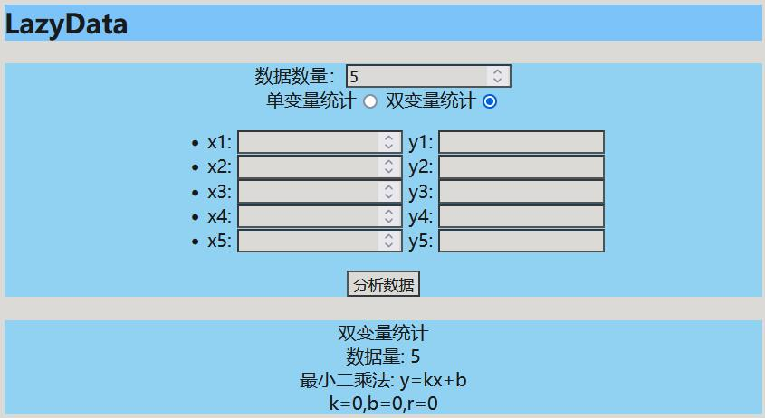

## 实验数据处理网页

该程序/系统可提供访问 ：）

### 简介

该网页为笔者在大二秋季学期开发。可用于对大学物理实验课上的数据进行简单处理，能对一列数据进行统计计算，输出平均值、平均值不确定度；对两列数据进行回归计算，输出k、b、r

### 访问

该网页部署在GitHubPage上，可点击https://abc2513.github.io/LazyData/LazyDataforWeb.html进行访问

### 用例

选择单变量/双变量功能,输入数据条数

数据输入：在数据输入框内填入数据，点击换行输入下一个数据。

单变量统计计算：进行单变量统计计算，输出平均值、平均值不确定度

双变量回归计算：进行双变量回归计算，输出k,b,r。

### 实现

在html编写所有的结构，使用Vue双向数据绑定实现显示内容和逻辑的关联，并计算相关的数据