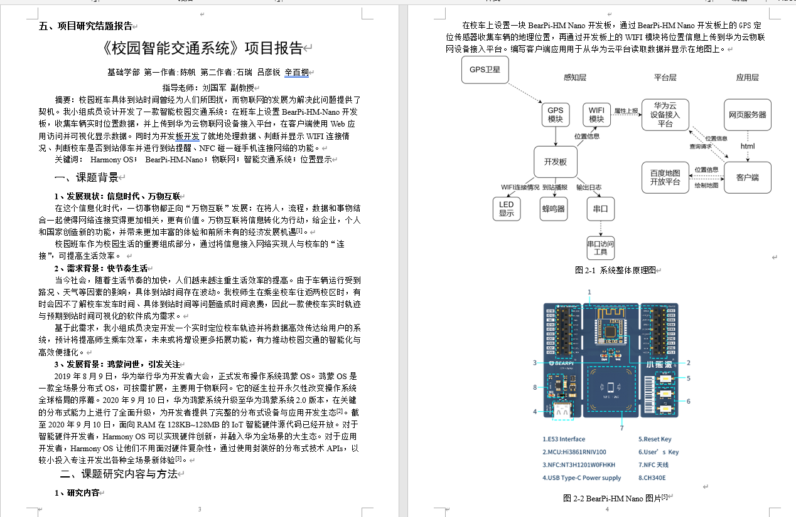
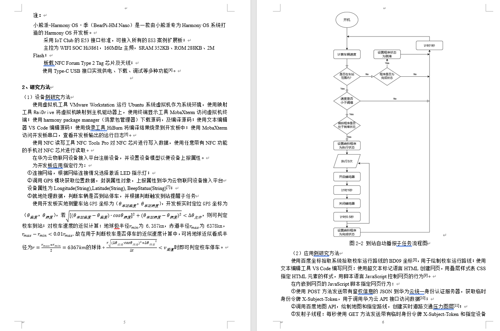
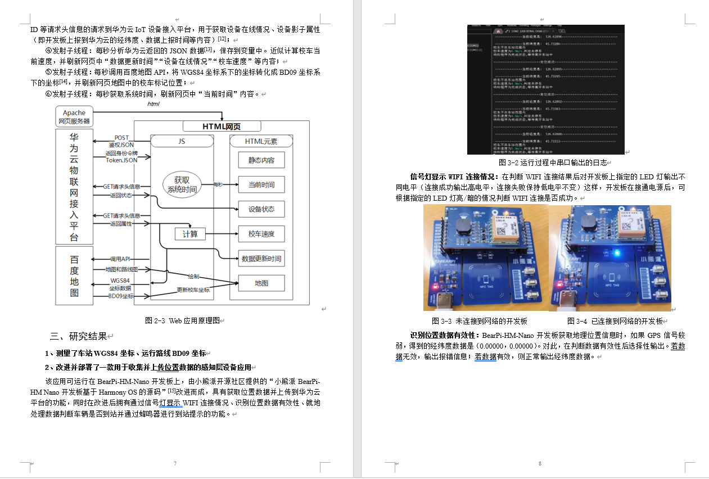
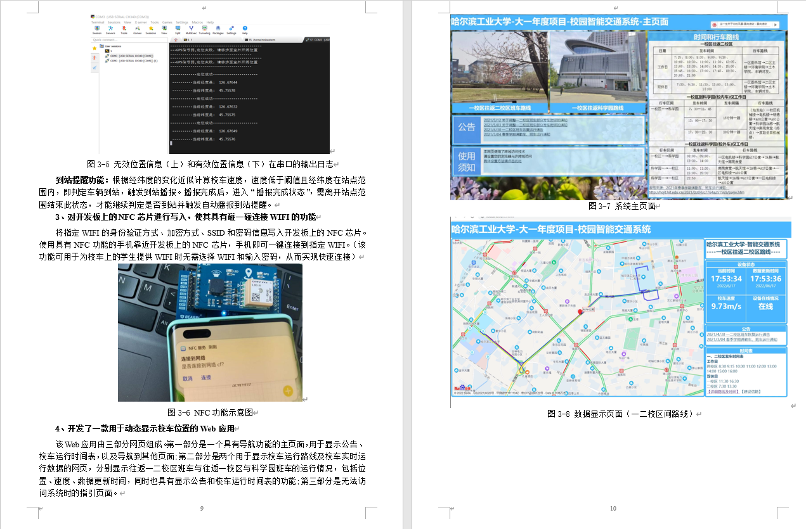
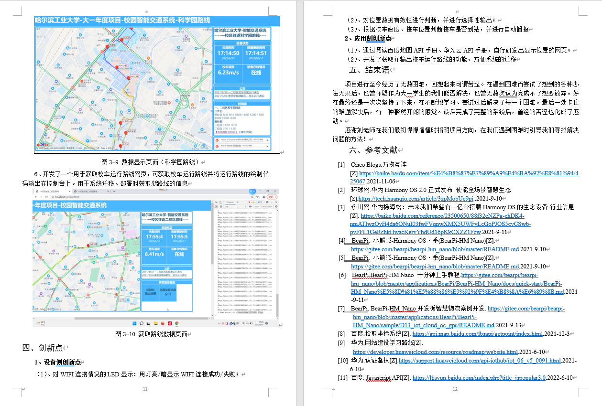

# 物联网项目：校园智能交通系统

## 简介

该项目作为年度项目开发于笔者大一期间，在笔者大一的暑假参加了2022年全国大学生物联网竞赛并获得东北赛区二等奖。此外在校内获得了年度项目优秀项目二等奖。该项目功能为：收集校车实时坐标，可视化提供给用户查看。同时为用户提供路线图、车站位置。

笔者在项目中担任组长和主要开发人员

## 实现

设备侧：链接WiFi，控制LED灯显示WiFi情况。收集实时位置数据并上传到华为云物联网设备接入平台。通过串口输出实时日志。

平台侧：使用华为云物联网设备接入平台，接收开发板上报的数据并保存到设备影子。

用户侧：使用HTML和JavaScript编写的网页，在打开网页时向华为云服务器获取统一身份认证token，定时使用token向华为云服务器查询设备影子的数据（车辆的GPS坐标），处理数据，调用百度地图API绘制地图并实时更新。

## 结题报告

