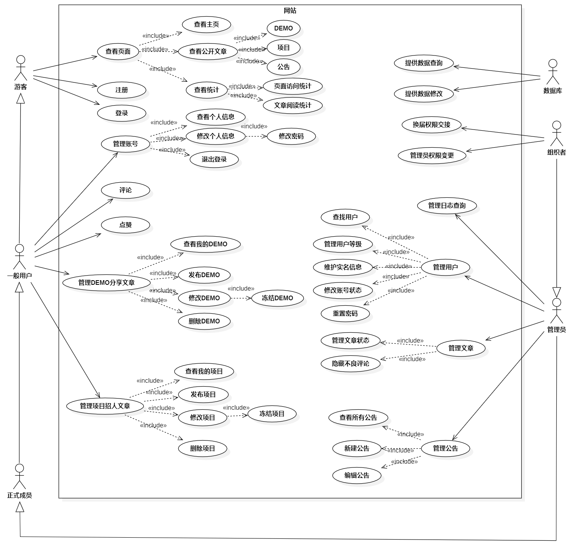

# 游戏开发社团网站

### 简介

哈尔滨工业大学游戏开发社团网站（以下简称本网站）是一款用于哈尔滨工业大学游戏开发社团成员分享DEMO的用户可交互式网站（Web2.0应用），于2022年秋季学期开始开发。

该网站为笔者大二秋季学期开始编写，于同年寒假基本完成。主要功能有上传自己的作品介绍、项目招人、在线游戏等内容，同时具有用户组管理、网站/文章访问量图表统计、点赞评论、管理日志查询、主页走马灯显示等二十余项功能。

项目以MIT协议开源到Github上，代码仓库地址是https://github.com/abc2513/HITGameWeb/

用户手册：https://github.com/abc2513/HITGameWeb/blob/main/%E6%96%87%E6%A1%A3/%E7%94%A8%E6%88%B7%E6%89%8B%E5%86%8C.md

令人遗憾的是，网站写完之后反响寥寥，部署运行一段时间后暂时关停了。

### 实现

- 后端：使用NodeJS+Express编写
- 前端：使用vue2，多页面Web应用
- 一些值得一提的实现
  - 鉴权：登录使用bcrypt校验密码，登录后所有请求携带token，使用jsonwebtoken进行校验。一级路由代表访问API所需权限，所有接口的访问首先进行权限校验。
  - 访问统计：后端所有的路由访问，都会同时在数据库里新增一条访问信息的记录。在统计页面，前端请求匹配特定正则表达式的路由访问信息后，使用ChartJS可视化显示
  - 管理日志：和上述访问统计类似，但是只记录管理员功能的接口，并记录详细的请求信息
  - 上传可在线运行游戏：用户上传指定格式内容的游戏压缩包（zip文件），后端（校验文件大小、请求次数不超限制后）使用multiparty接受文件，使用compressing解压缩文件并生成唯一名文件夹放入静态资源托管的路径下，并将唯一名和上次文件的其他信息记录在数据表中。
  - 文章内容：使用json格式保存“类型、内容”的数据，其中视频内容调用B站的外链接口，在frame中显示
  - 其他接口：后端使用Joi校验数据后，对数据库增删查改

### 部分截图

