# 虚拟旅游公司首页

笔者大二春季学期在学习“Advanced CSS and Sass”时，课程中的项目。主要特点是大量使用==现代CSS技术==和==Sass预处理器==构建优美的页面，包括一系列的动画、变形、视频背景等等；并且在==不使用JavaScript实现==导航栏开关/表单验证可视化等==动态内容==。

- 代码：https://github.com/abc2513/my_natours
- 页面：https://abc2513.github.io/my_natours/

涉及CSS知识点：渐变、伪类、伪元素、动画、CSS解析原理、级联（CSS冲突）、相对单位、强制继承、定位、Sass、Sass文件架构、变量、嵌套、混入、函数、拓展、剪辑、背景剪辑、响应式设计、网格布局、变换、兄弟元素选择器、子一代元素选择器、变换、视频背景、图片滤镜、背景滤镜、Sass颜色函数、媒体查询、响应式图像、渐变、calc函数、透视、形状、纯色渐变、光标、堆叠

### 现代CSS效果

#### 自定义表单控件

##### 自定义radio

原理：隐藏原有的表单radio，通过label实现点击切换，通过伪类选择器+兄弟元素选择器+伪元素实现radio状态的显示

##### 自定义输入框

原理：通过非法伪类+选中伪类 控制输入框颜色指示非法数据；通过placeholder伪类+伪元素实现提升placeholder内容移动到下方

#### 翻转卡片

原理：伪元素实现背面，透视属性实现背面不可见，hover伪类+变换属性实现悬浮时翻转

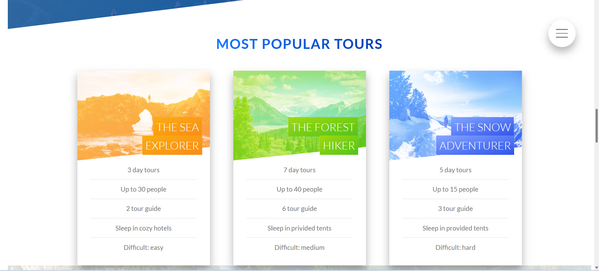

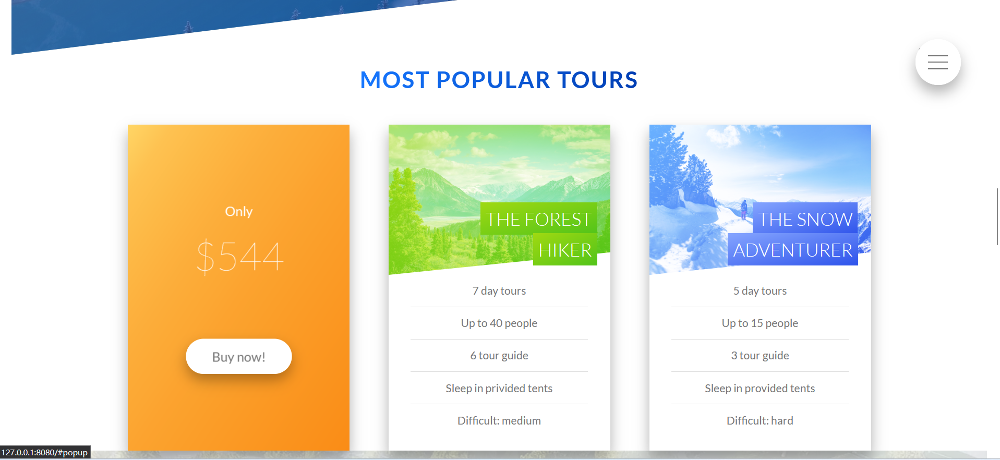

#### 导航按钮

原理：通过一个隐藏的checkbox控制导航页的开启或关闭，而屏幕右上角的按钮通过label元素指向checkbox进行点击事件的传递；checkbox通过一系列的伪类和类选择器控制导航页

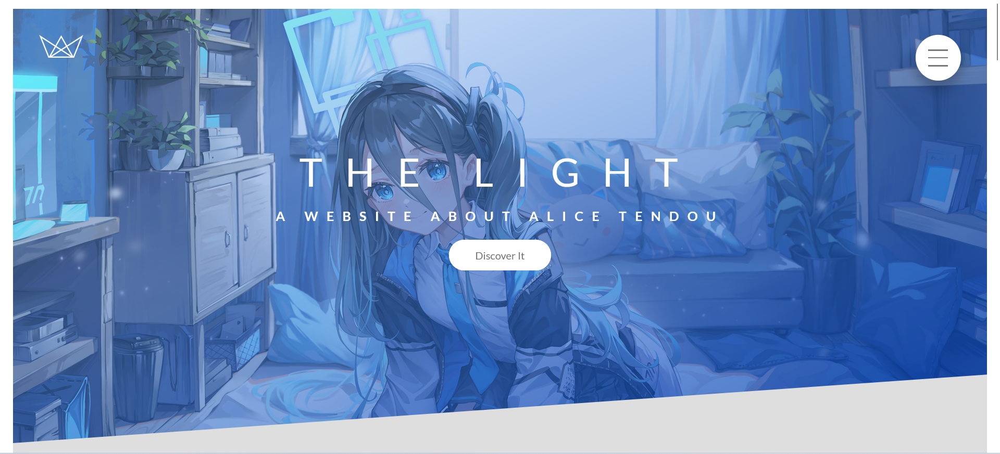

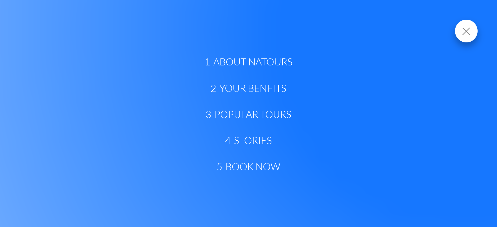

#### 优美的动画效果和视频背景

页面和元素在进入时、悬停时拥有一系列自然的动画和其他效果，以及视频背景，但遗憾在这里没法展示。建议使用桌面设备+最新版的谷歌/火狐浏览器访问网页，并尝试将鼠标放到各个元素上，来体验这些精美的效果

- 页面：https://abc2513.github.io/my_natours/

### 响应式设计

#### 响应式布局

##### 桌面

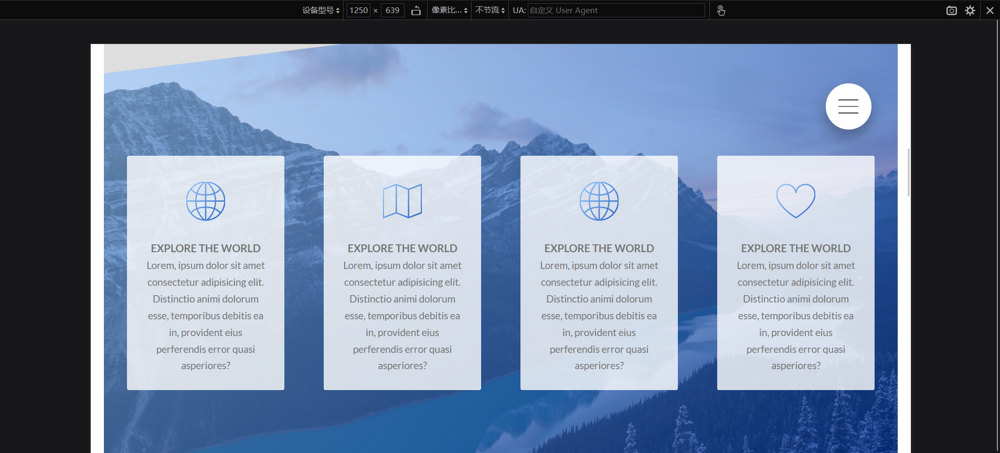

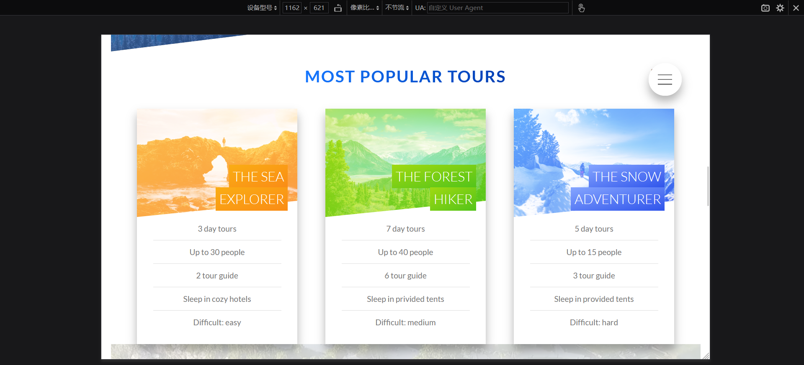

##### 手机

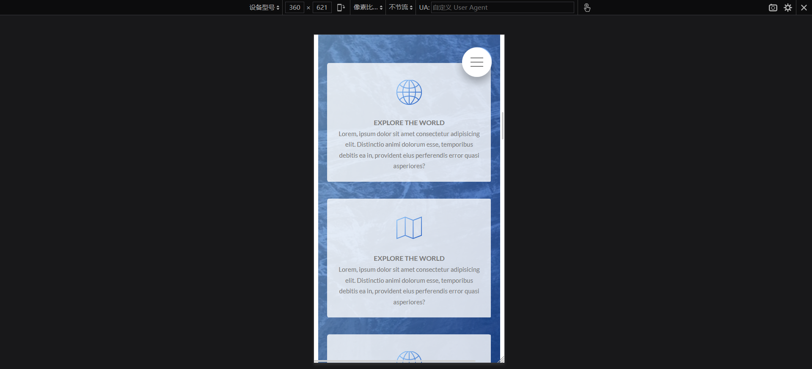

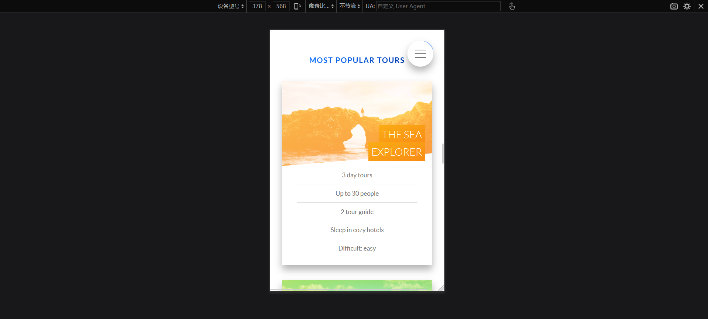

#### 响应式图像

##### 桌面

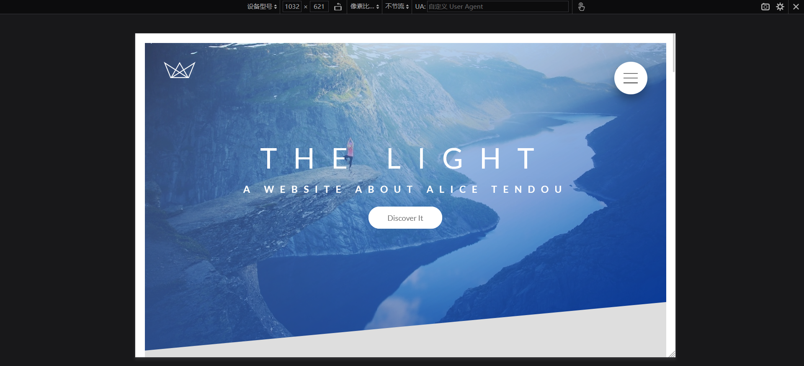

##### 手机

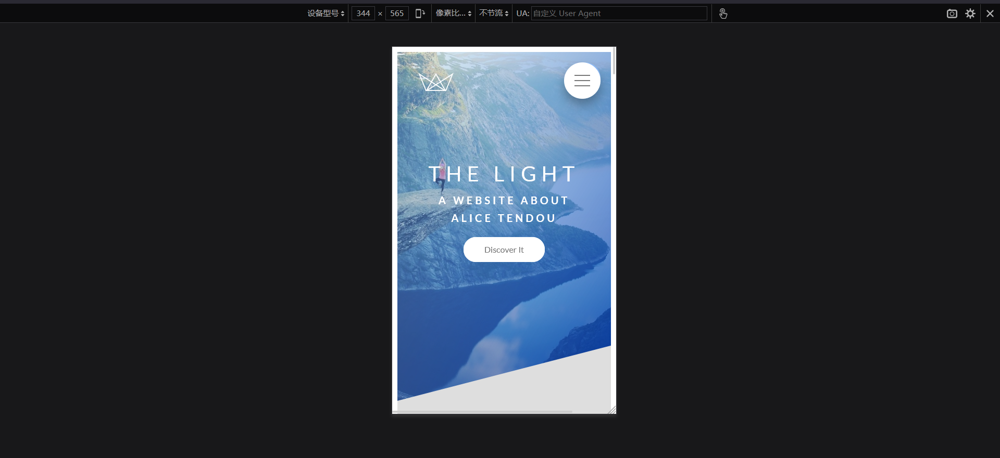

##### 超大屏或高分辨率屏

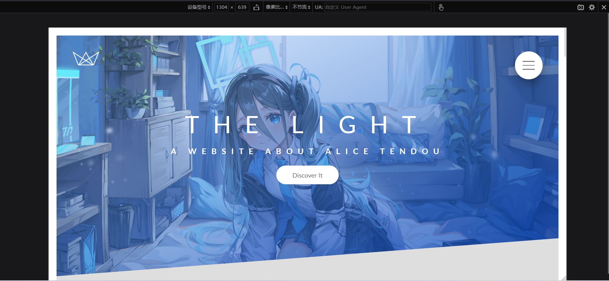

### 更多内容

- 代码：https://github.com/abc2513/my_natours
- 页面：https://abc2513.github.io/my_natours/