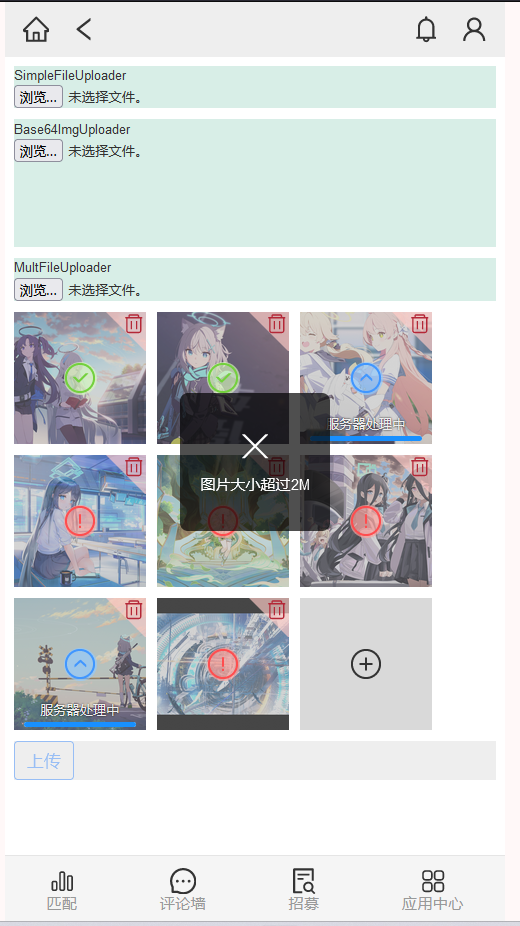
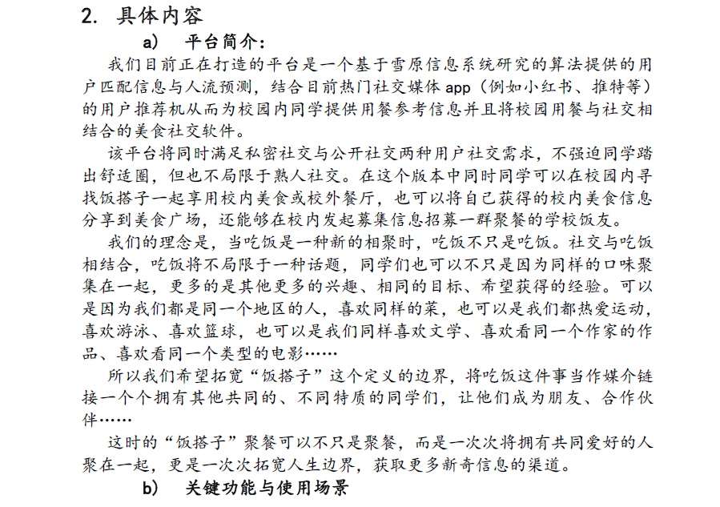
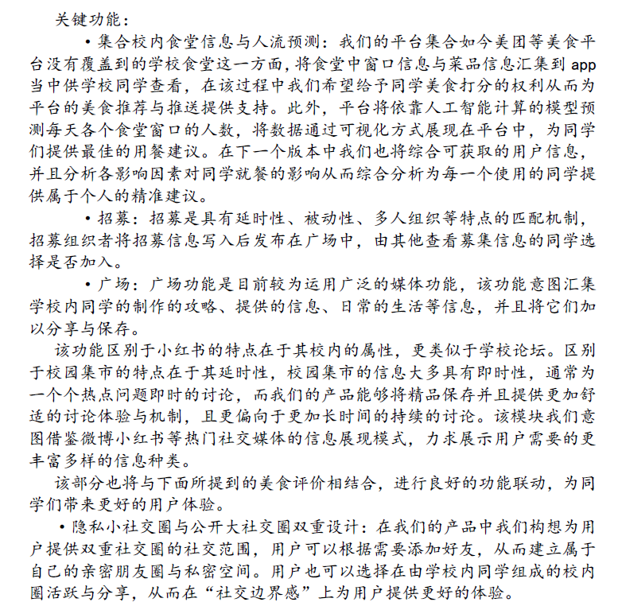
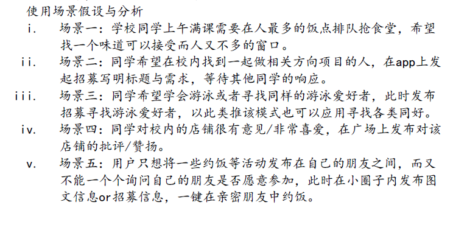

# 雪原信息分析系统

系统于2022年秋立项，目前尚处于开发阶段。此文档尚待完善

笔者负责前端设计与开发，并参与数据库设计、前后端接口设计与文档撰写、前端新成员的筛选等

### 前端部分

基于React脚手架开发，移动端优先的设计。使用antiDesign组件库、Redux等第三方库

亮点功能：

- 图片上传功能
  - 多图片上传，可控制同时上传数量
  - 前端使用spark-md5生成文件哈希值，可避免相同图片重复上传到服务器

### 系统背景与简介

提供饭搭子推荐、评论广场等功能

#### 